EnergyPlus Version {{ engine.config["EnergyPlusVersion"] }}  
Automatically Generated {{ engine.month_year() }}


Prepared for:

U.S. Department of Energy  
Energy Efficiency and Renewable Energy  
Office of Building Technologies  
Washington, D.C.

Originally Prepared by:

Robert H. Henninger and Michael J. Witte  
GARD Analytics, Inc.  
115 S. Wilke Road, Suite 115  
Arlington Heights, IL 60005  
USA  
www.gard.com

This report was developed based upon funding from the Alliance for Sustainable
Energy, LLC, Managing and Operating Contractor for the National Renewable
Energy Laboratory for the U.S. Department of Energy. Any opinions, findings,
and conclusions or recommendations expressed in this material are those of the
author(s) and do not necessarily reflect those of the sponsor. Earlier work was
supported by the Ernest Orlando Lawrence Berkeley National Laboratory, and by
the National Energy Technology Laboratory and the National Renewable Energy
Laboratory by subcontract through the University of Central Florida/Florida
Solar Energy Center.

This report was prepared as an account of work sponsored by an agency of the
United States Government. Neither the United States Government nor any agency
thereof, nor any of their employees, makes any warranty, express or implied, or
assumes any legal liability or responsibility for the accuracy, completeness,
or usefulness of any information, apparatus, product, or process disclosed, or
represents that its use would not infringe privately owned rights. Reference
herein to any specific commercial product, process, or services by trade name,
trademark, manufacturer, or otherwise does not necessarily constitute or imply
its endorsement, recommendation, or favoring by the United States Government or
any agency thereof. The views and opinions of authors expressed herein do not
necessarily state or reflect those of the United States Government or any
agency thereof.


# Test Objectives and Overview

## Test Type: Analytical

The ASHRAE 1052-RP Toolkit contains a set of simple analytical tests to test
the accuracy of building fabric calculations in building energy analysis
programs. Analytical tests compare a program’s results to mathematical
solutions for simple cases. This is an excellent method to use for assessing
the accuracy of results since there is only one solution for the case analyzed
given the boundary conditions. Analytical testing accomplishes results on two
different levels, both validation and debugging. Validation is accomplished
when the results of the test program compare favorably with the analytical
results. Debugging is accomplished when the results for certain cases do not
compare favorably with the analytical results and then through systematic
checking it is determined that the source of the difference is due to an input
error, a modeling inconsistency or flaw in the program logic.


## Test Suite: ASHRAE 1052-RP Toolkit

The tests described in ASHRAE’s report titled *Development of an Analytical
Verification Test Suite for Whole Building Energy Simulation Programs –
Building Fabric,* dated April 2001, (Spitler 2001) were performed.

As stated in the report’s “Introduction to the Test Documentation”:

> “A series of tests have been developed that are designed to help
> verify the ability of whole building energy simulation programs to
> model various aspects of heat transfer through the building fabric.
> These tests are each based on analytical solutions... These tests
> are for testing models relating to heat transfer through the building
> fabric, and not primary or secondary HVAC systems.”
>
> “The objective in each test is usually to test the ability of a
> building energy analysis program to model a particular heat transfer
> phenomena. This is done by comparing the test program output with the
> analytical solution for a special test zone. The data to be compared
> may be a single load or flux, or hourly loads over one or more days of
> output. In order to make each test specific and help diagnose problems
> it is necessary to minimize the number of heat transfer paths (and
> hence number of models involved). This requires the use of test zones
> that are rather different in their construction and specification than
> normal building zones.”

The ASHRAE 1052-RP test suite consists of 16 different tests which, as
explained in the ASHRAE report, can be organized into groups relating to
particular heat transfer phenomena as shown in Table 1 below.

**Table 1 ASHRAE 1052-RP Case Descriptions**

<table>
<tr>
  <th>Test Group</th>
  <th>Test Name</th>
  <th>Code</th>
</tr>
<tr>
  <td>Group 1 – Convection &amp; Conduction</td>
  <td>Steady-State Convection</td>
  <td>SSConv</td>
</tr>
<tr>
  <td></td>
  <td>Steady State Conduction</td>
  <td>SSCond</td>
</tr>
<tr>
  <td></td>
  <td>Transient Conduction – Adiabatic Wall</td>
  <td>TC1</td>
</tr>
<tr>
  <td></td>
  <td>Transient Conduction – Step Response</td>
  <td>TC2</td>
</tr>
<tr>
  <td></td>
  <td>Transient Conduction – Sinusoidal Driving Temperature and Multi-Layer Wall</td>
  <td>TC3</td>
</tr>
<tr>
  <td>Group 2 – Solar Gains &amp;  Shading</td>
  <td>Exterior Solar Radiation – Opaque Surfaces</td>
  <td>ExtSolRad</td>
</tr>
<tr>
  <td></td>
  <td>Solar Radiation – Glazed Surfaces</td>
  <td>SolRadGlazing</td>
</tr>
<tr>
  <td></td>
  <td>Solar Radiation – Window Shading</td>
  <td>SolRadShade</td>
</tr>
<tr>
  <td></td>
  <td>Solar Radiation – Window Reveal Shading</td>
  <td>WinReveal</td>
</tr>
<tr>
  <td></td>
  <td>Solar Radiation – Internal Solar Distribution</td>
  <td>IntSolarDist</td>
</tr>
<tr>
  <td>Group 3 - Infiltration</td>
  <td>Infiltration – Fixed Infiltration Rate</td>
  <td>Infiltration-1</td>
</tr>
<tr>
  <td></td>
  <td>Infiltration – Stack Effect</td>
  <td>Infililtration-2</td>
</tr>
<tr>
  <td>Group 4 – Long Wave Radiation</td>
  <td>Interior Long Wave Radiation</td>
  <td>IntLWRad</td>
</tr>
<tr>
  <td></td>
  <td>External Long Wave Radiation</td>
  <td>ExtLWRad</td>
</tr>
<tr>
  <td>Group 5 – Miscellaneous</td>
  <td>Internal Heat Gains - Convective and Radiative</td>
  <td>IntHeatGain</td>
</tr>
<tr>
  <td></td>
  <td>Ground Coupling - Slab-on-Ground Floor</td>
  <td>GrdCoup</td>
</tr>
</table>

  

All tests indicated in Table 1 were run with EnergyPlus Version {{ engine.config["EnergyPlusVersion"] }}.

The test suite uses a cube shaped zone of 3m x 3m x 3m internal dimensions.
Depending on which test is being performed, the surfaces of the zone are either
exposed to ambient or are adiabatic. For two of the tests, IntLWRad and
IntSolarDist, the aspect ratio of the zone is varied. The toolkit user is
prompted for inside and outside temperatures, inside and outside convection
coefficients, exterior envelope properties (for opaque surfaces and windows),
shading parameters, location (4 cities available), date (2 dates available) and
internal load level.

Output from each test takes the form of a text file listing the analytical
results which usually include the inside and outside surface temperatures and
the steady state zone load. A weather file in the user chosen format is also
created for use with the test program.

The use of the ASHRAE 1052-RP test suite with EnergyPlus required the following steps for each case:

1.  Prepare the EnergyPlus input (IDF) file which will simulate the Zone
    Description and Test Parameters as specified for a particular test

2.  Run the 1052-RP Toolkit software for a particular test to create a
    weather file in TMY2 format for the location chosen

3.  Convert the TMY2 weather file for use with EnergyPlus using the
    EnergyPlus weather conversion software

4.  Run EnergyPlus for the required time-step and simulation period to
    create a CSV file containing surface temperature data, surface
    fluxes, zone load and surface convection coefficient data for each
    time step. Each run was done with the INSIDE and OUTSIDE CONVECTION
    ALGORITHM objects set to SIMPLE in order to keep the test surface
    inside and outside convection coefficients constant throughout the
    test. Depending whether the test surface was a wall, ceiling or
    floor, EnergyPlus assigns a different value for the inside
    coefficient due to difference in direction of heat flow. The inside
    and outside convection coefficients from EnergyPlus for the test
    surface were then used with the 1052-RP Toolkit in the following
    step.

5.  Rerun the 1052-RP Toolkit using the test surface inside and outside
    convection coefficients used by EnergyPlus. Prior to EnergyPlus
    version 1.1.0, for cases where the EnergyPlus internal surface
    convection coefficients varied between surfaces, e.g., wall versus
    floor versus ceiling, the area weighted average of the interior
    convection coefficients was used with the 1052-RP toolkit. For
    EnergyPlus version 1.1.0 and later, the interior surface convection
    coefficients could be set to the same value for all surfaces by
    using the new ConvectionCoefficients input object. The 1052-RP
    Toolkit allows the user to let the surface convection coefficients
    to vary as a function of the temperature difference between the
    surface and the air by setting values for the coefficients A, C and
    n in the equation

    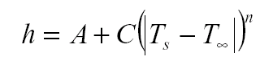

    For all of the 1052-RP Toolkit tests performed as part of this exercise,
    C=0.0, n=1 and A was set to the constant coefficient value that was taken from
    the EnergyPlus simulations. A picture of the 1052-RP Toolkit input screen for
    the ExtSolRad test with the surface inside convection coefficient = 3.076 and
    the surface outside convection coefficient = 10.22 is shown on the next page.

6.  Compare results

    Where a location and test date were required, test cases were run for Atlanta, August 21.

    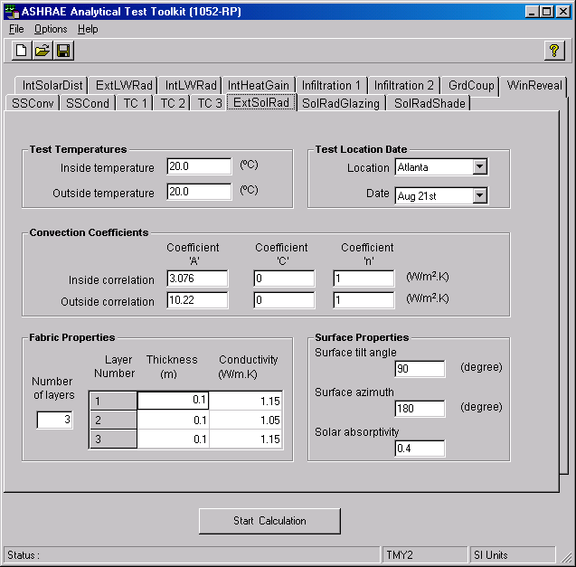


# Results and Discussion

EnergyPlus results for each of the 16 ASHRAE 1052-RP analytical tests are
presented here in this section in either spreadsheet format (for cases where
only a single point comparison was required) or chart format (for cases where a
time series comparison was required).


## Test SSConv – Steady State Convection

The test zone is made up of five adiabatic surfaces and one external surface
which is constructed of a single homogeneous layer with inside temperature held
constant at 10°C and outside temperature held constant at 40°C. The single
layer had properties as follows:

- Thickness 0.1 m
- Conductivity 1.0 $\frac{W}{mK}$

The effects of solar irradiation, long wave radiation, infiltration, and
internal heat gains are eliminated.

{{ engine.create_table_from_excel_range("Tests SSConv and SSCond.xlsx", "Test SSConv", "A6:H17", [0]) }}


EnergyPlus results for Test SSConv are identical to ASHRAE 1052-RP
analytical results.


## Test SSCond – Steady State Conduction

The test zone is made up of one external surface which is a multi-layer
homogeneous slab which is massless to avoid transient effects. The slab
had properties as follows:

<table>
<tr>
  <th></th>
  <th>Thickness (m)</th>
  <th>Conductivity ( $\frac{W}{mK}$ )</th>
  <th>Density ( $\frac{kg}{m^3}$ )</th>
</tr>
<tr>
  <td>Layer 1</td>
  <td>0.1</td>
  <td>0.1</td>
  <td>1.0</td>
</tr>
<tr>
  <td>Layer 2</td>
  <td>0.05</td>
  <td>0.05</td>
  <td>1.0</td>
</tr>
<tr>
  <td>Layer 3</td>
  <td>0.05</td>
  <td>0.25</td>
  <td>1.0</td>
</tr>
</table>


The inside temperature held constant at 10°C and outside temperature held constant at 40°C. The effects of solar irradiation, long wave radiation, infiltration, and internal heat gains are eliminated.

{{ engine.create_table_from_excel_range("Tests SSConv and SSCond.xlsx", "Test SSCond", "A6:H17", [0]) }}

EnergyPlus results for Test SSCond are identical to ASHRAE 1052-RP analytical results.


## Test TC1 –Transient Conduction, Adiabatic Wall

The test zone is a 3m x 3m x 3m cube with one external surface of homogeneous construction. All other surfaces are adiabatic but remain convectively coupled. The external temperature undergoes a 50°C step change from 20°C to 70°C while the inside temperature is allowed to float in response to the inside surface of the test construction in order to simulate adiabatic conditions at the inside surface of the test wall. The effects of solar irradiation, long wave radiation,
infiltration, and internal heat gains are eliminated.

```{exec_python}

engine.write_chart('ScatterLinesNoMarkers', '10 cm Wood-Chart', 'EnergyPlus Version {{ engine.config["EnergyPlusVersion"] }} & ASHRAE 1052 Version 1.0\nResults for ASHRAE Analytical Test TC1\nTransient Conduction, Adiabatic Wall, 10 cm Wood\n50 C Step Change in External Temperature\nIndoor Temperature Floats', 'Hour of Year', 'Temperature (C)', 'Test TC1-TS6.xlsx', 'EPlus 10cm Wood', 'B6:J107', "(C6,B7:B107,C7:C107,1);('ASHRAE 10cm Wood'!D7,B7:B107,'ASHRAE 10cm Wood'!D8:D108,2);('ASHRAE 10cm Wood'!E7,B7:B107,'ASHRAE 10cm Wood'!E8:E108,3);(I6,B7:B107,I7:I107,4);(J6,B7:B107,J7:J107,5);", ['ASHRAE 1052 allows user to only specify outside film coefficient which was set to 10.22 for both EnergyPlus and ASHRAE 1052 simulations.\nEnergyPlus inside film coefficient = 0.1 (lowest value allowed).\nNo discussion about inside film coefficient in ASHRAE 1052 documentation.', 'E-Plus TimeStep=6'], [], ['b--', 'mx', 'g+', 'm-', 'g-']) 

```

The small disagreement between EnergyPlus and ASHRAE 1052-RP analytical results
is thought to be due to not being able to simulate a true adiabatic condition
at the inside wall surface in EnergyPlus. The lower limit for the inside
convection coefficient in EnergyPlus is 0.1. The ASHRAE 1052-RP toolkit for
this test case does not allow the user to set a value for the inside film
coefficient since the analytical solution does not require it. The heat balance
technique used by EnergyPlus however, does utilize the inside convection
coefficient. For the EnergyPlus simulation, the ConvectionCoefficients object
was used to fix the outside film coefficient at 10.22 (the default value for
the boundary conditions specified) and inside film coefficient at 0.1. For the
1052-RP toolkit, only the outside film coefficient of 10.22 was specified.

With EnergyPlus version 7.0.0.036 the convection coefficient lower limit of 0.1
was overridden using the HeatBalanceAlgorithm object to allow a value of
0.000001. This improved results and moved EnergyPlus closer to the ASHRAE
1052RP curve as indicated above.


## Test TC2 – Transient Conduction, Step Response

The test zone is a 3m x 3m x 3m cube with one external surface of homogeneous
construction. All other surfaces are adiabatic but remain convectively coupled.
The internal zone air temperature is held constant at 20°C during the test. The
external temperature is set at the same temperature, 20°C initially, and then
undergoes a 50°C step change up from 20°C to 70°C where it is held constant for
a long period of time after which the external temperature undergoes a step
change down to -30°C (50°C below the initial setting). The effects of solar
irradiation, long wave radiation, infiltration, and internal heat gains are
eliminated.


### Step-Up in External Temperature

```{exec_python}
engine.write_chart('Combo', '10 cm Wood-Chart', 'EnergyPlus Version {{ engine.config["EnergyPlusVersion"] }} & ASHRAE 1052 Version 1.0\nResults for ASHRAE Analytical Test TC2-Step Up\nTransient Conduction, Non-Adiabatic Wall, 10 cm Wood\n50 C Step Change in External Temperature (20C to 70C)\nIndoor Temperature Constant at 20C', 'Hour of Year', ['Temperature (C)', 'Zone Load (W)'], 'Test TC2-StepUp-TS6.xlsx', 'EPlus 10cm Wood', 'B6:N117', "(C6,B7:B117,C7:C117,1);('ASHRAE 10cm Wood'!D7,B7:B117,'ASHRAE 10cm Wood'!D8:D118,2);('ASHRAE 10cm Wood'!E7,B7:B117,'ASHRAE 10cm Wood'!E8:E118,3);(I6,B7:B117,I7:I117,4);(J6,B7:B117,J7:J117,5)#('ASHRAE 10cm Wood'!H7,B7:B117,'ASHRAE 10cm Wood'!H8:H118,6);(N6,B7:B117,N7:N117,7);", ['E-Plus TimeStep=6'], [], ['b--', 'mx', 'g*', 'm-', 'g-', 'y^', 'y-']) 
```

During the transient period before reaching steady state EnergyPlus is
predicting lower surface temperatures than ASHRAE 1052-RP. The inside and
outside film coefficients for both programs were the same for this test so this
is not the source of difference. As seen below, excellent agreement was
obtained when comparing the total zone load over the 48-hour period after ramp
up in temperature occurs.

**Test TC2 – Transient Conduction, Step-Up External Temperature**

Test Parameter      |  Units     | 1052RP           |  EnergyPlus      |  % diff
--------------------|------------|------------------|------------------|---------
48-Hour Zone Load   |  $Wh$      | {{ engine.format_diff_row("Test TC2-StepUp-TS6.xlsx", "'ASHRAE 10cm Wood'!H121", "'EPlus 10cm Wood'!N120") }}


### Step-Down in External Temperature

```{exec_python}

engine.write_chart('Combo', '10 cm Wood-Chart', 'EnergyPlus Version {{ engine.config["EnergyPlusVersion"] }} & ASHRAE 1052 Version 1.0\nResults for ASHRAE Analytical Test TC2-Step Down\nTransient Conduction, Non-Adiabatic Wall, 10 cm Wood\n100 C Step Change in External Temperature (70C to -30C)\nIndoor Temperature Constant at 20C', 'Hour of Year', ['Temperature (C)', 'Zone Load (W)'], 'Test TC2-StepDown-TS6.xlsx', 'EPlus 10cm Wood', 'B6:O52', "(C6,B7:B52,C7:C52,1);('ASHRAE 10cm Wood'!D7,B7:B52,'ASHRAE 10cm Wood'!D8:D53,2);('ASHRAE 10cm Wood'!E7,B7:B52,'ASHRAE 10cm Wood'!E8:E53,3);(I6,B7:B52,I7:I52,4);(J6,B7:B52,J7:J52,5)#('ASHRAE 10cm Wood'!H7,B7:B52,'ASHRAE 10cm Wood'!H8:H53,6);(O6,B7:B52,O7:O52,7);", ['E-Plus TimeStep=6'], [], ['b--', 'mx', 'g*', 'm-', 'g-', 'y^', 'y-']) 

```

Once again, during the transient period before reaching steady state
EnergyPlus is responding slower to the temperature change and predicting
slightly higher surface temperatures than ASHRAE 1052-RP but total zone
load over the 48-hour period following ramp down in temperature compares
well.


**Test TC2 – Transient Conduction, Step-Down External Temperature**

Test Parameter      |  Units     | 1052RP           |  EnergyPlus      |  % diff
--------------------|------------|------------------|------------------|---------
48-Hour Zone Load   |  $Wh$      | {{ engine.format_diff_row("Test TC2-StepDown-TS6.xlsx", "'ASHRAE 10cm Wood'!H63", "'EPlus 10cm Wood'!O63") }}


## Test TC3 – Transient Conduction, Sinusoidal Driving Temperature and Multi-Layer Wall

The test zone is a 3m x 3m x 3m cube with one external surface which is a
multi-layer homogeneous slab with convective boundary conditions. The external
temperature is a steady-periodic sinusoidal change about a 20°C mean
temperature with an amplitude of +15°C and -15°C and a period of fluctuation of
24 hours. All other surfaces are adiabatic but remain convectively coupled. The
internal zone air temperature is held constant at the mean external temperature
(20°C). The effects of solar irradiation, long wave radiation, infiltration,
and internal heat gains are eliminated.

```{exec_python}
engine.write_chart('Combo', 'Chart', 'EnergyPlus Version {{ engine.config["EnergyPlusVersion"] }} & ASHRAE 1052 Version 1.0\nResults for ASHRAE Analytical Test TC3\nTransient Conduction, Non-Adiabatic 3-Layer Wall\nSinusoidal Change in External Temperature\n20C mean, 15C amp, 24 hr period\nIndoor Temperature Constant at 20C', 'Hour of Year', ['Temperature (C)', 'Zone Load (W)'], 'Test TC3-TS6.xlsx', 'ASHRAE Results', 'B6:D79', "(C7,'EPlus Results'!B7:B78,C8:C79,4);('EPlus Results'!C6,'EPlus Results'!B7:B78,'EPlus Results'!C7:C78,5)#(D7,'EPlus Results'!B7:B78,D8:D79,1);('EPlus Results'!O6,'EPlus Results'!B7:B78,'EPlus Results'!O7:O78,2)", ['E-Plus TimeStep=6\nTimeStep=1'], [], ['ms', 'r--', 'gx', 'y-'])
```

EnergyPlus results track the ASHRAE 1052-RP analytical results well during the
warm-up and cool-down periods but does not reach the same extremes that ASHRAE
1052-RP does. There also seems to be a small phase shift between the two
programs for both outdoor temperature and zone load. The sum of the absolute
value of the zone load over a 24-hour period is within 3%.

**Test TC3 – Transient Conduction, Sinusoidal Temperature**

Test Parameter               |  Units     | 1052RP           |  EnergyPlus      |  % diff
-----------------------------|------------|------------------|------------------|---------
24-Hour Absolute Zone Load   |  $Wh$      | {{ engine.format_diff_row("Test TC3-TS6.xlsx", "'ASHRAE Results'!G31", "'EPlus Results'!R30") }} 


## Test ExtSolRad – Exterior Solar Radiation, Opaque Surfaces

The test zone is similar to that described in Test SSCond with a multi-layer
external surface. Except for the external surface, all other surfaces are
adiabatic and have no thermal mass. The inside and outside temperatures are
fixed at 20°C. The effects of long wave radiation, infiltration, and internal
heat gains are eliminated. The location was chosen as Atlanta and date set at
August 21. Direct normal solar radiation at ground level was taken from ASHRAE
1052-RP weather files provided with the software. The external test surface was
chosen as having a 90° tilt (vertical) and two orientations -- 180° azimuth
(facing south) and 90° azimuth (facing east) .


### South Facing Surface
```{exec_python}
engine.write_chart('Combo', 'SolRad-South-Chart', 'EnergyPlus Version {{ engine.config["EnergyPlusVersion"] }} & ASHRAE 1052 ver 1.0\nResults for ASHRAE Analytical Test ExtSolRad\nAtlanta, August 21\nSouth Facing Opaque Surface', 'Time of Day', ['Incident Solar or Solar Flux (W/m2)', 'Zone Load (W/m2)'], 'Test ExtSolRad.xlsx', 'ASHRAE-ExtSolRad', 'B5:Q114', "(F5,'EPlus-ExtSolRad'!B7:B85,F6:F84,1);('EPlus-ExtSolRad'!O6,'EPlus-ExtSolRad'!B7:B85,'EPlus-ExtSolRad'!O7:O85,2)#(G5,'EPlus-ExtSolRad'!B7:B85,G6:G84,3);('EPlus-ExtSolRad'!Q6,'EPlus-ExtSolRad'!B7:B85,'EPlus-ExtSolRad'!Q7:Q85,4);", ['E-Plus TimeStep=6'], [], ['bx', 'r--', 'm*', 'g-'])

engine.write_chart('ScatterLinesNoMarkers', 'Temp-South-Chart', 'EnergyPlus Version {{ engine.config["EnergyPlusVersion"] }} & ASHRAE 1052 ver 1.0\nResults for ASHRAE Analytical Test ExtSolRad\nAtlanta, August 21\nSouth Facing Opaque Surface', 'Time of Day', 'Temperature (C)', 'Test ExtSolRad.xlsx', 'EPlus-ExtSolRad', 'B6:L114', "(C6,B7:B85,C7:C85,1);('ASHRAE-ExtSolRad'!B5,B7:B85,'ASHRAE-ExtSolRad'!B6:B84,2);(K6,B7:B85,K7:K85,3);('ASHRAE-ExtSolRad'!C5,B7:B85,'ASHRAE-ExtSolRad'!C6:C84,4);(L6,B7:B85,L7:L85,5);", ['E-Plus TimeStep=6'], [], ['g--', 'gx', 'r-', 'm*', 'b-'])
```

The results of EnergyPlus compare very well to the analytical results.


**Test ExtSolRad – Exterior Solar Radiation, South Facing**

Test Parameter               |  Units     | 1052RP           |  EnergyPlus      |  % diff
-----------------------------|------------|------------------|------------------|---------
24-Hour Zone Load            |  $\frac{Wh}{m^2}$   | {{ engine.format_diff_row("Test ExtSolRad.xlsx", "'ASHRAE-ExtSolRad'!G86", "'EPlus-ExtSolRad'!Q117") }} 
Peak Zone Load               |  $\frac{W}{m^2}$     | {{ engine.format_diff_row("Test ExtSolRad.xlsx", "'ASHRAE-ExtSolRad'!G87", "'EPlus-ExtSolRad'!Q118") }} 


The difference in loads may be attributable to a difference methodology
for treating polarization of light in the window models. The quote below is from EnergyPlus Change Request (CR) #4793:

> " . . . the differences between E+ and 1052 cooling load results are
> attributed to the different way of calculating beam solar
> transmittance vs. angle of incidence (E+ polarization averaging is
> done on the glass layer transmissivity and reflectivity *before*
> calculating system transmittance and reflectance--which is how WINDOW
> 5 does it, whereas in 1052 the system transmittance and reflectance
> are calculated for each polarization and then averaged."


### East Facing Surface

```{exec_python}
engine.write_chart('Combo', 'SolRad-East-Chart', 'EnergyPlus Version {{ engine.config["EnergyPlusVersion"] }} & ASHRAE 1052 ver 1.0\nResults for ASHRAE Analytical Test ExtSolRad\nAtlanta, August 21\nEast Facing Opaque Surface', 'Time of Day', ['Incident Solar or Solar Flux (W/m2)', 'Zone Load (W/m2)'], 'Test ExtSolRad.xlsx', 'ASHRAE-ExtSolRad-East', 'B5:Q114', "(F5,'EPlus-ExtSolRad-East'!B7:B85,F6:F84,1);('EPlus-ExtSolRad-East'!O6,'EPlus-ExtSolRad-East'!B7:B85,'EPlus-ExtSolRad-East'!O7:O85,2)#(G5,'EPlus-ExtSolRad-East'!B7:B85,G6:G84,3);('EPlus-ExtSolRad-East'!Q6,'EPlus-ExtSolRad-East'!B7:B85,'EPlus-ExtSolRad-East'!Q7:Q85,4);", ['E-Plus TimeStep=6'], [], ['bx', 'r--', 'm*', 'g-'])

engine.write_chart('ScatterLinesNoMarkers', 'Temp-East-Chart', 'EnergyPlus Version {{ engine.config["EnergyPlusVersion"] }} & ASHRAE 1052 ver 1.0\nResults for ASHRAE Analytical Test ExtSolRad\nAtlanta, August 21\nEast Facing Opaque Surface', 'Time of Day', 'Temperature (C)', 'Test ExtSolRad.xlsx', 'EPlus-ExtSolRad-East', 'B6:L114', "(C6,B7:B85,C7:C85,1);('ASHRAE-ExtSolRad-East'!B5,B7:B85,'ASHRAE-ExtSolRad-East'!B6:B84,2);(K6,B7:B85,K7:K85,3);('ASHRAE-ExtSolRad-East'!C5,B7:B85,'ASHRAE-ExtSolRad-East'!C6:C84,4);(L6,B7:B85,L7:L85,5);", ['E-Plus TimeStep=6'], [], ['g--', 'gx', 'r-', 'm*', 'b-'])
```

**Test ExtSolRad – Exterior Solar Radiation, East Facing**

Test Parameter           |  Units            | 1052RP           |  EnergyPlus      |  % diff
-------------------------|-------------------|------------------|------------------|---------
24-Hour Zone Load        |  $\frac{Wh}{m^2}$ | {{ engine.format_diff_row("Test ExtSolRad.xlsx", "'ASHRAE-ExtSolRad-East'!G86", "'EPlus-ExtSolRad-East'!Q117") }} 
Peak Zone Load           |  $\frac{W}{m^2}$  | {{ engine.format_diff_row("Test ExtSolRad.xlsx", "'ASHRAE-ExtSolRad-East'!G87", "'EPlus-ExtSolRad-East'!Q118") }} 


The results for the east facing test surface show some differences in the shape
of the curves. The curves for the 1052-RP Toolkit have a smooth shape while the
EnergyPlus curves are more jagged. It was thought that this difference in shape
is due to the interpolation that EnergyPlus must do to get 10 minute increment
weather for the simulation. Usually each test contained with the ASHRAE 1052-RP
Toolkit produces two out files – one with analytical results on a 10 minute
increment basis and a weather file containing hourly weather data in TMY2
format. EnergyPlus then must interpolate the hourly temperature and solar data
from the weather file to get weather data for the 10 minute timestep simulation
periods. This creates anomalies between the weather data used by the 1052-RP
Toolkit and EnergyPlus. To determine what impact this weather processing may
have on the results, a special EnergyPlus weather file was created for August
21 for Atlanta with data for each 10 minute increment of every hour. The
EnergyPlus simulation was then redone using this special weather file. As shown
below, much better agreement resulted with the 1052-RP Toolkit data.


```{exec_python}
engine.write_chart('Combo', 'SolRad-East-Chart', 'EnergyPlus Version {{ engine.config["EnergyPlusVersion"] }} & ASHRAE 1052 ver 1.0\nResults for ASHRAE Analytical Test ExtSolRad\nAtlanta, August 21\nEast Facing Opaque Surface', 'Time of Day', ['Incident Solar or Solar Flux (W/m2)', 'Zone Load (W/m2)'], '821Test ExtSolRad.xlsx', 'ASHRAE-ExtSolRad-East', 'B5:Q114', "(F5,'EPlus-ExtSolRad-East'!B7:B85,F6:F84,1);('EPlus-ExtSolRad-East'!O6,'EPlus-ExtSolRad-East'!B7:B85,'EPlus-ExtSolRad-East'!O7:O85,2)#(G5,'EPlus-ExtSolRad-East'!B7:B85,G6:G84,3);('EPlus-ExtSolRad-East'!Q6,'EPlus-ExtSolRad-East'!B7:B85,'EPlus-ExtSolRad-East'!Q7:Q85,4);", ['E-Plus TimeStep=6; 10 Minute Weather Data'], [], ['bx', 'r--', 'm*', 'g-'])

engine.write_chart('ScatterLinesNoMarkers', 'Temp-East-Chart', 'EnergyPlus Version {{ engine.config["EnergyPlusVersion"] }} & ASHRAE 1052 ver 1.0\nResults for ASHRAE Analytical Test ExtSolRad\nAtlanta, August 21\nEast Facing Opaque Surface', 'Time of Day', 'Temperature (C)', '821Test ExtSolRad.xlsx', 'EPlus-ExtSolRad-East', 'B6:L114', "(C6,B7:B85,C7:C85,1);('ASHRAE-ExtSolRad-East'!B5,B7:B85,'ASHRAE-ExtSolRad-East'!B6:B84,2);(K6,B7:B85,K7:K85,3);('ASHRAE-ExtSolRad-East'!C5,B7:B85,'ASHRAE-ExtSolRad-East'!C6:C84,4);(L6,B7:B85,L7:L85,5);", ['E-Plus TimeStep=6; 10 Minute Weather Data'], [], ['g--', 'gx', 'r-', 'm*', 'b-']) 
```


**Test ExtSolRad – Exterior Solar Radiation, East Facing**

Test Parameter               |  Units     | 1052RP           |  EnergyPlus      |  % diff
-----------------------------|------------|------------------|------------------|---------
24-Hour Zone Load            |  $\frac{Wh}{m^2}$   | {{ engine.format_diff_row("821Test ExtSolRad.xlsx", "'ASHRAE-ExtSolRad-East'!G86", "'EPlus-ExtSolRad-East'!Q120") }} 
Peak Zone Load               |  $\frac{Wh}{m^2}$     | {{ engine.format_diff_row("821Test ExtSolRad.xlsx", "'ASHRAE-ExtSolRad-East'!G87", "'EPlus-ExtSolRad-East'!Q121") }} 


## Test SolRadGlazing – Solar Radiation, Glazed Surfaces

The test zone is a 3m x 3m x 3m cube with one external surface which is
entirely glazed. The window system is a single pane of clear glass with no
frame or reveal. It is assumed that the glazed surface has no thermal mass and
high conductivity so that it will be of uniform temperature. All other surfaces
are black, adiabatic and have no thermal mass. Diffuse radiation is locked out.
The inside and outside temperatures are fixed at 20°C. The effects of long wave
radiation, infiltration, and internal heat gains are eliminated. The location
was chosen as Atlanta and date set at August 21. Direct normal solar radiation
at ground level was taken from ASHRAE 1052-RP weather files provided with the
software. The external glazed surface was chosen as having a 90° tilt
(vertical) ) and two orientations -- 180° azimuth (facing south) and 90°
azimuth (facing east).


### South Facing Surface

```{exec_python}
engine.write_chart('ScatterLines', 'Chart1', 'EnergyPlus Version {{ engine.config["EnergyPlusVersion"] }} & ASHRAE 1052 Version 1.0\nResults for ASHRAE Analytical Test SolRadGlazing\nAtlanta, August 21\nSouth Facing 1/8" Standard Glass', 'Time of day', 'Incident Solar & Total Heat Gain (W/m2)', 'Test SolRadGlazing.xlsx', 'ASHRAE-SolRadGlazing', 'A1:V145', "(E5,'EPlus-SolRadGlazing'!B38:B116,E6:E84,1);('EPlus-SolRadGlazing'!N1,'EPlus-SolRadGlazing'!B38:B145,'EPlus-SolRadGlazing'!N38:N145,2);(F5,A6:A84,F6:F84,3);('EPlus-SolRadGlazing'!V1,'EPlus-SolRadGlazing'!B38:B145,'EPlus-SolRadGlazing'!V38:V145,4);", ['E-Plus TimeStep=6'], [], ["r^", "r-", "bs", "b-"]) 
```

The solar energy incident on the surface for EnergyPlus tracks very well with
the analytical results. The curves showing the resultant heat gain in the space
have almost identical shapes except that the peak load determined by EnergyPlus
is a little smaller than the analytical value.


**Test SolRadGlazing – Solar Radiation, South Facing**


Test Parameter               |  Units           | 1052RP           |  EnergyPlus      |  % diff
-----------------------------|------------------|------------------|------------------|---------
24-Hour Head Gain            | $\frac{Wh}{m^2}$ | {{ engine.format_diff_row("Test SolRadGlazing.xlsx", "'ASHRAE-SolRadGlazing'!F86", "'EPlus-SolRadGlazing'!V147") }} 
Peak Load                    | $\frac{Wh}{m^2}$ | {{ engine.format_diff_row("Test SolRadGlazing.xlsx", "'ASHRAE-SolRadGlazing'!F87", "'EPlus-SolRadGlazing'!V148") }} 


### East Facing Surface

```{exec_python}
engine.write_chart('ScatterLines', 'Chart1', 'EnergyPlus Version {{ engine.config["EnergyPlusVersion"] }} & ASHRAE 1052 Version 1.0\nResults for ASHRAE Analytical Test SolRadGlazing\nChicago, August 21\nEast Facing 1/8" Standard Glass', 'Time of day', 'Incident Solar or Total Heat Gain (W/m2)', 'Test SolRadGlazing-East.xlsx', 'ASHRAE-SolRadGlazing-East', 'A1:T145', "(E5,'EPlus-SolRadGlazing-East'!B38:B116,E6:E84,1);('EPlus-SolRadGlazing-East'!N1,'EPlus-SolRadGlazing-East'!B38:B145,'EPlus-SolRadGlazing-East'!N38:N145,2);(F5,A6:A84,F6:F84,3);('EPlus-SolRadGlazing-East'!T1,'EPlus-SolRadGlazing-East'!B38:B145,'EPlus-SolRadGlazing-East'!T38:T145,4);", ['E-Plus TimeStep=6'], [], ["r^", "r-", "bs", "b-"])
```

**Test SolRadGlazing – Solar Radiation, East Facing**

Test Parameter               |  Units              | 1052RP           |  EnergyPlus      |  % diff
-----------------------------|---------------------|------------------|------------------|---------
24-Hour Head Gain            |  $\frac{Wh}{m^2}$   | {{ engine.format_diff_row("Test SolRadGlazing-East.xlsx", "'ASHRAE-SolRadGlazing-East'!F86", "'EPlus-SolRadGlazing-East'!V147") }} 
Peak Load                    |  $\frac{W}{m^2}$    | {{ engine.format_diff_row("Test SolRadGlazing-East.xlsx", "'ASHRAE-SolRadGlazing-East'!F87", "'EPlus-SolRadGlazing-East'!V148") }} 


As with the ExtSolRad test with an east facing test surface discussed in the
previoius section, here again there are differences between the EnergyPlus and
1052-RP Toolkit curves. Another simulation was done with EnergyPlus using the
same 10 minute weather data file described above and once again the results
shown below show much better agreement with the analytical results.

```{exec_python}
engine.write_chart('ScatterLines', 'Chart1', 'EnergyPlus Version {{ engine.config["EnergyPlusVersion"] }} & ASHRAE 1052 Version 1.0\nResults for ASHRAE Analytical Test SolRadGlazing\nChicago, August 21\nEast Facing 1/8" Standard Glass', 'Time of day', 'Incident Solar or Total Heat Gain (W/m2)', '821Test SolRadGlazing-East.xlsx', 'ASHRAE-SolRadGlazing-East', 'A1:T145', "(E5,'EPlus-SolRadGlazing-East'!B38:B116,E6:E84,1);('EPlus-SolRadGlazing-East'!N1,'EPlus-SolRadGlazing-East'!B38:B145,'EPlus-SolRadGlazing-East'!N38:N145,2);(F5,A6:A84,F6:F84,3);('EPlus-SolRadGlazing-East'!T1,'EPlus-SolRadGlazing-East'!B38:B145,'EPlus-SolRadGlazing-East'!T38:T145,4);", ['E-Plus TimeStep=6\n10 Minute Weather Data'], [], ["r^", "r-", "bs", "b-"])
```


**Test SolRadGlazing – Solar Radiation, East Facing, 10 minute weather data**

Test Parameter               |  Units     | 1052RP           |  EnergyPlus      |  % diff
-----------------------------|------------|------------------|------------------|---------
24-Hour Head Gain            |  $\frac{Wh}{m^2}$   | {{ engine.format_diff_row("821Test SolRadGlazing-East.xlsx", "'ASHRAE-SolRadGlazing-East'!F86", "'EPlus-SolRadGlazing-East'!T147") }} 
Peak Load                    |  $\frac{W}{m^2}$     | {{ engine.format_diff_row("821Test SolRadGlazing-East.xlsx", "'ASHRAE-SolRadGlazing-East'!F87", "'EPlus-SolRadGlazing-East'!T149") }} 


## Test SolRadShade – Solar Radiation, Window Shading

The test zone for this test is identical to that described in Section 2.7
except that external shading surfaces are attached to the glazed surface. Three
different shade configurations are tested: semi-infinite horizontal fin
(overhang), semi-infinite vertical fin, and combination of semi-infinite
horizontal and vertical fins (see figure below). The test surface was chosen to
have a tilt angle of 90° (vertical) and two orientations – an azimuth of 180°
(facing south) and an azimuth of 270° (facing west). The vertical fin was
assumed to be attached to the right edge of the glazed surface. The chart below
shows results for four situations: no shading, overhang only, vertical fin
only, and overhang with fin. Both the “Solar Transmitted” and “Sunlit Area of
Surface” as a function of time of day are shown. The total area of the glazed
surface is $9m^2$.

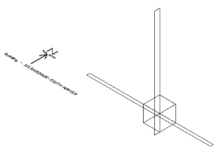


### South Facing Surface

```{exec_python}
engine.write_chart('ScatterLines', 'Solar Chart-South', 'Results for ASHRAE Analytical Test SolRadShade\nZone Solar Load from 9 m2 South Facing Window\nwith 0.6 m Overhang and/or 1.0 m Right Fin\nAtlanta, August 21', 'Time of day', 'Total Zone Load (W)', 'Test SolRadShade.xlsx', 'ASHRAE-Shade-South', 'B6:S151', "(F6,'EPlus-South-NoShade'!B44:B127,F43:F126,1);(H6,B37:B126,H37:H126,2);(I6,B37:B126,I37:I126,3);(G6,B37:B126,G37:G126,4);('EPlus-South-NoShade'!S7,'EPlus-South-NoShade'!B38:B127,'EPlus-South-NoShade'!S38:S127,5);('EPlus-Shade-South-Horiz'!S7,'EPlus-Shade-South-Horiz'!B38:B127,'EPlus-Shade-South-Horiz'!S38:S127,6);('EPlus-Shade-South-Vert'!S7,'EPlus-Shade-South-Vert'!B38:B127,'EPlus-Shade-South-Vert'!S38:S127,7);('EPlus-Shade-South-HorVer'!S7,'EPlus-Shade-South-HorVer'!B38:B127,'EPlus-Shade-South-HorVer'!S38:S127,8);", ['ASHRAE 1052 Version 1.0 & EnergyPlus Version {{ engine.config["EnergyPlusVersion"] }}', 'E-Plus TimeStep=6'], [], ['rs', 'g^', 'b*', 'm+', 'r-', 'g-', 'b-', 'm-']) 

engine.write_chart('ScatterLines', 'SunLit Chart-South', 'Results for ASHRAE Analytical Test SolRadShade\nSunlit Area of 9 m2 South Facing Window\nwith 0.6 m Overhang and/or 1.0 m Right Fin\nAtlanta, August 21', 'Time of Day', 'Sunlit Area of Surface (m2)', 'Test SolRadShade.xlsx', 'ASHRAE-Shade-South', 'B6:O151', "(D6,'EPlus-Shade-South-Horiz'!B44:B127,D43:D126,1);(E6,B37:B126,E37:E126,2);(C6,B37:B126,C37:C126,3);('EPlus-Shade-South-Horiz'!O7,'EPlus-Shade-South-Horiz'!B38:B127,'EPlus-Shade-South-Horiz'!O38:O127,4);('EPlus-Shade-South-Vert'!O7,'EPlus-Shade-South-Vert'!B38:B127,'EPlus-Shade-South-Vert'!O38:O127,5);('EPlus-Shade-South-HorVer'!O7,'EPlus-Shade-South-HorVer'!B38:B127,'EPlus-Shade-South-HorVer'!O38:O127,6);", ['ASHRAE 1052 Version 1.0 & EnergyPlus Version {{ engine.config["EnergyPlusVersion"] }}', 'E-Plus TimeStep=6'], [], ['rs', 'g^', 'b*', 'r-', 'g-', 'b-'])
 
```


**Test SolRadShade – Solar Radiation, Window Shading, South Facing**


Test Parameter               |  Units     | 1052RP           |  EnergyPlus      |  % diff
-----------------------------|------------|------------------|------------------|---------
With Overhang                |            |                  |                  |        |
24-Hour Head Gain            |  $\frac{Wh}{m^2}$   |  {{ engine.format_diff_row("Test SolRadShade.xlsx", "'ASHRAE-Shade-South'!H152", "'EPlus-Shade-South-Horiz'!S153") }} 
Peak Load                    |  $\frac{W}{m^2}$     |  {{ engine.format_diff_row("Test SolRadShade.xlsx", "'ASHRAE-Shade-South'!H153", "'EPlus-Shade-South-Horiz'!S154") }} 
With Fin                     |            |                  |                  |        |
24-Hour Head Gain            |  $\frac{Wh}{m^2}$   |  {{ engine.format_diff_row("Test SolRadShade.xlsx", "'ASHRAE-Shade-South'!I152", "'EPlus-Shade-South-Vert'!S153") }} 
Peak Load                    |  $\frac{W}{m^2}$     |  {{ engine.format_diff_row("Test SolRadShade.xlsx", "'ASHRAE-Shade-South'!I153", "'EPlus-Shade-South-Vert'!S154") }} 
With Overhang & Fin          |            |                  |                  |        |
24-Hour Head Gain            |  $\frac{Wh}{m^2}$   |  {{ engine.format_diff_row("Test SolRadShade.xlsx", "'ASHRAE-Shade-South'!G152", "'EPlus-Shade-South-HorVer'!S154") }} 
Peak Load                    |  $\frac{W}{m^2}$     |  {{ engine.format_diff_row("Test SolRadShade.xlsx", "'ASHRAE-Shade-South'!G153", "'EPlus-Shade-South-HorVer'!S155") }} 


EnergyPlus tracks the analytical results very closely and are slightly lower. Peak values for each situation also track very well.


### West Facing Surface

```{exec_python}
engine.write_chart('ScatterLines', 'Solar Chart-West', 'Results for ASHRAE Analytical Test SolRadShade\nSunlit Area of 9 m2 West Facing Window\nwith 0.6 m Overhang and/or 1.0 m Right Fin\nAtlanta, August 21', 'Time of day', 'Zone Load (W)', 'Test SolRadShade.xlsx', 'ASHRAE-Shade-West', 'B6:S151', "(F6,'EPlus-Shade-West-NoShade'!B38:B127,F37:F126,1);(H6,B37:B126,H37:H126,2);(I6,B37:B126,I37:I126,3);(G6,B37:B126,G37:G126,4);('EPlus-Shade-West-NoShade'!S7,'EPlus-Shade-West-NoShade'!B38:B127,'EPlus-Shade-West-NoShade'!S38:S127,5);('EPlus-Shade-West-Horiz'!T7,'EPlus-Shade-West-Horiz'!B38:B127,'EPlus-Shade-West-Horiz'!T38:T127,6);('EPlus-Shade-West-Vert'!S7,'EPlus-Shade-West-Vert'!B38:B127,'EPlus-Shade-West-Vert'!S38:S127,7);('EPlus-Shade-HorVer'!S7,'EPlus-Shade-HorVer'!B38:B127,'EPlus-Shade-HorVer'!S38:S127,8);", ['ASHRAE 1052 Version 1.0 & EnergyPlus Version {{ engine.config["EnergyPlusVersion"] }}', 'E-Plus TimeStep=6'], [], ['rs', 'g^', 'b*', 'm+', 'r-', 'g-', 'b-', 'm-'])

engine.write_chart('ScatterLines', 'SunLit Chart-West', 'Results for ASHRAE Analytical Test SolRadShade\nSunlit Area of 9 m2 West Facing Window\nwith 0.6 m Overhang and/or 1.0 m Right Fin\nAtlanta, August 21', 'Time of Day', 'Sunlit Area of Surface (m2)', 'Test SolRadShade.xlsx', 'ASHRAE-Shade-West', 'B6:O150', "(D6,'EPlus-Shade-West-Horiz'!B37:B120,D37:D120,1);(E6,B37:B150,E37:E150,2);(C6,B37:B150,C37:C150,3);('EPlus-Shade-West-Horiz'!O7,'EPlus-Shade-West-Horiz'!B38:B121,'EPlus-Shade-West-Horiz'!O38:O121,4);('EPlus-Shade-West-Vert'!O7,'EPlus-Shade-West-Vert'!B38:B121,'EPlus-Shade-West-Vert'!O38:O121,5);('EPlus-Shade-HorVer'!O7,'EPlus-Shade-HorVer'!B38:B121,'EPlus-Shade-HorVer'!O38:O121,6);", ['ASHRAE 1052 Version 1.0 & EnergyPlus Version {{ engine.config["EnergyPlusVersion"] }}', 'E-Plus TimeStep=6'], [], ['rs', 'g^', 'b*', 'r-', 'g-', 'b-'])
```


**Test SolRadShade – Solar Radiation, Window Shading, West Facing**

Test Parameter               |  Units     | 1052RP           |  EnergyPlus      |  % diff
-----------------------------|------------|------------------|------------------|---------
With Overhang                |            |                  |                  |     |
24-Hour Head Gain            |  $\frac{Wh}{m^2}$   |  {{ engine.format_diff_row("Test SolRadShade.xlsx", "'ASHRAE-Shade-West'!H152", "'EPlus-Shade-West-Horiz'!T153") }} 
Peak Load                    |  $\frac{W}{m^2}$     |  {{ engine.format_diff_row("Test SolRadShade.xlsx", "'ASHRAE-Shade-West'!H153", "'EPlus-Shade-West-Horiz'!T154") }} 
With Fin                     |            |                  |                  |     |
24-Hour Head Gain            |  $\frac{Wh}{m^2}$   |  {{ engine.format_diff_row("Test SolRadShade.xlsx", "'ASHRAE-Shade-West'!I152", "'EPlus-Shade-West-Vert'!S153") }} 
Peak Load                    |  $\frac{W}{m^2}$     |  {{ engine.format_diff_row("Test SolRadShade.xlsx", "'ASHRAE-Shade-West'!I153", "'EPlus-Shade-West-Vert'!S154") }} 
With Overhang & Fin          |            |                  |                  |     |
24-Hour Head Gain            |  $\frac{Wh}{m^2}$   |  {{ engine.format_diff_row("Test SolRadShade.xlsx", "'ASHRAE-Shade-West'!G152", "'EPlus-Shade-HorVer'!S153") }} 
Peak Load                    |  $\frac{W}{m^2}$     |  {{ engine.format_diff_row("Test SolRadShade.xlsx", "'ASHRAE-Shade-West'!G153", "'EPlus-Shade-HorVer'!S154") }} 


EnergyPlus tracks the analytical results very closely except for the last
couple of time increments late in the day. The reason for the differences
during the late afternoon hours is again due to the interpolation of hourly
solar data into 10 minute values as is shown in the chart below where use of
the 10 minute weather file corrects this difference. Peak values for each
situation also track very well.

```{exec_python}
engine.write_chart('ScatterLines', 'Solar Chart-West', 'Results for ASHRAE Analytical Test SolRadShade\nSunlit Area of 9 m2 West Facing Window\nwith 0.6 m Overhang and/or 1.0 m Right Fin\nAtlanta, August 21', 'Time of day', 'Zone Load (W)', '821Test SolRadShade.xlsx', 'ASHRAE-Shade-West', 'B6:S151', "(F6,B54:B130,F54:F130,1);(G6,B7:B150,G7:G150,2);(H6,B7:B150,H7:H150,3);(I6,B7:B150,I7:I150,4);('EPlus-Shade-West-Vert'!S7,'EPlus-Shade-West-Vert'!B8:B151,'EPlus-Shade-West-Vert'!S8:S151,5);('EPlus-Shade-HorVer'!S7,'EPlus-Shade-HorVer'!B8:B151,'EPlus-Shade-HorVer'!S8:S151,6);('EPlus-Shade-West-Horiz'!T7,'EPlus-Shade-West-Horiz'!B8:B151,'EPlus-Shade-West-Horiz'!T8:T151,7);('EPlus-Shade-West-NoShade'!S7,'EPlus-Shade-West-NoShade'!B8:B151,'EPlus-Shade-West-NoShade'!S8:S151,8);", ['ASHRAE 1052 Version 1.0 & EnergyPlus Version {{ engine.config["EnergyPlusVersion"] }}', 'E-Plus TimeStep=6\n10 Minute Weather Data'], [], ['rs', 'g^', 'b*', 'm+', 'r-', 'g-', 'b-', 'm-'])
```

  **Test SolRadShade – Solar Radiation, Window Shading, West Facing, 10 minute weather data**

Test Parameter               |  Units     | 1052RP           |  EnergyPlus      |  % diff
-----------------------------|------------|------------------|------------------|---------
With Overhang                |            |                  |                  |   |
24-Hour Head Gain            |  $\frac{W}{m^2}$   |  {{ engine.format_diff_row("821Test SolRadShade.xlsx", "'ASHRAE-Shade-West'!H152", "'EPlus-Shade-West-Horiz'!T153") }} 
Peak Load                    |  $\frac{Wh}{m^2}$     |  {{ engine.format_diff_row("821Test SolRadShade.xlsx", "'ASHRAE-Shade-West'!H153", "'EPlus-Shade-West-Horiz'!T154") }} 
With Fin                     |            |                  |                  |   |
24-Hour Head Gain            |  $\frac{W}{m^2}$   |  {{ engine.format_diff_row("821Test SolRadShade.xlsx", "'ASHRAE-Shade-West'!I152", "'EPlus-Shade-West-Vert'!S153") }} 
Peak Load                    |  $\frac{Wh}{m^2}$     |  {{ engine.format_diff_row("821Test SolRadShade.xlsx", "'ASHRAE-Shade-West'!I153", "'EPlus-Shade-West-Vert'!S154") }} 
With Overhang & Fin          |            |                  |                  |   |
24-Hour Head Gain            |  $\frac{W}{m^2}$   |  {{ engine.format_diff_row("821Test SolRadShade.xlsx", "'ASHRAE-Shade-West'!G152", "'EPlus-Shade-HorVer'!S153") }} 
Peak Load                    |  $\frac{Wh}{m^2}$     |  {{ engine.format_diff_row("821Test SolRadShade.xlsx", "'ASHRAE-Shade-West'!G153", "'EPlus-Shade-HorVer'!S154") }} 


## Test WinReveal – Window Reveal

This test is similar to the SolRadShade test described in the previous section
except that the test surface is a 3m x 3m opaque wall with a 2m x 2m window
which is setback into the window opening by 0.3m. The test surface here was
chosen to be south facing. Shown below are resultant loads in the zone for two
cases: one with a window that has a 0.3m reveal and one with a window that has
no reveal (0.0m).

```{exec_python}
engine.write_chart('ScatterLines', 'Zone Load Chart-South', 'EnergyPlus Version {{ engine.config["EnergyPlusVersion"] }} & ASHRAE 1052 Version 1.0\nResults for ASHRAE Analytical Test WinReveal\nZone Load From Sunlit Area of \n4 m2 South Facing Window with 0.3 m Setback\nAtlanta, August 21', 'Time of Day', 'Zone Load (W)', 'Test WinReveal.xlsx', 'ASHRAE Data-Setback', 'B6:AL151', "(D6,B37:B140,D37:D140,1);(E6,B7:B150,E7:E150,2);('EPlus Data-NoSetback'!AL7,'EPlus Data-NoSetback'!B8:B151,'EPlus Data-NoSetback'!AL8:AL151,3);('EPlus Data-WithSetback'!AL7,'EPlus Data-WithSetback'!B8:B151,'EPlus Data-WithSetback'!AL8:AL151,4);", ['E-Plus TimeStep=6'], [], ['rs', 'g^', 'r-', 'g-']  )

engine.write_chart('ScatterLines', 'SunLit Chart-South', 'EnergyPlus Version {{ engine.config["EnergyPlusVersion"] }} & ASHRAE 1052 Version 1.0\nASHRAE Analytical Test WinReveal\nSunlit Area of 4 m2 South Facing Window with 0.3 m Setback\nAtlanta, August 21', 'Time of Day', 'Sunlit Area of Window (m2)', 'Test WinReveal.xlsx', 'ASHRAE Data-Setback', 'B6:AI151', "(C6,B7:B150,C7:C150,1);('EPlus Data-WithSetback'!AI7,'EPlus Data-WithSetback'!B8:B151,'EPlus Data-WithSetback'!AI8:AI151,2);", ['E-Plus TimeStep=6'], [], ['rs', 'r-']) 
```


**Test WinReveal – Window Reveal, South Facing**

Test Parameter               |  Units     | 1052RP           |  EnergyPlus      |  % diff
-----------------------------|------------|------------------|------------------|---------
With Overhang                |            |                  |                  |   |
24-Hour Head Gain            |  $\frac{Wh}{m^2}$   |  {{ engine.format_diff_row("Test WinReveal.xlsx", "'ASHRAE Data-Setback'!E123", "'EPlus Data-WithSetback'!AL153") }} 
Peak Load                    |  $\frac{W}{m^2}$     |  {{ engine.format_diff_row("Test WinReveal.xlsx", "'ASHRAE Data-Setback'!E124", "'EPlus Data-WithSetback'!AL154") }} 

The load curves for the no reveal case are very similar to those for the
SolRadGlazing test presented and discussed in Section 2.7 where the peak load
for EnergyPlus was slightly lower than the analytical result. The load curves
for the window with reveal have a shape similar to those for the no reveal case
except with reduced values due to the shading that the window setback creates.
The sunlit area of the window for each time step as determined by EnergyPlus is
almost identical to the analytical values.


##Test IntSolarDist – Internal Solar Distribution

The test zone is 3m wide x 0.5m deep x 3m high. One of the 3m x 3m surfaces is
chosen as the test surface and has a 1m x 1m window centered in the surface.
The window has a 0.5m overhang and 0.5m fins on either side. This configuration
allows solar radiation to impinge only on the internal surface of the wall
opposite the window (see figure below). The surface opposite the window is
assumed massless and no internal redistribution of solar radiation occurs. All
other surfaces are of heavyweight construction and are assumed adiabatic. The
heavyweight surfaces test to see if the program is redistributing the solar
gains which for this test it should not. The inside and outside temperatures
are held constant at 20°C. The location and date were set for Atlanta,August
21. The test surface with the window was chosen as east facing.

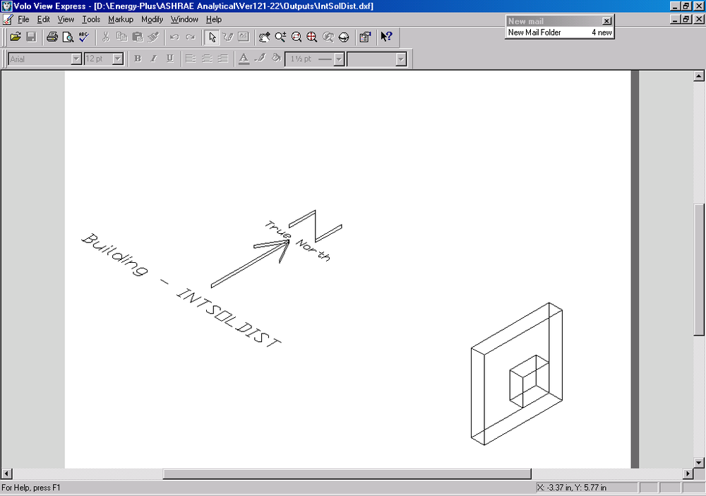


```{exec_python}
engine.write_chart('ScatterLines', 'Zone Load-East Chart', 'EnergyPlus Version {{ engine.config["EnergyPlusVersion"] }} & ASHRAE 1052 Version 1.0\nResults for ASHRAE Analytical Test IntSolDist\nZone Load From Sunlit Area of 1 m2 East Facing Window\nwith 0.5 m Overhang and 0.5 m Right & Left  Fins\nAtlanta, August 21', 'Time of Day', 'Zone Load (W)', 'Test IntSolDist.xlsx', 'ASHRAE Data-Shade', 'B6:AL151', "(D6,B7:B150,D7:D150,1);('EPlus Data-Shade'!AL7,'EPlus Data-Shade'!B8:B151,'EPlus Data-Shade'!AL8:AL151,2);", ['E-Plus TimeStep=6'], [], ['rs', 'r-'])
```

**Test IntSolDist – Internal Solar Distribution, East Facing**

Test Parameter               |  Units     | 1052RP           |  EnergyPlus      |  % diff
-----------------------------|------------|------------------|------------------|---------
With Overhang                |            |                  |                  |   |
24-Hour Head Gain            |  $\frac{Wh}{m^2}$   |  {{ engine.format_diff_row("Test IntSolDist.xlsx", "'ASHRAE Data-Shade'!D123", "'EPlus Data-Shade'!AL154") }} 
Peak Load                    |  $\frac{W}{m^2}$     |  {{ engine.format_diff_row("Test IntSolDist.xlsx", "'ASHRAE Data-Shade'!D124", "'EPlus Data-Shade'!AL155") }} 

The shape of the EnergyPlus zone load curve is similar to that for the
analytical results except that there is a significant difference in peak
values. The sunlit areas as shown below track the analytical results very
closely. With EnergyPlus version 2.1.0.023 there was a slight change in results
(<0.1% in 24-hour zone load) due to a change in the methodology for handling
solar diffuse through a window which was completely reworked in EnergyPlus
2.1.0.012 and was changed from uniform interior distribution of transmitted
diffuse solar to distribution based on approximate view factors between
transmitting windows and zone heat transfer surfaces (CR 7237).

In EnergyPlus 7.0.0.036 the shadow calculations were improved for non-convex
shading surfaces. This had a small impact on IntSolDist test results but moved
EnergyPlus closer to the 1052RP results by increasing the peak load by 0.5% and
the zone load by 0.05%.

```{exec_python}
engine.write_chart('ScatterLines', 'SunLit-East  Chart', 'EnergyPlus Version {{ engine.config["EnergyPlusVersion"] }} & ASHRAE 1052 Version 1.0\nResults for ASHRAE Analytical Test IntSolDist\nSunlit Area of 1 m2 East Facing Window\nwith 0.5 m Overhang and 0.5 m Right & Left  Fins\nAtlanta, August 21', 'Time of Day', 'Sunlit Area of Window (m2)', 'Test IntSolDist.xlsx', 'ASHRAE Data-Shade', 'B6:AI151', "(C6,B7:B150,C7:C150,1);('EPlus Data-Shade'!AI7,'EPlus Data-Shade'!B8:B151,'EPlus Data-Shade'!AI8:AI151,2);", ['E-Plus TimeStep=6'], [], ['rs', 'r-']) 
```


As indicated in the chart below, when the EnergyPlus simulation is rerun
with a 10 minute weather file, almost perfect agreement is obtained with
the analytical results.

```{exec_python}
engine.write_chart('ScatterLines', 'Zone Load-East Chart', 'EnergyPlus Version {{ engine.config["EnergyPlusVersion"] }} & ASHRAE 1052 Version 1.0\nResults for ASHRAE Analytical Test IntSolDist\nZone Load From Sunlit Area of 1 m2 East Facing Window\nwith 0.5 m Overhang and 0.5 m Right & Left  Fins\nAtlanta, August 21', 'Time of Day', 'Zone Load (W)', '821Test IntSolDist.xlsx', 'ASHRAE Data-Shade', 'B6:AL151', "(D6,B7:B150,D7:D150,1);('EPlus Data-Shade'!AL7,'EPlus Data-Shade'!B8:B151,'EPlus Data-Shade'!AL8:AL151,2);", ['E-Plus TimeStep=6\n10 Minute Weather Data'], [], ['rs', 'r-'])
```

**Test IntSolDist – Internal Solar Distribution, East Facing, 10 minute weather data**

Test Parameter               |  Units     | 1052RP           |  EnergyPlus      |  % diff
-----------------------------|------------|------------------|------------------|---------
With Overhang                |            |                  |                  |   |
24-Hour Head Gain            |  $\frac{Wh}{m^2}$   |  {{ engine.format_diff_row("821Test IntSolDist.xlsx", "'ASHRAE Data-Shade'!D123", "'EPlus Data-Shade'!AL153") }} 
Peak Load                    |  $\frac{W}{m^2}$     |  {{ engine.format_diff_row("821Test IntSolDist.xlsx", "'ASHRAE Data-Shade'!D124", "'EPlus Data-Shade'!AL154") }} 


## Test Infiltration-1, Sensible Infiltration Load, Fixed Infiltration Rate

The test zone is again a cube measuring 3m x 3m x 3m with no windows. All surfaces are assumed adiabatic. The inside temperature is held constant at 20°C and outside temperature is constant at 10°C. Infiltration occurs at a constant rate of $0.5\frac{m^3}{s}$ .

{{ engine.create_table_from_excel_range("Tests Infil-1.xlsx", "Infil-1", "B8:H13") }}


EnergyPlus results for Test Infiltration-1 are very close to ASHRAE 1052 analytical results.


## Test Infiltration-2, Stack Effect

The objective of this test is to test the treatment of infiltration under the pressure difference due to density and height differences resulting from fixed openings in the building fabric. This is done for a single zone with openings at high and low levels. The test zone is a tall cubic measuring 3m x 3m x 10m.  Two 0.5m x 0.2m openings are placed symmetrically at the top and bottom of the external walls. All surfaces are adiabatic. The inside temperature is held constant at 20°C and outside temperature is constant at 10°C. The inside and outside humidity ratios are held constant at the same value.

The modeling of this test with EnergyPlus required the use of the AIRFLOW NETWORK module. The EnergyPlus AIRFLOW NETWORK module allows a wall opening through which air flows to be modeled as a SIMPLE OPENING, DETAILED OPENING or SURFACE CRACK. The SURFACE CRACK method was chosen for this test because the formulas used by EnergyPlus for the SURFACE CRACK method are the same as those described in the test documentation for the analytical solution for this test case. EnergyPlus does not calculate the height of the neutral pressure zone. This was calculated instead by hand using the equation in the test documentation.


{{ engine.create_table_from_excel_range("Tests Infil-2.xlsx", "Infil-1", "B8:H11") }}


The EnergyPlus results for Test Infiltration-2 are very close to the
ASHRAE 1052-RP analytical results


## Test ExtLWRad – External Long Wave Radiation

The test zone is a cube measuring 3m x 3m x 3m with no windows. The external surface to be tested is a horizontal roof made of a single layer with thickness of 0.1m, thermal conductivity of 1.00 $\frac{W}{mK}$ and surface emissivity of 0.9. All other surfaces are adiabatic and have no thermal mass. The effects of solar irradiation, internal long wave radiation, infiltration, and internal heat gains are eliminated. Inside and outside temperatures are fixed at 20°C. One of the 1052RP inputs required for this test is the sky temperature in °C. The sky temperature in EnergyPlus cannot be fixed at a certain temperature, therefore EnergyPlus was run first using the above input parameters to determine the resulting sky temperature and inside and outside surface convection coefficients. EnergyPlus gave the following results:

Inside surface convection coefficient = {{ engine.get_cell("Test ExtLWRad.xlsx", "'Test ExtLWRad'!G15") }} W/m2-K
 Outside surface convection coefficient = {{ engine.get_cell("Test ExtLWRad.xlsx", "'Test ExtLWRad'!G16") }} W/m2-K
 Sky temperature = {{ engine.get_cell("Test ExtLWRad.xlsx", "'Test ExtLWRad'!G17") }}°C

The ASHRAE 1052RP toolkit was then use to simulate the ExtLWRad test with the input parameters set to be the same as those used by EnergyPlus. The comparative results are presented below.

**Test ExtLWRad: External Long Wave Radiation**

{{ engine.create_table_from_excel_range("Test ExtLWRad.xlsx", "Test ExtLWRad", "B8:H19") }}

Note: Convection coefficients and sky temperature were taken from EnergyPlus and entered into 1052RP Toolkit software  
>Zone Load = Heat Flux x $9m^2$ surface area


The reason for these differences is uncertain, but may be due to differences in modeling approach.


## Test IntLWRad – Interior Long Wave Radiation

The test zone is a building of 3m x 3m cross-section and varying length where L=3xAR, where AR is the aspect ratio. There are no windows. One of the 3m x 3m surfaces is selected as an external surface and the other surfaces are adiabatic. The test surface is of lightweight construction. The AR is varied from 1 to 2 to 5 to 10 to 20. The inside and outside temperatures are held constant at 20°C and 40°C respectively. Three different sets of surface emissivities are tested. Resulting interior surface temperatures for each set of emissivities and varying AR are presented below.


### Test 1 –Ext. Surf. Emis. = 0.9, Oppos. Surf. Emis. = 0.1, Other Surf. Emis. = 0.3 

```{exec_python}
engine.write_chart('ScatterLines', 'Chart-Surface Temp', 'ASHRAE Analytical Test IntLWRad-Test 1\nExterior Wall Surface Temperature versus Aspect Ratio\nBuilding of 3mx3m Cross-Section of Varying Length (L=3xAR)\nExt. Surf. Emis.=0.9, Oppos. Surf. Emis.=0.1, Other Surf. Emis.=0.3\nOutdoor Temp=40C, Indoor Temp=20C', 'Aspect Ratio (L/W)', 'Inside Surface Temperature (C)', 'Test IntRad-Test 1-cond=1000.xlsx', 'Data', 'B10:J15', "(J10,B11:B15,J11:J15,1);(L10,B11:B15,L11:L15,2);(M10,B11:B15,M11:M15,3);(C10,B11:B15,C11:C15,4);(E10,B11:B15,E11:E15,5);(F10,B11:B15,F11:F15,6);", ['EnergyPlus Version {{ engine.config["EnergyPlusVersion"] }} & ASHRAE 1052 Version 1.0', 'Eplus Conductivity = 1000', 'E-Plus TimeStep=6'], [], ['r^', 'bs', 'g*', 'r-', 'b-', 'g-'])
```

Excellent agreement is obtained between the two programs. For the EnergyPlus simulations, the ConvectionCoefficients object was used to force the inside convection coefficient to be the same value for all surfaces for a given aspect ratio in order to conform with the 1052 toolkit specification.

```{exec_python}
engine.write_chart('ScatterLines', 'Chart-Zone Load', 'ASHRAE Analytical Test IntLWRad-Test 1\nZone Load versus Aspect Ratio\nBuilding of 3mx3m Cross-Section of Varying Length (L=3xAR)\nExt. Surf. Emis.=0.9, Oppos. Surf. Emis.=0.1, Other Surf. Emis=0.3\nOutdoor Temp=40C, Indoor Temp=20C', 'Aspect Ratio (L/W)', 'Zone Load (W)', 'Test IntRad-Test 1-cond=1000.xlsx', 'Data', 'B10:K15', "(K10,B11:B15,K11:K15,1);(D10,B11:B15,D11:D15,2);", ['EnergyPlus Version {{ engine.config["EnergyPlusVersion"] }} & ASHRAE 1052 Version 1.0', 'Eplus Conductivity = 1000', 'E-Plus TimeStep=6'],  [], ['r^', 'r-'])
```

Zone loads results also agree very well. Similar agreement was obtained
for the other two tests as indicated below.

{{ engine.create_table_from_excel_range("Test IntRad-Test 1-cond=1000.xlsx", "Comparison", "A1:K27", [0]) }}


### Test 2 –Ext. Surf. Emis. = 0.9, All Other Surf. Emis. = 0.1 

```{exec_python}
engine.write_chart('ScatterLines', 'Chart-Surface Temp', 'ASHRAE Analytical Test IntLWRad-Test 2\nExterior Wall Surface Temperature versus Aspect Ratio\nBuilding of 3mx3m Cross-Section of Varying Length (L=3xAR)\nExt. Surface Emis=0.9, All Other Surfaces Emis=0.1\nOutdoor Temp=40C, Indoor Temp=20C', 'Aspect Ratio (L/W)', 'Inside Surface Temperature (C)', 'Test IntRad-Test 2-cond=1000.xlsx', 'Data', 'B10:J15', "(J10,B11:B15,J11:J15,1);(L10,B11:B15,L11:L15,2);(M10,B11:B15,M11:M15,3);(C10,B11:B15,C11:C15,4);(E10,B11:B15,E11:E15,5);(F10,B11:B15,F11:F15,6);", ['EnergyPlus Version {{ engine.config["EnergyPlusVersion"] }} & ASHRAE 1052 Version 1.0', 'Eplus Conductivity = 1000', 'E-Plus TimeStep=6'], [],  ['r^', 'bs', 'g*', 'r-', 'b-', 'g-'])

engine.write_chart('ScatterLines', 'Chart-Zone Load', 'ASHRAE Analytical Test IntLWRad-Test 2\nZone Load versus Aspect Ratio\nBuilding of 3mx3m Cross-Section of Varying Length (L=3xAR)\nExt. Surface Emis=0.9, All Other Surfaces Emis=0.1\nOutdoor Temp=40C, Indoor Temp=20C', 'Aspect Ratio (L/W)', 'Zone Load (W)', 'Test IntRad-Test 2-cond=1000.xlsx', 'Data', 'B10:K15', "(K10,B11:B15,K11:K15,1);(D10,B11:B15,D11:D15,2);", ['EnergyPlus Version {{ engine.config["EnergyPlusVersion"] }} & ASHRAE 1052 Version 1.0', 'Eplus Conductivity = 1000', 'E-Plus TimeStep=6'], [],  ['r^', 'r-']) 
```

{{ engine.create_table_from_excel_range("Test IntRad-Test 2-cond=1000.xlsx", "Comparison", "A1:K27", [0]) }}


### Test 3 –All Surf. Emis. = 0.9 

```{exec_python}
engine.write_chart('ScatterLines', 'Chart-Surface Temp', 'ASHRAE Analytical Test IntRad-Test 3\nExterior Wall Surface Temperature versus Aspect Ratio\nBuilding of 3mx3m Cross-Section of Varying Length (L=3xAR)\nAll Surfaces Emis=0.9\nOutdoor Temp=40C, Indoor Temp=20C', 'Aspect Ratio (L/W)', 'Inside Surface Temperature (C)', 'Test IntRad-Test 3-cond=1000.xlsx', 'Data', 'B10:J15', "(J10,B11:B15,J11:J15,1);(L10,B11:B15,L11:L15,2);(M10,B11:B15,M11:M15,3);(C10,B11:B15,C11:C15,4);(E10,B11:B15,E11:E15,5);(F10,B11:B15,F11:F15,6);", ['EnergyPlus Version {{ engine.config["EnergyPlusVersion"] }} & ASHRAE 1052 Version 1.0', 'Eplus Conductivity = 1000', 'E-Plus TimeStep=6'], [],  ['r^', 'bs', 'g*', 'r-', 'b-', 'g-']) 

engine.write_chart('ScatterLines', 'Chart-Zone Load', 'ASHRAE Analytical Test IntRad-Test 3\nZone Load versus Aspect Ratio\nBuilding of 3mx3m Cross-Section of Varying Length (L=3xAR)\nAll Surfaces Emis=0.9\nOutdoor Temp=40C, Indoor Temp=20C', 'Aspect Ratio (L/W)', 'Zone Load (W)', 'Test IntRad-Test 3-cond=1000.xlsx', 'Data', 'B10:K15', "(K10,B11:B15,K11:K15,1);(D10,B11:B15,D11:D15,2);", ['EnergyPlus Version {{ engine.config["EnergyPlusVersion"] }} & ASHRAE 1052 Version 1.0', 'Eplus Conductivity = 1000', 'E-Plus TimeStep=6'], [],  ['r^', 'r-']) 
```

{{ engine.create_table_from_excel_range("Test IntRad-Test 3-cond=1000.xlsx", "Comparison", "A1:K27", [0]) }}


## Test IntHeatGain – Internal Heat Gains, Convective and Radiative

The test zone is a 3m x 3m x 3m cube with no windows. All surfaces of the zone are single layer and of the same construction and are adiabatic. The inside temperature is held constant at 20°C. A 2700 W internal load is turned on for 168 hours and then is turned off. Tests are run for three different situations assuming the internal loads are 100% radiative, 50% radiative and 0% radiative (100% convective).

```{exec_python}
engine.write_chart('ScatterLines', 'Chart-Load', 'EnergyPlus Version {{ engine.config["EnergyPlusVersion"] }} & ASHRAE 1052 Version 1.0\nResults for ASHRAE Analytical Test IntHeatGain\n2,700 watt Internal load, On for 168 Hours, Then Off\nE-Plus with Double Wall Thickness, 0.2 m', 'Hour of simulation', 'Zone Load (W)', 'Test IntHeatGain-2XWall-TS6-OpenZone.xlsx', 'ASHRAE 100 Rad', 'A6:Y343', "(E6,'EPlus 50 Rad'!A7:A335,E7:E343,1);('ASHRAE 50 Rad'!E6,'EPlus 50 Rad'!A7:A335,'ASHRAE 50 Rad'!E7:E343,2);('ASHRAE 100 Conv'!E6,'EPlus 50 Rad'!A7:A335,'ASHRAE 100 Conv'!E7:E343,3);('EPlus 100 Rad'!Y6,'EPlus 50 Rad'!A7:A335,'EPlus 100 Rad'!Y7:Y335,4);('EPlus 50 Rad'!Y6,'EPlus 50 Rad'!A7:A335,'EPlus 50 Rad'!Y7:Y335,5);('EPlus 100 Conv'!Y6,'EPlus 50 Rad'!A7:A335,'EPlus 100 Conv'!Y7:Y335,6);", ['E-Plus TimeStep=6', 'E-Plus simulated with "Opened Floor\n& Ceiling" to achieve constant Inside Film = 3.076 for all surfaces'],  [], ['r^', 'bs', 'g*', 'r-', 'b-', 'g-'])

engine.write_chart('ScatterLines', 'Chart-Temperature', 'EnergyPlus Version {{ engine.config["EnergyPlusVersion"] }} & ASHRAE 1052 Version 1.0\nResults for ASHRAE Analytical Test IntHeatGain\n2,700 watt Internal load, On for 168 Hours, Then Off\nE-Plus with Double Wall Thickness, 0.2 m', 'Hour of Simulation', 'Inside Surface Temperature (C)', 'Test IntHeatGain-2XWall-TS6-OpenZone.xlsx', 'ASHRAE 100 Rad', 'A6:O343', "(C6,'EPlus 100 Conv'!A7:A341,C7:C343,1);('ASHRAE 50 Rad'!C6,'EPlus 100 Conv'!A7:A341,'ASHRAE 50 Rad'!C7:C343,2);('ASHRAE 100 Conv'!C6,'EPlus 100 Conv'!A7:A341,'ASHRAE 100 Conv'!C7:C343,3);('EPlus 100 Rad'!O6,'EPlus 100 Conv'!A7:A341,'EPlus 100 Rad'!O7:O340,4);('EPlus 50 Rad'!O6,'EPlus 100 Conv'!A7:A341,'EPlus 50 Rad'!O7:O341,5);('EPlus 100 Conv'!O6,'EPlus 100 Conv'!A7:A341,'EPlus 100 Conv'!O7:O341,6);", ['E-Plus TimeStep=6', 'E-Plus simulated with "Opened Floor\n& Ceiling" to achieve constant Inside Film = 3.076 for all surfaces'],  [], ['r^', 'bs', 'g*', 'r-', 'b-', 'g-'])
```

EnergyPlus results for zone load and inside surface temperature for the
IntHeatGain test are almost identical to the analytical results.

{{ engine.create_table_from_excel('Test IntHeatGain-2XWall-TS6-OpenZone.xlsx', "Comparison", [0]) }}


## Test GrdCoup – Ground Coupling, Slab-on-Grade Floor

The test zone is again a cube with internal dimensions of 3m x 3m x 3m
with no windows. All surfaces except the floor are adiabatic. The effects of solar irradiation, long wave radiation and infiltration are eliminated. The floor and ground are treated as a uniform semi-infinite slab. The inside air temperature is constant at 25°C while the ground temperature is constant at 2°C.

To handle ground coupling problems with slab-on-grade floors, EnergyPlus
requires the running of a separate auxiliary program called Slab. As
input this program requires the properties of the slab and soil, thickness of the slab, the average inside monthly temperature, insulation details and properties, area-to-perimeter ratio of the slab, indoor combined radiative and convective heat transfer coefficient, etc. The Slab program also requires an hourly weather file which it uses to calculate the deep ground temperature. The program calculates the resulting monthly slab/ground interface temperatures for the core and perimeter area of the slab and also the area weighted average temperature of the slab/ground interface. These monthly temperatures at the exterior of the slab surface are then input to the EnergyPlus whole building simulation program using the GroundTemperatures object where
the heat flux of the floor is used to perform the heat balance within the zone each timestep.

Unlike the other tests that are part of the 1052 Toolkit, the GrdCoup test does not generate a weather file that can be used by the test program. An EPW weather file in EnergyPlus format had to be generated separately for use with the Slab program. In doing this it was assumed that the outdoor dry-bulb temperature was held constant each hour and was set equal to the outside ground temperature (2C) that was specified for the 1052 Toolkit input, and all solar values were set to zero. The results of EnergyPlus versus the 1052 Toolkit results are presented
below.

{{ engine.create_table_from_excel_range('Tests GrdCoup.xlsx', "GrdCoup", "B8:H9,B11:H11") }}


For EnergyPlus version 1.2.2.030, the Slab program was significantly modified to add new user inputs and to refine the autogridding scheme. However, the EnergyPlus results are still significantly different from the ASHRAE 1052 results. Possible reasons include:

- The creation of an EnergyPlus weather file may be causing some differences

- The 1052-RP specification calls for the ground surface temperature
    to be the same as the deep ground temperature. The EnergyPlus Slab
    program requires that the distance from the edge of the slab to the
    domain edge be specified. No value was given for this parameter in
    the 1052-RP specification. It was assumed to be 10m.

-  The EnergyPlus Slab program requires the user to specify the
    thickness of the slab. None was given in the specification. It was
    assumed to be 0.13m.

-  The EnergyPlus Slab program requires that the material properties of
    the slab and soil be specified. None were given in the specification
    except for the 1.0 $\frac{W}{mK}$ slab conductivity. It was assumed that the
    density of the slab and soil was 2200 $\frac{kg}{m^3}$ and the specific
    heat of the slab and soil was 670 $\frac{J}{kgK}$

-  The documentation for this test states that “The floor is
    rectangular and is bounded (but not penetrated) on each side by four
    equal width external walls. It is assumed that the effect of the
    walls is to change the ground/slab surface temperature linearly over
    their thickness. The walls have a finite conductance but its actual
    value is unimportant." This boundary condition is not simulated by
    the Slab program, which assumes that entire top surface of the slab
    is exposed to the zone air temperature, and that all of the ground
    is exposed to the outdoor conditions. The wall thickness in the
    toolkit was to 0.1mm to minimize the impact of this boundary
    condition.

Further investigation of these issues will be done as part of work on a more extensive ground coupling test suite.


# EnergyPlus Problems Uncovered While Using ASHRAE 1052-RP Toolkit

During the process of using the ASHRAE 1052-RP Toolkit to test early versions of EnergyPlus, several significant differences were identified when comparing the EnergyPlus results to that of the toolkit. Each of these is discussed further in this section with the eventual resolution of the problem.


## Inverted Coordinates for Shade Fins

As was described in Section 2.8, a series of SolRadShade cases test a program’s ability to handle shading of windows caused by horizontal overhangs and vertical fins. A schematic of the SolRadShade test model for a south facing window with semi-infinite overhang and right fin is shown in Figure 1 below.


**Figure 1 View of SolRadShade Test Model with South Facing Window and Semi-Infinite Overhang and Right Fin**

When the SolRadShade test for this configuration was simulated with
EnergyPlus version 1.0.0.011, the results shown below in Figure 2 were obtained.

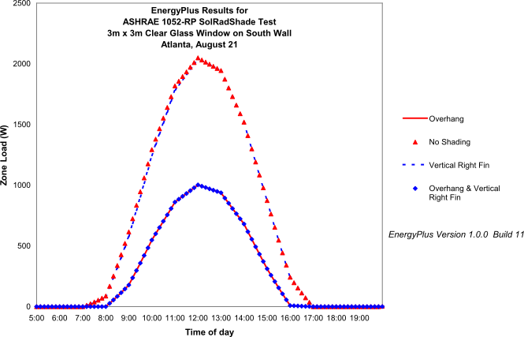

**Figure 2 Results from ASHRAE 1052-RP SolRadShade Test – Window Solar Gain Indicating Error with Shade Fin Calculation**

The two cases with overhangs showed the expected reduction in zone load
versus the “No Shading” case but the test with only the right fin present showed very little change from the “No Shading” case. This obviously was not right. Further searching into the reason why this was happening revealed that EnergyPlus was not setting the coordinates of the fin correctly. EnergyPlus had internally switched the length and width dimensions of the vertical fin which inverted the fin coordinates. This put the long dimension of the fin horizontally along the ground and the short dimension of the fin extending vertically upward, causing very little shading. This is an error that propagated from BLAST (Building
Systems Laboratory, 1999) where the EnergyPlus shading calculation code
orginated. Once a correction was made to the EnergyPlus code, the expected results as shown in Figure 3 were obtained.

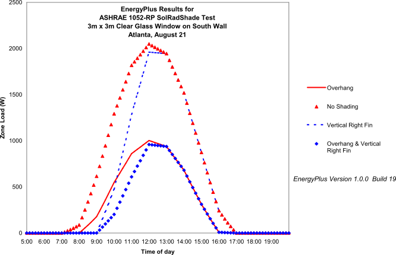

**Figure 3 Results from ASHRAE 1052-RP SolRadShade Test – Window Solar Gain with Shade Fin Problem Corrected**

Figure 4 below shows the SolRadShade test results with the latest release of EnergyPlus along with the corresponding 1052-RP analytical results. These EnergyPlus results also include the impact of a solar time shift error that was corrected and is further discussed in Section 3.3.

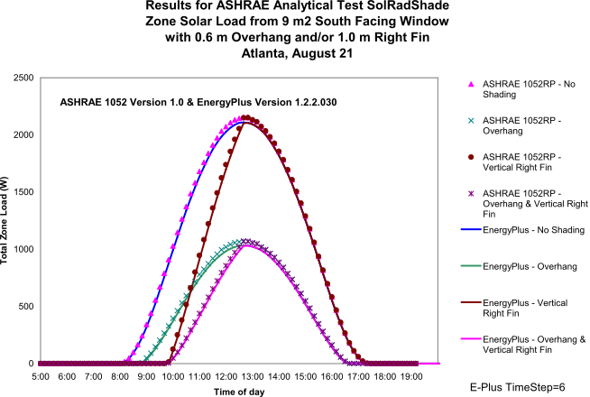

**Figure 4 Results from ASHRAE 1052-RP SolRadShade Test – Window Solar Gain with Shade Fin Problem and Solar Time Shift Problem Corrected**


## Sunlit Areas of Surfaces

With early versions of EnergyPlus the sunlit area calculations for shaded surfaces such as windows were done once each hour at the beginning of the hour and then were assumed constant for the rest of the hour. This was done to increase the speed of an EnergyPlus simulation. When the results of the sunlit area calculations using this approach were compared to 1052-RP analytical results however (see Figure 5), it was discovered that EnergyPlus was predicting the sunlit area for this
test to be 7.2% higher than the analytical result on a daily basis. In EnergyPlus 1.0.1.010 the sunlit area calculation was changed to occur at the beginning of every time step rather than only once each hour. This reduced the difference between EnergyPlus and 1052-RP to less than 1% as
shown in Figure 6.

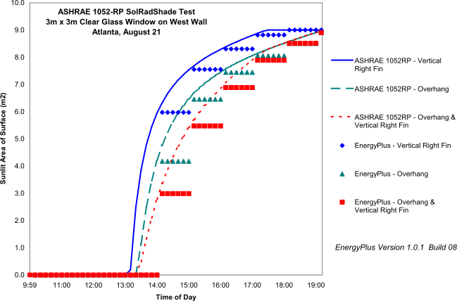

**Figure 5 Results from ASHRAE 1052-RP SolRadShade Test – EnergyPlus Window Sunlit Area Calculated Once Each Hour**

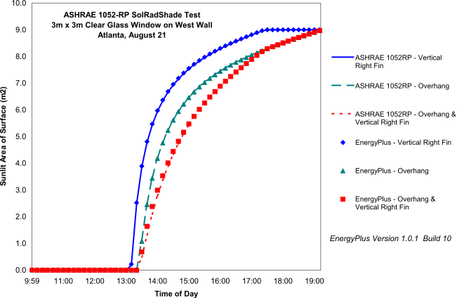

**Figure 6 Results from ASHRAE 1052-RP SolRadShade Test – EnergyPlus Window Sunlit Area Calculated for each Timestep**


## Solar Time Shift

When comparing the results of early versions of EnergyPlus with the results of various 1052-RP tests involving solar gain, it was noticed that there was a time shift between the simulated and analytical results (see Figure 7). Initially this was thought to be a daylight savings time error, but that was ruled out. It was determined that the problem was attributed to the manner in which hourly weather data was being interpolated for sub-hourly time steps. Data recorded on weather files are in one hour increments where for solar radiation the values are the total or average for the hour. Prior to EnergyPlus 1.0.1 Build 8 the solar radiation value taken from the weather file was assumed to be for the beginning of the hour and interpolation was then used to get the solar radiation for the sub-hourly time steps during the hour. This approach resulted in the time shift shown in Figure 7. Things improved when a “half” solar radiation interpolation technique was adopted where the solar radiation value read from the weather file was assumed to be at the half-hour point and then interpolated to get the values at the other time steps within the hour. This technique resulted in a very good correlation pattern with the 1052-RP toolkit results as shown in Figure 8 but the peak cooling load for EnergyPlus was 4.6% lower than that
predicted by 1052-RP.

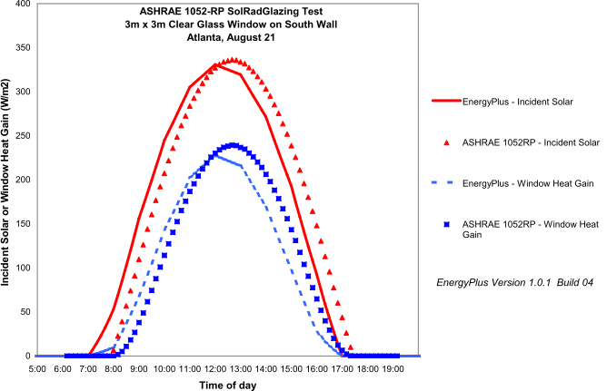

**Figure 7 Results from ASHRAE 1052RP SolRadGlazing Analytical Test - Window Solar Gain, Atlanta, August 21, South Facing Clear Single-Pane Glass Showing Time Shift in Results**

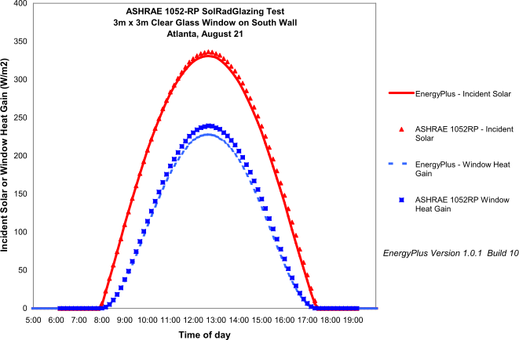

**Figure 8 Results from ASHRAE 1052RP SolRadGlazing Analytical Test - Window Solar Gain, Atlanta, August 21, South Facing Clear Single-Pane Glass with Solar Time Shift Corrected**

## Underestimating Peak Cooling Loads with Windows

As is evidenced by the EnergyPlus results presented in Figure 8 above, for most of the 1052-RP tests with windows EnergyPlus version 1.0 releases and earlier were predicting peak cooling loads that were smaller than the analytical results. Some of this difference got resolved when the EnergyPlus algorithms for handling solar transmittance through glass were updated. Algorithm changes were made to the window calculation of transmittance and reflectance versus angle of incidence for a single glass layer to correspond to what is currently in WINDOW 4 and WINDOW 5. The previous routine, based on an older WINDOW 4 .0 report, underestimated transmittance for angles of incidence >60 degrees. As shown in Figure 9 for the same SolRadGlazing case discussed in the previous section, excellent agreement was then obtained with the 1052-RP analytical results. The peak cooling load is now within 2%.

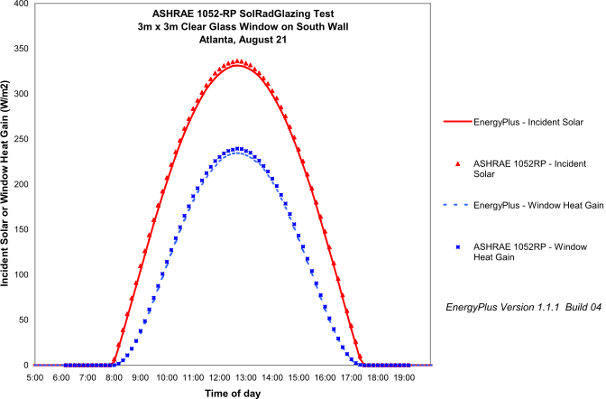

**Figure 9 Results from ASHRAE 1052RP SolRadGlazing Analytical Test - Window Solar Gain, Atlanta, August 21, South Facing Clear Single-Pane Glass with Window Solar Transmittance Corrected**


## Summary of Pertinent Changes that Occurred Between Versions of EnergyPlus

This section summarizes the modifications that were made to the EnergyPlus code or changes That were made in the modeling approach during the testing of EnegyPlus with the ASHRAE 1052-RP toolkit. Since the testing of EnergyPlus with the ASHRAE 1052-RP toolkit first began with version 1.0 back in June 2001, further capabilities and improvements have been added to EnergyPlus with new releases beginning in August 2002 (version 1.0.2) and continuing through the current version {{ engine.config["EnergyPlusVersion"] }}. The table below summarizes pertinent input file and code changes that were made as the testing progressed with each new public release of EnergyPlus.

**Summary of Pertinent EnergyPlus Changes that were Implemented Over Course of 1052-RP Toolkit Testing**

{{ engine.create_table_from_yaml("EnergyPlusChanges.yaml", ["Version", "Input-File-Changes", "Code-Changes"]) }}


Beginning with EnergyPlus version 1.3.0.018 a new SITE ATMOSPHERIC
VARIATION input object became available (beginning with EnergyPlus 3.0.0
the name of this object changed to Site:HeightVariation) to simulate
changes in outside air temperature and wind speed that typically occur
vertically across building surfaces versus the outdoor air temperature and wind speed that are obtained each hour from the weather file. Typically the meteorological wind speed is measured in an open field at 10m above the ground and meteorological air temperature is measured at 1.5m above ground level. To accommodate atmospheric variation EnergyPlus now automatically calculates the local outdoor air temperature and wind speed separately for each zone and surface exposed to the outdoor environment. The zone centroid or surface centroid are used to determine the height above ground. Only local outdoor air temperature and wind
speed are currently calculated because they are important factors for
the exterior convection calculation for surfaces and can also be factors
in the zone infiltration and ventilation calculations. Since the ASHRAE
1052-RP analytical solutions assume that the temperature of the outside
surfaces of the building are at the outdoor dry-bulb temperature read
from the weather file, the SITE ATMOSPHERIC VARIATION temperature
calculation feature was turned off by setting the air temperature
gradient coefficient to 0.0. The wind effect variation was left turned
on but had no effect on any of the tests because either the wind speed
on the weather file was always 0.0 m/s or all exterior surfaces of the
test zone were adiabatic (e.g. IntHeatGain test). The SITE ATMOSPHERIC
VARIATION object inputs were set as shown below for all test cases.


    SITE ATMOSPHERIC VARIATION,
     0.22, !- Wind Speed Profile Exponent
     370, !- Wind Speed Profile Boundary Layer Thickness {m}
     0.0; !- Air Temperature Gradient Coefficient {K/m}


New output variables to report the surface exterior outdoor dry-bulb temperature and surface exterior wind speed allow the user to track hourly changes when the SITE ATMOSPHERIC VARIATION features are active.

The methodology for handling solar diffuse through a window was completely reworked in EnergyPlus 2.1.0.012 and was changed from uniform interior distribution of transmitted diffuse solar to distribution based on approximate view factors between transmitting windows and zone heat
transfer surfaces. This change only affected the Test IntSolDist results. For all other tests the internal diffuse radiation was locked out.

In EnergyPlus 8.0.0.008, the minimum value for specific heat as input for Material objects was increased from $>0\frac{J}{kgK}$ to $\geq 100\frac{J}{kgK}$ . This required changes in Material objects for some tests where the specific heat had been set to 0.5 $\frac{J}{kgK}$ to simulate the requirement for massless adiabatic surfaces. This change did not impact test results reported in spreadsheets. Also changed in EnergyPlus 8.0.0.008 was the solar position calculations for 1 hour timesteps to help match better with other sub-hourly timesteps. This change resulted in only very small changes in results for test cases IntHeatgain, SolRadShade and WinReveal.


# Conclusions

EnergyPlus Version {{ engine.config["EnergyPlusVersion"] }} was used to model a series of analytical tests for building envelopes as specified in ASHRAE 1052-RP report titled *Development of an Analytical Verification Test Suite for Whole Building Energy Simulation Programs – Building Fabric*. The ability of EnergyPlus to predict zone loads, surface heat fluxes and surface temperatures was tested using a test suite of 16 cases which tested various modes of heat transfer such as convection, conduction, radiation, solar gains and shading, infiltration, long wave radiation, and other miscellaneous tests. Comparison of results between EnergyPlus and the ASHRAE
analytical solution for various test cases pointed to the following areas of significant difference:

- Difference in window heat gains due to different approach to handling light polarization between EnergyPlus and the 1052 toolkit.

- Differences for those tests where the 1052-RP hourly weather data had to
be interpolated into subhourly data for 10 minute timesteps

- Differences in treatment of external long wave radiation which may be
due to differences in external long wave radiation models

- Differences in treatment of ground-coupled heat transfer for slabs due
to assumptions that had to be in order to use the EnergyPlus Slab
program

Overall, the results of EnergyPlus compared very closely with the
analytical results obtained from the ASHRAE 1052-RP Toolkit. The 1052-RP
Toolkit proved to be very useful in detecting bugs and confirming that
basic modeling algorithms were working properly.


# References

Building Systems Laboratory. 1999. *BLAST 3.0 Users Manual*. Urbana-Champaign: Building Systems Laboratory, Department of Mechanical and Industrial Engineering, University of Illinois.

EnergyPlus 2014. U.S. Department of Energy, Energy Efficiency and Renewable Energy, Office of Building Technologies.
[www.energyplus.gov](http://www.energyplus.gov)

Spitler, J.D., Rees, S.J., and Dongyi, X., 2001. Development of an Analytical Verification Test Suite for Whole Building Energy Simulation Programs – Building Fabric, ASHRAE 1052-RP Final Report, April 2001.

Witte, M. J., Henninger, R.H., Glazer, J., and D. B. Crawley. 2001. "Testing and Validation of a New Building Energy Simulation Program," *Proceedings of Building Simulation 2001*, to be published in August 2001, Rio de Janeiro, Brazil, International Building Performance
Simulation Association (IBPSA).
