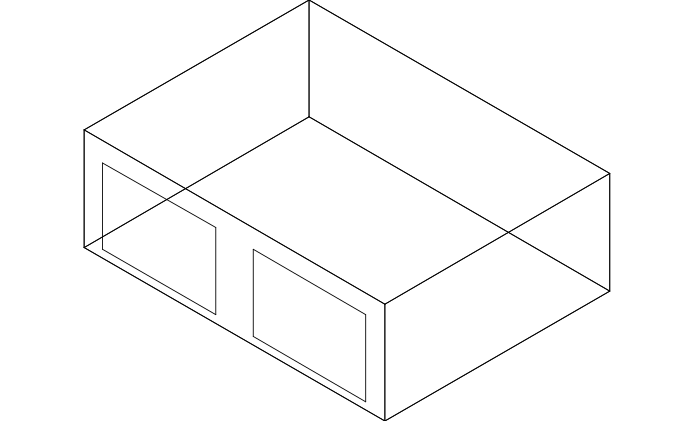
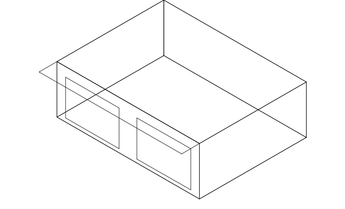
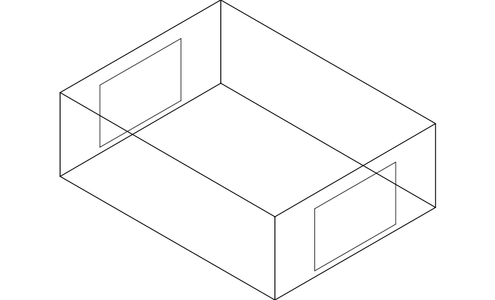
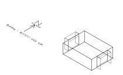
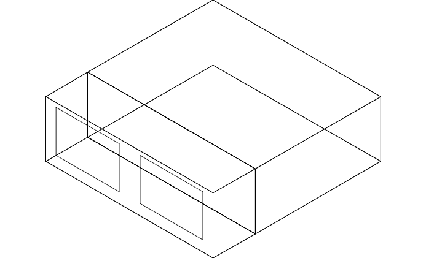

EnergyPlus Version {{ engine.config["EnergyPlusVersion"] }}  
Automatically Generated {{ engine.month_year() }}


Prepared for:

U.S. Department of Energy
Energy Efficiency and Renewable Energy
Office of Building Technologies
Washington, D.C.

Originally Prepared by:

Robert H. Henninger and Michael J. Witte
GARD Analytics, Inc.  
115 S. Wilke Road, Suite 105
Arlington Heights, IL 60005-1500
USA
www.gard.com

This report was developed based upon funding from the Alliance for Sustainable
Energy, LLC, Managing and Operating Contractor for the National Renewable
Energy Laboratory for the U.S. Department of Energy. Any opinions, findings,
and conclusions or recommendations expressed in this material are those of the
author(s) and do not necessarily reflect those of the sponsor. Earlier work was
supported by the Ernest Orlando Lawrence Berkeley National Laboratory, and by
the National Energy Technology Laboratory and the National Renewable Energy
Laboratory by subcontract through the University of Central Florida/Florida
Solar Energy Center.

This report was prepared as an account of work sponsored by an agency of the
United States Government. Neither the United States Government nor any agency
thereof, nor any of their employees, makes any warranty, express or implied, or
assumes any legal liability or responsibility for the accuracy, completeness,
or usefulness of any information, apparatus, product, or process disclosed, or
represents that its use would not infringe privately owned rights. Reference
herein to any specific commercial product, process, or services by trade name,
trademark, manufacturer, or otherwise does not necessarily constitute or imply
its endorsement, recommendation, or favoring by the United States Government or
any agency thereof. The views and opinions of authors expressed herein do not
necessarily state or reflect those of the United States Government or any
agency thereof.


#  Test Objectives and Overview

## Introduction


This report describes the modeling methodology and results for testing done of
building thermal envelope and fabric tests designated as Cases 195 through 960
of ANSI/ASHRAE Standard 140-2011 titled *Standard Method of Test for the
Evaluation of Building Energy Analysis Computer Programs* with the EnergyPlus
Version {{ engine.config["EnergyPlusVersion"] }}. The results of EnergyPlus are
also compared with results from several other whole building energy analysis
programs that simulated the same test cases.


## Test Type: Comparative - Loads

Comparative tests compare a program to itself or to other simulation programs.
This type of testing accomplishes results on two different levels, both
validation and debugging.

From a validation perspective, comparative tests will show that EnergyPlus is
computing solutions that are reasonable compared to other energy simulation
programs. This is a very powerful method of assessment, but it is no substitute
for determining if the program is absolutely correct since it may be just as
equally incorrect as the benchmark program or programs. The biggest strength of
comparative testing is the ability to compare any cases that two or more
programs can model. This is much more flexible than analytical tests when only
specific solutions exist for simple models, and much more flexible than
empirical tests when only specific data sets have been collected for usually a
very narrow band of operation. The ANSI/ASHRAE Standard 140-2011 procedures
discussed below take advantage of the comparative test method and have the
added advantage that for the specific tests included in ANSI/ASHRAE Standard
140-2011 have already been run by experts of the other simulation tools.

Comparative testing is also useful for field-by-field input debugging. Energy
simulation programs have so many inputs and outputs that the results are often
difficult to interpret. To ascertain if a given test passes or fails,
engineering judgment or hand calculations are often needed. Field by field
comparative testing eliminates any calculational requirements for the subset of
fields that are equivalent in two or more simulation programs. The equivalent
fields are exercised using equivalent inputs and relevant outputs are directly
compared.


## Test Suite: ANSI/ASHRAE Standard 140-2011

The tests described in Section 5.2 of ANSI/ASHRAE Standard 140-2011, *Standard
Method of Test for the Evaluation of Building Energy Analysis Computer
Programs* (ANSI/ASHRAE 2011), were performed. This suite of tests is based on
work previously performed under an earlier project sponsored by the
International Energy Agency (IEA) titled *Building Energy Simulation Test
(BESTEST) and Diagnostic Method* (IEA 1995). As stated in its Foreword,
Standard 140-2011 is a standard method of test that “can be used for
identifying and diagnosing predictive differences from whole building energy
simulation software that may possibly be caused by algorithmic differences,
modeling limitations, input differences, or coding errors.”

The following tests were performed as specified with modeling notes and
other reports generated as shown in the Standard:

 - BASE Case (Case 600, Section 5.2.1 of Standard)

 - BASIC Tests (Section 5.2.2 of Standard)
    - Low mass tests (Cases 610 to 650),
    - High mass tests (Cases 900 to 960)
    - Free float tests (Cases 600FF, 650FF, 900FF and 950FF)

 - IN-DEPTH tests (Section 5.2.3 of Standard)
    - Cases 195 to 320
    - Cases 395 to 440
    - Cases 800 and 810

The EnergyPlus test results are compared to the results of all programs that
completed and reported test results, including ESP, BLAST-3-193, DOE2.1D,
SRES/SUN, SERIRES, S3PAS, TRNSYS and TASE. Although not part of the original
set of results, results for later versions of BLAST and DOE2 have also been
added for completeness -- BLAST-3.0-334 and DOE2.1E.

A brief description of the BASE Case, BASIC Test Cases and Case 195 are
presented in the following sections. For details of the other test cases refer
to Standard 140.


### Case 600 – Base Case Low Mass Building

The basic test building (Figure 1) is a rectangular single zone (8 m wide x 6 m
long x 2.7 m high) with no interior partitions and 12 $m^2$ of windows on the
south exposure. The building is of lightweight construction with
characteristics as described below. For further details refer to Section 5.2.1
of ANSI/ASHRAE Standard 140-2011.



**Figure 1 Base Building (Case 600) - Isometric View of Southeast Corner with Windows on South Wall**

**Wall Construction (light weight mass)**

<table>
<thead>
<tr>
  <th>Element</th>
  <th>k ( $\frac{W}{mK}$ )</th>
  <th>Thickness (m)</th>
  <th>U ( $\frac{W}{m^2K}$ )</th>
  <th>R ( $\frac{m^2K}{W}$ )</th>
  <th>Density ( $\frac{kg}{m^3}$ )</th>
  <th>Cp ( $\frac{J}{kgK}$ )</th>
</tr>
</thead>
<tr>
  <td>Int. Surface Coeff.</td>
  <td></td>
  <td></td>
  <td>8.290</td>
  <td>0.121</td>
  <td></td>
  <td></td>
</tr>
<tr>
  <td>Plasterboard</td>
  <td>0.160</td>
  <td>0.012</td>
  <td>13.333</td>
  <td>0.075</td>
  <td>950</td>
  <td>840</td>
</tr>
<tr>
  <td>Fiberglass Quilt</td>
  <td>0.040</td>
  <td>0.066</td>
  <td>0.606</td>
  <td>1.650</td>
  <td>12</td>
  <td>840</td>
</tr>
<tr>
  <td>Wood Siding</td>
  <td>0.140</td>
  <td>0.009</td>
  <td>15.556</td>
  <td>0.064</td>
  <td>530</td>
  <td>900</td>
</tr>
<tr>
  <td>Ext. Surface Coeff.</td>
  <td></td>
  <td></td>
  <td>29.300</td>
  <td>0.034</td>
  <td></td>
  <td></td>
</tr>
<tr>
  <td></td>
  <td></td>
  <td></td>
  <td></td>
  <td></td>
  <td></td>
  <td></td>
</tr>
<tr>
  <td>Overall, air-to-air</td>
  <td></td>
  <td></td>
  <td>0.514</td>
  <td>1.944</td>
  <td></td>
  <td></td>
</tr>
</table>


**Roof Construction (light weight mass)**

<table>
<thead>
<tr>
  <th>Element</th>
  <th>k ( $\frac{W}{mK}$ )</th>
  <th>Thickness (m)</th>
  <th>U ( $\frac{W}{m^2K}$ )</th>
  <th>R ( $\frac{m^2K}{W}$ )</th>
  <th>Density ( $\frac{kg}{m^3}$ )</th>
  <th>Cp ( $\frac{J}{kgK}$ )</th>
</tr>
</thead>
<tr>
  <td>Int. Surface Coeff.</td>
  <td></td>
  <td></td>
  <td>8.290</td>
  <td>0.121</td>
  <td></td>
  <td></td>
</tr>
<tr>
  <td>Plasterboard</td>
  <td>0.160</td>
  <td>0.010</td>
  <td>16.000</td>
  <td>0.063</td>
  <td>950</td>
  <td>840</td>
</tr>
<tr>
  <td>Fiberglass Quilt</td>
  <td>0.040</td>
  <td>0.1118</td>
  <td>0.358</td>
  <td>2.794</td>
  <td>12</td>
  <td>840</td>
</tr>
<tr>
  <td>Roof Deck</td>
  <td>0.140</td>
  <td>0.019</td>
  <td>7.368</td>
  <td>0.136</td>
  <td>530</td>
  <td>900</td>
</tr>
<tr>
  <td>Ext. Surface Coeff.</td>
  <td></td>
  <td></td>
  <td>29.300</td>
  <td>0.034</td>
  <td></td>
  <td></td>
</tr>
<tr>
  <td></td>
  <td></td>
  <td></td>
  <td></td>
  <td></td>
  <td></td>
  <td></td>
</tr>
<tr>
  <td>Overall, air-to-air</td>
  <td></td>
  <td></td>
  <td>0.318</td>
  <td>3.147</td>
  <td></td>
  <td></td>
</tr>
</table>


**Floor Construction (light weight mass)**

<table>
<thead>
<tr>
  <th>Element</th>
  <th>k ( $\frac{W}{mK}$ )</th>
  <th>Thickness (m)</th>
  <th>U ( $\frac{W}{m^2K}$ )</th>
  <th>R ( $\frac{m^2K}{W}$ )</th>
  <th>Density ( $\frac{kg}{m^3}$ )</th>
  <th>Cp ( $\frac{J}{kgK}$ )</th>
</tr>
</thead>
<tr>
  <td>Int. Surface Coeff.</td>
  <td></td>
  <td></td>
  <td>8.290</td>
  <td>0.121</td>
  <td></td>
  <td></td>
</tr>
<tr>
  <td>Timber Flooring</td>
  <td>0.140</td>
  <td>0.025</td>
  <td>5.600</td>
  <td>0.179</td>
  <td>650</td>
  <td>1200</td>
</tr>
<tr>
  <td>Insulation</td>
  <td>0.040</td>
  <td>1.003</td>
  <td>0.040</td>
  <td>25.374</td>
  <td></td>
  <td></td>
</tr>
<tr>
  <td></td>
  <td></td>
  <td></td>
  <td></td>
  <td></td>
  <td></td>
  <td></td>
</tr>
<tr>
  <td>Overall, air-to-air</td>
  <td></td>
  <td></td>
  <td>0.039</td>
  <td>25.374</td>
  <td></td>
  <td></td>
</tr>
</table>


**Window Properties**

<table>
<tr>
  <td>Extinction coefficient </td>
  <td>0.0196/mm</td>
</tr>
<tr>
  <td>Number of panes</td>
  <td>2</td>
</tr>
<tr>
  <td>Pane thickness</td>
  <td>3.175mm</td>
</tr>
<tr>
  <td>Air-gap thickness</td>
  <td>13mm</td>
</tr>
<tr>
  <td>Index of refraction </td>
  <td>1.526</td>
</tr>
<tr>
  <td>Normal direct-beam transmittance through one pane</td>
  <td>0.86156</td>
</tr>
<tr>
  <td>Thermal Conductivity of glass</td>
  <td>1.06 $\frac{W}{mK}$</td>
</tr>
<tr>
  <td>Conductance of each glass pane</td>
  <td>333 $\frac{W}{m^2K}$</td>
</tr>
<tr>
  <td>Combined radiative and convective coefficient of air gap</td>
  <td>6.297 $\frac{W}{m^2K}$</td>
</tr>
<tr>
  <td>Exterior combined surface coefficient</td>
  <td>21.00 $\frac{W}{m^2K}$</td>
</tr>
<tr>
  <td>Interior combined surface coefficient</td>
  <td>8.29 $\frac{W}{m^2K}$</td>
</tr>
<tr>
  <td>U-value from interior air to ambient air</td>
  <td>3.0 $\frac{W}{m^2K}$</td>
</tr>
<tr>
  <td>Hemispherical infrared emittance of ordinary uncoated glass</td>
  <td>0.9</td>
</tr>
<tr>
  <td>Density of glass</td>
  <td>2500 $\frac{kg}{m^3}$</td>
</tr>
<tr>
  <td>Specific heat of glass</td>
  <td>750 $\frac{J}{kgK}$</td>
</tr>
<tr>
  <td>Interior shade devices</td>
  <td>None</td>
</tr>
<tr>
  <td>Double-pane shading coefficient at normal incidence</td>
  <td>0.907</td>
</tr>
<tr>
  <td>Double-pane solar heat gain coefficient at normal incidence</td>
  <td>0.789</td>
</tr>
</table>


There is 0.2 m of wall below the window and 0.5 m of wall above the window.

Windows are described in EnergyPlus using the Windows 5 format. Additional
glass properties are required for the front side and back side. In consultation
with F. Winkelmann of LBNL, it was recommended that the window described above
for the ANSI/ASHRAE Standard 140-2011 test be modeled as follows in EnergyPlus:


    WindowMaterial:Glazing,
      Glass Type 1, !- Name
      SpectralAverage, !- Optical Data Type
      , !- Window Glass Spectral Data Set Name
      0.003175, !- Thickness {m}
      0.86156, !- Solar Transmittance at Normal Incidence
      0.07846, !- Front Side Solar Reflectance at Normal Incidence
      0.07846, !- Back Side Solar Reflectance at Normal Incidence
      0.91325, !- Visible Transmittance at Normal Incidence
      0.08200, !- Front Side Visible Reflectance at Normal Incidence
      0.08200, !- Back Side Visible Reflectance at Normal Incidence
      0.0, !- Infrared Transmittance at Normal Incidence
      0.84, !- Front Side Infrared Hemispherical Emissivity
      0.84, !- Back Side Infrared Hemispherical Emissivity
      1.06; !- Conductivity {W/m-K}

    WindowMaterial:Gas,
      Air Space Resistance, !- Name
      AIR, !- Gas Type
      0.013 !- Thickness {m}
      
    Construction,
      Double Pane Window, !- Name
      Glass Type 1, !- Outside Layer
      Air Space Resistance, !- Layer 2
      Glass Type 1; !- Layer 3


**Infiltration:** 0.5 air change/hour

**Internal Load:** 200 W continuous, 60% radiative, 40% convective, 100% sensible

**Mechanical System:** 100% convective air system, 100% efficient with no duct losses and no capacity limitation, no latent heat extraction, non-proportional-type dual setpoint thermostat with deadband, heating <20°C, cooling >27°C

**Soil Temperature:** 10C continuous


### Case 610 – South Shading Test for Low Mass Building

Case 610 uses the Base Building modeled in Case 600 and adds a 1 m horizontal overhang across the entire length of south wall over the south facing windows at the roof level. See Figure 2. All other characteristics of the building were identical to the Base Case
building. This case tests the ability of a program to treat shading of a south exposed window.



**Figure 2 Base Building with South Shading (Case 610) - Isometric View of Southeast Corner**


### Case 620 – East/West Window Orientation Test for Low Mass Building

Case 620 uses the Base Building modeled in Case 600 with the following changes:

 - The window orientation was modified as shown in Figure 3 such that 6 $m^2$ of window area was added to both the east and west walls. The window properties are exactly the same as in Case 600

 - The south windows were eliminated and replaced with the wall construction used throughout the building



**Figure 3 Building with East/West Window Orientation (Case 620) -Isometric View of Southeast Corner**


### Case 630 – East/West Shading Test for Low Mass Building

Case 630 is exactly the same as Case 620 except that a shade overhang and shade fins were added around the east and west window. See Figure 4. A 1 m horizontal overhang is located at the roof level and extends across the 3 m width of each window. The 1 m wide right and left vertical shade fins are located a edge of each window and extend from the roof down to the ground.



**Figure 4 Building with East/West Window Orientation and Shade Overhang and Shade Fins added (Case 630) - Isometric View of Southeast Corner**


### Case 640 – Thermostat Setback Test for Low Mass Building

Case 640 is identical to the Base Case building of Case 600 except the following heating and cooling temperature setback schedule with a non-proportional thermostat was used:

 - From 2300 hours to 0700 hours, heat = on if zone temperature <10°C
 - From 0700 hours to 2300 hours, heat = on if zone temperature <20°C
 - All hours, cool = on if zone temperature >27°C
 - Otherwise, mechanical equipment is off.

See Figure 1 for schematic of building.


### Case 650 – Night Ventilation Test for Low Mass Building

Case 650 is identical to the Base Case building of Case 600 except the
following scheduled night time ventilation and heating and cooling temperature control was used:

 - From 1800 hours to 0700 hours, vent fan = on
 - From 0700 hours to 1800 hours, vent fan = off
 - Heating is always off
 - From 0700 hours to 1800 hours, cool = on if zone temperature >27°C, otherwise cool = off
 - From 1800 hours to 0700 hours, cool = off\
 - Vent fan capacity = 1703.16 standard $\frac{m^3}{h}$  (in addition to specified infiltration rate)
 - Waste heat from fan = 0.

See Figure 1 for schematic of building.


### Case 900 –Base Case High Mass Building

The 900 series of tests use the same building model as was used for the series 600 tests except that the wall and floor construction were changed to use heavier materials. Everything else with the building remained the same. The characteristics of the heavier mass wall and floor are as follows:


**Wall Construction (heavy weight mass)**

<table>
<thead>
<tr>
  <th>Element</th>
  <th>k ( $\frac{W}{mK}$ )</th>
  <th>Thickness (m)</th>
  <th>U ( $\frac{W}{m^2K}$ )</th>
  <th>R ( $\frac{m^2K}{W}$ )</th>
  <th>Density ( $\frac{kg}{m^3}$ )</th>
  <th>Cp ( $\frac{J}{kgK}$ )</th>
</tr>
</thead>
<tr>
  <td>Int. Surface Coeff.</td>
  <td></td>
  <td></td>
  <td>8.290</td>
  <td>0.121</td>
  <td></td>
  <td></td>
</tr>
<tr>
  <td>Concrete Block</td>
  <td>0.510</td>
  <td>0.100</td>
  <td>5.100</td>
  <td>0.196</td>
  <td>1400</td>
  <td>1000</td>
</tr>
<tr>
  <td>Foam Insulation</td>
  <td>0.040</td>
  <td>0.0615</td>
  <td>0.651</td>
  <td>1.537</td>
  <td>10</td>
  <td>1400</td>
</tr>
<tr>
  <td>Wood Siding</td>
  <td>0.140</td>
  <td>0.009</td>
  <td>15.556</td>
  <td>0.064</td>
  <td>530</td>
  <td>900</td>
</tr>
<tr>
  <td>Ext. Surface Coeff.</td>
  <td></td>
  <td></td>
  <td>29.300</td>
  <td>0.034</td>
  <td></td>
  <td></td>
</tr>
<tr>
  <td></td>
  <td></td>
  <td></td>
  <td></td>
  <td></td>
  <td></td>
  <td></td>
</tr>
<tr>
  <td>Overall, air-to-air</td>
  <td></td>
  <td></td>
  <td>0.512</td>
  <td>1.952</td>
  <td></td>
  <td></td>
</tr>
</table>


**Floor Construction (heavy weight mass)**

<table>
<thead>
<tr>
  <th>Element</th>
  <th>k ( $\frac{W}{mK}$ )</th>
  <th>Thickness (m)</th>
  <th>U ( $\frac{W}{m^2K}$ )</th>
  <th>R ( $\frac{m^2K}{W}$ )</th>
  <th>Density ( $\frac{kg}{m^3}$ )</th>
  <th>Cp ( $\frac{J}{kgK}$ )</th>
</tr>
</thead>
<tr>
  <td>Int. Surface Coeff.</td>
  <td></td>
  <td></td>
  <td>8.290</td>
  <td>0.121</td>
  <td></td>
  <td></td>
</tr>
<tr>
  <td>Concrete Slab</td>
  <td>1.130</td>
  <td>0.080</td>
  <td>14.125</td>
  <td>0.071</td>
  <td>1400</td>
  <td>1000</td>
</tr>
<tr>
  <td>Insulation</td>
  <td>0.040</td>
  <td>1.007</td>
  <td>0.040</td>
  <td>25.175</td>
  <td></td>
  <td></td>
</tr>
<tr>
  <td></td>
  <td></td>
  <td></td>
  <td></td>
  <td></td>
  <td></td>
  <td></td>
</tr>
<tr>
  <td>Overall, air-to-air</td>
  <td></td>
  <td></td>
  <td>0.039</td>
  <td>25.366</td>
  <td></td>
  <td></td>
</tr>
</table>


See Figure 1 for schematic of building for Case 900.


### Case 910 –South Shading Test for High Mass Building

Case 910 uses the high mass Base Building modeled in Case 900 except that a 1 m
horizontal overhang was added to the entire length of south wall over the south
facing windows at the roof level. See Figure 2. All other characteristics of
the building were identical to the high mass Base Building of Case 900. This
case tests the ability of a program to treat shading of a south exposed window.
This case is identical to Case 610 except for high mass walls and floor.


### Case 920 – East/West Window Orientation Test for High Mass Building

Case 920 is identical to Case 620 except for high mass walls and floor.


### Case 930 – East/West Shading Test for High Mass Building

Case 930 is identical to Case 630 except for high mass walls and floor.


### Case 940 – Thermostat Setback Test for High Mass Building

Case 940 is identical to Case 640 except for high mass walls and floor.


### Case 950 – Night Ventilation Test for High Mass Building

Case 950 is identical to case 650 except for high mass walls and floor.


### Case 960 – Sunspace Test

Case 960 simulates a passive solar building consisting of two zones (a back-zone and a sun-zone) separated by a common interior wall (Figure 5).



**Figure 5 Sunspace Building with Back-Zone and Sun-Zone (Case 960) - Isometric View of Southeast Corner**

**Back Zone:** The geometric and thermal properties of the back-zone are
exactly the same as for Case 600 except that the south wall and windows are
replaced with the common wall. Infiltration and internal load in the back-zone
is also the same as in Case 600.

**Common Wall:** Material properties of the common wall are as follows:

<table>
<thead>
<tr>
  <th>Element</th>
  <th>k ( $\frac{W}{mK}$ )</th>
  <th>Thickness (m)</th>
  <th>U ( $\frac{W}{m^2K}$ )</th>
  <th>R ( $\frac{m^2K}{W}$ )</th>
  <th>Density ( $\frac{kg}{m^3}$ )</th>
  <th>Cp ( $\frac{J}{kgK}$ )</th>
</tr>
</thead>
<tr>
  <td>Common Wall</td>
  <td>0.510</td>
  <td>0.200</td>
  <td>2.55</td>
  <td>0.392</td>
  <td>1400</td>
  <td>1000</td>
</tr>
</table>


**Sun-Zone:** The sun-zone is 2 m deep by 8 m wide by 2.7 m high. The back (north) wall of the sun-zone is the common wall. The south wall of the sun-zone contains two 6 $m^2$ windows that are identical to the windows in Case 900 except that they are raised to a level of 0.5 m
above the ground. The thermal and physical properties of the sun-zone are the same as case 900 with the following exceptions:

 - Zone depth is 2 meters.
 - The north wall has been replaced with the common wall.
 - The east and west walls (end-walls) are 5.4 $m^2$ each.
 - The volume of the sun-zone is 43.2 $m^3$
 - Infiltration rate is 0.5 air changes per hour.
 - Internal heat gain = 0 W.
 - Heating and cooling control strategy as follows:
    - Sun-zone has no space conditioning system (free floating).
    - Back-zone is controlled the same as for case 600.


### Case 600FF – Free Floating Temperature Test for Base Case Low Mass Building

Case 600FF is the same as Case 600 except that there is no mechanical heating or cooling system.


### Case 650FF – Free Floating Temperature Test for Base Case Low Mass Building with Night Ventilation

Case 650FF is the same as Case 650 except that there is no mechanical heating or cooling system.


### Case 900FF – Free Floating Temperature Test for Base Case High Mass Building

Case 900FF is the same as Case 900 except that there is no mechanical heating or cooling system.


### Case 950FF – Free Floating Temperature Test for Base Case High Mass Building with Night Ventilation

Case 950FF is the same as Case 950 except that there is no mechanical heating or cooling system.


### Case 195 – Indepth Test of Solid Conduction Problem for Low Mass Building

Case 195 is the same as case 600 with the following exceptions:

 - South wall contains no windows and is entirely constructed of the Lightweight mass exterior wall construction described in Section 1.2.1.
 - Infiltration Rate = 0
 - Internal Gains = 0
 - Thermostat control is “20,20 bang-bang”
    - Heat = on if temperature < 20C
    - Cool = on if temperature > 20C

 - Interior and exterior surface emissivitiy and absorptance set = 0.1


## Modeling Notes

The specifications as presented in Section 5 - Test Procedures of ANSI/ASHRAE Standard 140-2011 were followed to prepare the EnergyPlus models for the test cases described above. In some cases the specification provided redundant input values for a particular element of the building due to the fact different programs require different inputs. The following notes are presented regarding preparation of EnergyPlus IDF files:

 - The weather file used for all simulations was taken from a CD that was provided along with Standard 140-2011. The weather file is labeled DRYCOLD.TMY and contains hourly weather for an entire year which is characterized as “cold clear winters/hot dry summers.”
 - Although the Standard spelled out in detail the exterior and interior radiative and convective surface properties, these were not used. The Standard indicated that if your program automatically calculates the exterior and interior film coefficients, then these radiative and convective input values were to be disregarded.
 - The material layers for walls, floors and roofs were specified using the Material object except for the floor insulation which was described using the Material:NoMass object. The opaque surface radiative properties listed in the Material object were defined in the Standard and were set as follows:

    > Thermal Emissivity = 0.90  
    > Solar Absorptance = 0.60  
    > Visible Absorptance = 0.60

 - The glass for windows was specified using the Window:MaterialGlazing and Window:MaterialGas objects. Certain input variables listed in the Window:MaterialGlazing object were not defined in the Standard and were set as follows:

    > Visible Transmittance = 0.91325

 - The convergence variables in the Building object were set as follows:

    > Loads Convergence Tolerance Value 3.9999999E-02  
    > Temperature Convergence Tolerance Value 4.0000002E-03

 - To get the shade calculations to work for the window overhang test cases, the following variables in the Building object had to be set:

    > Solar Distribution = FullInteriorAndExterior

    Same was true for cases with window fins.

 - The following objects were set to:

    > Surface Convection Algorithm:Inside = Detailed (v5.0.0 and earlier)  
    > Surface Convection Algorithm:Inside = TARP (v6.0.0 and later)  
    > Surface Convection Algorithm:Outside = DOE-2

 - To get the dual setpoint with deadband thermostat (Type=4) to work, the following object had to be specified:

    > ZoneCapacitanceMultiplier = 1 (v5.0.0 and earlier)

    Not included and left to default (v6.0.0 and later)

 - The ZoneHVAC:IdealLoadsAirSystem (called PURCHASED AIR system in earlier versions) was used to model the mechanical system.

 - All simulations were done using a Timestep = 4; output results were reported hourly.


# Results and Discussion

The results of the EnergyPlus Loads comparison with other whole building energy
analysis programs that participated in the comparison are summarized on a set
of charts presented in Appendix A. The nomenclature for the various programs
referred to on these charts along with the program author and modeler
responsible for using the program as part of the BESTEST project are presented
on the previous page. Results for later versions of BLAST (3.0 level 334) and
DOE2 (2.1E) which were not part of the original BESTEST exercise have also been
added.

<table>
<thead>
<tr>
  <th>Code Name</th>
  <th>Computer Program</th>
  <th>Developer</th>
  <th>Implemented By</th>
</tr>
</thead>
<tr>
  <td>BLAST</td>
  <td>BLAST-3.0 level 193 v.1</td>
  <td>CERL, U.S.</td>
  <td>NREL, U.S. <br>Politecnico, Torino, Italy</td>
</tr>
<tr>
  <td>DOE2.1D</td>
  <td>DOE2.1D 14</td>
  <td>LANL/LBL, U.S.</td>
  <td>NREL, U.S.</td>
</tr>
<tr>
  <td>ESP</td>
  <td>ESP-RV8</td>
  <td>Strathclyde University, U.K.</td>
  <td>De Montfort University, U.K.</td>
</tr>
<tr>
  <td>SRES/SUN</td>
  <td>SERIRES/SUNCODE 5.7</td>
  <td>NREL/Ecotope, U.S.</td>
  <td>NREL, U.S.</td>
</tr>
<tr>
  <td>SERIRES</td>
  <td>SERIRES 1.2</td>
  <td>NREL, U.S.<br>BRE, U.K.</td>
  <td>BRE, U.K.</td>
</tr>
<tr>
  <td>S3PAS</td>
  <td>S3PAS</td>
  <td>University of Sevilla, Spain</td>
  <td>University of Sevilla, Spain</td>
</tr>
<tr>
  <td>TASE</td>
  <td>TASE</td>
  <td>Tampere University, FInland</td>
  <td>Tampere University, Finland</td>
</tr>
<tr>
  <td>TRNSYS</td>
  <td>TRNSYS 13.1</td>
  <td>University of Wisconsin, U.S.</td>
  <td>BRE, U.K.<br>Vrije Universiteit (VUB),<br>Brussels, Belgium</td>
</tr>
<tr>
  <td>DOE2.1E</td>
  <td>DOE2.1E</td>
  <td>LANL/LBL, U.S.</td>
  <td>GARD Analytics, U.S.using NREL input files</td>
</tr>
<tr>
  <td>DOE2.1E-RevWindow</td>
  <td>DOE2.1E-RevWindow</td>
  <td>LANL/LBL, U.S.</td>
  <td>GARD Analytics, U.S.Uses Window 4 data file which more closely matches specification</td>
</tr>
<tr>
  <td>BLAST3.0-334</td>
  <td>BLAST-3.0 level 334</td>
  <td>CERL, U.S.</td>
  <td>GARD Analytics, U.S.using NREL input files</td>
</tr>
<tr>
  <td>ENERGYPLUS</td>
  <td>EnergyPlus ver. {{ engine.config["EnergyPlusVersion"] }}</td>
  <td>U.S. Dept. of Energy</td>
  <td>GARD Analytics, U.S.</td>
</tr>
</table>

Appendix A contains a series of charts that compare the results of EnergyPlus
with other programs. The results for other programs have been updated to
reflect the results reported in ANSI/ASHRAE Standard 140-2011. The charts are
presented in the following order:

- Low Mass Building, Annual Heating, Cases 600, 610, 620, 630, 640, 650
- Low Mass Building, Annual Cooling, Cases 600, 610, 620, 630, 640, 650
- Low Mass Building, Peak Heating, Cases 600, 610, 620, 630, 640, 650
- Low Mass Building, Peak Cooling, Cases 600, 610, 620, 630, 640, 650
- High Mass Building, Annual Heating, Cases 900, 910, 920, 930, 940, 950, 960
- High Mass Building, Annual Cooling, Cases 900, 910, 920, 930, 940, 950, 960
- High Mass Building, Peak Heating, Cases 900, 910, 920, 930, 940, 950, 960
- High Mass Building, Peak Cooling, Cases 900, 910, 920, 930, 940, 950, 960
- Free Floating Zone Temperature, Maximum Temperature, Cases 600FF,
900FF, 650FF, 950FF, 960 Sunspace
- Free Floating Zone Temperature, Minimum Temperature, Cases 600FF,
900FF, 650FF, 950FF, 960 Sunspace
- Low Mass Building, Low Absorptances, No Windows, Case 195.

Results are also summarized in tabular format in Appendix B.

With EnergyPlus version 1.3.0.018 a new SITE ATMOSPHERIC VARIATION input object
became available (beginning with EnergyPlus 3.0.0 the name of this object
changed to Site:HeightVariation) to simulate changes in outside air temperature
and wind speed that typically occur vertically across building surfaces versus
the outdoor air temperature and wind speed that are obtained each hour from the
weather file. Typically the meteorological wind speed is measured in an open
field at 10m above the ground and meteorological air temperature is measured at
1.5m above ground level. To accommodate atmospheric variation EnergyPlus now
automatically calculates the local outdoor air temperature and wind speed
separately for each zone and surface exposed to the outdoor environment. The
zone centroid or surface centroid are used to determine the height above
ground. Only local outdoor air temperature and wind speed are currently
calculated because they are important factors for the exterior convection
calculation for surfaces and can also be factors in the zone infiltration and
ventilation calculations.

Since the Standard 140 instructions indicate that if the program being tested
automatically calculates exterior surface convection coefficients then this is
the method that should be used to model the various test cases, the SITE
ATMOSPHERIC VARIATION object was allowed to be active for all of the test cases
simulated with EnergyPlus 1.3.0.018 and later versions with the following
default inputs for a country terrain:


    SITE ATMOSPHERIC VARIATION,
     0.14, !- Wind Speed Profile Exponent
     270, !- Wind Speed Profile Boundary Layer Thickness {m}
     0.0065; !- Air Temperature Gradient Coefficient {K/m}

The result was that there were small changes in the EnergyPlus 1.3.0.018
results compared to results from previous EnergyPlus releases.

The methodology for handling solar diffuse through a window was completely
reworked in EnergyPlus 2.1.0.012 and was changed from uniform interior
distribution of transmitted diffuse solar to distribution based on approximate
view factors between transmitting windows and zone heat transfer surfaces. All
tests showed varying degrees of change compared to the previous EnergyPlus
2.0.0.025 release. See further discussion in Section 2.1 below.

One measure of comparison as to how well EnergyPlus predicted thermal loads
compared to the other programs is to see if the results fall within the range
of spread of results for other programs. This can be seen visually with the
charts included in Appendix A where the annual heating, annual cooling, peak
heating and peak cooling are displayed as a series of bars for the series 600
and series 900 cases that were analyzed by all programs. Appendix B shows the
same results but in tabular format and also includes a row for each comparison
indicating a YES or NO if EnergyPlus was within range. For the 62 individual
comparisons that were performed, the EnergyPlus results were within the range
of spread of results for the other programs for all cases except the following:

<table>
<thead>
<tr>
  <th>Test</th>
  <th>Building Type</th>
  <th>Feature Being Tested</th>
  <th>Output Parameter</th>
  <th>Range of Other Programs</th>
  <th>EnergyPlus</th>
</tr>
</thead>
<tr>
  <td>620</td>
  <td>Low Mass</td>
  <td>East/West Windows</td>
  <td>Annual Heating</td>
  <td>4.61 to 5.94 MWh</td>
  <td>4.55 MWh</td>
</tr>
<tr>
  <td>630</td>
  <td>Low Mass</td>
  <td>East/West Windows with Shading</td>
  <td>Annual Heating</td>
  <td>5.05 to 6.47 MWh</td>
  <td>4.88 MWh</td>
</tr>
<tr>
  <td>640</td>
  <td>Low Mass</td>
  <td>Thermostat Setback</td>
  <td>Annual Heating</td>
  <td>2.75 to 3.80 MWh</td>
  <td>2.68 MWh</td>
</tr>
<tr>
  <td>910</td>
  <td>High Mass</td>
  <td>South Windows with Shading</td>
  <td>Annual Heating</td>
  <td>1.512 to 2.28 MWh</td>
  <td>1.506 MWh</td>
</tr>
<tr>
  <td>920</td>
  <td>High Mass</td>
  <td>East/West Windows</td>
  <td>Annual Heating</td>
  <td>3.26 to 4.30 MWh</td>
  <td>3.19 MWh</td>
</tr>
<tr>
  <td>930</td>
  <td>High Mass</td>
  <td>East/West Windows with Shading</td>
  <td>Annual Heating</td>
  <td>4.14 to 5.34 MWh</td>
  <td>3.91 MWh</td>
</tr>
<tr>
  <td>940</td>
  <td>High Mass</td>
  <td>Thermostat Setback</td>
  <td>Annual Heating</td>
  <td>0.79 to 1.41 MWh</td>
  <td>0.77 MWh</td>
</tr>
</table>


For the free floating cases where 10 additional comparisons were made, the
maximum and minimum zone temperatures predicted by EnergyPlus were within the
range of spread for all the programs except for:

<table>
<thead>
<tr>
  <th>Test</th>
  <th>Building Type</th>
  <th>Feature Being Tested</th>
  <th>Output Parameter</th>
  <th>Range of Other Programs</th>
  <th>EnergyPlus</th>
</tr>
</thead>
<tr>
  <td>650FF</td>
  <td>Low Mass</td>
  <td>Night Ventilation</td>
  <td>Minimum Zone Temp.</td>
  <td>-23.00 to –21.0 C</td>
  <td>-23.04 C</td>
</tr>
<tr>
  <td>950FF</td>
  <td>High Mass</td>
  <td>Night Ventilation</td>
  <td>Minimum Zone Temp.</td>
  <td>-20.2 to –17.8 C</td>
  <td>-20.3 C</td>
</tr>
</table>


For the solid conduction problem (case 195) it was not possible to make a broad
comparison since there was only one program recognized by ASHRAE as having a
valid result.

A series of “Delta Charts” were also generated which compare the difference in
results between certain cases in order to isolate the sensitivity of each
program to changes in building features such as mass construction, addition of
windows with and without shading, thermostat setback, ventilation cooling, etc.
The “Delta Charts” comparing EnergyPlus results with other programs are
presented in Appendix C. A visual comparison of EnergyPlus results compared to
other programs indicates significant difference for:

<table>
<thead>
<tr>
  <th>Test</th>
  <th>Building Type</th>
  <th>Feature Being Tested</th>
  <th>Output Parameter</th>
  <th>Range of Other Programs</th>
  <th>EnergyPlus</th>
</tr>
</thead>
<tr>
  <td>(620 – 600)</td>
  <td>Low Mass</td>
  <td>E/W Window vs. S Window</td>
  <td>Peak Cooling</td>
  <td>-2.56 to –1.72 KW</td>
  <td>-2.65 KW</td>
</tr>
<tr>
  <td>(650 – 600)</td>
  <td>Low Mass</td>
  <td>Vent Cooling vs. No Vent Cooling</td>
  <td>Annual Cooling</td>
  <td>-1.42 to –1.24 MWh</td>
  <td>-1.44 MWh</td>
</tr>
<tr>
  <td>(650 – 600)</td>
  <td>Low Mass</td>
  <td>Vent Cooling vs. No Vent Cooling</td>
  <td>Peak Cooling</td>
  <td>-0.163 to –0.085 KW</td>
  <td>-0.193 KW</td>
</tr>
<tr>
  <td>(920 – 900)</td>
  <td>High Mass</td>
  <td>East/West Windows</td>
  <td>Annual Heating</td>
  <td>1.99 to 2.50 MWh</td>
  <td>1.97 MWh</td>
</tr>
<tr>
  <td>(940 – 640)</td>
  <td></td>
  <td>Setback (High Mass) vs. Setback (Low Mass)</td>
  <td>Peak Heating</td>
  <td>-1.252 to –-0.230 KW</td>
  <td>-1.461 KW</td>
</tr>
</table>


Additional BASIC and IN-DEPTH test charts comparing EnergyPlus results to those
of other programs are presented in Appendix D. These almost 100 additional
comparisons are designed to isolate the effects of specific algorithms and a
program’s ability to model building envelope loads for a non-deadband on/off
thermostat control configuration with the following variations among cases: no
windows, opaque windows, exterior infrared emittance, interior infrared
emittance, infiltration, internal gains, exterior shortwave absorptance, south
solar gains, interior shortwave absorptance, window orientation, shading
devices, and thermostat setpoints. In EnergyPlus version 1.4.0.004 a correction
was made to the sunlit area calculation for DOORS which affected the results
for Cases 200, 210, 215, 220, 230, 240, 250, 395, 400, 410, 420 and 430 where
the windows were replaced with opaque surfaces that had been modeled in
EnergyPlus as DOORS. This brought the results for most of these cases back
within the range of other programs but still left EnergyPlus results for annual
heating in Cases 300 and 310 and the results for peak cooling for Cases 395 and
400 out of range.

With the switch to the DOE-2 outside convection coefficient algorithm in
EnergyPlus version 3.1.0.027 annual heating decreased overall and Cases 270 to
320 were now out of range along with peak heating for Cases 300 and 310. The
peak cooling results for Cases 395 and 400 were now brought back within the
range of other programs.

In EnergyPlus version 4.0.0.024 the algorithms for window convection
coefficients changed and as a result, in addition to the changes discussed
above for the BASIC and IN-DEPTH tests, the annual heating results for Case 300
moved outside of the range of other programs.

In EnergyPlus version 7.2.0.006 the model coefficients for the DOE-2 outside
face convection correlations were changed which resulted in small increases in
the annual heating for Cases 600 through 960 which in turn brought the annual
heating for Case 900 within the range of results of other programs. This change
also resulted in the delta peak cooling for (Case 950 – Case 650) moving within
the range of other program results.


## Comparison of Changes that Occurred Between Versions of EnergyPlus

This section documents the comparative changes that took place in results as
modifications were made to the EnergyPlus code or changes were made in the
modeling approach. Since the first reporting of EnergyPlus results for BESTEST
with version 1.0.0.023 back in August 2001, further capabilities and
improvements have been added to EnergyPlus with new releases beginning in June
2002 (version 1.0.1) and continuing through the current release (version 
{{ engine.config["EnergyPlusVersion"] }}). The table below summarizes pertinent
input file and code changes that were made as the testing progressed with each
new public release of EnergyPlus.

**Summary of Pertinent EnergyPlus Changes that were Implemented Since Original Testing with Version 1.0.0.023**


{{ engine.create_table_from_yaml("EnergyPlusChanges.yaml", ["Version", "Input-File-Changes", "Code-Changes"]) }}

Charts presented in Appendix E show graphically how results changed for the
various BESTEST cases with each public release version of EnergyPlus and
changes discussed in the above table. Changes in results between the first two
releases were sometimes significant (as high as 10%). Some significant changes
also occurred with version 1.1.1.004 where surface convection coefficient
algorithms were changed.

The results for Case 960 with EnergyPlus version 1.3.0.018 input file changes
produced only small changes compared to previous versions.

Changing the weather file conversion procedure produced significant changes.
Previously, for all results through version 1.3.0.018, the BESTEST analyses had
been done using a BLAST weather file which had been converted into EnergyPlus
EPW format using the EnergyPlus weather converter. Since then, the DRYCOLD.TMY
weather file provided with Standard 140 has been directly converted into EPW
format using the EnergyPlus weather converter. This produced significant
changes in results for some test cases as can be seen from the charts in
Appendix E where results are shown using EnergyPlus version 1.3.0.018 with both
the originally converted weather file (shown on charts as Ver 1.3.018) and
results with the new weather file (shown on charts as Ver 1.3.0.018
NewWeather). A comparison of the two weather files shows several differences.
First, the BLAST version of the BESTEST weather file has Daylight Savings Time
option turned on while the EnergyPlus version of the BESTEST weather file has
the Daylight Savings Time option turned off. This created differences in
results for those test cases which have schedules which change throughout the
day, i.e. thermostat setback and nighttime ventilation cases (Cases 640, 650,
650FF, 940, 950 and 950FF). Secondly, there were differences in the hourly
outdoor wet-bulb temperature (which produces corresponding changes in outdoor
humidity ratio, relative humidity, enthalpy and density), sky temperature and
diffuse and direct solar as indicated below.

<table>
<tr><td></td><td><strong>Change in E-Plus Max Difference (C)</strong></td><td><strong>Change in E-Plus Average Difference (C)</strong></td></tr>
<tr><td>Outdoor Wet-Bulb Temp</td><td>0.33</td><td>0.05</td></tr>
<tr><td>Sky Temperature</td><td>10.6</td><td>3.5</td></tr>
<tr><td></td><td><strong>Change in E-Plus Annual Difference (%)</strong></td><td></td></tr>
<tr><td>Annual Direct Solar</td><td>0.11</td><td></td></tr>
<tr><td>Annual Diffuse Solar</td><td>4.2</td><td></td></tr>
</table>


These changes are undoubtedly due to differences in the psychrometric
and solar routines used by the BLAST and EnergyPlus weather conversion programs.

{{ engine.create_paragraphs("EnergyPlusChanges.yaml", "Description") }}


# Conclusions

EnergyPlus Version {{ engine.config["EnergyPlusVersion"] }}  was used to model
a range of building specifications as specified in ANSI/ASHRAE Standard
140-2011 - *Standard Method of Test for the Evaluation of Building Energy
Analysis Computer Programs* and in the *Building Energy Simulation Test
(BESTEST) and Diagnostic Method*. The ability of EnergyPlus to predict thermal
loads was tested using a test suite of 18 cases which included buildings with
both low mass and high mass construction, without windows and with windows on
various exposures, with and without exterior window shading, with and without
temperature setback, with and without night ventilation, and with and without
free floating space temperatures. The annual heating and cooling and peak
heating and cooling results predicted by EnergyPlus for 13 different cases were
compared to results from 8 other whole building energy simulation programs that
participated in an International Energy Agency (IEA) project conducted in
February 1995. Maximum and minimum free-floating temperatures were compared for
4 different cases. A solid conduction case was compared to only one other
program due to modeling limitations in the other programs. A range of over 100
BASIC and IN-DEPTH test cases were also modeled. When comparing EnergyPlus’
results for the BASIC and IN-DEPTH test cases, EnergyPlus was within the range
of spread of results for the other 8 programs for all but seven cases. The
seven cases outside of range were all less than 5.5% out of bounds.


# References

ANSI/ASHRAE 2011. Standard 140-2011, Standard Method of Test for the Evaluation
of Building Energy Analysis Computer Programs, American Society of Heating,
Refrigerating and Air-Conditioning Engineers, Atlanta, GA.

EnergyPlus {{ engine.year() }}. U.S. Department of Energy, Energy Efficiency and Renewable
Energy, Office of Building Technologies.
[www.energyplus.gov](http://www.energyplus.gov)

IEA 1995. *Building Energy Simulation Test(BESTEST) and Diagnostic Method*,
National Renewable Energy Laboratory, Golden, Colorado, February 1995.


# Appendix A

**Charts Comparing EnergyPlus Results with Other Whole Building Energy Simulation Programs**


```{exec_python}

engine.write_chart('ColumnClustered', 'Low Annual Heating', 'Standard 140-2007 Comparison\nLow Mass Building Annual Heating', 'BESTEST Case', 'Annual Heating (MWH)', 'Sec5-2out-Part 1 Results and Bar Charts-Cases 600 thru 900.xlsx', 'RESULTS1', 'A54:M60', '(B54,A55:A60,B55:B60,1);(C54,A55:A60,C55:C60,2);(D54,A55:A60,D55:D60,3);(E54,A55:A60,E55:E60,4);(F54,A55:A60,F55:F60,5);(G54,A55:A60,G55:G60,6);(H54,A55:A60,H55:H60,7);(I54,A55:A60,I55:I60,8);(J54,A55:A60,J55:J60,9);(K54,A55:A60,K55:K60,10);(L54,A55:A60,L55:L60,11);(M54,A55:A60,M55:M60,12);', ['TASE Case 630 disregarded by ASHRAE Standard 140P due to  known errors', 'For Case 650, heating always off'])
engine.write_chart('ColumnClustered', 'Low Annual Cooling', 'Standard 140-2007 Comparison\nLow Mass Building Annual Cooling', 'BESTEST Case', 'Annual Cooling (MWH)', 'Sec5-2out-Part 1 Results and Bar Charts-Cases 600 thru 900.xlsx', 'RESULTS1', 'A99:M105', '(B99,A100:A105,B100:B105,1);(C99,A100:A105,C100:C105,2);(D99,A100:A105,D100:D105,3);(E99,A100:A105,E100:E105,4);(F99,A100:A105,F100:F105,5);(G99,A100:A105,G100:G105,6);(H99,A100:A105,H100:H105,7);(I99,A100:A105,I100:I105,8);(J99,A100:A105,J100:J105,9);(K99,A100:A105,K100:K105,10);(L99,A100:A105,L100:L105,11);(M99,A100:A105,M100:M105,12);', ['TASE Case 630 disregarded by ASHRAE Standard 140P due to  known errors'])
engine.write_chart('ColumnClustered', 'Low Peak Heating', 'Standard 140-2007 Comparison\nLow Mass Building Peak Heating', 'BESTEST Case', 'Peak Heating (kW)', 'Sec5-2out-Part 1 Results and Bar Charts-Cases 600 thru 900.xlsx', 'RESULTS1', 'A146:M152', '(B146,A147:A152,B147:B152,1);(C146,A147:A152,C147:C152,2);(D146,A147:A152,D147:D152,3);(E146,A147:A152,E147:E152,4);(F146,A147:A152,F147:F152,5);(G146,A147:A152,G147:G152,6);(H146,A147:A152,H147:H152,7);(I146,A147:A152,I147:I152,8);(J146,A147:A152,J147:J152,9);(K146,A147:A152,K147:K152,10);(L146,A147:A152,L147:L152,11);(M146,A147:A152,M147:M152,12);', ['All SERIRES results and TASE Case 630 results disregarded  by ASHRAE Standard 140P due to known errors.   EnergyPlus is out of range for Case 640.', 'For Case 650, heating always off'])
engine.write_chart('ColumnClustered', 'Low Peak Cooling', 'Standard 140-2007 Comparison\nLow Mass Building Peak Cooling', 'BESTEST Case', 'Peak Cooling (kW)', 'Sec5-2out-Part 1 Results and Bar Charts-Cases 600 thru 900.xlsx', 'RESULTS1', 'A192:M198', '(B192,A193:A198,B193:B198,1);(C192,A193:A198,C193:C198,2);(D192,A193:A198,D193:D198,3);(E192,A193:A198,E193:E198,4);(F192,A193:A198,F193:F198,5);(G192,A193:A198,G193:G198,6);(H192,A193:A198,H193:H198,7);(I192,A193:A198,I193:I198,8);(J192,A193:A198,J193:J198,9);(K192,A193:A198,K193:K198,10);(L192,A193:A198,L193:L198,11);(M192,A193:A198,M193:M198,12);', ['All SERIRES results and TASE Case 630 results disregarded  by ASHRAE Standard 140P due to known errors.'])
engine.write_chart('ColumnClustered', 'High Annual Heating', 'Standard 140-2007 Comparison\nHigh Mass Building Annual Heating', 'BESTEST Case', 'Annual Heating (MWH)', 'Sec5-2out-Part 1 Results and Bar Charts-Cases 600 thru 900.xlsx', 'RESULTS1', 'A62:M69', '(B62,(A63:A68,A69),(B63:B68,B69),1);(C62,(A63:A68,A69),(C63:C68,C69),2);(D62,(A63:A68,A69),(D63:D68,D69),3);(E62,(A63:A68,A69),(E63:E68,E69),4);(F62,(A63:A68,A69),(F63:F68,F69),5);(G62,(A63:A68,A69),(G63:G68,G69),6);(H62,(A63:A68,A69),(H63:H68,H69),7);(I62,(A63:A68,A69),(I63:I68,I69),8);(J62,(A63:A68,A69),(J63:J68,J69),9);(K62,(A63:A68,A69),(K63:K68,K69),10);(L62,(A63:A68,A69),(L63:L68,L69),11);(M62,(A63:A68,A69),(M63:M68,M69),12);', ['TASE Case 930 disregarded by ASHRAE Standard 140P due to  known errors.', 'For Case 950, heating always off'])
engine.write_chart('ColumnClustered', 'High Annual Cooling', 'Standard 140-2007 Comparison\nHigh Mass Building Annual Cooling', 'BESTEST Case', 'Annual Cooling (MWH)', 'Sec5-2out-Part 1 Results and Bar Charts-Cases 600 thru 900.xlsx', 'RESULTS1', 'A107:M114', '(B107,(A108:A113,A114),(B108:B113,B114),1);(C107,(A108:A113,A114),(C108:C113,C114),2);(D107,(A108:A113,A114),(D108:D113,D114),3);(E107,(A108:A113,A114),(E108:E113,E114),4);(F107,(A108:A113,A114),(F108:F113,F114),5);(G107,(A108:A113,A114),(G108:G113,G114),6);(H107,(A108:A113,A114),(H108:H113,H114),7);(I107,(A108:A113,A114),(I108:I113,I114),8);(J107,(A108:A113,A114),(J108:J113,J114),9);(K107,(A108:A113,A114),(K108:K113,K114),10);(L107,(A108:A113,A114),(L108:L113,L114),11);(M107,(A108:A113,A114),(M108:M113,M114),12);', ['TASE Case 930 disregarded by ASHRAE Standard 140P due to  known errors'])
engine.write_chart('ColumnClustered', 'High Peak Heating', 'Standard 140-2007 Comparison\nHigh Mass Building Peak Heating', 'BESTEST Case', 'Peak Heating (kW)', 'Sec5-2out-Part 1 Results and Bar Charts-Cases 600 thru 900.xlsx', 'RESULTS1', 'A155:M162', '(B155,(A156:A161,A162),(B156:B161,B162),1);(C155,(A156:A161,A162),(C156:C161,C162),2);(D155,(A156:A161,A162),(D156:D161,D162),3);(E155,(A156:A161,A162),(E156:E161,E162),4);(F155,(A156:A161,A162),(F156:F161,F162),5);(G155,(A156:A161,A162),(G156:G161,G162),6);(H155,(A156:A161,A162),(H156:H161,H162),7);(I155,(A156:A161,A162),(I156:I161,I162),8);(J155,(A156:A161,A162),(J156:J161,J162),9);(K155,(A156:A161,A162),(K156:K161,K162),10);(L155,(A156:A161,A162),(L156:L161,L162),11);(M155,(A156:A161,A162),(M156:M161,M162),12);', ['All SERIRES results and TASE Case 930 results disregarded  by ASHRAE Standard 140P due to known errors.', 'For Case 950, heating always off'])
engine.write_chart('ColumnClustered', 'High Peak Cooling', 'Standard 140-2007 Comparison\nHigh Mass Building Peak Cooling', 'BESTEST Case', 'Peak Cooling (kW)', 'Sec5-2out-Part 1 Results and Bar Charts-Cases 600 thru 900.xlsx', 'RESULTS1', 'A201:M208', '(B201,(A202:A207,A208),(B202:B207,B208),1);(C201,(A202:A207,A208),(C202:C207,C208),2);(D201,(A202:A207,A208),(D202:D207,D208),3);(E201,(A202:A207,A208),(E202:E207,E208),4);(F201,(A202:A207,A208),(F202:F207,F208),5);(G201,(A202:A207,A208),(G202:G207,G208),6);(H201,(A202:A207,A208),(H202:H207,H208),7);(I201,(A202:A207,A208),(I202:I207,I208),8);(J201,(A202:A207,A208),(J202:J207,J208),9);(K201,(A202:A207,A208),(K202:K207,K208),10);(L201,(A202:A207,A208),(L202:L207,L208),11);(M201,(A202:A207,A208),(M202:M207,M208),12);', ['All SERIRES results and TASE Case 930 results disregarded  by ASHRAE Standard 140P due to known errors.'])
engine.write_chart('ColumnClustered', 'FF Maximum Temp', 'Standard 140-2007 Comparison\nFree Floating Maximum Temperature', 'BESTEST Case', 'Maximum Temperature (C)', 'Sec5-2out-Part 1 Results and Bar Charts-Cases 600 thru 900.xlsx', 'RESULTS1', 'A241:M246', '(B241,A242:A246,B242:B246,1);(C241,A242:A246,C242:C246,2);(D241,A242:A246,D242:D246,3);(E241,A242:A246,E242:E246,4);(F241,A242:A246,F242:F246,5);(G241,A242:A246,G242:G246,6);(H241,A242:A246,H242:H246,7);(I241,A242:A246,I242:I246,8);(J241,A242:A246,J242:J246,9);(K241,A242:A246,K242:K246,10);(L241,A242:A246,L242:L246,11);(M241,A242:A246,M242:M246,12);', ['All SERIRES results  disregarded  by ASHRAE Standard 140P due to known errors.'])
engine.write_chart('ColumnClustered', 'FF Minimum Temp', 'Standard 140-2007 Comparison\nFree Floating Minimum Temperature', 'BESTEST Case', 'Minimum Temperature (C)', 'Sec5-2out-Part 1 Results and Bar Charts-Cases 600 thru 900.xlsx', 'RESULTS1', 'A256:M261', '(B256,A257:A261,B257:B261,1);(C256,A257:A261,C257:C261,2);(D256,A257:A261,D257:D261,3);(E256,A257:A261,E257:E261,4);(F256,A257:A261,F257:F261,5);(G256,A257:A261,G257:G261,6);(H256,A257:A261,H257:H261,7);(I256,A257:A261,I257:I261,8);(J256,A257:A261,J257:J261,9);(K256,A257:A261,K257:K261,10);(L256,A257:A261,L257:L261,11);(M256,A257:A261,M257:M261,12);', ['All SERIRES results  disregarded  by ASHRAE Standard 140P due to known errors.   EnergyPlus Cases 650FF and 950FF out of range.'])
engine.write_chart('ColumnClustered', 'Case 195', 'Standard 140-2007 Comparison\nLow Mass Building (low absorptances, no windows)', 'BESTEST Case', 'Annual (MWH) or Peak (kW)', 'Sec5-2out-Part 1 Results and Bar Charts-Cases 600 thru 900.xlsx', 'RESULTS1', 'A71:M211', "(B71,(A72,A117,A165,A211),(B72,B117,B165,B211),1);(M71,(A72,A117,A165,A211),(M72,M117,M165,M211),2);", ['Only ESP is recognized by  ASHRAE Standard 140 as having valid result; other programs are not capable of modeling spec for interior and/or exterior shortwave absorptance = 0.1', 'EnergyPlus Version {{ engine.config["EnergyPlusVersion"] }}'])


```


# Appendix B

**Tables Comparing EnergyPlus Results with Other Whole Building Energy Simulation Programs**


{{ engine.create_table_from_excel_range("BESTEST Comparison with Reference Results.xlsx", "Cases 195", "A1:C53", [0,1,2,3,4]) }}

{{ engine.create_table_from_excel("BESTEST Comparison with Reference Results.xlsx", "Cases 600", [0,1,2,3,4]) }}

{{ engine.create_table_from_excel("BESTEST Comparison with Reference Results.xlsx", "Cases 900", [0,1,2,3,4]) }}

{{ engine.create_table_from_excel("BESTEST Comparison with Reference Results.xlsx", "Free Float Cases", [0,1,2,3,4]) }}


# Appendix C

**Delta Charts Comparing EnergyPlus Results with Other Whole Building Energy Simulation Programs**


```{exec_python}

engine.write_chart('ColumnClustered', 'Delta-South Shade-Load', 'Standard 140-2007 Comparison\nSouth Shaded Window (Delta)\nAnnual Heating and Cooling', 'BESTEST Case', 'Difference (MWH)', 'Sec5-2out-Part 1 Results and Bar Charts-Cases 600 thru 900.xlsx', 'RESULTS1', 'R54:AC104', '(S54,(R55,R64,R94,R104),(S55,S64,S94,S104),1);(T54,(R55,R64,R94,R104),(T55,T64,T94,T104),2);(U54,(R55,R64,R94,R104),(U55,U64,U94,U104),3);(V54,(R55,R64,R94,R104),(V55,V64,V94,V104),4);(W54,(R55,R64,R94,R104),(W55,W64,W94,W104),5);(X54,(R55,R64,R94,R104),(X55,X64,X94,X104),6);(Y54,(R55,R64,R94,R104),(Y55,Y64,Y94,Y104),7);(Z54,(R55,R64,R94,R104),(Z55,Z64,Z94,Z104),8);(AA54,(R55,R64,R94,R104),(AA55,AA64,AA94,AA104),9);(AB54,(R55,R64,R94,R104),(AB55,AB64,AB94,AB104),10);(AC54,(R55,R64,R94,R104),(AC55,AC64,AC94,AC104),11);', [])
engine.write_chart('ColumnClustered', 'Delta-South Shade-Peak', 'Standard 140-2007 Comparison\nSouth Shaded Window (Delta)\nPeak Heating and Cooling', 'BESTEST Case', 'Difference (kW)', 'Sec5-2out-Part 1 Results and Bar Charts-Cases 600 thru 900.xlsx', 'RESULTS1', 'R72:AC129', '(S72,(R73,R81,R118,R129),(S73,S81,S118,S129),1);(T72,(R73,R81,R118,R129),(T73,T81,T118,T129),2);(U72,(R73,R81,R118,R129),(U73,U81,U118,U129),3);(V72,(R73,R81,R118,R129),(V73,V81,V118,V129),4);(W72,(R73,R81,R118,R129),(W73,W81,W118,W129),5);(X72,(R73,R81,R118,R129),(X73,X81,X118,X129),6);(Y72,(R73,R81,R118,R129),(Y73,Y81,Y118,Y129),7);(Z72,(R73,R81,R118,R129),(Z73,Z81,Z118,Z129),8);(AA72,(R73,R81,R118,R129),(AA73,AA81,AA118,AA129),9);(AB72,(R73,R81,R118,R129),(AB73,AB81,AB118,AB129),10);(AC72,(R73,R81,R118,R129),(AC73,AC81,AC118,AC129),11);', [])
engine.write_chart('ColumnClustered', 'Delta-East&West-Load', 'Standard 140-2007 Comparison\nEast & West Window (Delta)\nAnnual Heating and Cooling', 'BESTEST Case', 'Difference (MWH)', 'Sec5-2out-Part 1 Results and Bar Charts-Cases 600 thru 900.xlsx', 'RESULTS1', 'R54:AC105', '(S54,(R56,R65,R93,R105),(S56,S65,S93,S105),1);(T54,(R56,R65,R93,R105),(T56,T65,T93,T105),2);(U54,(R56,R65,R93,R105),(U56,U65,U93,U105),3);(V54,(R56,R65,R93,R105),(V56,V65,V93,V105),4);(W54,(R56,R65,R93,R105),(W56,W65,W93,W105),5);(X54,(R56,R65,R93,R105),(X56,X65,X93,X105),6);(Y54,(R56,R65,R93,R105),(Y56,Y65,Y93,Y105),7);(Z54,(R56,R65,R93,R105),(Z56,Z65,Z93,Z105),8);(AA54,(R56,R65,R93,R105),(AA56,AA65,AA93,AA105),9);(AB54,(R56,R65,R93,R105),(AB56,AB65,AB93,AB105),10);(AC54,(R56,R65,R93,R105),(AC56,AC65,AC93,AC105),11);', [])
engine.write_chart('ColumnClustered', 'Delta-East&West-Peak', 'BStandard 140-2007 Comparison\nEast & West Window (Delta)\nPeak Heating and Cooling', 'BESTEST Case', 'Difference (kW)', 'Sec5-2out-Part 1 Results and Bar Charts-Cases 600 thru 900.xlsx', 'RESULTS1', 'R54:AC130', '(S54,(R74,R82,R119,R130),(S74,S82,S119,S130),1);(T54,(R74,R82,R119,R130),(T74,T82,T119,T130),2);(U54,(R74,R82,R119,R130),(U74,U82,U119,U130),3);(V54,(R74,R82,R119,R130),(V74,V82,V119,V130),4);(W54,(R74,R82,R119,R130),(W74,W82,W119,W130),5);(X54,(R74,R82,R119,R130),(X74,X82,X119,X130),6);(Y54,(R74,R82,R119,R130),(Y74,Y82,Y119,Y130),7);(Z54,(R74,R82,R119,R130),(Z74,Z82,Z119,Z130),8);(AA54,(R74,R82,R119,R130),(AA74,AA82,AA119,AA130),9);(AB54,(R74,R82,R119,R130),(AB74,AB82,AB119,AB130),10);(AC54,(R74,R82,R119,R130),(AC74,AC82,AC119,AC130),11);', [])
engine.write_chart('ColumnClustered', 'Delta-E&WShade-Load', 'Standard 140-2007 Comparison\nEast & West Shaded Window (Delta)\nAnnual Heating and Cooling', 'BESTEST Case', 'Difference (MWH)', 'Sec5-2out-Part 1 Results and Bar Charts-Cases 600 thru 900.xlsx', 'RESULTS1', 'R54:AC108', '(S54,(R57,R66,R95,R108),(S57,S66,S95,S108),1);(T54,(R57,R66,R95,R108),(T57,T66,T95,T108),2);(U54,(R57,R66,R95,R108),(U57,U66,U95,U108),3);(V54,(R57,R66,R95,R108),(V57,V66,V95,V108),4);(W54,(R57,R66,R95,R108),(W57,W66,W95,W108),5);(X54,(R57,R66,R95,R108),(X57,X66,X95,X108),6);(Y54,(R57,R66,R95,R108),(Y57,Y66,Y95,Y108),7);(Z54,(R57,R66,R95,R108),(Z57,Z66,Z95,Z108),8);(AA54,(R57,R66,R95,R108),(AA57,AA66,AA95,AA108),9);(AB54,(R57,R66,R95,R108),(AB57,AB66,AB95,AB108),10);(AC54,(R57,R66,R95,R108),(AC57,AC66,AC95,AC108),11);', [])
engine.write_chart('ColumnClustered', 'Delta-E&WShade-Peak', 'Standard 140-2007 Comparison\nEast & West Shaded Window (Delta)\nPeak Heating and Cooling', 'BESTEST Case', 'Difference (kW)', 'Sec5-2out-Part 1 Results and Bar Charts-Cases 600 thru 900.xlsx', 'RESULTS1', 'R54:AC131', '(S54,(R75,R83,R120,R131),(S75,S83,S120,S131),1);(T54,(R75,R83,R120,R131),(T75,T83,T120,T131),2);(U54,(R75,R83,R120,R131),(U75,U83,U120,U131),3);(V54,(R75,R83,R120,R131),(V75,V83,V120,V131),4);(W54,(R75,R83,R120,R131),(W75,W83,W120,W131),5);(X54,(R75,R83,R120,R131),(X75,X83,X120,X131),6);(Y54,(R75,R83,R120,R131),(Y75,Y83,Y120,Y131),7);(Z54,(R75,R83,R120,R131),(Z75,Z83,Z120,Z131),8);(AA54,(R75,R83,R120,R131),(AA75,AA83,AA120,AA131),9);(AB54,(R75,R83,R120,R131),(AB75,AB83,AB120,AB131),10);(AC54,(R75,R83,R120,R131),(AC75,AC83,AC120,AC131),11);', [])
engine.write_chart('ColumnClustered', 'Delta-TSetback-Heat', 'Standard 140-2007 Comparison\nThermostat Setback (Delta)\nAnnual Heating', 'BESTEST Case', 'Difference (MWH)', 'Sec5-2out-Part 1 Results and Bar Charts-Cases 600 thru 900.xlsx', 'RESULTS1', 'R54:AC96', '(S54,(R58,R96),(S58,S96),1);(T54,(R58,R96),(T58,T96),2);(U54,(R58,R96),(U58,U96),3);(V54,(R58,R96),(V58,V96),4);(W54,(R58,R96),(W58,W96),5);(X54,(R58,R96),(X58,X96),6);(Y54,(R58,R96),(Y58,Y96),7);(Z54,(R58,R96),(Z58,Z96),8);(AA54,(R58,R96),(AA58,AA96),9);(AB54,(R58,R96),(AB58,AB96),10);(AC54,(R58,R96),(AC58,AC96),11);', [])
engine.write_chart('ColumnClustered', 'Delta-TSetback-PeakHeat', 'Standard 140-2007 Comparison\nThermostat Setback (Delta)\nPeak Heating', 'BESTEST Case', 'Difference (kW)', 'Sec5-2out-Part 1 Results and Bar Charts-Cases 600 thru 900.xlsx', 'RESULTS1', 'R54:AC121', '(S54,(R76,R121),(S76,S121),1);(T54,(R76,R121),(T76,T121),2);(U54,(R76,R121),(U76,U121),3);(V54,(R76,R121),(V76,V121),4);(W54,(R76,R121),(W76,W121),5);(X54,(R76,R121),(X76,X121),6);(Y54,(R76,R121),(Y76,Y121),7);(Z54,(R76,R121),(Z76,Z121),8);(AA54,(R76,R121),(AA76,AA121),9);(AB54,(R76,R121),(AB76,AB121),10);(AC54,(R76,R121),(AC76,AC121),11);', [])
engine.write_chart('ColumnClustered', 'Delta-VentCool-Load', 'Standard 140-2007 Comparison\nVent Cooling (Delta)\nAnnual Cooling', 'BESTEST Case', 'Difference (MWH)', 'Sec5-2out-Part 1 Results and Bar Charts-Cases 600 thru 900.xlsx', 'RESULTS1', 'R54:AC110', '(S54,(R68,R110),(S68,S110),1);(T54,(R68,R110),(T68,T110),2);(U54,(R68,R110),(U68,U110),3);(V54,(R68,R110),(V68,V110),4);(W54,(R68,R110),(W68,W110),5);(X54,(R68,R110),(X68,X110),6);(Y54,(R68,R110),(Y68,Y110),7);(Z54,(R68,R110),(Z68,Z110),8);(AA54,(R68,R110),(AA68,AA110),9);(AB54,(R68,R110),(AB68,AB110),10);(AC54,(R68,R110),(AC68,AC110),11);', [])
engine.write_chart('ColumnClustered', 'Delta-VentCool-Peak', 'Standard 140-2007 Comparison\nVent Cooling (Delta)\nPeak Cooling', 'BESTEST Case', 'Difference (kW)', 'Sec5-2out-Part 1 Results and Bar Charts-Cases 600 thru 900.xlsx', 'RESULTS1', 'R54:AC134', '(S54,(R85,R134),(S85,S134),1);(T54,(R85,R134),(T85,T134),2);(U54,(R85,R134),(U85,U134),3);(V54,(R85,R134),(V85,V134),4);(W54,(R85,R134),(W85,W134),5);(X54,(R85,R134),(X85,X134),6);(Y54,(R85,R134),(Y85,Y134),7);(Z54,(R85,R134),(Z85,Z134),8);(AA54,(R85,R134),(AA85,AA134),9);(AB54,(R85,R134),(AB85,AB134),10);(AC54,(R85,R134),(AC85,AC134),11);', [])
engine.write_chart('ColumnClustered', 'Delta-Sunspace-Load', 'Standard 140-2007 Comparison\nSunspace (Delta)\nAnnual Heating and Cooling', 'BESTEST Case', 'Difference (MWH)', 'Sec5-2out-Part 1 Results and Bar Charts-Cases 600 thru 900.xlsx', 'RESULTS1', 'R54:AC111', '(S54,(R99,R111),(S99,S111),1);(T54,(R99,R111),(T99,T111),2);(U54,(R99,R111),(U99,U111),3);(V54,(R99,R111),(V99,V111),4);(W54,(R99,R111),(W99,W111),5);(X54,(R99,R111),(X99,X111),6);(Y54,(R99,R111),(Y99,Y111),7);(Z54,(R99,R111),(Z99,Z111),8);(AA54,(R99,R111),(AA99,AA111),9);(AB54,(R99,R111),(AB99,AB111),10);(AC54,(R99,R111),(AC99,AC111),11);', [])
engine.write_chart('ColumnClustered', 'Delta-Sunspace-Peak', 'Standard 140-2007 Comparison\nSunspace (Delta)\nPeak Heating and Cooling', 'BESTEST Case', 'Difference (kW)', 'Sec5-2out-Part 1 Results and Bar Charts-Cases 600 thru 900.xlsx', 'RESULTS1', 'R54:AC135', '(S54,(R122,R135),(S122,S135),1);(T54,(R122,R135),(T122,T135),2);(U54,(R122,R135),(U122,U135),3);(V54,(R122,R135),(V122,V135),4);(W54,(R122,R135),(W122,W135),5);(X54,(R122,R135),(X122,X135),6);(Y54,(R122,R135),(Y122,Y135),7);(Z54,(R122,R135),(Z122,Z135),8);(AA54,(R122,R135),(AA122,AA135),9);(AB54,(R122,R135),(AB122,AB135),10);(AC54,(R122,R135),(AC122,AC135),11);', [])
engine.write_chart('ColumnClustered', 'Delta-Mass Effect-Annual', 'Standard 140-2007 Comparison\nMass Effect (Delta)\nAnnual Heating and Cooling', 'BESTEST Case', 'Annual Heating or Cooling (MWH)', 'Sec5-2out-Part 1 Results and Bar Charts-Cases 600 thru 900.xlsx', 'RESULTS1', 'R91:AC295', '(S91,(R92,R103,R277,R284,R288,R295),(S92,S103,S277,S284,S288,S295),1);(T91,(R92,R103,R277,R284,R288,R295),(T92,T103,T277,T284,T288,T295),2);(U91,(R92,R103,R277,R284,R288,R295),(U92,U103,U277,U284,U288,U295),3);(V91,(R92,R103,R277,R284,R288,R295),(V92,V103,V277,V284,V288,V295),4);(W91,(R92,R103,R277,R284,R288,R295),(W92,W103,W277,W284,W288,W295),5);(X91,(R92,R103,R277,R284,R288,R295),(X92,X103,X277,X284,X288,X295),6);(Y91,(R92,R103,R277,R284,R288,R295),(Y92,Y103,Y277,Y284,Y288,Y295),7);(Z91,(R92,R103,R277,R284,R288,R295),(Z92,Z103,Z277,Z284,Z288,Z295),8);(AA91,(R92,R103,R277,R284,R288,R295),(AA92,AA103,AA277,AA284,AA288,AA295),9);(AB91,(R92,R103,R277,R284,R288,R295),(AB92,AB103,AB277,AB284,AB288,AB295),10);(AC91,(R92,R103,R277,R284,R288,R295),(AC92,AC103,AC277,AC284,AC288,AC295),11);', [])
engine.write_chart('ColumnClustered', 'Delta-Mass Effect-Peak', 'Standard 140-2007 Comparison\nMass Effect (Delta)\nPeak Heating and Cooling', 'BESTEST Case', 'Peak Heating or Cooling (KW)', 'Sec5-2out-Part 1 Results and Bar Charts-Cases 600 thru 900.xlsx', 'RESULTS1', 'R91:AC316', '(S91,(R117,R128,R299,R305,R309,R316),(S117,S128,S299,S305,S309,S316),1);(T91,(R117,R128,R299,R305,R309,R316),(T117,T128,T299,T305,T309,T316),2);(U91,(R117,R128,R299,R305,R309,R316),(U117,U128,U299,U305,U309,U316),3);(V91,(R117,R128,R299,R305,R309,R316),(V117,V128,V299,V305,V309,V316),4);(W91,(R117,R128,R299,R305,R309,R316),(W117,W128,W299,W305,W309,W316),5);(X91,(R117,R128,R299,R305,R309,R316),(X117,X128,X299,X305,X309,X316),6);(Z91,(R117,R128,R299,R305,R309,R316),(Z117,Z128,Z299,Z305,Z309,Z316),7);(AA91,(R117,R128,R299,R305,R309,R316),(AA117,AA128,AA299,AA305,AA309,AA316),8);(AB91,(R117,R128,R299,R305,R309,R316),(AB117,AB128,AB299,AB305,AB309,AB316),9);(AC91,(R117,R128,R299,R305,R309,R316),(AC117,AC128,AC299,AC305,AC309,AC316),10);', [])
engine.write_chart('ColumnClustered', 'Delta-South Window-Annual', 'Standard 140-2007 Comparison\nSouth Window (Delta)\nAnnual Heating and Cooling', 'BESTEST Case', 'Annual Heating or Cooling (MWH)', 'Sec5-2out-Part 1 Results and Bar Charts-Cases 600 thru 900.xlsx', 'RESULTS1', 'R91:AC289', '(S91,(R233,R246,R278,R289),(S233,S246,S278,S289),1);(T91,(R233,R246,R278,R289),(T233,T246,T278,T289),2);(U91,(R233,R246,R278,R289),(U233,U246,U278,U289),3);(V91,(R233,R246,R278,R289),(V233,V246,V278,V289),4);(W91,(R233,R246,R278,R289),(W233,W246,W278,W289),5);(X91,(R233,R246,R278,R289),(X233,X246,X278,X289),6);(Y91,(R233,R246,R278,R289),(Y233,Y246,Y278,Y289),7);(Z91,(R233,R246,R278,R289),(Z233,Z246,Z278,Z289),8);(AA91,(R233,R246,R278,R289),(AA233,AA246,AA278,AA289),9);(AB91,(R233,R246,R278,R289),(AB233,AB246,AB278,AB289),10);(AC91,(R233,R246,R278,R289),(AC233,AC246,AC278,AC289),11);', [])
engine.write_chart('ColumnClustered', 'Delta-South Window-Peak', 'Standard 140-2007 Comparison\nSouth Window (Delta)\nPeak Heating and Cooling', 'BESTEST Case', 'Peak Heating or Cooling (KW)', 'Sec5-2out-Part 1 Results and Bar Charts-Cases 600 thru 900.xlsx', 'RESULTS1', 'R91:AC310', '(S91,(R261,R270,R300,R310),(S261,S270,S300,S310),1);(T91,(R261,R270,R300,R310),(T261,T270,T300,T310),2);(U91,(R261,R270,R300,R310),(U261,U270,U300,U310),3);(V91,(R261,R270,R300,R310),(V261,V270,V300,V310),4);(W91,(R261,R270,R300,R310),(W261,W270,W300,W310),5);(X91,(R261,R270,R300,R310),(X261,X270,X300,X310),6);(Z91,(R261,R270,R300,R310),(Z261,Z270,Z300,Z310),7);(AA91,(R261,R270,R300,R310),(AA261,AA270,AA300,AA310),8);(AB91,(R261,R270,R300,R310),(AB261,AB270,AB300,AB310),9);(AC91,(R261,R270,R300,R310),(AC261,AC270,AC300,AC310),10);', [])

```

# Appendix D

**Additional BASIC and IN-DEPTH Test Charts Comparing EnergyPlus Results with Other Whole Building Energy Simulation Programs**


```{exec_python}

engine.write_chart('ColumnClustered', 'Chart1', 'BESTEST BASIC\nAnnual Incident Solar Radiation\n(Diffuse + Direct)', 'Hour of Day', 'Annual Incident Solar Radiation (kWh/m2)', 'Sec5-2out-Part 2 Results and Bar Charts-Basic Tests.xlsx', 'Results', 'A12:J17', '(B12,A13:A17,B13:B17,1);(D12,A13:A17,D13:D17,2);(E12,A13:A17,E13:E17,3);(F12,A13:A17,F13:F17,4);(G12,A13:A17,G13:G17,5);(H12,A13:A17,H13:H17,6);(I12,A13:A17,I13:I17,7);(J12,A13:A17,J13:J17,8);', [])
engine.write_chart('ColumnClustered', 'Chart2', 'BESTEST BASIC\nAnnual Transmitted SOLRAD Unshaded\n(Diffuse + Direct)', 'Hour of Day', 'Annual Transmitted Solar Radiation (kWh/m2)', 'Sec5-2out-Part 2 Results and Bar Charts-Basic Tests.xlsx', 'Results', 'A29:J31', '(B29,A30:A31,B30:B31,1);(D29,A30:A31,D30:D31,2);(E29,A30:A31,E30:E31,3);(F29,A30:A31,F30:F31,4);(G29,A30:A31,G30:G31,5);(H29,A30:A31,H30:H31,6);(I29,A30:A31,I30:I31,7);(J29,A30:A31,J30:J31,8);', [])
engine.write_chart('ColumnClustered', 'Chart3', 'BESTEST BASIC\nAnnual Transmitted SOLRAD Shaded\n(Diffuse + Direct)', 'Hour of Day', 'Annual Transmitted Solar Radiation (kWh/m2)', 'Sec5-2out-Part 2 Results and Bar Charts-Basic Tests.xlsx', 'Results', 'A43:J45', '(B43,A44:A45,B44:B45,1);(D43,A44:A45,D44:D45,2);(E43,A44:A45,E44:E45,3);(F43,A44:A45,F44:F45,4);(G43,A44:A45,G44:G45,5);(H43,A44:A45,H44:H45,6);(I43,A44:A45,I44:I45,7);(J43,A44:A45,J44:J45,8);', [])
engine.write_chart('ColumnClustered', 'Chart4', 'BESTEST BASIC\nAnnual Transmissivity Coefficient of Windows\n(Unshaded Transmitted)/(Incident SOLRAD)', 'Hour of Day', 'Transmissivity Coefficient of Windows', 'Sec5-2out-Part 2 Results and Bar Charts-Basic Tests.xlsx', 'Results', 'A56:J58', '(B56,A57:A58,B57:B58,1);(D56,A57:A58,D57:D58,2);(E56,A57:A58,E57:E58,3);(F56,A57:A58,F57:F58,4);(G56,A57:A58,G57:G58,5);(H56,A57:A58,H57:H58,6);(I56,A57:A58,I57:I58,7);(J56,A57:A58,J57:J58,8);', [])
engine.write_chart('ColumnClustered', 'Chart5', 'BESTEST BASIC\nAnnual Overhang and Fin Shading Coefficients\n(1-(Shaded)/(Unshaded)) Transmitted SOLRAD', 'Hour of Day', 'Annual Shading Coefficients', 'Sec5-2out-Part 2 Results and Bar Charts-Basic Tests.xlsx', 'Results', 'A68:J70', '(B68,A69:A70,B69:B70,1);(D68,A69:A70,D69:D70,2);(E68,A69:A70,E69:E70,3);(F68,A69:A70,F69:F70,4);(G68,A69:A70,G69:G70,5);(H68,A69:A70,H69:H70,6);(I68,A69:A70,I69:I70,7);(J68,A69:A70,J69:J70,8);', [])
engine.write_chart('ColumnClustered', 'Indepth 1', 'Standard 140-2007 In-Depth Comparison\nLow Mass Annual Heating\nCases 195 to 250', 'BESTEST Case', 'Annual Heating (MWH)', 'Sec5-2out-Part 1 Results and Bar Charts-Cases 600 thru 900.xlsx', 'RESULTS1', 'A71:M79', '(B71,A72:A79,B72:B79,1);(C71,A72:A79,C72:C79,2);(E71,A72:A79,E72:E79,3);(F71,A72:A79,F72:F79,4);(H71,A72:A79,H72:H79,5);(I71,A72:A79,I72:I79,6);(J71,A72:A79,J72:J79,7);(K71,A72:A79,K72:K79,8);(L71,A72:A79,L72:L79,9);(M71,A72:A79,M72:M79,10);', [])
engine.write_chart('ColumnClustered', 'Indepth 2', 'Standard 140-2007 In-Depth Comparison\nLow Mass Annual Sensible Cooling\nCases 195 to 250', 'BESTEST Case', 'Annual Cooling (MWH)', 'Sec5-2out-Part 1 Results and Bar Charts-Cases 600 thru 900.xlsx', 'RESULTS1', 'A116:M124', '(B116,A117:A124,B117:B124,1);(C116,A117:A124,C117:C124,2);(E116,A117:A124,E117:E124,3);(F116,A117:A124,F117:F124,4);(H116,A117:A124,H117:H124,5);(I116,A117:A124,I117:I124,6);(J116,A117:A124,J117:J124,7);(K116,A117:A124,K117:K124,8);(L116,A117:A124,L117:L124,9);(M116,A117:A124,M117:M124,10);', [])
engine.write_chart('ColumnClustered', 'Indepth 3', 'Standard 140-2007 In-Depth Comparison\nLow Mass Peak Heating\nCases 195 to 250', 'BESTEST Case', 'Peak Heating (KW)', 'Sec5-2out-Part 1 Results and Bar Charts-Cases 600 thru 900.xlsx', 'RESULTS1', 'A164:M172', '(B164,A165:A172,B165:B172,1);(C164,A165:A172,C165:C172,2);(E164,A165:A172,E165:E172,3);(F164,A165:A172,F165:F172,4);(H164,A165:A172,H165:H172,5);(I164,A165:A172,I165:I172,6);(J164,A165:A172,J165:J172,7);(K164,A165:A172,K165:K172,8);(L164,A165:A172,L165:L172,9);(M164,A165:A172,M165:M172,10);', [])
engine.write_chart('ColumnClustered', 'Indepth 4', 'Standard 140-2007 In-Depth Comparison\nLow Mass Peak Sensible Cooling\nCases 195 to 250', 'BESTEST Case', 'Peak Cooling (KW)', 'Sec5-2out-Part 1 Results and Bar Charts-Cases 600 thru 900.xlsx', 'RESULTS1', 'A210:M218', '(B210,A211:A218,B211:B218,1);(C210,A211:A218,C211:C218,2);(E210,A211:A218,E211:E218,3);(F210,A211:A218,F211:F218,4);(H210,A211:A218,H211:H218,5);(I210,A211:A218,I211:I218,6);(J210,A211:A218,J211:J218,7);(K210,A211:A218,K211:K218,8);(L210,A211:A218,L211:L218,9);(M210,A211:A218,M211:M218,10);', [])
engine.write_chart('ColumnClustered', 'Indepth 5', 'Standard 140-2007 In-Depth Comparison\nLow Mass Annual Heating\nCases 270 to 320', 'BESTEST Case', 'Annual Heating (MWH)', 'Sec5-2out-Part 1 Results and Bar Charts-Cases 600 thru 900.xlsx', 'RESULTS1', 'A80:M86', '(B80,A81:A86,B81:B86,1);(C80,A81:A86,C81:C86,2);(H80,A81:A86,H81:H86,3);(I80,A81:A86,I81:I86,4);(K80,A81:A86,K81:K86,5);(L80,A81:A86,L81:L86,6);(M80,A81:A86,M81:M86,7);', [])
engine.write_chart('ColumnClustered', 'Indepth 6', 'Standard 140-2007 In-Depth Comparison\nLow Mass Annual Sensible Cooling\nCases 270 to 320', 'BESTEST Case', 'Annual Cooling (MWH)', 'Sec5-2out-Part 1 Results and Bar Charts-Cases 600 thru 900.xlsx', 'RESULTS1', 'A125:M131', '(B125,A126:A131,B126:B131,1);(C125,A126:A131,C126:C131,2);(H125,A126:A131,H126:H131,3);(I125,A126:A131,I126:I131,4);(K125,A126:A131,K126:K131,5);(L125,A126:A131,L126:L131,6);(M125,A126:A131,M126:M131,7);', [])
engine.write_chart('ColumnClustered', 'Indepth 7', 'Standard 140-2007 In-Depth Comparison\nLow Mass Peak Heating\nCases 270 to 320', 'BESTEST Case', 'Peak Heating (KW)', 'Sec5-2out-Part 1 Results and Bar Charts-Cases 600 thru 900.xlsx', 'RESULTS1', 'A173:M179', '(B173,A174:A179,B174:B179,1);(C173,A174:A179,C174:C179,2);(H173,A174:A179,H174:H179,3);(K173,A174:A179,K174:K179,4);(L173,A174:A179,L174:L179,5);(M173,A174:A179,M174:M179,6);', [])
engine.write_chart('ColumnClustered', 'Indepth 8', 'Standard 140-2007 In-Depth Comparison\nLow Mass Peak Sensible Cooling\nCases 270 to 320', 'BESTEST Case', 'Peak Cooling (KW)', 'Sec5-2out-Part 1 Results and Bar Charts-Cases 600 thru 900.xlsx', 'RESULTS1', 'A219:M225', '(B219,A220:A225,B220:B225,1);(C219,A220:A225,C220:C225,2);(H219,A220:A225,H220:H225,3);(K219,A220:A225,K220:K225,4);(L219,A220:A225,L220:L225,5);(M219,A220:A225,M220:M225,6);', [])
engine.write_chart('ColumnClustered', 'Indepth 9', 'Standard 140-2007 In-Depth Comparison\nLow & High Mass Building Annual Heating\nCases 395 to 440, 800, 810', 'BESTEST Case', 'Annual Heating (MWH)', 'Sec5-2out-Part 1 Results and Bar Charts-Cases 600 thru 900.xlsx', 'RESULTS1', 'A87:M95', '(B87,A88:A95,B88:B95,1);(C87,A88:A95,C88:C95,2);(D87,A88:A95,D88:D95,3);(E87,A88:A95,E88:E95,4);(F87,A88:A95,F88:F95,5);(G87,A88:A95,G88:G95,6);(H87,A88:A95,H88:H95,7);(I87,A88:A95,I88:I95,8);(J87,A88:A95,J88:J95,9);(K87,A88:A95,K88:K95,10);(L87,A88:A95,L88:L95,11);(M87,A88:A95,M88:M95,12);', [])
engine.write_chart('ColumnClustered', 'Indepth 10', 'Standard 140-2007 In-Depth Comparison\nLow & High Mass Building Annual Sensible Cooling\nCases 395 to 440, 800, 810', 'BESTEST Case', 'Annual Cooling (MWH)', 'Sec5-2out-Part 1 Results and Bar Charts-Cases 600 thru 900.xlsx', 'RESULTS1', 'A132:M140', '(B132,A133:A140,B133:B140,1);(C132,A133:A140,C133:C140,2);(D132,A133:A140,D133:D140,3);(E132,A133:A140,E133:E140,4);(F132,A133:A140,F133:F140,5);(G132,A133:A140,G133:G140,6);(H132,A133:A140,H133:H140,7);(I132,A133:A140,I133:I140,8);(J132,A133:A140,J133:J140,9);(K132,A133:A140,K133:K140,10);(L132,A133:A140,L133:L140,11);(M132,A133:A140,M133:M140,12);', [])
engine.write_chart('ColumnClustered', 'Indepth 11', 'Standard 140-2007 In-Depth Comparison\nLow & High Mass Building Peak Heating\nCases 395 to 440, 800, 810', 'BESTEST Case', 'Peak Heating (KW)', 'Sec5-2out-Part 1 Results and Bar Charts-Cases 600 thru 900.xlsx', 'RESULTS1', 'A146:M187', '(B146,A180:A187,B180:B187,1);(C146,A180:A187,C180:C187,2);(D146,A180:A187,D180:D187,3);(E146,A180:A187,E180:E187,4);(F146,A180:A187,F180:F187,5);(G146,A180:A187,G180:G187,6);(H146,A180:A187,H180:H187,7);(I146,A180:A187,I180:I187,8);(J146,A180:A187,J180:J187,9);(K146,A180:A187,K180:K187,10);(L146,A180:A187,L180:L187,11);(M146,A180:A187,M180:M187,12);', [])
engine.write_chart('ColumnClustered', 'Indepth 12', 'Standard 140-2007 In-Depth Comparison\nLow & High Mass Building Peak Sensible Cooling\nCases 395 to 440, 800, 810', 'BESTEST Case', 'Peak Cooling (KW)', 'Sec5-2out-Part 1 Results and Bar Charts-Cases 600 thru 900.xlsx', 'RESULTS1', 'A192:M233', '(B192,A226:A233,B226:B233,1);(C192,A226:A233,C226:C233,2);(D192,A226:A233,D226:D233,3);(E192,A226:A233,E226:E233,4);(F192,A226:A233,F226:F233,5);(G192,A226:A233,G226:G233,6);(H192,A226:A233,H226:H233,7);(I192,A226:A233,I226:I233,8);(J192,A226:A233,J226:J233,9);(K192,A226:A233,K226:K233,10);(L192,A226:A233,L226:L233,11);(M192,A226:A233,M226:M233,12);', [])
engine.write_chart('ColumnClustered', 'Indepth Delta 3', 'Standard 140-2007 In-Depth Comparison\nCases 220 to 270 (Delta)\nAnnual Heating and Sensible Cooling', 'BESTEST Case', 'Difference (MWH)', 'Sec5-2out-Part 1 Results and Bar Charts-Cases 600 thru 900.xlsx', 'RESULTS1', 'R154:AC179', '(S154,(R155:R158,R176:R179),(S155:S158,S176:S179),1);(T154,(R155:R158,R176:R179),(T155:T158,T176:T179),2);(U154,(R155:R158,R176:R179),(U155:U158,U176:U179),3);(V154,(R155:R158,R176:R179),(V155:V158,V176:V179),4);(W154,(R155:R158,R176:R179),(W155:W158,W176:W179),5);(X154,(R155:R158,R176:R179),(X155:X158,X176:X179),6);(Y154,(R155:R158,R176:R179),(Y155:Y158,Y176:Y179),7);(Z154,(R155:R158,R176:R179),(Z155:Z158,Z176:Z179),8);(AA154,(R155:R158,R176:R179),(AA155:AA158,AA176:AA179),9);(AB154,(R155:R158,R176:R179),(AB155:AB158,AB176:AB179),10);(AC154,(R155:R158,R176:R179),(AC155:AC158,AC176:AC179),11);', [])
engine.write_chart('ColumnClustered', 'Indepth Delta 4', 'Standard 140-2007 In-Depth Comparison\nCases 220 to 270 (Delta)\nPeak Heating and Sensible Cooling', 'BESTEST Case', 'Difference (KW)', 'Sec5-2out-Part 1 Results and Bar Charts-Cases 600 thru 900.xlsx', 'RESULTS1', 'R193:AC218', '(S193,(R194:R195,R215:R218),(S194:S195,S215:S218),1);(T193,(R194:R195,R215:R218),(T194:T195,T215:T218),2);(U193,(R194:R195,R215:R218),(U194:U195,U215:U218),3);(V193,(R194:R195,R215:R218),(V194:V195,V215:V218),4);(W193,(R194:R195,R215:R218),(W194:W195,W215:W218),5);(X193,(R194:R195,R215:R218),(X194:X195,X215:X218),6);(Y193,(R194:R195,R215:R218),(Y194:Y195,Y215:Y218),7);(Z193,(R194:R195,R215:R218),(Z194:Z195,Z215:Z218),8);(AA193,(R194:R195,R215:R218),(AA194:AA195,AA215:AA218),9);(AB193,(R194:R195,R215:R218),(AB194:AB195,AB215:AB218),10);(AC193,(R194:R195,R215:R218),(AC194:AC195,AC215:AC218),11);', [])
engine.write_chart('ColumnClustered', 'Indepth Delta 5', 'Standard 140-2007 In-Depth Comparison\nCases 270 to 320 (Delta)\nAnnual Heating and Sensible Cooling', 'BESTEST Case', 'Difference (MWH)', 'Sec5-2out-Part 1 Results and Bar Charts-Cases 600 thru 900.xlsx', 'RESULTS1', 'R163:AC184', '(S163,(R164:R165,R180:R184),(S164:S165,S180:S184),1);(T163,(R164:R165,R180:R184),(T164:T165,T180:T184),2);(U163,(R164:R165,R180:R184),(U164:U165,U180:U184),3);(V163,(R164:R165,R180:R184),(V164:V165,V180:V184),4);(W163,(R164:R165,R180:R184),(W164:W165,W180:W184),5);(X163,(R164:R165,R180:R184),(X164:X165,X180:X184),6);(Y163,(R164:R165,R180:R184),(Y164:Y165,Y180:Y184),7);(Z163,(R164:R165,R180:R184),(Z164:Z165,Z180:Z184),8);(AA163,(R164:R165,R180:R184),(AA164:AA165,AA180:AA184),9);(AB163,(R164:R165,R180:R184),(AB164:AB165,AB180:AB184),10);(AC163,(R164:R165,R180:R184),(AC164:AC165,AC180:AC184),11);', [])
engine.write_chart('ColumnClustered', 'Indepth Delta 6', 'Standard 140-2007 In-Depth Comparison\nCases 270 to 320 (Delta)\nPeak Sensible Cooling', 'BESTEST Case', 'Difference (KW)', 'Sec5-2out-Part 1 Results and Bar Charts-Cases 600 thru 900.xlsx', 'RESULTS1', 'R219:AC224', '(S219,R220:R224,S220:S224,1);(T219,R220:R224,T220:T224,2);(U219,R220:R224,U220:U224,3);(V219,R220:R224,V220:V224,4);(W219,R220:R224,W220:W224,5);(X219,R220:R224,X220:X224,6);(Y219,R220:R224,Y220:Y224,7);(Z219,R220:R224,Z220:Z224,8);(AA219,R220:R224,AA220:AA224,9);(AB219,R220:R224,AB220:AB224,10);(AC219,R220:R224,AC220:AC224,11);', [])
engine.write_chart('ColumnClustered', 'Indepth Delta 7', 'Standard 140-2007 In-Depth Comparison\nCases 395 to 600 (Delta)\nAnnual Heating and Sensible Cooling', 'BESTEST Case', 'Difference (MWH)', 'Sec5-2out-Part 1 Results and Bar Charts-Cases 600 thru 900.xlsx', 'RESULTS1', 'R229:AC247', '(S229,(R230:R235,R245:R247),(S230:S235,S245:S247),1);(T229,(R230:R235,R245:R247),(T230:T235,T245:T247),2);(U229,(R230:R235,R245:R247),(U230:U235,U245:U247),3);(V229,(R230:R235,R245:R247),(V230:V235,V245:V247),4);(W229,(R230:R235,R245:R247),(W230:W235,W245:W247),5);(X229,(R230:R235,R245:R247),(X230:X235,X245:X247),6);(Y229,(R230:R235,R245:R247),(Y230:Y235,Y245:Y247),7);(Z229,(R230:R235,R245:R247),(Z230:Z235,Z245:Z247),8);(AA229,(R230:R235,R245:R247),(AA230:AA235,AA245:AA247),9);(AB229,(R230:R235,R245:R247),(AB230:AB235,AB245:AB247),10);(AC229,(R230:R235,R245:R247),(AC230:AC235,AC245:AC247),11);', [])
engine.write_chart('ColumnClustered', 'Indepth Delta 8', 'Standard 140-2007 In-Depth Comparison\nCases 395 to 600 (Delta)\nPeak Heating and Sensible Cooling', 'BESTEST Case', 'Difference (KW)', 'Sec5-2out-Part 1 Results and Bar Charts-Cases 600 thru 900.xlsx', 'RESULTS1', 'R253:AC271', '(S253,(R254:R255,R259,R266:R271),(S254:S255,S259,S266:S271),1);(T253,(R254:R255,R259,R266:R271),(T254:T255,T259,T266:T271),2);(U253,(R254:R255,R259,R266:R271),(U254:U255,U259,U266:U271),3);(V253,(R254:R255,R259,R266:R271),(V254:V255,V259,V266:V271),4);(W253,(R254:R255,R259,R266:R271),(W254:W255,W259,W266:W271),5);(X253,(R254:R255,R259,R266:R271),(X254:X255,X259,X266:X271),6);(Y253,(R254:R255,R259,R266:R271),(Y254:Y255,Y259,Y266:Y271),7);(Z253,(R254:R255,R259,R266:R271),(Z254:Z255,Z259,Z266:Z271),8);(AA253,(R254:R255,R259,R266:R271),(AA254:AA255,AA259,AA266:AA271),9);(AB253,(R254:R255,R259,R266:R271),(AB254:AB255,AB259,AB266:AB271),10);(AC253,(R254:R255,R259,R266:R271),(AC254:AC255,AC259,AC266:AC271),11);', [])
engine.write_chart('ScatterLines', 'Hourly-IncidentSolar-South', 'Standard 140-2007 Case 600 or 900\nCloudy & Clear Day Hourly Incident Solar\nSouth Facing Surface', 'Hour of Day', 'Incident Solar (Wh/m2)', 'Sec5-2out-Part 1 Results and Bar Charts-Cases 600 thru 900.xlsx', 'RESULTS1', 'A281:M387', '(B281,(A282:A305,A363:A387),(B282:B305,B363:B387),1);(C281,(A282:A305,A363:A387),(C282:C305,C363:C387),2);(D281,(A282:A305,A363:A387),(D282:D305,D363:D387),3);(E281,(A282:A305,A363:A387),(E282:E305,E363:E387),4);(F281,(A282:A305,A363:A387),(F282:F305,F363:F387),5);(G281,(A282:A305,A363:A387),(G282:G305,G363:G387),6);(H281,(A282:A305,A363:A387),(H282:H305,H363:H387),7);(I281,(A282:A305,A363:A387),(I282:I305,I363:I387),8);(J281,(A282:A305,A363:A387),(J282:J305,J363:J387),9);(K281,(A282:A305,A363:A387),(K282:K305,K363:K387),10);(L281,(A282:A305,A363:A387),(L282:L305,L363:L387),11);(M281,(A282:A305,A363:A387),(M282:M305,M363:M387),12);', ['Cloudy Day (March 5)', 'Clear Day (July 27)'])
engine.write_chart('ScatterLines', 'Hourly-IncidentSolar-West', 'Standard 140-2007 Case 600 or 900\nCloudy & Clear Day Hourly Incident Solar\nWest Facing Surface', 'Hour of Day', 'Incident Solar (Wh/m2)', 'Sec5-2out-Part 1 Results and Bar Charts-Cases 600 thru 900.xlsx', 'RESULTS1', 'A322:M428', '(B322,(A323:A346,A404:A428),(B323:B346,B404:B428),1);(C322,(A323:A346,A404:A428),(C323:C346,C404:C428),2);(D322,(A323:A346,A404:A428),(D323:D346,D404:D428),3);(E322,(A323:A346,A404:A428),(E323:E346,E404:E428),4);(F322,(A323:A346,A404:A428),(F323:F346,F404:F428),5);(G322,(A323:A346,A404:A428),(G323:G346,G404:G428),6);(H322,(A323:A346,A404:A428),(H323:H346,H404:H428),7);(I322,(A323:A346,A404:A428),(I323:I346,I404:I428),8);(J322,(A323:A346,A404:A428),(J323:J346,J404:J428),9);(K322,(A323:A346,A404:A428),(K323:K346,K404:K428),10);(L322,(A323:A346,A404:A428),(L323:L346,L404:L428),11);(M322,(A323:A346,A404:A428),(M323:M346,M404:M428),12);', ['Cloudy Day (March 5)', 'Clear Day (July 27)'])
engine.write_chart('ScatterLines', 'Hourly-FreeFloatTemp-ColdDay', 'Standard 140-2007 Hourly Free Float Temperatures\nClear Cold Day\nCases 600FF and 900FF', 'Hour of Day', 'Temperature (C)', 'Sec5-2out-Part 1 Results and Bar Charts-Cases 600 thru 900.xlsx', 'RESULTS1', 'A444:M509', '(B444,(A445:A468,A485:A509),(B445:B468,B485:B509),1);(C444,(A445:A468,A485:A509),(C445:C468,C485:C509),2);(D444,(A445:A468,A485:A509),(D445:D468,D485:D509),3);(E444,(A445:A468,A485:A509),(E445:E468,E485:E509),4);(F444,(A445:A468,A485:A509),(F445:F468,F485:F509),5);(G444,(A445:A468,A485:A509),(G445:G468,G485:G509),6);(H444,(A445:A468,A485:A509),(H445:H468,H485:H509),7);(I444,(A445:A468,A485:A509),(I445:I468,I485:I509),8);(J444,(A445:A468,A485:A509),(J445:J468,J485:J509),9);(K444,(A445:A468,A485:A509),(K445:K468,K485:K509),10);(L444,(A445:A468,A485:A509),(L445:L468,L485:L509),11);(M444,(A445:A468,A485:A509),(M445:M468,M485:M509),12);', ['Case 600FF', 'Case 900FF'])
engine.write_chart('ScatterLines', 'Hourly-FreeFloatTemp-HotDay', 'Standard 140-2007 Hourly Free Float Temperatures\nClear Hot Day\nCases 650FF and 950FF', 'Hour of Day', 'Temperature (C)', 'Sec5-2out-Part 1 Results and Bar Charts-Cases 600 thru 900.xlsx', 'RESULTS1', 'A526:M591', '(B526,(A527:A550,A567:A591),(B527:B550,B567:B591),1);(C526,(A527:A550,A567:A591),(C527:C550,C567:C591),2);(D526,(A527:A550,A567:A591),(D527:D550,D567:D591),3);(E526,(A527:A550,A567:A591),(E527:E550,E567:E591),4);(F526,(A527:A550,A567:A591),(F527:F550,F567:F591),5);(G526,(A527:A550,A567:A591),(G527:G550,G567:G591),6);(H526,(A527:A550,A567:A591),(H527:H550,H567:H591),7);(I526,(A527:A550,A567:A591),(I527:I550,I567:I591),8);(J526,(A527:A550,A567:A591),(J527:J550,J567:J591),9);(K526,(A527:A550,A567:A591),(K527:K550,K567:K591),10);(L526,(A527:A550,A567:A591),(L527:L550,L567:L591),11);(M526,(A527:A550,A567:A591),(M527:M550,M567:M591),12);', ['Case 650FF', 'Case 950FF'])
engine.write_chart('ScatterLines', 'Hourly-Loads-Case600', 'Standard 140-2007 Hourly Loads\nClear Cold Day, Case 600\nHeating (+), Sensible Cooling (-)', 'Hour of Day', 'Heating or Sensible Cooling Load (kW)', 'Sec5-2out-Part 1 Results and Bar Charts-Cases 600 thru 900.xlsx', 'RESULTS1', 'A608:M632', '(B608,A609:A632,B609:B632,1);(C608,A609:A632,C609:C632,2);(D608,A609:A632,D609:D632,3);(E608,A609:A632,E609:E632,4);(F608,A609:A632,F609:F632,5);(G608,A609:A632,G609:G632,6);(H608,A609:A632,H609:H632,7);(I608,A609:A632,I609:I632,8);(J608,A609:A632,J609:J632,9);(K608,A609:A632,K609:K632,10);(L608,A609:A632,L609:L632,11);(M608,A609:A632,M609:M632,12);', [])
engine.write_chart('ScatterLines', 'Hourly-Loads-Case900', 'Standard 140-2007 Hourly Loads\nClear Cold Day, Case 900\nHeating (+), Sensible Cooling (-)', 'Hour of Day', 'Heating or Sensible Cooling Load (kW)', 'Sec5-2out-Part 1 Results and Bar Charts-Cases 600 thru 900.xlsx', 'RESULTS1', 'A649:M673', '(B649,A650:A673,B650:B673,1);(C649,A650:A673,C650:C673,2);(D649,A650:A673,D650:D673,3);(E649,A650:A673,E650:E673,4);(F649,A650:A673,F650:F673,5);(G649,A650:A673,G650:G673,6);(H649,A650:A673,H650:H673,7);(I649,A650:A673,I650:I673,8);(J649,A650:A673,J650:J673,9);(K649,A650:A673,K650:K673,10);(L649,A650:A673,L650:L673,11);(M649,A650:A673,M650:M673,12);', [])

```


# Appendix E

**ANSI/ASHRAE Standard 140-2011 Output Form – Modeling Notes**

**STANDARD 140 OUTPUT FORM – MODELING NOTES**

SOFTWARE: EnergyPlus
VERSION: {{ engine.config["EnergyPlusVersion"] }}

Simulated Effect:
*Inside and outside convection algorithm*

Optional Settings or Modeling Capabilities:

    SurfaceConvectionAlgorithm:Inside = Simple
    SurfaceConvectionAlgorithm:Inside = TARP
    SurfaceConvectionAlgorithm:Inside = Ceiling Diffuser
    SurfaceConvectionAlgorithm:Inside = AdaptiveConvectionAlgorithm
    SurfaceConvectionAlgorithm:Outside = SimpleCombined
    SurfaceConvectionAlgorithm:Outside = TARP
    SurfaceConvectionAlgorithm:Outside = MoWitt
    SurfaceConvectionAlgorithm:Outside = DOE-2
    SurfaceConvectionAlgorithm:Outside = AdaptiveConvectionAlgorithm

Setting or Capability Used:

    SurfaceConvectionAlgorithm:Inside = TARP
    SurfaceConvectionAlgorithm:Outside = DOE-2

Physical Meaning of Option Used:
TARP uses variable natural convection based on temperature difference. DOE-2 is based on correlations from measurements for rough surfaces.

--------------------------------------------

Simulated Effect:
*Solar distribution effects for shade surfaces*

Optional Settings or Modeling Capabilities:

    SOLAR DISTRIBUTION = MinimalShadowing
    SOLAR DISTRIBUTION = FullExterior
    SOLAR DISTRIBUTION = FullInteriorAndExterior
    SOLAR DISTRIBUTION = FullExteriorWithReflections
    SOLAR DISTRIBUTION = FullInteriorAndExteriorWithReflections

Setting or Capability Used:

    SOLAR DISTRIBUTION = FullInteriorAndExterior

Physical Meaning of Option Used:
*Full interior and exterior shadow calculations are performed each
hour.*

--------------------------------------------

Simulated Effect:
*Calculating resulting zone temperature.*

Optional Settings or Modeling Capabilities:

    ZoneCapacitanceMultiplier:ResearchSpecial,
    Temperature Capacity Multiplier > 0,
    Humidity Capacity Multiplier > 0,
    Carbon Dioxide Capacity Multiplier >0

Setting or Capability Used:

    Let default to
    ZoneCapacitanceMultiplier:ResearchSpecial
    Temperature capacity Multiplier =1,
    Humidity Capacity Multiplier =1,
    Carbon Dioxide Capacity Multiplier =1

Physical Meaning of Option Used:
*Used for stability in predictor corrector step by increasing reactive capacity of zone*

--------------------------------------------

Simulated Effect:
*Various variables used to describe properties of surfaces.*

Optional Settings or Modeling Capabilities:

    Visible Absorptance = 0.0 to 1.0

Setting or Capability Used:

    Visible Absorptance = Solar Absorptance = 0.6

Physical Meaning of Option Used:
*Solar Absorptance – property of surface describing ability to absorb incident solar radiation*

--------------------------------------------

Simulated Effect:

*Simulation time increment.*

Optional Settings or Modeling Capabilities:

    TimeStep = whole number between 1 and 60 evenly divisible into 60

Setting or Capability Used:

    TimeStep = 4

Physical Meaning of Option Used:
*The simulation time increment is 15 minutes. Outputs were set to report hourly.*

--------------------------------------------

Simulated Effect:

*Frequency of solar and shadow calculations.*

Optional Settings or Modeling Capabilities:

    ShadowCalculation
    Calculation Method = AverageOverDaysInFrequency
    Calculation Method = TimestepFrequency
    Calculation Frequency >=1 (default = 20, every 20 days)

Setting or Capability Used:

    Calculation Method = AverageOverDaysInFrequency
    Calculation Frequency = 1

Physical Meaning of Option Used:

*Solar and shadow calculations frequency done based on value set.*

--------------------------------------------

Simulated Effect:

*Window properties for double pane glazing made of standard 1/8”(3mm) clear glass with ½” (13mm) air gap.*

Optional Settings or Modeling Capabilities:

*EnergyPlus requires window properties for front and back of window surface.*

Setting or Capability Used:

*Window properties were described as follows:*

    WindowMaterial:Glazing,
     Glass Type 1, !- Name
     SpectralAverage, !- Optical Data Type
     , !- Window Glass Spectral Data Set Name
     0.003175, !- Thickness {m}
     0.86156, !- Solar Transmittance at Normal Incidence
     0.07846, !- Front Side Solar Reflectance at Normal Incidence
     0.07846, !- Back Side Solar Reflectance at Normal Incidence
     0.91325, !- Visible Transmittance at Normal Incidence
     0.08200, !- Front Side Visible Reflectance at Normal Incidence
     0.08200, !- Back Side Visible Reflectance at Normal Incidence
     0.0, !- Infrared Transmittance at Normal Incidence
     0.84, !- Front Side Infrared Hemispherical Emissivity
     0.84, !- Back Side Infrared Hemispherical Emissivity
     1.06; !- Conductivity {W/m-K}

    WindowMaterial:Gas,
     Air Space Resistance, !- Name
     AIR, !- Gas Type
     0.013; !- Thickness {m}

    Construction,
     Double Pane Window, !- Name
     Glass Type 1, !- Outside Layer
     Air Space Resistance, !- Layer 2
     Glass Type 1; !- Layer 3

Physical Meaning of Option Used:
*Description of window properties for double pane clear glass window for determining solar and conduction heat gain.*

--------------------------------------------

Simulated Effect:

*Ground Reflectance.*

Optional Settings or Modeling Capabilities:

    Site:GroundReflectance = 0.0 to 1.0

Setting or Capability Used:

    Site:GroundReflectance = 0.20

Physical Meaning of Option Used:

*Property of ground surface describing amount of incident solar that is reflected.*


