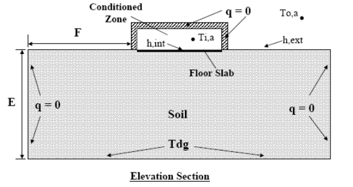
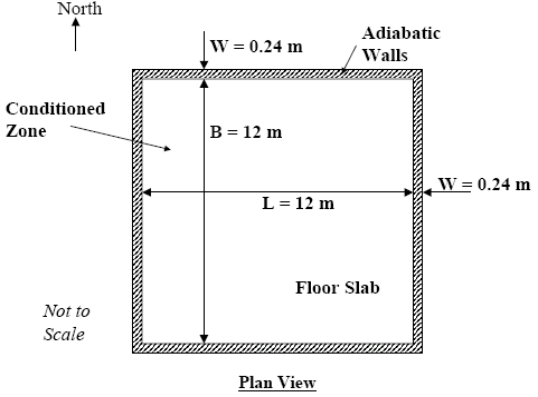
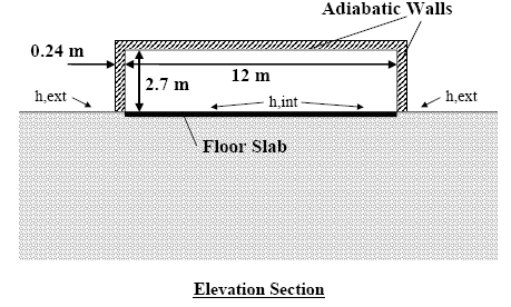
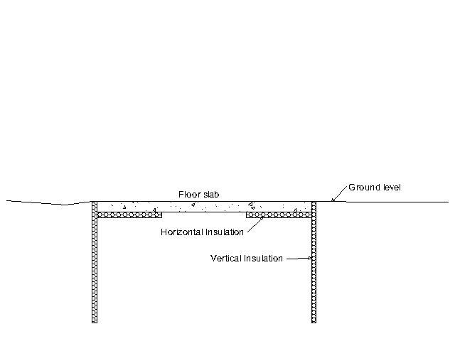
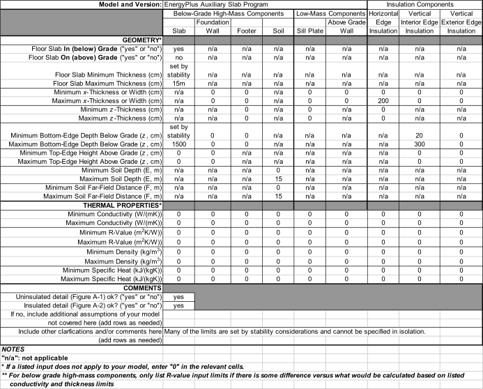

EnergyPlus Version {{ engine.config["EnergyPlusVersion"] }}  
Automatically Generated {{ engine.month_year() }}


Prepared for:

U.S. Department of Energy  
Energy Efficiency and Renewable Energy  
Office of Building Technologies  
Washington, D.C.

Originally Created by:

Robert H. Henninger and Michael J. Witte  
115 S. Wilke Road, Suite 105  
Arlington Heights, IL 60005-1500  
USA  
www.gard.com

This report was developed based upon funding from the Alliance for Sustainable Energy, LLC, Managing and Operating Contractor for the National Renewable Energy Laboratory for the U.S. Department of Energy. Any opinions, findings, and conclusions or recommendations expressed in this material are those of the author(s) and do not necessarily reflect those of the sponsor. Earlier work was supported by the Ernest Orlando Lawrence Berkeley National Laboratory, and by the National Energy Technology Laboratory and the National Renewable Energy Laboratory by
subcontract through the University of Central Florida/Florida Solar Energy Center.

This report was prepared as an account of work sponsored by an agency of
the United States Government. Neither the United States Government nor
any agency thereof, nor any of their employees, makes any warranty, express or implied, or assumes any legal liability or responsibility for the accuracy, completeness, or usefulness of any information, apparatus, product, or process disclosed, or represents that its use would not infringe privately owned rights. Reference herein to any specific commercial product, process, or services by trade name, trademark, manufacturer, or otherwise does not necessarily constitute or imply its endorsement, recommendation, or favoring by the United States Government or any agency thereof. The views and opinions of authors expressed herein do not necessarily state or reflect those of the United States Government or any agency thereof.


# Test Objectives and Overview

## Introduction

This report describes the modeling methodology and results for testing
done for the *IEA BESTEST In-Depth Diagnostic Cases for Ground Coupled Heat Transfer Related to Slab-on-Grade Construction* (Neymark and Judkoff 2008) which were simulated using the EnergyPlus software. The specifications for the test suite are described in Section 1.3 Test Specifications of that report. The results of EnergyPlus are also compared with results from several other numerical models and whole
building energy simulation programs which simulated the same test cases.


## Test Type: Comparative - Loads

Comparative tests compare a program to itself or to other simulation programs. This type of testing accomplishes results on two different levels, both validation and debugging.

From a validation perspective, comparative tests will show that
EnergyPlus is computing solutions that are reasonable compared to other
energy simulation programs. This is a very powerful method of assessment, but it is no substitute for determining if the program is absolutely correct since it may be just as equally incorrect as the benchmark program or programs. The biggest strength of comparative
testing is the ability to compare any cases that two or more programs
can model. This is much more flexible than analytical tests when only
specific solutions exist for simple models, and much more flexible than
empirical tests when only specific data sets have been collected for usually a very narrow band of operation. The IEA BESTEST in-depth diagnostic G-C test procedures discussed below take advantage of the comparative test method and for the specific tests included in test suite have already been run by experts of the other simulation tools.

Comparative testing is also useful for field-by-field input debugging.
Energy simulation programs have so many inputs and outputs that the results are often difficult to interpret. To ascertain if a given test passes or fails, engineering judgment or hand calculations are often needed. Field by field comparative testing eliminates any calculational requirements for the subset of fields that are equivalent in two or more simulation programs. The equivalent fields are exercised using
equivalent inputs and relevant outputs are directly compared.


## Test Suite: IEA BESTEST In-Depth Diagnostic G-C Test Suite for Slab-on-Grade Construction

The tests described in Section 1.3 of the *IEA BESTEST In-Depth Diagnostic Cases for Ground Coupled Heat Transfer Related to Slab-on-Grade Construction* (Neymark and Judkoff 2008) were performed using EnergyPlus. The test cases are designed to use the results of
verified detailed numerical ground-coupled heat transfer models as a
secondary mathematical truth standard for comparing the results of simplified and mid-level detailed ground-coupled heat transfer models typically used with whole-building energy simulation software. The test cases use an idealized uninsulated slab-in-grade configuration with both steady-state and harmonic boundary conditions applied with artificially constructed annual weather data, along with an adiabatic above-grade building envelope to isolate the effects of ground-coupled heat
transfer.

The test cases are divided into three categories:

-   Series “a” – for use with numerical methods programs
-   Series “b” – for use with whole-building simulation programs
-   Series “c” – uses boundary conditions that are compatible with the
    BASESIMP program to allow comparison of BASESIMP results with other
    programs

EnergyPlus was used to model the nine test cases in Series “b” and five
test cases in Series “c”. Table 1 summarizes the characteristics of
these test cases.


### Base Case Building (Case GC30b)

The basic test building (Figures 1 and 2) is a rectangular 144 $m^2$ single
zone (12 m wide x 12 m long x 2.7 m high) with no interior partitions
and no windows. The building’s exterior walls and roof are adiabatic and
massless with energy transfer only through the floor slab which is contact with soil. There is no infiltration or ventilation and no internal gains.

**Input Parameters**

- Slab length 12m  
- Slab width 12m  
- Wall thickness 0.24m  
- Inside zone air temperature 30°C  
- Outside air temperature 10°C  
- Deep ground temperature 10°C  
- Deep ground boundary depth 15m  
- Far field boundary distance 15m  
- For other inputs see Table 1  


**Soil and Slab Properties and Boundary Conditions**

Thermal Conductivity 1.9 $\frac{W}{mK}$  
Density 1490 $\frac{kg}{m^3}$  
Specific Heat 1800 $\frac{J}{kgK}$  
Slab thickness - Use the smallest thickness that program will allow


**Table 1 – In-Depth Ground Coupling Test Cases**

<table>
<thead>
 <tr>
  <th>Case</th>
  <th>Test Description</th>
  <th>Dynamic</th>
  <th>Slab Dimen. (m x m)</th>
  <th>h,int $\frac{W}{m^2K}$</th>
  <th>h,ext $\frac{W}{m^2K}$</th>
  <th>Ground Depth (m)</th>
  <th>Far-Field Boundary (m)</th>
  <th>Cond. $\frac{W}{mK}$</th>
 </tr>
</thead>
 <tr>
  <td>Series &quot;b&quot; - Test
  Cases for Whole-Building Simulation Programs</td>
 </tr>
 <tr>
  <td>GC30b</td>
  <td>Comparative Base Case</td>
  <td>Steady State</td>
  <td>12 x 12</td>
  <td>100</td>
  <td>100</td>
  <td>15</td>
  <td>15</td>
  <td>1.9</td>
 </tr>
 <tr>
  <td>GC40b</td>
  <td>Harmonic Variation</td>
  <td>Harmonic</td>
  <td>12 x 12</td>
  <td>100</td>
  <td>100</td>
  <td>15</td>
  <td>15</td>
  <td>1.9</td>
 </tr>
 <tr>
  <td>GC45b</td>
  <td>Aspect Ratio</td>
  <td>Harmonic</td>
  <td>36 x 4</td>
  <td>100</td>
  <td>100</td>
  <td>15</td>
  <td>15</td>
  <td>1.9</td>
 </tr>
 <tr>
  <td>GC50b</td>
  <td>Large Slab</td>
  <td>Harmonic</td>
  <td>80 x 80</td>
  <td>100</td>
  <td>100</td>
  <td>15</td>
  <td>15</td>
  <td>1.9</td>
 </tr>
 <tr>
  <td>GC55b</td>
  <td>Shallow Deep Ground Temp</td>
  <td>Harmonic</td>
  <td>12 x 12</td>
  <td>100</td>
  <td>100</td>
  <td>2</td>
  <td>15</td>
  <td>1.9</td>
 </tr>
 <tr>
  <td>GC60b</td>
  <td>h, int</td>
  <td>Steady State</td>
  <td>12 x 12</td>
  <td>7.95</td>
  <td>100</td>
  <td>15</td>
  <td>15</td>
  <td>1.9</td>
 </tr>
 <tr>
  <td>GC65b</td>
  <td>h,int and h,ext</td>
  <td>Steady State</td>
  <td>12 x 12</td>
  <td>7.95</td>
  <td>11.95</td>
  <td>15</td>
  <td>15</td>
  <td>1.9</td>
 </tr>
 <tr>
  <td>GC70b</td>
  <td>Harmonic h,int and h,ext</td>
  <td>Harmonic</td>
  <td>12 x 12</td>
  <td>7.95</td>
  <td>11.95</td>
  <td>15</td>
  <td>15</td>
  <td>1.9</td>
 </tr>
 <tr>
  <td>GC80b</td>
  <td>Ground Conductivity</td>
  <td>Harmonic</td>
  <td>12 x 12</td>
  <td>100</td>
  <td>100</td>
  <td>15</td>
  <td>15</td>
  <td>0.5</td>
 </tr>
 <tr>
  <td>Series "c" - Test Cases apply boundary conditions that are compatible with the BASESIMP program</td>
 </tr>
 <tr>
  <td>GC30c</td>
  <td>Comparative Base Case for Series "c"</td>
  <td>Steady State</td>
  <td>12 x 12</td>
  <td>7.95</td>
  <td>Const T</td>
  <td>15</td>
  <td>8</td>
  <td>1.9</td>
 </tr>
 <tr>
  <td>GC40c</td>
  <td>Harmonic Variation</td>
  <td>Harmonic</td>
  <td>12 x 12</td>
  <td>7.95</td>
  <td>Direct T</td>
  <td>15</td>
  <td>8</td>
  <td>1.9</td>
 </tr>
 <tr>
  <td>GC45c</td>
  <td>Aspect Ratio</td>
  <td>Harmonic</td>
  <td>36 x 4</td>
  <td>7.95</td>
  <td>Direct T</td>
  <td>15</td>
  <td>8</td>
  <td>1.9</td>
 </tr>
 <tr>
  <td>GC55c</td>
  <td>Shallow Deep Ground Temp</td>
  <td>Harmonic</td>
  <td>12 x 12</td>
  <td>7.95</td>
  <td>Direct T</td>
  <td>5</td>
  <td>8</td>
  <td>1.9</td>
 </tr>
 <tr>
  <td>GC80c</td>
  <td>Ground Conductivity</td>
  <td>Harmonic</td>
  <td>12 x 12</td>
  <td>7.95</td>
  <td>Direct T</td>
  <td>15</td>
  <td>8</td>
  <td>0.85</td>
 </tr>
 <tr>
  <td>Notes:</td>
 </tr>
 <tr>
  <td>h,int = interior surface convective coefficient</td>
  <td>Cond = slab and soil conductivity</td>
 </tr>
 <tr>
  <td>h,ext = exterior surface convective coefficient</td>
  <td>const T = direct input constant temp</td>
 </tr>
 <tr>
  <td>Far-Field Boundary = distance from slab edge</td>
  <td>direct T = direct input temp (varies hourly)</td>
 </tr>
</table>


**Surface Properties**

No surface radiation exchange. Interior and exterior solar absorptances
and infrared emittances are to set to 0 or as low as program will allow.

**Mechanical System**

The mechanical system is an ideal system that provides sensible heating
only (no cooling) with the following characteristics:

- Heat on if zone temperature <30°C; otherwise Heat = Off  
- Heating capacity set as needed to maintain zone air setpoint temperature
of 30°C  
- Uniform zone air temperature, i.e. well mixed air  
- 100% efficient  
- 100% convective air system  
- Ideal controls, heating system cycles to maintain zone setpoint temperature



**Figure 1 – Schematic Diagram of Test Building and Soil showing Boundary Conditions and Soil Dimensions (Excerpted from Neymark and Judkoff 2008)**





**Figure 2 – Schematic Diagram of Floor Slab and Conditioned Zone Adiabatic Wall Dimensions (Excerpted from Neymark and Judkoff 2008)**


### Weather Data

Six weather data files in TMY2 format were provided with the test suite
in electronic format with characteristics as follows:

<table>
<thead>
 <tr>
  <th>Weather Data Set</th>
  <th>Mean Ambient Dry-Bulb Temperature</th>
  <th>Mean Ambient Relative Humidity</th>
  <th>Constant Annual Wind Speed</th>
 </tr>
</thead>
 <tr>
  <td>GCSS-W40.TM2</td>
  <td>10 C, constant</td>
  <td>0.09%, constant</td>
  <td>40.0 m/s</td>
 </tr>
 <tr>
  <td>GCSS-W20.TM2</td>
  <td>10 C, constant</td>
  <td>0.09%, constant</td>
  <td>19.9 m/s</td>
 </tr>
 <tr>
  <td>GCSS-W01.TM2</td>
  <td>10 C, constant</td>
  <td>0.09%, constant</td>
  <td>1.0 m/s</td>
 </tr>
 <tr>
  <td>GCSP-W40.TM2</td>
  <td>10 C, harmonically varying</td>
  <td>0.09%, harmonically varying</td>
  <td>40.0 m/s</td>
 </tr>
 <tr>
  <td>GCSP-W20.TM2</td>
  <td>10 C, harmonically varying</td>
  <td>0.09%, harmonically varying</td>
  <td>19.9 m/s</td>
 </tr>
 <tr>
  <td>GCSP-W01.TM2</td>
  <td>10 C, harmonically varying</td>
  <td>0.09%, harmonically varying</td>
  <td>1.0 m/s</td>
 </tr>
</table>


These weather files were to be used as indicated below for the various
test cases. The TM2 versions of these weather files were converted to
EnergyPlus format using the EnergyPlus 3.1.0.027 weather conversion
program (version 1.04.0011 dated 4/9/2009).

<table>
<thead>
 <tr>
  <th>Case</th>
  <th>Weather Data File</th>
 </tr>
</thead>
 <tr>
  <td>GC30b</td>
  <td>GCSS-W20.TM2</td>
 </tr>
 <tr>
  <td>GC40b</td>
  <td>GCSP-W20.TM2</td>
 </tr>
 <tr>
  <td>GC45b</td>
  <td>GCSP-W20.TM2</td>
 </tr>
 <tr>
  <td>GC50b</td>
  <td>GCSP-W20.TM2</td>
 </tr>
 <tr>
  <td>GC55b</td>
  <td>GCSP-W20.TM2</td>
 </tr>
 <tr>
  <td>GC60b</td>
  <td>GCSS-W20.TM2</td>
 </tr>
 <tr>
  <td>GC65b</td>
  <td>GCSS-W01.TM2</td>
 </tr>
 <tr>
  <td>GC70b</td>
  <td>GCSP-W01.TM2</td>
 </tr>
 <tr>
  <td>GC80b</td>
  <td>GCSP-W20.TM2</td>
 </tr>
 <tr>
  <td>GC30c</td>
  <td>GCSS-W40.TM2</td>
 </tr>
 <tr>
  <td>GC40c</td>
  <td>GCSP-W40.TM2</td>
 </tr>
 <tr>
  <td>GC45c</td>
  <td>GCSP-W40.TM2</td>
 </tr>
 <tr>
  <td>GC55c</td>
  <td>GCSP-W40.TM2</td>
 </tr>
 <tr>
  <td>GC80c</td>
  <td>GCSP-W40.TM2</td>
 </tr>
</table>


### Simulation and Reporting Period

Annual simulations were run for all cases for as many years as required
such that a less than or equal to 0.1% change in floor slab conduction
occurs over the year. The following outputs were provided for the last
hour of the simulation:

-   Conduction through the floor slab in W or $\frac{Wh}{h}$  
-   Zone load in W or $\frac{Wh}{h}$   
-   Zone air temperature in °C  
-   Duration of the simulation in hours


# Results and Discussion

## Modeling Methodology


The difficulty behind linking ground heat transfer calculations to EnergyPlus is the fact that the conduction calculations in EnergyPlus (and in DOE–2 and BLAST before it) are one-dimensional and the ground heat transfer calculations are two or three-dimensional. This causes severe modeling problems irrespective of the methods being used for the ground heat transfer calculation. The basic heat balance based zone model is the foundation for building energy simulation in EnergyPlus. Thus, it is necessary to be able to relate ground heat transfer
calculations to that model.

The heat balance zone model considers a single room or thermal zone in a building and performs a heat balance on it. A fundamental modeling assumption is that the faces of the enclosure are isothermal planes. A ground heat transfer calculation usually considers an entire building and the earth that surrounds it, resulting in non-isothermal face planes where there is ground contact.

The EnergyPlus development team decided to break the modeling into two
steps with the first step being to partially decouple the ground heat
transfer calculation from the thermal zone calculation to determine the
ground-slab interface temperature and then the second step being the
zone heat transfer calculation. The most important parameter for the zone calculation is the outside face temperature of the building surface
that is in contact with the ground. Thus, this becomes a reasonable
“separation plane” for the two calculations. It was further decided that the current usage of monthly average ground temperature was reasonable for this separation plane temperature as well, since the time scales of the building heat transfer processes are so much shorter than those of the ground heat transfer processes.

Using the separation plane premise, the 3D ground heat transfer program
for slabs were developed by Bahnfleth (1989, 1990) and were modified by
Clements (2004) to produce outside face temperatures. The program has been modified for use by EnergyPlus to permit separate monthly average inside zone temperatures as input. The program produces outside face temperatures for the core area and the perimeter area of the slab. It also produces the overall weighted average surface temperature based on the perimeter and core areas used in the calculation.

The independent EnergyPlus Slab program requires the use of the EnergyPlus whole-building simulation program in order to determine the space heating or cooling load and resultant space temperature for each time step of the simulation. Only In-Depth G-C test cases GC30b, GC40b, GC45b, GC50b, GC55b, GC60b, GC65b, GC70b, GC80b, GC30c, GC40c, GC45c, GC55c and GC80c were modeled with EnergyPlus. Each of these cases were simulated using the autogrid feature of the EnergyPlus Slab program.

The simulation of ground-coupled heat transfer is a two-step process
with EnergyPlus. First, for each of the IEA BESTEST In-Depth G-C cases
that were modeled, the characteristics and properties of the soil and
slab along with boundary conditions, indoor film coefficients and monthly average indoor temperature setpoint were input to the EnergyPlus Slab program which is an auxiliary program that is part of the EnergyPlus suite. Using the slab Area-to-Perimeter ratio defined by the user, the Slab program generates an equivalent slab with appropriate
perimeter and core areas and simulates the slab heat transfer for a period of years until the temperature convergence tolerance is reached. A set of monthly slab perimeter and core temperatures at the ground-slab interface and heat fluxes are output as shown in tables below. The second step then is to create the EnergyPlus whole building model (IDF
file) which includes the monthly average ground temperature values from the Slab program analysis. In the EnergyPlus IDF file these monthly temperatures are input as part of the
Site:GroundTemperature:BuildingSurface object. The whole building simulation is then performed using a one zone building where all surfaces except for the floor were adiabatic. This analysis process is then repeated for each case to be analyzed.


## Modeling Difficulties

The boundary condition of zero-vertical heat flux implied for the soil surface just beneath the adiabatic exterior walls of the conditioned zone, as specified in the BESTEST Indepth G-C specification, was not modeled by the EnergyPlus Slab program. The slab program does not have the capability to model this effect. With the EnergyPlus Slab program the entire slab top surface is exposed to the interior zone condition. The slab configuration used in the slab program is a “slab-in-grade
model.” That is, the slab top surface is assumed to be level with the outside earth surface. The modeling capabilities of the EnergyPlus Slab program are shown in Figure 3. The insulation layers are optional and were not required for any of the G-C test cases.



**Figure 3 EnergyPlus Slab-In-Grade Illustration**

## Modeling Assumptions

Over the duration of the IEA BESTEST In-Depth Ground-Coupling test suite
development in which EnergyPlus first participated in December 2004, the
EnergyPlus auxiliary Slab program has had several upgrades with changes
as summarized below:

-   May 2003 Original version (EnergyPlus version 1.1.0.003) used to
    report results in EnergyPlus Modeler Report dated December 2004

-   April 2004 Enhanced (EnergyPlus version 1.2.2.031) to allow optional
    user inputs for the lower deep boundary temperature and exterior
    ground heat transfer coefficient and was used to report revised
    results presented in EnergyPlus Modeler Report dated June 2005

-   March 2006 Enhanced (EnergyPlus 1.3.0.007) to allow user input of
    the lower deep boundary depth and was used to report revised results
    presented in EnergyPlus Modeler Report dated March 2006.

Several of the inputs required by the EnergyPlus Slab program to
simulate the IEA BESTEST In-Depth G-C test cases but not specified by
the test specification are highlighted below.

- Ground surface albedo for snow and no snow conditions – both set to
    0.0

-  Ground surface emissivity for snow and no snow conditions – both set
    to 0.000001

-  Ground surface roughness for snow and no snow conditions – both set
    to 0.000001

-  Slab thickness - The EnergyPlus Slab program requires the user to
    specify the thickness of the slab. For the results reported in the
    EnergyPlus Modeler Report dated December 2004, the slab thickness
    was set to 0.1524 m (6 inch). In accordance with the IEA BESTEST
    In-Depth G-C specification released in June 2005 where it was
    requested that the thinnest slab allowable be used, all cases were
    revised to use a slab with thickness of 0.1285 m (5 inch).

-  Surface evapotranspiration – set to FALSE (off)

-  Convergence tolerance – The Slab program iterations continue until
    the temperature change of all modes are less than this value. For
    all test cases the convergence tolerance was set to 0.1 C.

-  For all cases the grid autosizing option was used.

-  For Cases GC30c, GC40c, GC45c, GC55c and GC80c the exterior ground
    surface temperature could not be fixed as required by the BESTEST
    Indepth G-C specification. To approximate this condition, as
    suggested in the specification, the exterior ground convective
    coefficient was set to 100 W/m2-K.


## Results with Latest Release


### Slab Program Results

The monthly ground/slab interface temperatures calculated by the
EnergyPlus Slab Program for various cases are summarized in tables
below. The temperatures listed in the column labeled “Taverage” were
used by EnergyPlus to simulate the heat transfer between the slab and
the zone interior space. It should be noted that the total slab area
(perimeter area + core area) presented in the tables below will not
necessarily agree with the total slab area specified for each case in
the BESTEST Indepth G-C specification. This is particularly noticeable
for Cases GC45b and GC45c. The EnergyPlus Slab program requests that the user input the Area-to-Perimeter (A/P) ratio for each case and not the
actual dimensions or area of the slab. The EnergyPlus Slab program then
constructs a square slab with an equivalent A/P ratio and then performs
its analysis to determine the ground/slab interface temperatures. For
those cases where the specification calls for a slab with dimensions of
12m by 12m (Cases GC30, GC 40, GC55, GC60, GC65 and GC70), the total
floor area used by the Slab program happens to be approximately 144 m2.
For the other cases however, where the specification calls for a rectangular floor (Case GC45 with a 36m by 4m floor and Case GC 50 with a 80m by 80m floor), the floor area used by EnergyPlus is not that called for in the specification. The resulting ground/slab interface
temperatures calculated by the Slab program for these last two cases
should be reliable since they are based on a floor with the same A/P ratio. The resulting monthly ground/slab interface temperatures are then specified in EnergyPlus using the Site:GroundTemperature:BuildingSurface
object along with the actual slab dimensions from the specification for
each test case. EnergyPlus then performs simulations based on the correct slab area. The ground temperatures calculated by the Slab program for EnergyPlus version {{ engine.config["EnergyPlusVersion"] }} are presented below.


**Cases GC30b – Steady-State Comparative Test Base Case**

{{ engine.render_slab_data("Outputs/EPlus-CaseGC30b-SLABSurfaceTemps.TXT") }}

**Case GC40b – Harmonic Variation of Ambient Temperature**

{{ engine.render_slab_data("Outputs/EPlus-CaseGC40b-SLABSurfaceTemps.TXT") }}

**Case GC45b – Aspect Ratio**

{{ engine.render_slab_data("Outputs/EPlus-CaseGC45b-SLABSurfaceTemps.TXT") }}

**Case GC50b – Large Slab**

{{ engine.render_slab_data("Outputs/EPlus-CaseGC50b-SLABSurfaceTemps.TXT") }}

**Case GC55b – Shallow Deep Ground Temperature**

{{ engine.render_slab_data("Outputs/EPlus-CaseGC55b-SLABSurfaceTemps.TXT") }}


**Case GC60b – Steady State with Typical Interior Surface Convective Coefficient**

{{ engine.render_slab_data("Outputs/EPlus-CaseGC60b-SLABSurfaceTemps.TXT") }}


**Case GC65b – Steady State with Typical Interior and Exterior Surface Convective Coefficients**

{{ engine.render_slab_data("Outputs/EPlus-CaseGC65b-SLABSurfaceTemps.TXT") }}


**Case GC70b – Harmonic Variation of Ambient Temperature with Typical Interior and Exterior Surface Convective Coefficients**

{{ engine.render_slab_data("Outputs/EPlus-CaseGC70b-SLABSurfaceTemps.TXT") }}


**Case GC80b – Reduced Slab and Ground Conductivity**

{{ engine.render_slab_data("Outputs/EPlus-CaseGC80b-SLABSurfaceTemps.TXT") }}


**Cases GC30c – Steady-State Comparative Test Base Case with BASESIMP**

{{ engine.render_slab_data("Outputs/EPlus-CaseGC30c-SLABSurfaceTemps.TXT") }}


**Case GC40c – Harmonic Variation of Direct-Input Exterior Surface Temperature with BASESIMP Boundary Conditions**

{{ engine.render_slab_data("Outputs/EPlus-CaseGC40c-SLABSurfaceTemps.TXT") }}


**Case GC45c – Aspect Ratio with BASESIMP Boundary Conditions**

{{ engine.render_slab_data("Outputs/EPlus-CaseGC45c-SLABSurfaceTemps.TXT") }}


**Case GC55c – Shallow Deep Ground Temperature with BASESIMP Boundary Conditions**

{{ engine.render_slab_data("Outputs/EPlus-CaseGC55c-SLABSurfaceTemps.TXT") }}


**Case GC80c – Reduced Slab and Ground Conductivity with BASESIMP Boundary Conditions**

{{ engine.render_slab_data("Outputs/EPlus-CaseGC80c-SLABSurfaceTemps.TXT") }}


### Times to Reach Convergence

The accuracy of results produced by the EnergyPlus Slab program are controlled by the Convergence Tolerance input parameter specified by the user. Annual simulations by the EnergyPlus Slab program continue until the change in temperature for all nodes of the grid are less than this convergence tolerance. For all of the cases simulated as part of this test suite, the convergence tolerance was set to 0.1 C. Convergence for the cases occurred within the following time periods:

- Case GC30b: 8 years  
- Case GC40b: 8 years  
- Case GC45b: 8 years  
- Case GC50b: 10 years  
- Case GC55b: 3 years  
- Case GC60b: 8 years  
- Case GC65b: 9 years  
- Case GC70b: 9 years  
- Case GC80b: 20 years  
- Case GC30c: 7 years  
- Case GC40c: 7 years  
- Case GC45c: 7 years  
- Case GC55c: 4 years  
- Case GC80c: 12 years


### EnergyPlus Results

EnergyPlus results for the final round of testing done as part of the IEA task were submitted using EnergyPlus version 2.0.0.025 in September 2007 and are compared to the results of other programs that participated in the exercise in the IEA final report published in September 2008
(Neymark and Judkoff 2008). Table 2 summarizes the various programs that
participated in this IEA program. Although there have been subsequent new releases of EnergyPlus since the reporting of final results, i.e. October 2007 (version 2.1.0) through the release in April 2010 (version 4.0.0.023), the EnergyPlus results for the IEA BESTEST In-Depth G-C test suite through version 4.0.0.023 did not change. With EnergyPlus version 5.0.0.031, the EnergyPlus Slab along with its input requirements were integrated into the EnergyPlus main program for more convenient use. The G-C test suite results for version 5.0.0.031 changed slightly from previous versions due to the monthly ground temperatures calculated and passed by the Slab program to EnergyPlus having extra degrees of accuracy, i.e., previously the Slab output reports showed the monthly ground temperature with two place accuracy after the decimal point while with version 5.0.0.031 the Slab program was passing values with three place accuracy after the decimal point. The change in results was less than 0.1%. With changes to the Slab program in EnergyPlus version 6.0.0.023, the floor slab fluxes were lower by 1.5% to 4.25% compared to version 5.0.0.031, moving results closer in most cases to the mean of the results for the three numerical programs participating in the IEA exercise. 

**Table 2 – Participating Organizations and Programs**

<table>
<thead>
<tr>
  <th>**Analytical,Solution, Case 10a**</th>
  <th>**Authoring Organization**</th>
  <th>**Implemented by**</th>
  <th>**Abbreviation**</th>
</tr>
</thead>
<tr>
  <td>Delsante, Stokes and Walsh</td>
  <td>Commonwealth Scientific and,Industrial Research Organisation, Australia</td>
  <td>NREL/JNA $^{1,2}$ United States</td>
  <td>Analytical Solution/CSIRO</td>
</tr>
<tr>
  <td>**Verified Numerical Model**</td>
  <td>**Authoring Organization**</td>
  <td>**Implemented by**</td>
  <td>**Abbreviation**</td>
</tr>
<tr>
  <td>FLUENT 6.0.20</td>
  <td>Fluent, Inc., United States</td>
  <td>PAAET $^3$ Kuwait</td>
  <td>FLUENT/PAAET</td>
</tr>
<tr>
  <td>MATLAB 7.0.4.365 (R14)</td>
  <td>The MathWorks, Inc., United States</td>
  <td>Dublin Institute of Technology, Ireland</td>
  <td>MATLAB/DIT</td>
</tr>
<tr>
  <td>TRNSYS 16.1</td>
  <td>University of Wisconsin/TESS, $^4$ United States</td>
  <td>TESS $^4$ United States</td>
  <td>TRNSYS/TESS</td>
</tr>
<tr>
  <td>**Simulation Program**</td>
  <td>**Authoring Organization**</td>
  <td>**Implemented by**</td>
  <td>**Abbreviation**</td>
</tr>
<tr>
  <td>BASECALC V1.0e</td>
  <td>CETC $^5$ Canada</td>
  <td>CETC $^5$ Canada</td>
  <td>BASECALC/NRCan</td>
</tr>
<tr>
  <td>EnergyPlus 2.0.0.025</td>
  <td>LBNL/UIUC/DOE-BT $^{6,7,8}$ United States</td>
  <td>GARD Analytics, Inc., United States</td>
  <td>EnergyPlus/GARD</td>
</tr>
<tr>
  <td>ESP-r/BASESIMP</td>
  <td>CETC/ESRU $^{5,9}$ Canada/United Kingdom</td>
  <td>CETC $^5$ Canada</td>
  <td>ESP-r-BASESIMP/NRCan</td>
</tr>
<tr>
  <td>GHT</td>
  <td>NREL $^1$ United States</td>
  <td>NREL $^1$ United States</td>
  <td>GHT/NREL</td>
</tr>
<tr>
  <td>SUNREL-GC 1.14.01</td>
  <td>NREL $^1$ United States</td>
  <td>NREL $^1$ United States</td>
  <td>SUNREL-GC/NREL</td>
</tr>
<tr>
  <td>VA114 2.20/ISO-13370</td>
  <td>VABI Software BV, The Netherlands, CEN/ISO $^{10, 11}$ </td>
  <td>VABI Software BV, The Netherlands</td>
  <td>VA 114-ISO 13370/VABI</td>
</tr>
</table>

> $^1$ NREL: National Renewable Energy Laboratory, United States  
> $^2$ JNA:J, Neymark & Associates, United States  
> $^3$ PAAET: Public Authority for Applied Education and Training, Kuwait  
> $^4$ TESS: Thermal Energy Systems Specialists, United States   
> $^5$ CETC: CANMET Energy Technology Centre, Natural Resources Canada, Canada
> $^6$ LBNL: Lawrence Berkeley National Laboratory, United States  
> $^7$ UIUC: University of Illinois Urbana/Champaign, United States   
> $^8$ DOE-BT: U.S. Department of Energy, Office of Building Technologies, Energy Efficiency and Renewable Energy,  United States   
> $^9$ ESRU: Energy Systems Research Unit, University of Strathclyde, United Kingdom  
> $^{10}$ CEN: European Committee for Standardisation, Belgium  
> $^{11}$ ISO: International Organization for Standardization, Switzerland

 
The results for each of the IEA BESTEST In-Depth G-C test cases simulated with EnergyPlus is presented in Table 3. The EnergyPlus results compared to the other programs that participated in the IEA
BESTEST In-Depth G-C test exercise are presented on a set of charts which can be found in Appendix A. The charts are presented in groups of three: Floor Conduction, Zone Heating Load and Zone Temperature first for the Steady-State cases, then for the Steady-Periodic cases, and finally for the Steady-State Annual Peak Hour.


**Table 3 – IEA BESTEST In-Depth G-C Test Case Results with EnergyPlus Version {{ engine.config["EnergyPlusVersion"] }}**

{{ engine.create_table_from_excel_range("EPlus-GC-InDepth-Out-0206.xlsx", "StandardOutput", "D53:R80") }}


The IEA BESTEST In-Depth G-C final report refers to the results of the
TRNSYS, FLUENT and MATLIB programs as quasi-analytical results since
they are detailed 3-D models of the test cases and were rigorously verified versus the Case GC-10a analytical solution. A comparison of the
EnergyPlus results to the mean of the results for the numerical programs
is shown in Table 4.

Some of these differences may be explainable due to the less detailed
modeling that the EnergyPlus Slab program does of slab-on-grade heat
transfer compared to the more detailed modeling of numerical models. There were two input parameters for which the EnergyPlus results seemed to be more sensitive compared to the results of the numerical models and other programs.

-  Sensitivity to variation of ground surface heat transfer coefficient
    – this is demonstrated by comparing the results of Case GC60b with
    h,ext = 100 W/m2-K versus Cases GC65b and GC70b with h,ext = 11.95
    W/m2-K (see Figure 4). This disagreement may be caused by the
    EnergyPlus Slab program not being able to model the presence of the
    adiabatic exterior wall which would create a shorter heat flow path
    underneath the exterior wall and would overestimate the slab
    perimeter heat flow for the test cases.

-  Sensitivity to variation of soil depth – this is demonstrated by
    comparing the results of Case GC40b with Soil Depth = 15m versus
    Case GC55b with Soil Depth = 2m (see Figure 5). This difference is
    again probably due to the more detailed modeling done by numerical
    programs versus the EnergyPlus method.

Additional “Delta Charts” are included in the IEA final report to compare the difference in results between certain cases in order to isolate the sensitivity of each program to changes in other features floor aspect ratio, ground conductivity, etc. The “Delta Charts” comparing EnergyPlus results with other programs are presented in
Appendix B.

**Table 4 – EnergyPlus In-Depth G-C Test Case Results (Version {{ engine.config["EnergyPlusVersion"] }}) Compared to Results of Numerical Models**

{{ engine.create_table_from_excel_range("Comparison of Results.xlsx", "Numerical Model XComp", "B2:H12") }}

{{ engine.create_table_from_excel_range("Comparison of Results.xlsx", "Numerical Model XComp", "B15:H31") }}


{{ engine.write_chart('ColumnClustered', 'Microsoft Excel', 'IEA BESTEST In-Depth Ground-Coupling Floor Slab\nSteady-State and Steady-Periodic Floor Conduction', '', 'Floor Heat Flow (W or Wh/h)', 'Charts for Eplus Testing Report.xlsx', 'Chart Data', '', "(B6,A7:A11,B7:B11,1);(C6,A7:A11,C7:C11,2);(D6,A7:A11,D7:D11,3);(E6,A7:A11,E7:E11,4);(G6,A7:A11,G7:G11,5);(F6,A7:A11,F7:F11,6);", ["For comparison purposes the Case GC70b floor heat flow which is reported in units of annual kWh is plotted as kWh*1000/8760"]) }}

**Figure 4 EnergyPlus Slab Program Sensitivity to Ground Surface Heat Transfer Coefficient Compared to Other Models and Programs**

{{ engine.write_chart('ColumnClustered', 'Microsoft Excel', 'IEA BESTEST In-Depth Ground-Coupling Floor Slab\nSteady-Periodic Annual Floor Conduction', '', 'Floor Heat Flow (W or Wh/h)', 'Charts for Eplus Testing Report.xlsx', 'Chart Data', '', "(B17,A18:A20,B18:B20,1);(C17,A18:A20,C18:C20,2);(D17,A18:A20,D18:D20,3);(E17,A18:A20,E18:E20,4);(G17,A18:A20,G18:G20,5);(F17,A18:A20,F18:F20,6);", []) }}

**Figure 5 EnergyPlus Slab Program Sensitivity to Soil Depth Compared to Other Models and Programs**


## Enhancements to EnergyPlus Prompted by Using IEA BESTEST In-Depth G-C Test Suite

As was discussed in Section 2.3, a series of enhancements were made to
the EnergyPlus Slab program in order to accommodate the range of variable testing required by the IEA BESTEST In-Depth G-C specification. The extreme range of some of these variables would never be seen in real buildings but are convenient for controlled comparative testing. A summary of these enhancements and there impact on results is presented
below.

-   User definition of a specific lower deep boundary temperature. This
    capability was required to ensure that all programs participating in
    the IEA BESTEST In-Depth G-C comparative testing exercise were using
    the same deep boundary temperature. Previous to this enhancement,
    this temperature was calculated for the user by the EnergyPlus Slab
    program and set to the annual mean outdoor dry-bulb temperature as
    determined from data on the weather file. Since the lower deep
    boundary temperature required by the specification was 10C for all
    test cases and each of the weather files used as part of the test
    suite already had annual mean ambient dry-bulb air temperatures of
    10C, use of this new capability did not change any of the test
    results.

-   User definition of ground surface heat transfer coefficient. This
    capability was required to ensure that all programs participating in
    the IEA BESTEST In-Depth G-C comparative testing exercise were using
    the same the same ground heat transfer coefficient. Most test cases
    the In-Depth G-C specification required that this parameter be set
    to 100 W/m2-K, a value far higher than typically seen in real
    situations. Cases GC65b and GC70b however, required that this
    parameter be set at 11.95 W/m2-K. In the original version of the
    EnergyPlus Slab program the user did not have the option of defining
    this parameter but rather it was calculated internally by the
    program as a function of the ambient temperature and wind speed from
    the weather file. Subsequent to this enhancement the ground heat
    transfer coefficient for each test case was set by input to that
    required by the specification.

-   User definition of the lower deep boundary depth, including allowing
    the automated gridding option for various depths. This capability
    was required because the In-Depth G-C specification requested the
    simulation of shallow as well as deep boundary depths ranging from
    2m to 30m. Previous to this enhancement, when the A/P ratio was 4.25
    or less the deep boundary depth was automatically set to 15 m and if
    greater than 4.25 it was set to 20m. It is expected that once you
    reach 20m there would be little change in results beyond that
    distance. For all test cases except GC55b and GC55c, the deep
    boundary depth specified is 15 m, and since for all cases except
    GC50b the A/P ratio is less than 4.25, this new capability affected
    only three out of the 14 of the test cases modeled by EnergyPlus.

-   With earlier versions of the EnergyPlus Slab program documentation
    there was some confusion about the input parameter “Distance from
    edge of slab to domain edge.” It was unclear if this was the
    horizontal far field distance or the deep boundary depth. Later
    EnergyPlus documentation changes cleared this up.


## Summary of Other Changes that Occurred Between Versions of EnergyPlus Subsequent to IEA Testing

Since participating in the IEA G-C testing certain changes have been
made to the EnergyPlus Slab program which account for the change in
results seen between versions of EnergyPlus. Those changes are
summarized in the table below.

**Table 5 – Summary of Pertinent EnergyPlus Changes**

{{ engine.create_table_from_yaml("EnergyPlusChanges.yaml", ["Version", "Input-File-Changes", "Code-Changes"]) }}


# Conclusions

EnergyPlus Version {{ engine.config["EnergyPlusVersion"] }} was used to model a
range of ground-coupling models for a slab-on-grade configuration specified in
*IEA BESTEST In-Depth Diagnostic Cases for Ground Coupled Heart Transfer
Related to Slab-on-Grade Construction* (Neymark and Judkoff 2008). The ability
of EnergyPlus and its Slab Program to model a slab-on-grade floor configuration
and predict hourly floor conduction, zone loads and resulting zone temperatures
was tested using a suite of 14 test cases which included varying slab aspect
ratios, floor interior heat transfer coefficients, exterior ground heat
transfer coefficients, ground depth, far field boundary distance, and
steady-state and harmonic outdoor temperature. The results predicted by
EnergyPlus for the 14 different cases were compared to 3 quasi-analytical
numerical models and 5 other whole building simulation programs that
participated in an International Energy Agency project which was completed in
2007. EnergyPlus results differed by
{{ engine.percent_abs_range("Comparison of Results.xlsx", "Numerical Model XComp", "H9:H12") }}
compared to the numerical
models depending on the test case. Some of these differences may be explainable
due to the less detailed modeling that the EnergyPlus Slab program does of
slab-on-grade heat transfer compared to the more detailed modeling of numerical
models and also due to the EnergyPlus Slab program’s inability to model the
presence of the adiabatic exterior walls of the conditioned zone as described
in the IEA BESTEST In-Depth G-C specification.


# References

Bahnfleth, W.P. 1989. Three Dimensional Modeling of Heat Transfer from Slab Floors. Ph.D. dissertation., also published as USACERL TM E-89/11,
University of Illinois.

Bahnfleth, W.P. and C.O. Pedersen. 1990. A Three Dimensional Numerical Study of Slab-on-Grade Heat Transfer. *ASHRAE Transactions* Pt. 2, 96:61-72.

Clements, Edward, 2004, Three Dimensional Foundation Heat Transfer
Modules for Whole-Building Energy Analysis, MS Thesis, Pennsylvania
State University.

EnergyPlus 2014. U.S. Department of Energy, Energy Efficiency and
Renewable Energy, Office of Building Technologies.
[www.energyplus.gov](http://www.energyplus.gov)

Ground Heat Transfer in EnergyPlus*, Auxiliary EnergyPlus Programs*, pgs
65-82, April 6, 2009.

Neymark, J., and R. Judkoff. 2008. *International Energy Agency Building Energy Simulation TEST and Diagnostic Method (IEA BESTEST) In-Depth Diagnostic Cases for Ground Coupled Heat Transfer Related to Slab-on-Grade Construction*, NREL TP-550-43388, National Renewable
Energy Laboratory, Golden, Colorado, September 2008.\
*www.iea-shc.org/publications/task.aspx?Task=34*
 

# Appendix A

**Charts Comparing EnergyPlus Version {{ engine.config["EnergyPlusVersion"] }} Results with Other Whole Building Energy Simulation Programs**

**(Other Program Results Excerpted from Neymark and Judkoff 2008)**

```{exec_python}
engine.write_chart('ColumnClustered', 'QFSS', 'IEA BESTEST Ground Coupling: In-Depth Floor Slab \nSteady-State Floor Conduction', [], 'Floor Heat Flow (W or Wh/h)', 'GC-Indepth-Results.xlsx', 'ABSdata', 'B11:L17', "(C11,B12:B17,C12:C17,1);(D11,B12:B17,D12:D17,2);(E11,B12:B17,E12:E17,3);(F11,B12:B17,F12:F17,4);(G11,B12:B17,G12:G17,5);(H11,B12:B17,H12:H17,6);(I11,B12:B17,I12:I17,7);(J11,B12:B17,J12:J17,8);(K11,B12:B17,K12:K17,9);(L11,B12:B17,L12:L17,10);", [])
engine.write_chart('ColumnClustered', 'QZSS', 'IEA BESTEST Ground Coupling: In-Depth Floor Slab \nSteady-State Zone Heating Load', [], 'Heating Load (W or Wh/h)', 'GC-Indepth-Results.xlsx', 'ABSdata', 'B19:L23', "(H19,B20:B23,H20:H23,1);(I19,B20:B23,I20:I23,2);(J19,B20:B23,J20:J23,3);(K19,B20:B23,K20:K23,4);(L19,B20:B23,L20:L23,5);", [])
engine.write_chart('ColumnClustered', 'TZSS', 'IEA BESTEST Ground Coupling: In-Depth Floor Slab \nSteady-State Zone Temperature', [], 'Temperature (°C)', 'GC-Indepth-Results.xlsx', 'ABSdata', 'B48:L52', "(H48,B49:B52,H49:H52,1);(I48,B49:B52,I49:I52,2);(J48,B49:B52,J49:J52,3);(K48,B49:B52,K49:K52,4);(L48,B49:B52,L49:L52,5);", [])
engine.write_chart('ColumnClustered', 'QFSP', 'IEA BESTEST Ground Coupling: In-Depth Floor Slab \nSteady-Periodic Annual Floor Conduction', [], 'Floor Heat Flow (kWh)', 'GC-Indepth-Results.xlsx', 'ABSdata', 'B69:K80', "(C69,B70:B80,C70:C80,1);(D69,B70:B80,D70:D80,2);(E69,B70:B80,E70:E80,3);(F69,B70:B80,F70:F80,4);(G69,B70:B80,G70:G80,5);(H69,B70:B80,H70:H80,6);(I69,B70:B80,I70:I80,7);(J69,B70:B80,J70:J80,8);(K69,B70:B80,K70:K80,9);", [])
engine.write_chart('ColumnClustered', 'QZSP', 'IEA BESTEST Ground Coupling: In-Depth Floor Slab \nSteady-Periodic Annual Zone Heating Load', [], 'Heating Load (kWh)', 'GC-Indepth-Results.xlsx', 'ABSdata', 'B82:K92', "(G82,B83:B92,G83:G92,1);(H82,B83:B92,H83:H92,2);(I82,B83:B92,I83:I92,3);(J82,B83:B92,J83:J92,4);(K82,B83:B92,K83:K92,5);", [])
engine.write_chart('ColumnClustered', 'TZSP', 'IEA BESTEST Ground Coupling: In-Depth Floor Slab \nSteady-Periodic Zone Temperature', [], 'Temperature (°C)', 'GC-Indepth-Results.xlsx', 'ABSdata', 'B112:K122', "(G112,B113:B122,G113:G122,1);(H112,B113:B122,H113:H122,2);(I112,B113:B122,I113:I122,3);(J112,B113:B122,J113:J122,4);(K112,B113:B122,K113:K122,5);", [])
engine.write_chart('ColumnClustered', 'PFSP', 'IEA BESTEST Ground Coupling: In-Depth Floor Slab \nSteady-Periodic Annual Peak-Hour Floor Conduction', [], 'Floor Heat Flow (W or Wh/h)', 'GC-Indepth-Results.xlsx', 'ABSPeakdata', 'B11:K22', "(C11,B12:B22,C12:C22,1);(D11,B12:B22,D12:D22,2);(E11,B12:B22,E12:E22,3);(F11,B12:B22,F12:F22,4);(G11,B12:B22,G12:G22,5);(H11,B12:B22,H12:H22,6);(I11,B12:B22,I12:I22,7);(J11,B12:B22,J12:J22,8);(K11,B12:B22,K12:K22,9);", [])
engine.write_chart('ColumnClustered', 'PZSP', 'IEA BESTEST Ground Coupling: In-Depth Floor Slab \nSteady-Periodic Annual Peak-Hour Zone Heating Load', [], 'Zone Heating Load (W or Wh/h)', 'GC-Indepth-Results.xlsx', 'ABSPeakdata', 'B23:K33', "(G23,B24:B33,G24:G33,1);(H23,B24:B33,H24:H33,2);(I23,B24:B33,I24:I33,3);(J23,B24:B33,J24:J33,4);(K23,B24:B33,K24:K33,5);", [])
engine.write_chart('ColumnClustered', 'ODBmin', 'IEA BESTEST Ground Coupling: In-Depth Floor Slab \nSteady-Periodic Minimum ODB', [], 'Temperature (°C)', 'GC-Indepth-Results.xlsx', 'ABSPeakdata', 'B48:K59', "(C48,B49:B59,C49:C59,1);(E48,B49:B59,E49:E59,2);(F48,B49:B59,F49:F59,3);(G48,B49:B59,G49:G59,4);(H48,B49:B59,H49:H59,5);(I48,B49:B59,I49:I59,6);(J48,B49:B59,J49:J59,7);(K48,B49:B59,K49:K59,8);", [])
```


# Appendix B

**Delta Charts Comparing EnergyPlus Version 8.2.0 Results with Other Whole Building Energy Simulation Programs** 

**(Other Program Results Excerpted from Neymark and Judkoff 2008)**

```{exec_python}
engine.write_chart('ColumnClustered', 'dQFSS', 'IEA BESTEST Ground Coupling: In-Depth Floor Slab \nSteady-State Floor Conduction Sensitivity', [], 'Floor Heat Flow (W or Wh/h)', 'GC-Indepth-Results.xlsx', 'DELdata', 'B10:K20', "(C10,B11:B20,C11:C20,1);(D10,B11:B20,D11:D20,2);(E10,B11:B20,E11:E20,3);(F10,B11:B20,F11:F20,4);(G10,B11:B20,G11:G20,5);(H10,B11:B20,H11:H20,6);(I10,B11:B20,I11:I20,7);(J10,B11:B20,J11:J20,8);(K10,B11:B20,K11:K20,9);", [])
engine.write_chart('ColumnClustered', 'dQZSS', 'IEA BESTEST Ground Coupling: In-Depth Floor Slab \nSteady-State Zone Heating Load Sensitivity', [], 'Heating Load (W or Wh/h)', 'GC-Indepth-Results.xlsx', 'DELdata', 'B25:K31', "(G25,B26:B31,G26:G31,1);(H25,B26:B31,H26:H31,2);(I25,B26:B31,I26:I31,3);(J25,B26:B31,J26:J31,4);(K25,B26:B31,K26:K31,5);", [])
engine.write_chart('ColumnClustered', 'QZ-FSS', 'IEA BESTEST Ground Coupling: In-Depth Floor Slab \nSteady-State (Zone Heating Load) - (Floor Conduction)', [], 'Heat Flow (W or Wh/h)', 'GC-Indepth-Results.xlsx', 'ABSdata', 'B25:L29', "(H25,B26:B29,H26:H29,1);(I25,B26:B29,I26:I29,2);(J25,B26:B29,J26:J29,3);(K25,B26:B29,K26:K29,4);(L25,B26:B29,L26:L29,5);", [])
engine.write_chart('ColumnClustered', 'dQFSP', 'IEA BESTEST Ground Coupling: In-Depth Floor Slab \nSteady-Periodic Annual Floor Conduction Sensitivity', [], 'Floor Heat Flow (kWh)', 'GC-Indepth-Results.xlsx', 'DELdata', 'B36:K45', "(C36,B37:B45,C37:C45,1);(D36,B37:B45,D37:D45,2);(E36,B37:B45,E37:E45,3);(F36,B37:B45,F37:F45,4);(G36,B37:B45,G37:G45,5);(H36,B37:B45,H37:H45,6);(I36,B37:B45,I37:I45,7);(J36,B37:B45,J37:J45,8);(K36,B37:B45,K37:K45,9);", [])
engine.write_chart('ColumnClustered', 'dQZSP', 'IEA BESTEST Ground Coupling: In-Depth Floor Slab \nSteady-Periodic Annual Zone Heating Load Sensitivity', [], 'Heating Load (kWh)', 'GC-Indepth-Results.xlsx', 'DELdata', 'B49:K57', "(G49,B50:B57,G50:G57,1);(H49,B50:B57,H50:H57,2);(I49,B50:B57,I50:I57,3);(J49,B50:B57,J50:J57,4);(K49,B50:B57,K50:K57,5);", [])
engine.write_chart('ColumnClustered', 'QZ-FSP', 'IEA BESTEST Ground Coupling: In-Depth Floor Slab \nSteady-Periodic  (Zone Heating Load) - (Floor Conduction)', [], 'Heating Load (kWh)', 'GC-Indepth-Results.xlsx', 'ABSdata', 'B94:K104', "(G94,B95:B104,G95:G104,1);(H94,B95:B104,H95:H104,2);(I94,B95:B104,I95:I104,3);(J94,B95:B104,J95:J104,4);(K94,B95:B104,K95:K104,5);", [])
engine.write_chart('ColumnClustered', 'dPFSP', 'IEA BESTEST Ground Coupling: In-Depth Floor Slab \nSteady-Periodic Annual Peak-Hour Floor Conduction Sensitivity', [], 'Floor Heat Flow (W or Wh/h)', 'GC-Indepth-Results.xlsx', 'DELdata', 'B61:K70', "(C61,B62:B70,C62:C70,1);(D61,B62:B70,D62:D70,2);(E61,B62:B70,E62:E70,3);(F61,B62:B70,F62:F70,4);(G61,B62:B70,G62:G70,5);(H61,B62:B70,H62:H70,6);(I61,B62:B70,I62:I70,7);(J61,B62:B70,J62:J70,8);(K61,B62:B70,K62:K70,9);", [])
engine.write_chart('ColumnClustered', 'dPZSP', 'IEA BESTEST Ground Coupling: In-Depth Floor Slab \nSteady-Periodic Annual Peak-Hour Zone Heating Load Sensitivity', [], 'Zone Heating Load (W or Wh/h)', 'GC-Indepth-Results.xlsx', 'DELdata', 'B74:K82', "(G74,B75:B82,G75:G82,1);(H74,B75:B82,H75:H82,2);(I74,B75:B82,I75:I82,3);(J74,B75:B82,J75:J82,4);(K74,B75:B82,K75:K82,5);", [])
engine.write_chart('ColumnClustered', 'PZ-FSP', 'IEA BESTEST Ground Coupling: In-Depth Floor Slab \nSteady-Periodic  (Peak Zone Heating Load) - (Peak Floor Conduction)', [], 'Heating Load (W or Wh/h)', 'GC-Indepth-Results.xlsx', 'ABSPeakdata', 'B35:K45', "(G35,B36:B45,G36:G45,1);(H35,B36:B45,H36:H45,2);(I35,B36:B45,I36:I45,3);(J35,B36:B45,J36:J45,4);(K35,B36:B45,K36:K45,5);", [])
```


# Appendix C

**EnergyPlus Model Geometry and Thermal Property Allowed Inputs (pro forma)**


