EnergyPlus Version {{ engine.config["EnergyPlusVersion"] }}

Automatically generated {{ engine.month_year() }}


Prepared for:

U.S. Department of Energy  
Energy Efficiency and Renewable Energy  
Office of Building Technologies  
Washington, D.C.  

Originally Prepared by:

Robert H. Henninger and Michael J. Witte  
GARD Analytics, Inc.  
115 S. Wilke Road, Suite 105  
Arlington Heights, IL 60005-1500  
USA  
www.gard.com

This report was developed based upon funding from the Alliance for Sustainable
Energy, LLC, Managing and Operating Contractor for the National Renewable
Energy Laboratory for the U.S. Department of Energy. Any opinions, findings,
and conclusions or recommendations expressed in this material are those of the
author(s) and do not necessarily reflect those of the sponsor. Earlier work was
supported by the Ernest Orlando Lawrence Berkeley National Laboratory, and by
the National Energy Technology Laboratory and the National Renewable Energy
Laboratory by subcontract through the University of Central Florida/Florida
Solar Energy Center.

This report was prepared as an account of work sponsored by an agency of the
United States Government. Neither the United States Government nor any agency
thereof, nor any of their employees, makes any warranty, express or implied, or
assumes any legal liability or responsibility for the accuracy, completeness,
or usefulness of any information, apparatus, product, or process disclosed, or
represents that its use would not infringe privately owned rights. Reference
herein to any specific commercial product, process, or services by trade name,
trademark, manufacturer, or otherwise does not necessarily constitute or imply
its endorsement, recommendation, or favoring by the United States Government or
any agency thereof. The views and opinions of authors expressed herein do not
necessarily state or reflect those of the United States Government or any
agency thereof.


# Test Objectives and Overview

## Introduction

This report describes the modeling methodology and results for testing done of
HVAC system tests designated as Cases CE100 through CE200 of ANSI/ASHRAE
Standard 140-2011 titled *Standard Method of Test for the Evaluation of
Building Energy Analysis Computer Programs* with the EnergyPlus Version 
{{ engine.config["EnergyPlusVersion"] }}. The results of EnergyPlus are also
compared with analytical results as well as results from several other whole
building energy analysis programs that simulated the same test cases.

## Test Type: Analytical and Comparative - HVAC

The ANSI/ASHRAE Standard 140-2011 contains a set of analytical tests as well as
a set of comparative results from several whole building simulation programs
that participated in an International Energy Agency (IEA) project to test HVAC
equipment performance modeling procedures. Analytical tests compare a program's
results to mathematical solutions for simple cases. This is an excellent method
to use for assessing the accuracy of results since there is only one solution
for the case analyzed given the boundary conditions. Comparative tests compare
a program to itself or to other simulation programs. Both types of testing
accomplish results on two different levels, both validation and debugging.
Validation is accomplished when the results of the test program compare
favorably with the analytical results. Debugging is accomplished when the
results for certain cases do not compare favorably with the analytical results
and then through systematic checking it is determined that the source of the
difference is due to an input error, a modeling inconsistency or flaw in the
program logic.

## Test Suite: ANSI/ASHRAE Standard 140-2011 Space Cooling Performance Tests

The tests described in Sections 5.3.1 and 5.3.2 of ANSI/ASHRAE Standard
140-2011, *Standard Method of Test for the Evaluation of Building Energy
Analysis Computer Programs*, were performed using the EnergyPlus program. This
standard builds upon work previously performed by the International Energy
Agency (IEA) Solar Heating and Cooling Programme Task 22 *Building Energy
Simulation Test and Diagnostic Method for HVAC Equipment Models (HVAC BESTEST),
Volume 1: Cases E100 - E200* (Neymark & Judkoff 2001). The results of the IEA
HVAC BESTEST activities are reported in a National Renewable Energy Laboratory
(NREL) report by the same name as above but with a January 2002 publish date
(Neymark & Judkoff 2002). The testing done with EnergyPlus actually started as
part of the IEA HVAC BESTEST activities before these HVAC equipment performance
testing procedures were incorporated into ANSI/ASHRAE Standard 140. The
discussion which follows chronicles the experiences that occurred while using
EnergyPlus to simulate the HVAC BESTEST suite, the same tests that are now part
of ANSI/ASHRAE Standard 140-2011 where the test cases are referenced as Cases
CE100 - CE200. In the following discussions where sections, tables or figures
are referenced from Standard 140-2011, the corresponding reference in the HVAC
BESTEST specification follows in parentheses. Beginning with the results for
EnergyPlus version 2.2.0.023 and later releases, the new "CE" test case
designation is used in tables and charts while for all previous versions of
EnergyPlus results the "E" test case designation from HVAC BESTEST was used.

The following HVAC equipment performance tests describe an analytical
verification and comparative diagnostic procedure for testing the ability of
whole building simulation programs to model the performance of unitary space
cooling equipment that is typically modeled using manufacturer design data
presented in the form of empirically derived performance maps. The following
tests were performed with EnergyPlus as specified in Standard 140-2011 (Section
1.3 of the HVAC BESTEST specification):

-   Case CE100 - Base Case Building and Mechanical System

-   Additional Dry Coil Test Cases (Cases CE110, CE120, CE130, CE140), as described in Section 5.3.2.1 of Standard 140-2011 (Section 1.3.2 and 1.3.3 of the HVAC BESTEST specification)

-   Humid Zone Test Cases (Cases CE150, CE160, CE165, CE170, CE180, CE185, CE190, CE195, CE200), as described in Section 5.3.2.2 of  Standard 140-2011 (Section 1.3.4 of the HVAC BESTEST specification)

### Case CE100 - Base Case Building and Mechanical System

The basic test building (Figure 1) is a rectangular 48 m^2^ single zone (8 m wide x 6 m long x 2.7 m high) with no interior partitions and no windows. The building is intended as a near-adiabatic cell with cooling load driven by user specified internal gains. Material properties are described below. For further details refer to Section 5.3.1 of the standard.

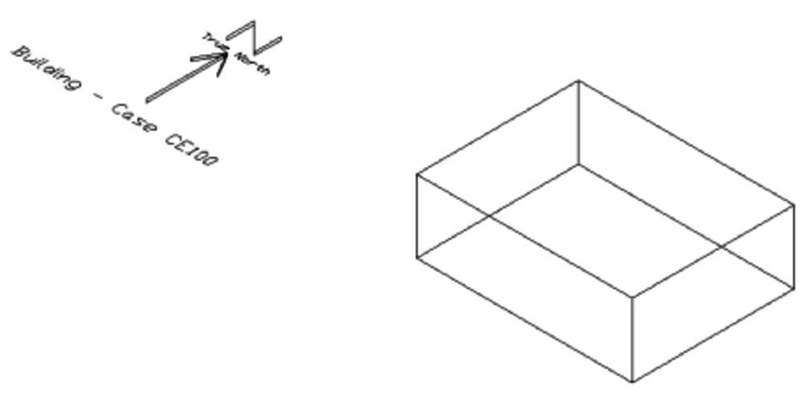

**Figure 1 Base Building (Case CE100) - Isometric View of Southeast Corner**

**Wall, Roof and Floor Construction:**

<table>
<col align="left"/>
<col align="right"/>
<col align="right"/>
<col align="right"/>
<col align="right"/>

<thead>
<tr>
  <th>Element</th>
  <th>k ( $\frac{W}{mK}$ )</th>
  <th>Thickness (m)</th>
  <th>U ( $\frac{W}{m^2K}$ )</th>
  <th>R ( $\frac{m^2K}{W}$ )</th>
</tr>
</thead>
<tr>
  <td>Int. Surface Coeff.</td>
  <td></td>
  <td></td>
  <td>8.290</td>
  <td>0.121</td>
</tr>
<tr>
  <td>Insulation</td>
  <td>0.010</td>
  <td>1.000</td>
  <td>0.010</td>
  <td>100.000</td>
</tr>
<tr>
  <td>Ext. Surface Coeff.</td>
  <td></td>
  <td></td>
  <td>29.300</td>
  <td>0.034</td>
</tr>
<tr>
  <td></td>
  <td></td>
  <td></td>
  <td></td>
  <td></td>
</tr>
<tr>
  <td>Overall, air-to-air</td>
  <td></td>
  <td></td>
  <td>0.010</td>
  <td>100.155</td>
</tr>
</table>


**Opaque Surface Radiative Properties:**

<table>
<tr>
  <th></th>
  <th>Interior Surface</th>
  <th>Exterior Surface</th>
</tr>
<tr>
  <td>Solar Absorptance</td>
  <td>0.6</td>
  <td>0.1</td>
</tr>
<tr>
  <td>Infrared Emittance</td>
  <td>0.9</td>
  <td>0.9</td>
</tr>
</table>


**Infiltration:** None  
**Internal Load:** 5400 W sensible, continuous, 100% convective; no
latent load  
**Mechanical System:** Simple unitary vapor compression cooling system with air cooled condenser and indoor evaporator coil, 100% convective air system, no outside air or exhaust air, single speed, draw-through air distribution fan, indoor and outdoor fans cycle on/off with compressor, no cylinder unloading, no hot gas bypass, crankcase heater and other auxiliary energy = 0. Performance characteristics at ARI rating conditions of 35.0°C outdoor dry-bulb, 26.7°C cooling coil entering dry-bulb and 19.4°C cooling coil entering wet-bulb are:

- Net Total Capacity: 7852 W  
- Airflow: 0.425 $\frac{m^3}{s}$  
- Apparatus: Dew Point 13.8 °C  
- Compressor Power: 1858 W  
- Indoor Fan Power: 230 W  
- Outdoor Fan Power: 108 W  
- COP: 3.62  
- Seasonal COP: 3.78

There is a non-proportional-type thermostat, heat always off, cooling on if
zone air temperature >22.2°C and heat extraction rate is assumed to equal the
maximum capacity of the equipment for the hour's environmental conditions. For
further specifications and the equipment's full-load and part load performance
map, see Section 5.3.1.10 and Tables 26a -26f of Standard 140 (Section 1.3.2.2
and Tables 1-6 in HVAC BESTEST specification).


### Dry Zone and Wet Zone Series (Cases CE110 - CE200)

The 13 other cases represent a set of fundamental mechanical equipment tests.
These cases test a program's ability to model unitary space cooling equipment
performance under controlled load and weather conditions. Given the underlying
physical assumptions in the case definitions, there is a mathematically
provable and deterministic solution for each case. The results of analytical
solutions are included in ANSI/ASHRAE Standard 140-2011 and in the HVAC BESTEST
final report. Only the following parameters are varied to develop the remaining
test cases:

-   Internal sensible gains
-   Internal latent gains
-   Thermostat setpoint (indoor dry-bulb temperature)
-   Outdoor dry-bulb temperature.

Table 1 summarizes how these parameters are varied for all of the test cases modeled.


### Weather Data

Four three-month long (January - March) weather files in both TMY and TM2
format were provided with the Standard 140-2011 test suite for the first time
with new file names as shown below. >The TM2 versions of these weather files
were converted to EnergyPlus format using the latest EnergyPlus weather
conversions program and used to generate the EnergyPlus Version 2.2.0.023
results reported later. Results for versions of EnergyPlus prior to Version
2.2.0.023 were generated using the HVAC BESTEST weather files shown in
parenthesis below where the numeric code in the HVAC BESTEST weather file name
representing the constant outdoor dry-bulb temperature in degrees centigrade
(without the decimal) used in the weather file:

- CE100A.TM2 (HVBT461.TMY in HVAC BESTEST)
- CE110A.TM2 (HVBT294.TMY in HVAC BESTEST)
- CE165A.TM2 (HVBT406.TMY in HVAC BESTEST)
- CE200A.TM2 (HVBT350.TMY in HVAC BESTEST)


### Simulation and Reporting Period

Simulations for all cases were run for a three month period. The first month of
the simulation period (January) served as an initialization period. The output
results reported were for the second month of the simulation (February).

**Table 1 Standard 140-2011 Space Cooling Performance Test Case Descriptions**

<table>
 <tr  >
  <td rowspan=3    >Case #</td>
  <td colspan=3   >Zone</td>
  <td   >Weather</td>
  <td rowspan=3   >Comments</td>
 </tr>
 <tr  >
  <td colspan=2   >Internal Gains</td>
  <td  >Setpoint</td>
  <td rowspan=2   >ODB ('C)</td>
 </tr>
 <tr  >
  <td    >Sensible (W)</td>
  <td   >Latent (W)</td>
  <td   >EDB (C)</td>
 </tr>
 <tr  >
  <td colspan=6   >**Dry Zone Series**</td>
 </tr>
 <tr  >
  <td   >CE 100</td>
  <td  >5400</td>
  <td  >0</td>
  <td  >22.2</td>
  <td  >46.1</td>
  <td  >Base case, dry coil. High PLR.</td>
 </tr>
 <tr  >
  <td   >CE110</td>
  <td  >5400</td>
  <td  >0</td>
  <td  >22.2</td>
  <td  >29.4</td>
  <td  >High PLR. Tests low ODB vs CE100.</td>
 </tr>
 <tr  >
  <td   >CE120</td>
  <td  >5400</td>
  <td  >0</td>
  <td  >26.7</td>
  <td  >29.4</td>
  <td   >High
  PLR. Tests low EDB vs CE100. Tests ODB &amp; EDB interaction vs CE100.</td>
 </tr>
 <tr  >
  <td   >CE130</td>
  <td  >270</td>
  <td  >0</td>
  <td  >22.2</td>
  <td  >46.1</td>
  <td  >Low PLR tests vs CE130.</td>
 </tr>
 <tr  >
  <td   >CE140</td>
  <td  >270</td>
  <td  >0</td>
  <td  >22.2</td>
  <td  >29.4</td>
  <td   >Tests ODB at low PLR vs CE130. Tests PLR at low ODB vs CE110.</td>
 </tr>
 <tr  >
  <td colspan=6   >**Humid Zone Series**</td>
 </tr>
 <tr  >
  <td   >CE150</td>
  <td  >5400</td>
  <td  >1100</td>
  <td  >22.2</td>
  <td  >29.4</td>
  <td   >High PLR. High SHR. Tests latent load vs CE110.</td>
 </tr>
 <tr  >
  <td   >CE160</td>
  <td  >5400</td>
  <td  >1100</td>
  <td  >26.7</td>
  <td  >29.4</td>
  <td   >High PLR. High SHR. Tests EDB vs CE150.</td>
 </tr>
 <tr  >
  <td   >CE165</td>
  <td  >5400</td>
  <td  >1100</td>
  <td  >23.3</td>
  <td  >40.6</td>
  <td   >High PLR. High SHR. Tests ODB &amp; EDB interaction with latent load vs CE160.</td>
 </tr>
 <tr  >
  <td   >CE170</td>
  <td  >2100</td>
  <td  >1100</td>
  <td  >22.2</td>
  <td  >29.4</td>
  <td   >Mid PLR. Mid SHR. Tests low sensible load vs CE 150.</td>
 </tr>
 <tr  >
  <td   >CE180</td>
  <td  >2100</td>
  <td  >4400</td>
  <td  >22.2</td>
  <td  >29.4</td>
  <td   > 
  </span>Tests high latent load vs CE170.</td>
 </tr>
 <tr  >
  <td   >CE185</td>
  <td  >2100</td>
  <td  >4400</td>
  <td  >22.2</td>
  <td  >46.1</td>
  <td   >High PLR. Low SHR. Tests ODB vs. CE180.</td>
 </tr>
 <tr  >
  <td   >CE190</td>
  <td  >270</td>
  <td  >550</td>
  <td  >22.2</td>
  <td  >29.4</td>
  <td   >  </span>Tests latent load a low PLR vs CE140.</td>
 </tr>
 <tr  >
  <td   >CE195</td>
  <td  >270</td>
  <td  >550</td>
  <td  >22.2</td>
  <td  >46.1</td>
  <td   >Low PLR. Low SHR. Tests ODB at low PLR &amp; SHR vs CE190. Tests low PLR at constant SHR vs CE185. Tests latent load at low PLR vs CE130.</td>
 </tr>
 <tr  >
  <td colspan=6   >**Full load test at ARI conditions**</td>
 </tr>
 <tr  >
  <td   >CE200</td>
  <td  >6120</td>
  <td  >1817</td>
  <td  >26.7</td>
  <td  >35.0</td>
  <td   >Tests for ARI indoor wet-bulb temperature at full sensible and latent loads.</td>
 </tr>
 <tr  >
  <td   >Abbreviations:</td>
  <td  ></td>
  <td colspan=4  >PLR = part load ratio</td>
 </tr>
 <tr  >
  <td   ></td>
  <td></td>
  <td colspan=4 >EDB = cooling coil entering dry-bulb temperature</td>
 </tr>
 <tr  >
  <td   ></td>
  <td></td>
  <td colspan=4 >ARI = Air Conditioning and Refrigeration Institute</td>
 </tr>
 <tr  >
  <td   ></td>
  <td></td>
  <td colspan=4 >ODB = outdoor dry-bulb temperature</td>
 </tr>
 <tr  >
  <td   ></td>
  <td ></td>
  <td colspan=4  >SHR = sensible heat ratio</td>
 </tr>
</table>


# Modeler Report

The material included in this section up through Section 2.13 is a
slightly revised copy of the Modeler Report which was prepared by GARD Analytics at NREL's request for inclusion in their final report to the International Energy Agency (IEA) Tool Evaluation and Improvement Experts Group. It documents the modeling approach taken to simulate the HVAC BESTEST cases using EnergyPlus. Several iterations occurred during which the input models were fine tuned, bugs were found in EnergyPlus and software changes were made. This Modeler Report was written to chronicle these experiences and demonstrate how the HVAC BESTEST test suite can be used in the development of whole building energy analysis software.


## Modeling Methodology

For modeling of the simple unitary vapor compression cooling system, the EnergyPlus ZoneHVAC:WindowAirConditioner model was utilized. No other DX coil cooling system was available at the time that this work began, but others have been added since then. The ZoneHVAC:WindowAirConditioner model consists of three modules for which specifications can be entered: DX cooling coil, indoor fan and outside air mixer. The outside air quantity was set to 0.0. The DX coil model is based upon the DOE-2.1E DX coil simulation algorithms with modifications to the coil bypass factor calculations.

The building envelope loads and internal loads are calculated each hour to determine the zone load that the mechanical HVAC system must satisfy. The DX coil model then uses performance information at rated conditions along with curve fits for variations in total capacity, energy input ratio and part load fraction to determine performance at part load conditions. Sensible/latent capacity splits are determined by the rated sensible heat ratio (SHR) and the apparatus dewpoint/bypass factor approach.

Five performance curves are required:

1.  The total cooling capacity modifier curve (function of temperature)
    is a bi-quadratic curve with two independent variables: wet bulb temperature of the air entering the cooling coil, and dry bulb temperature of the air entering the air-cooled condenser. The output of this curve is multiplied by the rated total cooling capacity to give the total cooling capacity at specific temperature operating conditions (i.e., at temperatures different from the rating point temperatures).

2.  The total cooling capacity modifier curve (function of flow
    fraction) is a quadratic curve with the independent variable being the ratio of the actual air flow rate across the cooling coil to the rated air flow rate (i.e., fraction of full load flow). The output of this curve is multiplied by the rated total cooling capacity and the total cooling capacity modifier curve (function of temperature) to give the total cooling capacity at the specific temperature and air flow conditions at which the coil is operating.

3.  The energy input ratio (EIR) modifier curve (function of
    temperature) is a bi-quadratic curve with two independent variables: wet bulb temperature of the air entering the cooling coil, and dry bulb temperature of the air entering the air-cooled condenser. The output of this curve is multiplied by the rated EIR (inverse of the rated COP) to give the EIR at specific temperature operating conditions (i.e., at temperatures different from the rating point temperatures).

4.  The energy input ratio (EIR) modifier curve (function of flow
    fraction) is a quadratic curve with the independent variable being the ratio of the actual air flow rate across the cooling coil to the rated air flow rate (i.e., fraction of full load flow). The output of this curve is multiplied by the rated EIR (inverse of the rated COP) and the EIR modifier curve (function of temperature) to give the EIR at the specific temperature and airflow conditions at which the coil is operating.

5.  The part load fraction correlation (function of part load ratio) is a quadratic curve with the independent variable being part load
    ratio (sensible cooling load / steady-state sensible cooling
    capacity). The output of this curve is used in combination with the rated EIR and EIR modifier curves to give the "effective" EIR for a given simulation time step. The part load fraction correlation accounts for efficiency losses due to compressor cycling. In the earlier versions of EnergyPlus, this correction could only be applied to the condensing unit power, but a revision was made to also allow a part load correction for the indoor fan (see Round 4 discussion).

The DX coil model as implemented in EnergyPlus does not allow for simulation of the cooling coil bypass factor characteristics as called out in the specification.


## Modeling Assumptions

### Thermostat Control

Ideal thermostat control was assumed with no throttling range.


### DX Coil Curve Fits

Since EnergyPlus utilizes a DX coil model very similar to that used in DOE-2, the performance curves initially used in EnergyPlus were
identical to those used in DOE-2. Joel Neymark, who provided the DOE-2 modeling support for HVAC BESTEST, kindly provided us with a copy of the DOE-2 input files that he used for performing the DOE-2 analysis. Provided with the matrix of performance data in English units for each of the curves, we converted the temperature input variables to metric units and reran DOE-2 to get the curve fit coefficients. (This shortcut on the curves was done in order to save some time. New curve coefficients were developer later, see Round 4.) The resulting coefficients used for the initial runs are presented below.

1. **Total cooling capacity modifier curve** (function of temperature)

    - Form: Bi-quadratic curve
      
        > $curve=a+b*wb+c*wb^2+d*edb+e*{edb}^2+f*wb*edb$
      
    - Independent variables: wet bulb temperature of the air entering the cooling coil, and dry bulb temperature of the air entering the air-cooled condenser.

        > - a = 0.40731210  
        > - b = 0.04517144  
        > - c = 0.00008412  
        > - d = 0.00140582  
        > - e = -0.00003830  
        > - f = -0.00046771

2. **Total cooling capacity modifier curve** (function of flow fraction)

    - Form: Quadratic curve

        > $curve=a+b*ff+c*{ff}^2$
      
    - Independent variables: ratio of the actual air flow rate across the cooling coil to the rated air flow rate (i.e., fraction of full load flow).  
    - Since the indoor fan always operates at constant volume flow, the modifier will be 1.0, therefore:

        > - a = 1.0 
        > - b = 0.0  
        > - c = 0.0

3. **Energy input ratio (EIR) modifier curve** (function of temperature)

    - Form: Bi-quadratic curve

        > $curve=a+b*wb+c*wb^2+d*edb+e*{edb}^2+f*wb*edb$
      
    - Independent variables: wet bulb temperature of the air entering the cooling coil, and dry bulb temperature of the air entering the air-cooled condenser.

        > - a = 0.72724128  
        > - b = -0.02055985  
        > - c = 0.00075095  
        > - d = 0.01355680  
        > - e = 0.00040789  
        > - f = -0.00086178

4. **Energy input ratio (EIR) modifier curve** (function of flow fraction)

    - Form: Quadratic curve

        >  $curve=a+b*ff+c*{ff}^2$

    - Independent variables: ratio of the actual air flow rate across the cooling coil to the rated air flow rate (i.e., fraction of full load flow).  
    - Since the indoor fan always operates at constant volume flow, the  modifier will be 1.0, therefore:

        > - a = 1.0  
        > - b = 0.0  
        > - c = 0.0

5.  **Part load fraction correlation** (function of part load ratio)

    - Form: Quadratic curve

        > $curve=a+b*ff+c*{ff}^2$
      
    - Independent variable: part load ratio (sensible cooling load/steady state sensible cooling capacity)  
    - Part load performance was specified in Figure 1-3 of the HVAC BESTEST specification (Figure 10 of the standard), therefore:

        > - a = 0.771  
        > - b = 0.229  
        > - c = 0.0


## Modeling Options

Throughout the exercise with EnergyPlus, the ZoneHVAC:WindowAirConditioner
model was used to simulate the HVAC system. Subsequent to the initial rounds of
testing, two new DX system models have been added to EnergyPlus,
Furnace:BlowThru:HeatCool and DXSystem:AirLoop. No attempt was made to utilize
Furnace:BlowThru:HeatCool since it does not accommodate a draw-thru fan option.
DXSystem:AirLoop is a significantly different equipment configuration which has
not been tested with this suite.


## Modeling Difficulties

### Weather Data

The TMY weather files provided as part of the HVAC BESTEST package are not
directly usable by EnergyPlus. In order to create an EnergyPlus compatible
weather file, the TMY file was first converted to BLAST format using the BLAST
weather processor (WIFE). An EnergyPlus translator was then used to convert the
weather data from the BLAST format to EnergyPlus format.

Table 1-2 of the specification (Table A1-3b of the standard) indicates that the
ambient dry-bulb and relative humidity should be as follows for the various
data sets:

<table>
<tr>
  <th>Data Set</th>
  <th>HVAC BESTEST Dry-Bulb Temp.</th>
  <th>HVAC BESTEST Relative Humidity</th>
</tr>
<tr>
  <td>HVBT294.TMY </td>
  <td>29.4C</td>
  <td>39%</td>
</tr>
<tr>
  <td>HVBT350.TMY </td>
  <td>35.0C</td>
  <td>28%</td>
</tr>
<tr>
  <td>HVBT406.TMY </td>
  <td>40.6C</td>
  <td>21%</td>
</tr>
<tr>
  <td>HVBT461.TMY</td>
  <td>46.1C</td>
  <td>16%</td>
</tr>
</table>


The converted EnergyPlus weather data set contains slightly different values for ambient relative humidity as indicated below:

<table>
<tr>
  <th>Data Set</th>
  <th>HVAC BESTEST Dry-Bulb Temp.</th>
  <th>HVAC BESTEST Relative Humidity</th>
</tr>
<tr>
  <td>HVBT294.TMY </td>
  <td>29.4C</td>
  <td>38.98%</td>
</tr>
<tr>
  <td>HVBT350.TMY </td>
  <td>35.0C</td>
  <td>28.41%</td>
</tr>
<tr>
  <td>HVBT406.TMY </td>
  <td>40.6C</td>
  <td>20.98%</td>
</tr>
<tr>
  <td>HVBT461.TMY</td>
  <td>46.1C</td>
  <td>15.76%</td>
</tr>
</table>


### Building Envelope Construction

The specification for the building envelope indicates that the exterior walls, roof and floor are made up of one opaque layer of insulation (R=100) with differing radiative properties for the interior surface and exterior surface (ref. Table 1-4 of the specification or Table 24 of standard). To allow the surface radiative properties to be set at different values, the exterior wall, roof and floor had to be simulated as two insulation layers, each with an R=50. The EnergyPlus description for this construction was as follows:

    MATERIAL:Regular-R,
     INSULATION-EXT, ! Material Name
     VerySmooth, ! Roughness
     50.00, ! Thermal Resistance {m2-K/W}
     0.9000, ! Thermal Absorptance
     0.1000, ! Solar Absorptance
     0.1000; ! Visible Absorptance

    MATERIAL:Regular-R,
     INSULATION-INT, ! Material Name
     VerySmooth, ! Roughness
     50.00, ! Thermal Resistance {m2-K/W}
     0.9000, ! Thermal Absorptance
     0.6000, ! Solar Absorptance
     0.6000; ! Visible Absorptance

    CONSTRUCTION,
     LTWALL, ! Construction Name
     ! Material layer names follow:
     INSULATION-EXT,
     INSULATION-INT;

### Indoor Fan

The specification calls for the unitary air conditioner to have a
draw-thru indoor fan. The ZoneHVAC:WindowAirConditioner model in early beta versions of EnergyPlus could only model a blow-thru fan
configuration. In Version 1.0.0 Build 005 and later a draw-thru
configuration is also available. This limitation may have affected the latent load on the cooling coil and the compressor energy consumption in the early results (Round 1 and Round 2), but other issues were also contributing errors at that point. A draw-thru fan was modeled in Round 3 and thereafter.

### Compressor and Condenser Fan Breakout

The rated COP required as input by the EnergyPlus DX coil model requires that the input power be the combined power for the compressor and condenser fans. As such, there are no separate input variables or output variables available for the compressor or condenser fan. The only output variable available for reporting in EnergyPlus is the DX coil electricity consumption which includes compressor plus condenser fan.

## Software Errors Discovered and/or Comparison Between Different Versions of the Same Software - Round 1


During the first round of simulations several potential software errors were identified in EnergyPlus Beta Version 5-07:

- Fan electrical power and fan heat were consistently low compared to the analytical results for all tests.

- The reported cooling coil loads were consistently too high and apparently had not been adjusted for the fraction of the time step that the equipment operated, however, the DX coil electricity consumption and actual load delivered to the space were being adjusted appropriately for cycling time.

- For the dry coil cases, the reported sensible coil load was slightly higher than the reported total coil load. Latent load was not available as an output variable, but was calculated by subtracting the sensible from the total. This error caused small negative latent loads to be calculated for the dry coil cases.

- Zone relative humidity was higher for many tests compared to the analytical results, especially for the tests with wet coils. This difference was probably due to simulating a blow-thru configuration rather than the required draw-thru configuration.

Software change requests were posted. Once a new version became available, the tests were rerun.


## Results - Round 1

Results from the first modeling with EnergyPlus Beta 5-07 are presented in Table 2. The evaporator total coil load was too large because cycling during the time step was not accounted for. The negative latent coil loads for cases E100 through E140 result from the reported coil sensible load being greater than the total load.

**Table 2 - HVAC BESTEST Results for EnergyPlus Beta 5 Build 07**

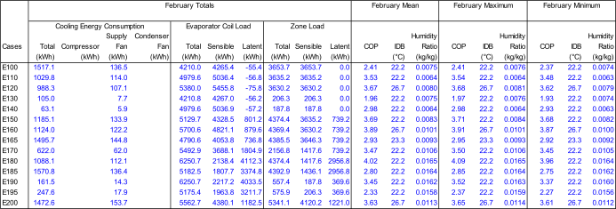


## Software Errors Discovered and/or Comparison Between Different Versions of the Same Software - Round 2

EnergyPlus Beta 5-14 included changes to fix the following problems which were identified in HVAC BESTEST Round 1:

- Reporting of cooling coil loads were corrected to account for run time during cycling operation.

- The methods of calculating SHR and coil bypass factor were modified to eliminate the problem where the dry coil cases reported  sensible coil loads which were slightly higher than the reported total coil loads. This error was causing small negative latent loads to be calculated for the dry coil cases.

During the second round of simulations with EnergyPlus Beta 5-14 the cooling
coil error identified during the first round of simulations was corrected to
account for cycling during each time step, and this brought the evaporator coil
loads closer to the range of results for the other programs; but the loads were
still higher than they should be. Another potential error was therefore
identified which may have been masked by the coil problem identified in Round
1:

- Although there was excellent agreement for zone total cooling load, the evaporator cooling coil load was larger than the zone cooling load plus fan heat.

- Also, the mean indoor dry bulb for Case E200 moved from 26.7C to 27.1C.

- The other problems identified in Round 1 still remained (low fan power, poor agreement in zone humidity ratio).


## Results - Round 2

Results from the second round of simulations with EnergyPlus Beta 5-14 are presented in Table 3.

**Table 3 - HVAC BESTEST Results for EnergyPlus Beta 5 Build 14**

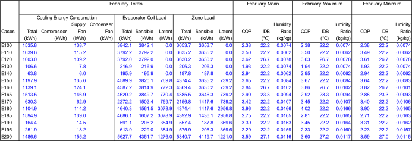


## Software Errors Discovered and/or Comparison Between Different Versions of the Same Software - Round 3

The suite of HVAC BESTEST cases were simulated again using EnergyPlus Version 1.0.0.011 (the first public release of Version 1.0, April 2001) which included the following changes from Beta 5-14:

- Modified method for calculating coil outlet conditions.  
- Changed to use of Double Precision throughout all of EnergyPlus. (This change was prompted by various issues not related to HVAC BESTEST.)  
- Added two output variables for tracking run time  
    - Window AC Fan RunTime Fraction  
    - Window AC Compressor RunTime Fraction  
- Added an output variable for coil latent load.  
- Added Draw-Thru Fan option to Window AC.  
- The name of the DX coil object was changed from COIL:DX:DOE2 to COIL:DX:BF-Empirical to better represent its algorithmic basis.

In addition, the following input file changes were made:

- Changed from blow-thru fan to draw-thru configuration.  
- Updated the DX coil object name to COIL:DX:BF-Empirical.

The following changes in results were observed:

- Indoor fan power consumption and fan heat decreased significantly from Round 2, moving farther below the analytical results.  
- Space cooling electricity consumption changed slightly from Round 2 and moved closer to the analytical results.  
- Mean indoor humidity ratio decreased compared to Round 2, moving farther away from the analytical results for most of the dry coil cases and moving closer to the analytical results for the wet coil cases.  
- Mean indoor dry bulb for Case E200 moved further out of range to 27.5C (the setpoint for this case is 26.7C).

In general, except for fan power and fan heat, the overall EnergyPlus Version 1.0.0.011 results compared much better to the HVAC BESTEST analytical results.


## Results - Round 3

Results from the third round of simulations with EnergyPlus Version 1.0.0.011 are presented in Table 4.

**Table 4 - HVAC BESTEST Results for EnergyPlus Version 1.0.0 Build 011**

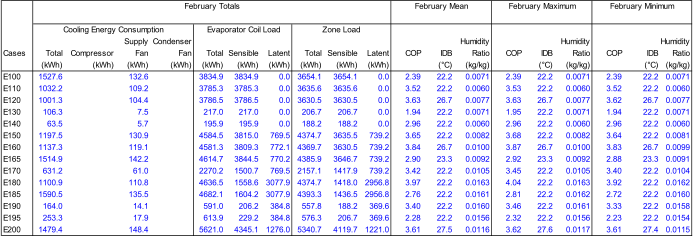


## Software Errors Discovered and/or Comparison Between Different Versions of the Same Software - Round 4

The suite of HVAC BESTEST cases were simulated again using EnergyPlus Version 1.0.0.023 (a maintenance release, June 2001) which included both input file and source code changes from Version 1.0.0.011.

Input file changes for Round 4:

- The equipment performance curves were refit from scratch using the Excel function LINEST. Data for the curves were taken from Table 1-6c of the specification (Table 26c of the standard). Curve fits were developed using SI units since this is what EnergyPlus requires. Previously, the DOE-2 curve coefficients from Neymark's work had been used, but the EIR curve fit done for DOE-2 applied only to the compressor input power. The EIR curve required for the EnergyPlus DX Coil model is based on compressor input power plus outdoor condenser fan power. The resulting curves used for the latest round of EnergyPlus simulations were as follows:

      > $CoolCapFT=a+b*wb+c*{wb}^2+d*edb+e*{edb}^2+f*wb+edb$ 
      > 
      > where
      >  
      > - wb = wet-bulb temperature of air entering the cooling coil  
      > - edb = dry-bulb temperature of the air entering the air-cooled condenser  
      > - a = 0.43863482  
      > - b = 0.04259180  
      > - c = 0.00015024  
      > - d = 0.00100248  
      > - e = -0.00003314  
      > - f = -0.00046664  
    
    - Data points were taken from first three columns of Table 1-6c of the specification (Table 26c of the standard). CoolCap data was normalized to ARI rated capacity of 8,181 W, i.e. CoolCapFT = 1.0 at 19.4 C wb and 35.0 C edb.

      > $EIRFT=a+b*wb+c*{wb}^2+d*edb+e*{edb}^2+f*wb*edb$  
      > 
      > where
      > 
      > - wb = wet-bulb temperature of air entering the cooling coil  
      > - edb = dry-bulb temperature of the air entering the air-cooled condenser  
      > - a = 0.77127580  
      > - b = -0.02218018  
      > - c = 0.00074086  
      > - d = 0.01306849  
      > - e = 0.00039124  
      > - f = -0.00082052  
      
    - edb and wb data points were taken from the first two columns of Table 1-6c of the specification (Table 26c of the standard). Energy input data points for corresponding pairs of edb and wb were taken from column labeled "Compressor Power" in Table 1-6c (Table 26c of the standard) with an additional 108 W added to them for outdoor fan power. EIR is energy input ratio [(compressor + outdoor fan power)/cooling capacity] normalized to ARI rated conditions, i.e. EIRFT = 1.0 at 19.4 C wb and 35.0 C edb.

- Relaxed the min/max limits of the performance curve independent variables, wb and edb, to allow extrapolation of CoolCapFT and  EIRFT outside the bounds of the equipment performance data given in the specification in accordance with comments in Section 1.3.2.2.3.2 of the specification (Section 5.3.1.10.3.4 of the standard).

- The BESTEST CDF curve was determined based on net total capacities of the unit while the EnergyPlus DX Coil model requires that the part load curve be expressed on the basis of gross sensible capacities. A new CDF curve was developed which was intended to be on a gross capacity basis, but a later review of this curve showed an error in the derivation. Further review showed that there is really little difference between net part load and gross part load, so the revised curve was then removed and the original CDF curve was used.

- The CDF curve (part load curve) was applied to the indoor fan operation where previously there was no input available for this. This change also required using the FAN:SIMPLE:ONOFF object instead of FAN:SIMPLE:CONSTVOLUME which has been used previously.

- Added one week of infiltration to the beginning of the Case E120 run period to prevent overdrying of the zone during the simulation warmup period. (See the results discussion below for more details.)

Relevant source code changes from Version 1.0.0.011 to Version 1.0.0.023:

- Standard air conditions for converting volume flow to mass flow in the indoor fan calculations were changed. The standard specifies that the volume flow rate is for dry air at 20C. EnergyPlus was using a dry-bulb of 25C at the initial outdoor barometric pressure with a humidity ratio of 0.014 kg/kg, although the EnergyPlus documentation indicated 21C and 101325 Pa was being used. EnergyPlus now calculates the initial air mass flow based on dry air at 20C at the standard barometric pressure for the specified altitude, and the documentation reflects this change.

- The specific heat for air throughout the air-side HVAC simulation was changed from a dry cp basis to a moist cp basis. Previously, a mixture of dry and moist cp had been used for various HVAC calculations.

- The heat of vaporization (hfg) for converting a zone latent load into a load in the HVAC system was changed.

- A new input field was added to FAN:SIMPLE:ONOFF to allow a CDF curve (part load curve) to be applied to the indoor fan operation where previously part load adjustments could only be applied to the compressor and outdoor fan.

- Changed the moisture initialization to use the initial outdoor humidity ratio to initialize all HVAC air nodes.

The following changes in results were observed:

- The sensible and latent coil loads improved and now track very close to the analytical results.

- The mean indoor temperature for Case E200 improved and now, along with rest of the cases, matches exactly with the analytical results.

- The mean indoor humidity ratio tracks the analytical values better, especially for the wet coil cases. For Case E120 however, the EnergyPlus humidity ratio (0.0038) was much less than the analytical value (0.0079). Introducing infiltration for the first week of January only and then turning infiltration off, eliminates this problem and gives a mean indoor humidity ratio for the month of February of 0.0081. Even though all nodes are initialized to the outdoor humidity ratio at the beginning of the simulation, conditions during the simulation warmup days overdry the zone for this case. Without the infiltration during the first week, there is no source of moisture to overcome the overdrying and establish the desired equilibrium.

- Indoor fan power consumption and fan heat match analytical results in most cases or are slightly less than analytical results.

- COP results changed but are still mixed. One problem may have to do with the basis of the CDF curve in BESTEST versus what EnergyPlus requires. The CDF curve was determined based on net total capacities of the unit while the EnergyPlus DX Coil model requires that the part load curve be expressed on the basis of gross sensible capacities.


## Results - Round 4

Results from the fourth round of simulations with EnergyPlus Version 1.0.0.023 are presented in Table 5.

**Table 5 - HVAC BESTEST Results for EnergyPlus Version 1.0.0 Build 023**

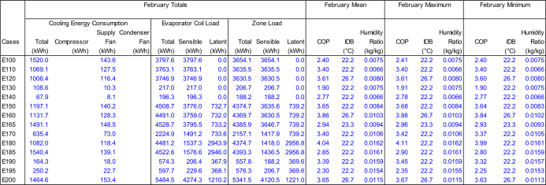


## Comparison of Changes that Occurred with Early Versions of EnergyPlus

This section documents the comparative changes that took place in results (see
Figures 2 through 9) as modifications were made to the EnergyPlus code or
changes were made in the modeling approach (see Table 6). The analytical
results shown in Figures 2 -9 represent the baseline against which all
EnergyPlus results were compared. Results for other intermediate versions of
EnergyPlus not discussed above have been included. EnergyPlus Version 1.0.0.023
(June 2001) was the most current public release of the software at the time
this section of the report was written.

**Table 6 - Summary of Pertinent EnergyPlus Changes that were Implemented**

<table>
<thead>
<tr>
<th>Version</th>
<th>Input File Changes</th>
<th>Code Changes</th>
</tr>
</thead>
<tr>
<td>Beta 5-12 thru Beta 5-14</td>
<td></td>
<td>DX coil calculations modified to account for cycling. Modified method of calculating SHR and coil bypass factor</td>
</tr>
<tr>
<td>Beta 5-15 thru Beta 5-18</td>
<td>Changed DX coil object names</td>
<td>Changed name of DX coil object from COIL:DX:DOE2 to COIL:DX:BF->Empirical to better represent its algorithmic basis (no impact on results)</td>
</tr>
<tr>
<td>Ver 1.0.0.001 thru Ver 1.0.0.011</td>
<td>Changed from blow-thru to draw-thru fan configuration</td>
<td>Changed to double precision.  Modified method of calculating coil outlet conditions. Added draw-thru fan option to WindowAC model</td>
</tr>
<tr>
<td>Ver 1.0.0.012 thru Ver 1.0.0.014</td>
<td>New equipment performance curves. Adjusted fan mass flow and efficiency to achieve desired mass flow and fan power</td>
<td></td>
</tr>
<tr>
<td>Ver 1.0.0.015 thru Ver 1.0.0.017</td>
<td>Went back to specified values for fan mass flow and efficiency</td>
<td>Partial implementation of moist cp. Fan power calculated using a standard initial density for volume to mass flow conversion</td>
</tr>
<tr>
<td>Ver 1.0.0.018 thru Ver 1.0.0.019</td>
<td>Changed basis of CDF curve from net to gross.  Opened up min/max limits for performance curves</td>
<td>Complete implementation of moist cp hfg calculation modified for latent loads</td>
</tr>
<tr>
<td>Ver 1.0.0.020 thru Ver 1.0.0.023</td>
<td>Went back to original CDF curve (modified curve used with Ver 1-19 was incorrect). Changed from FAN:SIMPLE:CONSTVOLUME to FAN:SIMPLE:ONOFF. Used CDF curve for fan power to account for cycling.</td>
<td>Implemented optional PLR curve for fan cycling. Changed moisture initializations to use outdoor humidity ratio.</td>
</tr>
</table>

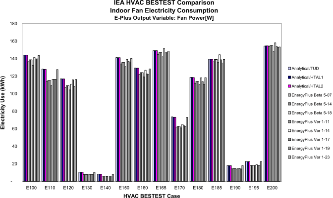

**Figure 2 Indoor Fan Power Results for Early Versions of EnergyPlus**

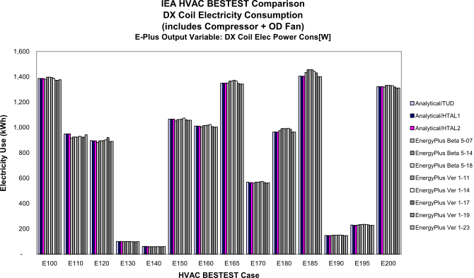

**Figure 3 Compressor Plus Outdoor Fan Electricity Consumption Results for Early Versions of EnergyPlus**

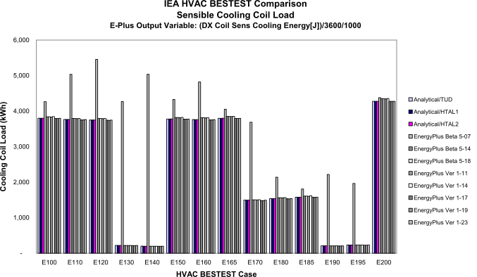

**Figure 4 Sensible Cooling Coil Load Results for Early Versions of EnergyPlus**

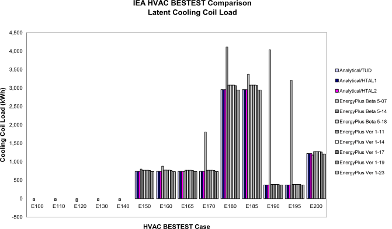

**Figure 5 Latent Cooling Coil Load Results for Early Versions of EnergyPlus**

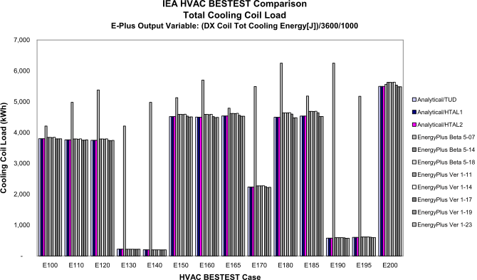

**Figure 6 Total Cooling Coil Load Results for Early Versions of EnergyPlus**

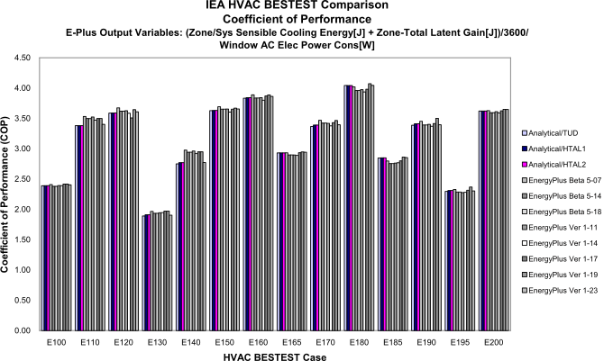

**Figure 7 Coefficient of Performance Results for Early Versions of EnergyPlus**

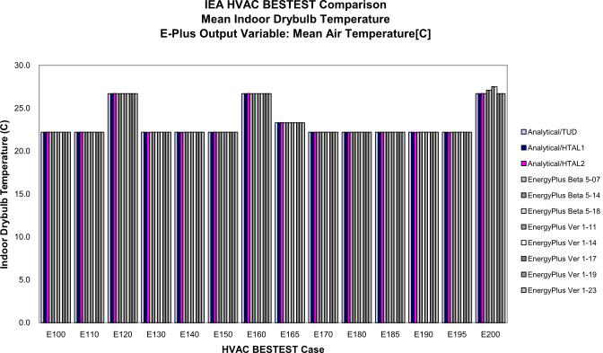

**Figure 8 Indoor Dry-Bulb Temperature for Early Versions of EnergyPlus**

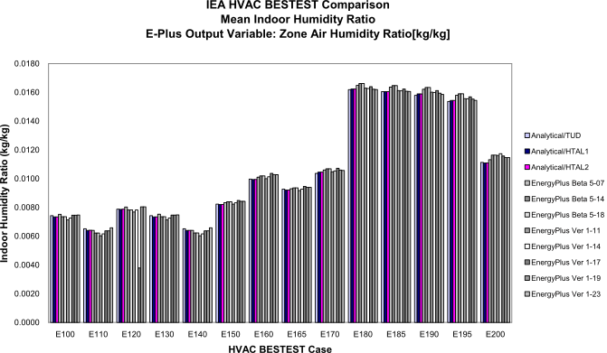

**Figure 9 Indoor Humidity Ratio Results for Early Versions of EnergyPlus**


### Results with Subsequent Releases of EnergyPlus

The IEA HVAC BESTEST workgroup has completed their activities and final results
are recorded in a report authored and released by NREL in January 2002 (Neymark
& Judkoff 2002). Since the completion of that study, further capabilities and
improvements have been added to EnergyPlus with new releases beginning in June
2002 (version 1.0.1) and continuing through the current release  (version 
{{ engine.config["EnergyPlusVersion"] }}).
Although some minor changes took place in version 1.0.2
and were later reversed in version 1.0.3 (see Table 7), the results for all
subsequent releases through EnergyPlus version 7.0.0 remained essentially
unchanged. Minor changes in results (<0.06%) in EnergyPlus Version 7.1.0.012
are discussed below in subsection titled "EnergyPlus 7.1.0.012 Changes."

Small changes in results of 0.47% or less occurred with EnergyPlus version
1.3.0.018 (see Table 8), due to a change in the algorithm for calculating the
cooling coil outlet conditions for the EnergyPlus ZoneHVAC:WindowAirConditioner
model.

Also with EnergyPlus version 1.3.0.018 a new SITE ATMOSPHERIC VARIATION input
object became available (beginning with EnergyPlus 3.0.0 the name of this
object changed to Site:HeightVariation) to simulate changes in outside air
temperature and wind speed that typically occur vertically across building
surfaces versus the outdoor air temperature and wind speed that are obtained
each hour from the weather file. Typically the meteorological wind speed is
measured in an open field at 10m above the ground and meteorological air
temperature is measured at 1.5m above ground level. To accommodate atmospheric
variation EnergyPlus now automatically calculates the local outdoor air
temperature and wind speed separately for each zone and surface exposed to the
outdoor environment. The zone centroid or surface centroid are used to
determine the height above ground. Only local outdoor air temperature and wind
speed are currently calculated because they are important factors for the
exterior convection calculation for surfaces and can also be factors in the
zone infiltration and ventilation calculations. Since ANSI/ASHRAE Standard 140
assumes that the temperature of the outside surfaces of the building are at the
outdoor dry-bulb temperature read from the weather file, the SITE ATMOSPHERIC
VARIATION temperature calculation feature was turned off by setting the air
temperature gradient coefficient to 0.0. The wind speed variation calculation
was also turned off by setting the wind speed profile exponent to 0.0 because
the building's exterior surfaces were configured to be near adiabatic with an
insulation layer of R-100 $\frac{m^2K}{W}$ . For Case E120 which had
infiltration, the wind variation had no effect since the infiltration rate was
set to a constant. The SITE ATMOSPHERIC VARIATION object was allowed to be
active for all of the test cases simulated with EnergyPlus 1.3.0.018 and later
versions with the following inputs:


    SITE ATMOSPHERIC VARIATION,
     0.0, !- Wind Speed Profile Exponent
     370, !- Wind Speed Profile Boundary Layer Thickness {m}
     0.0; !- Air Temperature Gradient Coefficient {K/m}


New output variables to report the surface exterior outdoor dry-bulb
temperature and surface exterior wind speed allow the user to track hourly
changes when the SITE ATMOSPHERIC VARIATION features are active.

**EnergyPlus 1.4.0.025 Changes**

With EnergyPlus version 1.4.0.025, a change was made to make the DX coil
sensible and latent outputs agree with the Window AC outputs. The total cooling
output did not change but there were small changes in sensible cooling (1.1% or
less) and latent cooling (-0.8% or less) for cases E150 through E200 where
there was a latent load on the cooling coil (see Table 9).

Simulations of the entire test suite with EnergyPlus Versions 1.4.0.025, 2.0.0.025 and 2.1.0.023 produced identical results.

**EnergyPlus Version 2.2.0.023 Changes**

EnergyPlus Version 2.2.0.023 results were the first to use the new TM2 weather
files which were provided with Standard 140-2011. All EnergyPlus results prior
to Version 2.2.0.023 used the TMY version of the weather files. Version
2.2.0.023 was simulated with both the old TMY weather and the new TM2 weather.
Differences in results when comparing Version 2.2.0.023 results back to Version
2.1.0.023 using the old TMY weather file were negligible (<0.0026%).

Section A1.2.1 of Standard 140-2011 indicates that

> there are small differences in solar radiation, wind speed, etc. between the two weather sets that result in a sensible loads difference of 0.2%-0.3% in cases with low internal gains [i.e., CE130, CE140, CE190 and CE195]. This percentage load difference is less [0.01%-0.04%] for other cases because they have higher internal loads.

Comparing results of Version 2.2.0.023(see Table 9) with TM2 weather to Version 2.1.0.023 results (see Table
10) with TMY weather showed differences of 0.46% or less for coil
sensible loads.

**EnergyPlus version 7.1.0.012 Changes**

A new feature regarding interpolation of rain and snow flags in the weather
data was added to this latest release of EnergyPlus. Even though the building
envelope was near adiabatic this had a small impact on exterior surface heat
transfer due to changes in the surface exterior film coefficient and
temperature difference across the surface. Since the weather data used for this
analysis did have hours when rain was occurring, very small changes on the
order of 0.06% or less occurred in annual zone heating or zone annual sensible
cooling in many test cases. The results obtained with EnergyPlus Versions
2.2.0.023, 3.0.0.028, 3.1.0.027, 4.0.0.024, 5.0.0.031, 6.0.0.023 and 7.0.0.036
are shown in Table 10. Results for EnergyPlus Version 7.1.0.012 are shown in
Table 11.

**EnergyPlus version 8.2.0 Changes**

For EnergyPlus version 8.2.0, the source code was converted from FORTRAN to C++. This produced negligible differences in results.

The results for EnergyPlus Version 8.2.0 were the same as with Version
7.1.0.012, 7.2.0.006, 8.0.0.008 and 8.1.0.009. Refer to Table 11 for
summary of results. 

**EnergyPlus version {{ engine.config["EnergyPlusVersion"] }} Results**

Refer to Table 12 for results from EnergyPlus version {{ engine.config["EnergyPlusVersion"] }}.


**Table 7 - Summary of Pertinent EnergyPlus Changes that were Implemented After EnergyPlus 1.0.0.023**


{{ engine.create_table_from_yaml("EnergyPlusChanges.yaml", ["Version", "Input-File-Changes", "Code-Changes"]) }}


**Table 8 - HVAC BESTEST Results for EnergyPlus Version 1.3.0 Build 018**

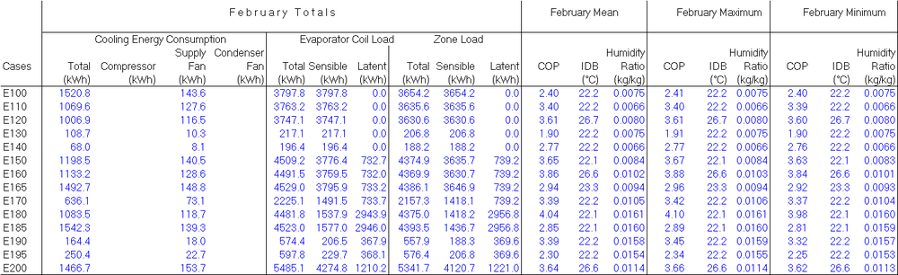

**Table 9 - Standard 140 HVAC Results for EnergyPlus Versions 1.4.0.025 Thru 2.1.0.023**

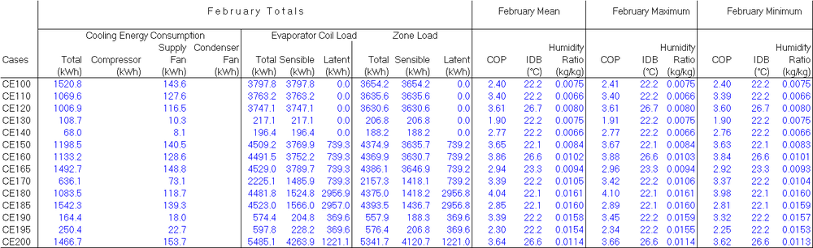

**Table 10 - Standard 140 HVAC Results for EnergyPlus Versions 2.2.0.023, 3.0.0.028, 3.1.0.027,4.0.0.024, 5.0.0.031, 6.0.0.023 and 7.0.0.036**

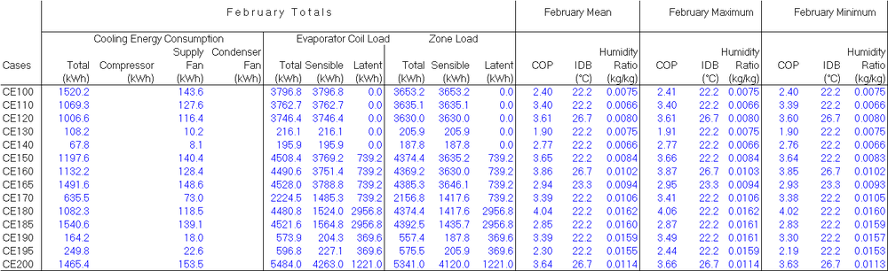

**Table 11 - Standard 140 HVAC Results for EnergyPlus Versions 7.1.0.012, 7.2.0.006, 8.0.0.008, 8.1.0.009**

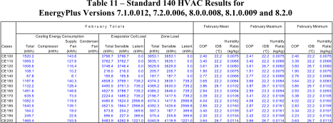

**Table 12 - Standard 140 HVAC Results for EnergyPlus Version {{ engine.config["EnergyPlusVersion"] }}**

{{ engine.create_table_from_excel_range("NREL RESULTS.xlsx", "L", "A19:T38") }}

# Results and Discussion

The results of the EnergyPlus Standard 140-2011 test cases CE100 - CE200 comparison with other whole building energy analysis programs that participated in the Standard 140-2011 comparison are summarized on a set of charts which can be found in Appendix A. The nomenclature for the various programs referred to on these charts along with the program author and modeler responsible for using the program as part of the project are presented below.

<table>
<tr>
  <th>**Code Name**</th>
  <th>**Authoring Organization**</th>
  <th>**Implemented by**</th>
  <th>**Abbreviation**</th>
</tr>
<tr>
  <td>CA-SIS V1</td>
  <td>Electricite de France, France</td>
  <td>Electricite de France, France</td>
  <td>CASIS/EDF</td>
</tr>
<tr>
  <td>CLIM2000 2.1.6</td>
  <td>Electricite de France, France</td>
  <td>Electricite de France, France</td>
  <td>CLIM2000/EDF</td>
</tr>
<tr>
  <td>DOE-2.1E-088</td>
  <td>LANL/LBNL/ESTSC, U.S.</td>
  <td>CIEMAT, Spain</td>
  <td>DOE21E/CIEMAT</td>
</tr>
<tr>
  <td>DOE-2.1E-133</td>
  <td>LANL/LBNL/JJH, U.S</td>
  <td>NREL/JNA, U.S.</td>
  <td>DOE21E/NREL</td>
</tr>
<tr>
  <td>TRNSYS 14.2-TUD with ideal controller model</td>
  <td>University of Wisconsin, U.S.; Technische Univ. Dresden, Germany</td>
  <td>Technische Univ. Dresden, Germany</td>
  <td>TRNSYS-ideal/TUD</td>
</tr>
<tr>
  <td>TRNSYS 14.2-TUD with real controller model</td>
  <td>University of Wisc., U.S.; Technische Univ. Dresden, Germany</td>
  <td>Technische Univ. Dresden, Germany</td>
  <td>TRNYS-real/TUD</td>
</tr>
<tr>
  <td>Analytical Solution</td>
  <td>Hochschule Technik &amp; Architektur, Luzern, Switzerland</td>
  <td>Hochschule Technik &amp; Architektur, Luzern, Switzerland</td>
  <td>Analytical/HTAL1</td>
</tr>
<tr>
  <td>Analytical Solution with realistic controller model</td>
  <td>Hochschule Technik &amp; Architektur, Luzern, Switzerland</td>
  <td>Hochschule Technik &amp; Architektur, Luzern, Switzerland</td>
  <td>Analytical/HTAL2</td>
</tr>
<tr>
  <td>Analytical Solution</td>
  <td>Technische Univ. Dresden, Germany</td>
  <td>Technische Univ. Dresden, Germany</td>
  <td>Analytical/TUD</td>
</tr>
<tr>
  <td>ENERGYPLUS {{ engine.config["EnergyPlusVersion"] }}</td>
  <td>U.S. Dept. of Energy</td>
  <td>GARD Analytics, Inc., U.S.</td>
  <td>ENERGY+/GARD</td>
</tr>
</table>


> LANL/LBNL: Los Alamos National Laboratory/Lawrence Berkeley Laboratory  
> ESTAC: Energy Science & Technology Software Center (at Oak Ridge National Laboratory)  
> CIEMAT: Centro de Investigaciones Energeticas, Medioambientales y
Tecnologicas  
> JJH: James J. Hirsch & Associates  
> NREL/JNA: National Renewable Energy Laboratory/J. Neymark & Associates

The charts in Appendix A which compare the results of EnergyPlus with other programs are presented in the following order:

- Total Space Cooling Electricity Consumption (compressor + outdoor fan + indoor fan)
- Indoor Fan Electricity Consumption
- Coefficient of Performance
- Total Cooling Coil Load
- Sensible Cooling Coil Load
- Latent Cooling Coil Load
- Zone Load (fan heat)
- Zone Total Cooling Load
- Zone Sensible Cooling Load
- Zone Latent Cooling Load
- Mean Indoor Dry-bulb Temperature
- Mean Indoor Humidity Ratio

A visual inspection of the charts in Appendix A indicates that
EnergyPlus compares very well to the analytical results for all of the charts. Quantitatively, the percent difference between EnergyPlus and average analytical results were as follows:


{{ engine.create_table_from_excel_range("HVAC-BESTEST Results-Charts.xlsx", "MaxDiffSummary", "A3:B15") }}


# Conclusions

EnergyPlus Version 1.0.0.023 and subsequent versions up through the most recent
release, EnergyPlus {{ engine.config["EnergyPlusVersion"] }}, were used to
model a range of HVAC equipment load specifications as specified in
*ANSI/ASHRAE Standard 140-2011 Standard Method of Test for the Evaluation of
Building Energy Analysis Computer Programs* which builds upon work done
previously as part of the *International Energy Agency Building Energy
Simulation Testand Diagnostic Method for HVAC Equipment Models (HVAC BESTEST).*
The ability of EnergyPlus to predict zone loads, cooling coil loads, cooling
equipment energy consumption and resulting zone environment was tested using a
test suite of 14 cases which included varying internal loads and outdoor
conditions. The results predicted by EnergyPlus for 14 different cases were
compared to results from 6 other whole building energy simulation programs that
participated in an International Energy Agency (IEA) project which concluded in
January 2002. Comparisons were also made with the results from three analytical
solutions. EnergyPlus results generally agreed to within 1.1% of the analytical
results except for the mean zone humidity ratio which agreed to within 2.7% for
high SHR cases but was within 0.65% for low SHR cases.

For another discussion of EnergyPlus results, please refer to Appendix B where
pertinent sections were extracted from the HVAC BESTEST Final Report (Neymark &
Judkoff 2001) prepared by Joel Neymark, J. Neymark & Associates, October 2001.
This discussion pertains to results obtained with EnergyPlus version 1.0.0.023.

The ANSI/ASHRAE Standard 140-2011 (and subsequently the IEA HVAC BESTEST suite)
is a very valuable testing tool which provides excellent benchmarks for testing
HVAC system and equipment algorithms versus the results of other international
building simulation programs. As discussed in this report, these tests allowed
the developers of EnergyPlus to identify errors in algorithms and improve
simulation accuracy.


# References

ANSI/ASHRAE 2004. Standard 140-2004, Standard Method of Test for the Evaluation of Building Energy Analysis Computer Programs, American Society of Heating, Refrigerating and Air-Conditioning Engineers, Atlanta, GA.

ANSI/ASHRAE 2011. Standard 140-2011, Standard Method of Test for the Evaluation of Building Energy Analysis Computer Programs, American Society of Heating, Refrigerating and Air-Conditioning Engineers, Atlanta, GA.

EnergyPlus 2014. U.S. Department of Energy, Energy Efficiency and
Renewable Energy, Office of Building Technologies.
[www.energyplus.gov](http://www.energyplus.gov)

Henninger, Robert H, Michael J Witte, and Drury B Crawley. 2004.
"Analytical and Comparative Testing of EnergyPlus using IEA HVAC BESTEST E100-E200 Test Suite," pp 855-863, *Energy and Buildings*, 36:8.

Neymark, J., and R. Judkoff. 2001. *International Energy Agency Solar Heating and Cooling Programme Task 22 Building Energy Simulation Test and Diagnostic Method for HVAC Equipment Models (HVAC BESTEST)*, National Renewable Energy Laboratory, Golden, Colorado, October 2001.

Neymark, J., and R. Judkoff. 2002. *International Energy Agency Building Energy Simulation Test and Diagnostic Method for HVAC Equipment Models (HVAC BESTEST) Volume 1: Cases E100 - E200*, National Renewable Energy Laboratory, Golden, Colorado, NREL/TP-550-30152, January 2002.

Witte, M. J., Henninger, R.H., Glazer, J., and D. B. Crawley. 2001.
"Testing and Validation of a New Building Energy Simulation Program," *Proceedings of Building Simulation 2001*, August 2001, Rio de Janeiro, Brazil, International Building Performance Simulation Association (IBPSA).

# Appendix A

**Charts Comparing EnergyPlus Version {{ engine.config["EnergyPlusVersion"] }} Results with Other Whole Building Energy Simulation Programs**  
**(Other Program Results Excerpted from ANSI/ASHRAE Standard 140-2011)


```{exec_python}

engine.write_chart('ColumnClustered', 'COP', 'HVAC BESTEST: Mean COP', '', 'COP', 'NREL RESULTS.xlsx', 'Data-COP', 'A4:K18', '(B4,A5:A18,B5:B18,1);(C4,A5:A18,C5:C18,2);(D4,A5:A18,D5:D18,3);(E4,A5:A18,E5:E18,4);(F4,A5:A18,F5:F18,5);(G4,A5:A18,G5:G18,6);(H4,A5:A18,H5:H18,7);(I4,A5:A18,I5:I18,8);(J4,A5:A18,J5:J18,9);(K4,A5:A18,K5:K18,10);', [])
engine.write_chart('ColumnClustered', 'COPvar', 'HVAC BESTEST: (Maximum - Minimum)/Mean COP', '', 'Fractional Variation', 'NREL RESULTS.xlsx', 'Data-COP', 'A21:K35', '(B21,A22:A35,B22:B35,1);(C21,A22:A35,C22:C35,2);(D21,A22:A35,D22:D35,3);(E21,A22:A35,E22:E35,4);(F21,A22:A35,F22:F35,5);(G21,A22:A35,G22:G35,6);(H21,A22:A35,H22:H35,7);(I21,A22:A35,I22:I35,8);(J21,A22:A35,J22:J35,9);(K21,A22:A35,K22:K35,10);', [])
engine.write_chart('ColumnClustered', 'delCOP', 'HVAC BESTEST: Mean COP Sensitivities', '', 'delta COP', 'NREL RESULTS.xlsx', 'Data-Delta', 'A94:K113', '(B94,A95:A113,B95:B113,1);(C94,A95:A113,C95:C113,2);(D94,A95:A113,D95:D113,3);(E94,A95:A113,E95:E113,4);(F94,A95:A113,F95:F113,5);(G94,A95:A113,G95:G113,6);(H94,A95:A113,H95:H113,7);(I94,A95:A113,I95:I113,8);(J94,A95:A113,J95:J113,9);(K94,A95:A113,K95:K113,10);', [])
engine.write_chart('ColumnClustered', 'Qtot', 'HVAC BESTEST: Total Space Cooling Electricity Consumption', '', 'Electricity Consumption (kWh)', 'NREL RESULTS.xlsx', 'Data-Electr', 'A9:K23', '(B9,A10:A23,B10:B23,1);(C9,A10:A23,C10:C23,2);(D9,A10:A23,D10:D23,3);(E9,A10:A23,E10:E23,4);(F9,A10:A23,F10:F23,5);(G9,A10:A23,G10:G23,6);(H9,A10:A23,H10:H23,7);(I9,A10:A23,I10:I23,8);(J9,A10:A23,J10:J23,9);(K9,A10:A23,K10:K23,10);', [])
engine.write_chart('ColumnClustered', 'dQtot', 'HVAC BESTEST: Total Space Cooling Electricity Sensitivities', '', 'delta Electricity Consumption (kWh)', 'NREL RESULTS.xlsx', 'Data-Delta', 'A4:K23', '(B4,A5:A23,B5:B23,1);(C4,A5:A23,C5:C23,2);(D4,A5:A23,D5:D23,3);(E4,A5:A23,E5:E23,4);(F4,A5:A23,F5:F23,5);(G4,A5:A23,G5:G23,6);(H4,A5:A23,H5:H23,7);(I4,A5:A23,I5:I23,8);(J4,A5:A23,J5:J23,9);(K4,A5:A23,K5:K23,10);', [])
engine.write_chart('ColumnClustered', 'Qcomp', 'HVAC BESTEST: Compressor Electricity Consumption', '', 'Electricity Consumption (kWh)', 'NREL RESULTS.xlsx', 'Data-Electr', 'A26:K40', '(B26,A27:A40,B27:B40,1);(C26,A27:A40,C27:C40,2);(D26,A27:A40,D27:D40,3);(E26,A27:A40,E27:E40,4);(F26,A27:A40,F27:F40,5);(G26,A27:A40,G27:G40,6);(H26,A27:A40,H27:H40,7);(I26,A27:A40,I27:I40,8);(J26,A27:A40,J27:J40,9);(K26,A27:A40,K27:K40,10);', [])
engine.write_chart('ColumnClustered', 'dQcomp', 'HVAC BESTEST: Total Compressor Electricity Sensitivities', '', 'delta Electricity Consumption (kWh)', 'NREL RESULTS.xlsx', 'Data-Delta', 'A26:K45', '(B26,A27:A45,B27:B45,1);(C26,A27:A45,C27:C45,2);(D26,A27:A45,D27:D45,3);(E26,A27:A45,E27:E45,4);(F26,A27:A45,F27:F45,5);(G26,A27:A45,G27:G45,6);(H26,A27:A45,H27:H45,7);(I26,A27:A45,I27:I45,8);(J26,A27:A45,J27:J45,9);(K26,A27:A45,K27:K45,10);', [])
engine.write_chart('ColumnClustered', 'Qidfan', 'HVAC BESTEST: Total Indoor (Supply) Fan Electricity Consumption', '', 'Electricity Consumption (kWh)', 'NREL RESULTS.xlsx', 'Data-Electr', 'A43:K57', '(B43,A44:A57,B44:B57,1);(C43,A44:A57,C44:C57,2);(D43,A44:A57,D44:D57,3);(E43,A44:A57,E44:E57,4);(F43,A44:A57,F44:F57,5);(G43,A44:A57,G44:G57,6);(H43,A44:A57,H44:H57,7);(I43,A44:A57,I44:I57,8);(J43,A44:A57,J44:J57,9);(K43,A44:A57,K44:K57,10);', [])
engine.write_chart('ColumnClustered', 'dQidfan', 'HVAC BESTEST: Indoor (Supply) Fan Electricity Sensitivities', '', 'delta Electricity Consumption (kWh)', 'NREL RESULTS.xlsx', 'Data-Delta', 'A48:K67', '(B48,A49:A67,B49:B67,1);(C48,A49:A67,C49:C67,2);(D48,A49:A67,D49:D67,3);(E48,A49:A67,E49:E67,4);(F48,A49:A67,F49:F67,5);(G48,A49:A67,G49:G67,6);(H48,A49:A67,H49:H67,7);(I48,A49:A67,I49:I67,8);(J48,A49:A67,J49:J67,9);(K48,A49:A67,K49:K67,10);', [])
engine.write_chart('ColumnClustered', 'Qodfan', 'HVAC BESTEST: Outdoor (Condenser) Fan Electricity Consumption', '', 'Electricity Consumption (kWh)', 'NREL RESULTS.xlsx', 'Data-Electr', 'A60:K74', '(B60,A61:A74,B61:B74,1);(C60,A61:A74,C61:C74,2);(D60,A61:A74,D61:D74,3);(E60,A61:A74,E61:E74,4);(F60,A61:A74,F61:F74,5);(G60,A61:A74,G61:G74,6);(H60,A61:A74,H61:H74,7);(I60,A61:A74,I61:I74,8);(J60,A61:A74,J61:J74,9);(K60,A61:A74,K61:K74,10);', [])
engine.write_chart('ColumnClustered', 'dQodfan', 'HVAC BESTEST: Outdoor (Condenser) Fan Electricity Sensitivities', '', 'delta Electricity Consumption (kWh)', 'NREL RESULTS.xlsx', 'Data-Delta', 'A70:K89', '(B70,A71:A89,B71:B89,1);(C70,A71:A89,C71:C89,2);(D70,A71:A89,D71:D89,3);(E70,A71:A89,E71:E89,4);(F70,A71:A89,F71:F89,5);(G70,A71:A89,G71:G89,6);(H70,A71:A89,H71:H89,7);(I70,A71:A89,I71:I89,8);(J70,A71:A89,J71:J89,9);(K70,A71:A89,K71:K89,10);', [])
engine.write_chart('ColumnClustered', 'QCtot', 'HVAC BESTEST: Total Coil Load', '', 'Load (kWh thermal)', 'NREL RESULTS.xlsx', 'Data-Loads', 'A74:K88', '(B74,A75:A88,B75:B88,1);(C74,A75:A88,C75:C88,2);(D74,A75:A88,D75:D88,3);(E74,A75:A88,E75:E88,4);(F74,A75:A88,F75:F88,5);(G74,A75:A88,G75:G88,6);(H74,A75:A88,H75:H88,7);(I74,A75:A88,I75:I88,8);(J74,A75:A88,J75:J88,9);(K74,A75:A88,K75:K88,10);', [])
engine.write_chart('ColumnClustered', 'dQCtot', 'HVAC BESTEST: Total Coil Load Sensitivities', '', 'delta Load (kWh thermal)', 'NREL RESULTS.xlsx', 'Data-Delta', 'A116:K135', '(B116,A117:A135,B117:B135,1);(C116,A117:A135,C117:C135,2);(D116,A117:A135,D117:D135,3);(E116,A117:A135,E117:E135,4);(F116,A117:A135,F117:F135,5);(G116,A117:A135,G117:G135,6);(H116,A117:A135,H117:H135,7);(I116,A117:A135,I117:I135,8);(J116,A117:A135,J117:J135,9);(K116,A117:A135,K117:K135,10);', [])
engine.write_chart('ColumnClustered', 'QCsens', 'HVAC BESTEST: Sensible Coil Load', '', 'Load (kWh thermal)', 'NREL RESULTS.xlsx', 'Data-Loads', 'A91:K105', '(B91,A92:A105,B92:B105,1);(C91,A92:A105,C92:C105,2);(D91,A92:A105,D92:D105,3);(E91,A92:A105,E92:E105,4);(F91,A92:A105,F92:F105,5);(G91,A92:A105,G92:G105,6);(H91,A92:A105,H92:H105,7);(I91,A92:A105,I92:I105,8);(J91,A92:A105,J92:J105,9);(K91,A92:A105,K92:K105,10);', [])
engine.write_chart('ColumnClustered', 'dQCsens', 'HVAC BESTEST: Sensible Coil Load Sensitivities', '', 'delta Load (kWh thermal)', 'NREL RESULTS.xlsx', 'Data-Delta', 'A138:K157', '(B138,A139:A157,B139:B157,1);(C138,A139:A157,C139:C157,2);(D138,A139:A157,D139:D157,3);(E138,A139:A157,E139:E157,4);(F138,A139:A157,F139:F157,5);(G138,A139:A157,G139:G157,6);(H138,A139:A157,H139:H157,7);(I138,A139:A157,I139:I157,8);(J138,A139:A157,J139:J157,9);(K138,A139:A157,K139:K157,10);', [])
engine.write_chart('ColumnClustered', 'QClat', 'HVAC BESTEST: Latent Coil Load', '', 'Load (kWh thermal)', 'NREL RESULTS.xlsx', 'Data-Loads', 'A108:K122', '(B108,A109:A122,B109:B122,1);(C108,A109:A122,C109:C122,2);(D108,A109:A122,D109:D122,3);(E108,A109:A122,E109:E122,4);(F108,A109:A122,F109:F122,5);(G108,A109:A122,G109:G122,6);(H108,A109:A122,H109:H122,7);(I108,A109:A122,I109:I122,8);(J108,A109:A122,J109:J122,9);(K108,A109:A122,K109:K122,10);', [])
engine.write_chart('ColumnClustered', 'dQClat', 'HVAC BESTEST: Latent Coil Load Sensitivities', '', 'delta Load (kWh thermal)', 'NREL RESULTS.xlsx', 'Data-Delta', 'A160:K179', '(B160,A161:A179,B161:B179,1);(C160,A161:A179,C161:C179,2);(D160,A161:A179,D161:D179,3);(E160,A161:A179,E161:E179,4);(F160,A161:A179,F161:F179,5);(G160,A161:A179,G161:G179,6);(H160,A161:A179,H161:H179,7);(I160,A161:A179,I161:I179,8);(J160,A161:A179,J161:J179,9);(K160,A161:A179,K161:K179,10);', [])
engine.write_chart('ColumnClustered', 'IDB', 'HVAC BESTEST: Mean Indoor Drybulb Temperature', '', 'Temperature (°C)', 'NREL RESULTS.xlsx', 'Data-TempHum', 'A9:K23', '(B9,A10:A23,B10:B23,1);(C9,A10:A23,C10:C23,2);(D9,A10:A23,D10:D23,3);(E9,A10:A23,E10:E23,4);(F9,A10:A23,F10:F23,5);(G9,A10:A23,G10:G23,6);(H9,A10:A23,H10:H23,7);(I9,A10:A23,I10:I23,8);(J9,A10:A23,J10:J23,9);(K9,A10:A23,K10:K23,10);', [])
engine.write_chart('ColumnClustered', 'IDBvar', 'HVAC BESTEST: (Maximum - Minimum)/Mean Indoor Drybulb Temperature', '', 'Fractional Variation', 'NREL RESULTS.xlsx', 'Data-TempHum', 'A26:K40', '(B26,A27:A40,B27:B40,1);(C26,A27:A40,C27:C40,2);(D26,A27:A40,D27:D40,3);(E26,A27:A40,E27:E40,4);(F26,A27:A40,F27:F40,5);(G26,A27:A40,G27:G40,6);(H26,A27:A40,H27:H40,7);(I26,A27:A40,I27:I40,8);(J26,A27:A40,J27:J40,9);(K26,A27:A40,K27:K40,10);', [])
engine.write_chart('ColumnClustered', 'Humrat', 'HVAC BESTEST: Mean Indoor Humidity Ratio', '', 'Humidity Ratio (kg/kg)', 'NREL RESULTS.xlsx', 'Data-TempHum', 'A45:K59', '(B45,A46:A59,B46:B59,1);(C45,A46:A59,C46:C59,2);(D45,A46:A59,D46:D59,3);(E45,A46:A59,E46:E59,4);(F45,A46:A59,F46:F59,5);(G45,A46:A59,G46:G59,6);(H45,A46:A59,H46:H59,7);(I45,A46:A59,I46:I59,8);(J45,A46:A59,J46:J59,9);(K45,A46:A59,K46:K59,10);', [])
engine.write_chart('ColumnClustered', 'Humratvar', 'HVAC BESTEST: (Maximum - Minimum)/Mean Indoor Humidity Ratio', '', 'Fractional Variation', 'NREL RESULTS.xlsx', 'Data-TempHum', 'A62:K76', '(B62,A63:A76,B63:B76,1);(C62,A63:A76,C63:C76,2);(D62,A63:A76,D63:D76,3);(E62,A63:A76,E63:E76,4);(F62,A63:A76,F63:F76,5);(G62,A63:A76,G63:G76,6);(H62,A63:A76,H63:H76,7);(I62,A63:A76,I63:I76,8);(J62,A63:A76,J63:J76,9);(K62,A63:A76,K63:K76,10);', [])
engine.write_chart('ColumnClustered', 'QZtot', 'HVAC BESTEST: Total Zone Load', '', 'Load (Wh thermal)', 'NREL RESULTS.xlsx', 'Data-Loads', 'A4:K18', '(B4,A5:A18,B5:B18,1);(C4,A5:A18,C5:C18,2);(D4,A5:A18,D5:D18,3);(E4,A5:A18,E5:E18,4);(F4,A5:A18,F5:F18,5);(G4,A5:A18,G5:G18,6);(H4,A5:A18,H5:H18,7);(I4,A5:A18,I5:I18,8);(J4,A5:A18,J5:J18,9);(K4,A5:A18,K5:K18,10);', [])
engine.write_chart('ColumnClustered', 'QZsens', 'HVAC BESTEST: Sensible Zone Load', '', 'Load (Wh thermal)', 'NREL RESULTS.xlsx', 'Data-Loads', 'A21:K35', '(B21,A22:A35,B22:B35,1);(C21,A22:A35,C22:C35,2);(D21,A22:A35,D22:D35,3);(E21,A22:A35,E22:E35,4);(F21,A22:A35,F22:F35,5);(G21,A22:A35,G22:G35,6);(H21,A22:A35,H22:H35,7);(I21,A22:A35,I22:I35,8);(J21,A22:A35,J22:J35,9);(K21,A22:A35,K22:K35,10);', [])
engine.write_chart('ColumnClustered', 'QZlat', 'HVAC BESTEST: Latent Zone Load', '', 'Load (Wh thermal)', 'NREL RESULTS.xlsx', 'Data-Loads', 'A38:K52', '(B38,A39:A52,B39:B52,1);(C38,A39:A52,C39:C52,2);(D38,A39:A52,D39:D52,3);(E38,A39:A52,E39:E52,4);(F38,A39:A52,F39:F52,5);(G38,A39:A52,G39:G52,6);(H38,A39:A52,H39:H52,7);(I38,A39:A52,I39:I52,8);(J38,A39:A52,J39:J52,9);(K38,A39:A52,K39:K52,10);', [])
engine.write_chart('ColumnClustered', 'Qfan', 'HVAC BESTEST: Sensible Coil Load - Zone Load (Fan Heat)', '', 'Load (kWh thermal)', 'NREL RESULTS.xlsx', 'Data-Loads', 'A126:K140', '(B126,A127:A140,B127:B140,1);(C126,A127:A140,C127:C140,2);(D126,A127:A140,D127:D140,3);(E126,A127:A140,E127:E140,4);(F126,A127:A140,F127:F140,5);(G126,A127:A140,G127:G140,6);(H126,A127:A140,H127:H140,7);(I126,A127:A140,I127:I140,8);(J126,A127:A140,J127:J140,9);(K126,A127:A140,K127:K140,10);', [])
engine.write_chart('ColumnClustered', 'QCL-QZL', 'HVAC BESTEST: Latent Coil Load - Latent Zone Load (Should = 0)', '', 'Load (kWh thermal)', 'NREL RESULTS.xlsx', 'Data-Loads', 'A56:K70', '(B56,A57:A70,B57:B70,1);(C56,A57:A70,C57:C70,2);(D56,A57:A70,D57:D70,3);(E56,A57:A70,E57:E70,4);(F56,A57:A70,F57:F70,5);(G56,A57:A70,G57:G70,6);(H56,A57:A70,H57:H70,7);(I56,A57:A70,I57:I70,8);(J56,A57:A70,J57:J70,9);(K56,A57:A70,K57:K70,10);', [])
```


# Appendix B

**EnergyPlus Discussion excerpted from HVAC BESTEST Final Report, (Neymark & Judkoff 2002)**

*(Note: The excerpted discussion that follows is based on HVAC BESTEST results produced with EnergyPlus 1.0.0.023.)*

**3.4.7 EnergyPlus (GARD Analytics)**

EnergyPlus is the program recently released by DOE, and is the building energy simulation program that will be supported by DOE. GARD Analytics (GARD) used EnergyPlus's "Window Air-Conditioner" system for its model.

GARD submitted eight iterations of simulation results. Table 3-4
describes input file and software modifications for each iteration; a single results set was submitted corresponding to changes described in each row of the table. Version Beta 5-07 was used for the initial results set.

**Table 3-4. Summary of EnergyPlus Changes that were Implemented**

<table>
<thead>
<tr><th>Version</th><th>Input File Changes</th><th>Code Changes</th></tr>
</thead>

<tr><td>Beta 5-12 thru Beta 5-14</td><td></td><td>DX coil calculations modified to account for cycling. Modified method of calculating SHR and coil bypass factor</td></tr>
<tr><td>Beta 5-15 thru Beta 5-18</td><td>Changed DX coil object names</td><td>Changed name of DX coil object from to better represent its algorithmic basis (no impact on results)</td></tr>
<tr><td>Ver 1-01 thru Ver 1-11</td><td>Changed from blow-thru to draw-thru fan configuration</td><td>Changed to double precision. Modified method of calculating coil outlet conditions.  Added draw-thru fan option to WindowAC model</td></tr>
<tr><td>Ver 1-12 thru Ver 1-14</td><td>New equipment performance curves. Adjusted fan mass flow and efficiency to achieve desired mass flow and fan power</td><td></td></tr>
<tr><td>Ver 1-15 thru Ver 1-17</td><td>Went back to specified values for fan mass flow and efficiency</td><td>Partial implementation of moist cp. Fan power calculated using a standard initial density for volume to mass flow conversion</td></tr>
<tr><td>Ver 1-18 thru Ver 1-19</td><td>Changed basis of CDF curve from net to gross Opened. up min/max limits for performance curves</td><td>Complete implementation of moist cp hfg calculation modified for latent loads </td></tr>
<tr><td>Ver 1-20 thru Ver 1-23</td><td>Went back to original CDF curve (modified curve used with Ver 1-19 was incorrect). Changed from FAN:SIMPLE:CONSTVOLUME to FAN:SIMPLE:ONOFF. Used CDF curve for fan power to account for cycling</td><td>Implemented optional PLR curve for fan cycling. Changed moisture initializations to use outdoor humidity ratio</td></tr>
</table>
  

The COP results for selected cases are summarized in Figure 3-9 for the EnergyPlus simulations and the TUD/HTAL analytical solution results. Note that the differences in results have been magnified in this figure by increasing the minimum value on the y-axis. Figure 3-10 includes specific results used to diagnose the causes of various disagreements. For the initial run with Beta 5-07, a number of disagreements with the analytical solution results were identified:

- Low indoor fan electrical power and fan heat; see Figure 3-10 results labeled "E170 Q ID Fan x 50"  
- Reported cooling coil loads apparently not adjusted for part load cycling (although actual load removed from the zone appears to have been adjusted); see Figure 3-10 results labeled "E140 Q Coil Total"  
- Sensible coil load about 1% higher than total coil load in the dry-coil cases.

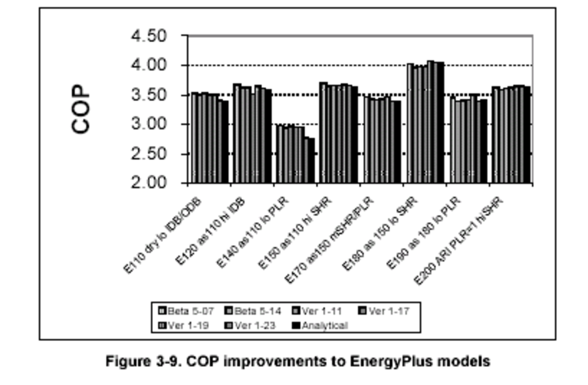

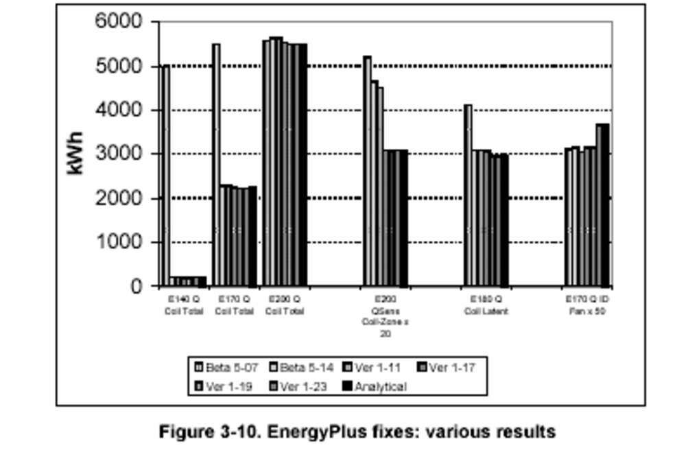

The process of correcting these disagreements engendered the
improvements to EnergyPlus described below.


*3.4.7.1 Reported Cooling Coil Loads Not Adjusted for Part Load Operation (up to 2500% effect on total coil load, negligible effect on energy consumption)*

In Figure 3-10 it is apparent from the Beta 5-07 results for total coil load (designated by the results labeled "Q Coil Total" for cases E140, E170, and E200) that the total cooling coil load is in error, with the greatest error found in cases with lower PLR. For Beta 5-14 the reporting of cooling coil loads was corrected to account for run time during cycling operation. Because for Beta 5-07 the actual load extracted from the space was already being adjusted for cycling (similar magnitude disagreements do not exist for COP of cases E140 and E170 in Figure 3-9), it appears that this problem had a negligible effect on COP and energy consumption.


*3.4.7.2 Modified Calculation of SHR and BF (1%-2% total consumption effect)*

The problem of sensible coil loads being greater than total coil loads was addressed by modifying the methods of calculating SHR and BF. With the reasonable assumption that the coil load reporting error had negligible effect on energy consumption, the difference in COP between Beta 5-14 and Beta 5-07 (shown in Figure 3-9) illustrates the 1%-2% energy consumption effect of this modification, with a similar degree of change for all cases.

Along with the remaining differences in COP that are apparent from Figure 3-9 for Beta 5-14, GARD noted a number of other disagreements that were previously masked:

-   Total coil loads were generally greater than for the analytical
    solutions (see "E200 Q Coil Total" results in Figure 3-10), and were 1%-2% greater than the sums of total zone load plus fan energy consumption
-   The mean IDB for E200 moved from 26.7°C (good) to 27.1°C (high)
-   Previous Beta 5-07 disagreements in terms of low ID fan power remain (see "E170 Q ID Fan × 50" results in Figure 3-10).

These disagreements with the analytical solutions prompted further
improvements, described below.


*3.4.7.3 Draw-through Fan, Double-Precision Variables, and Modified Calculation of Coil Outlet Conditions (0.1%-0.7% total consumption effect)*

Changes leading up to Version 1-11 included:

-   Modified method for calculating coil outlet conditions
-   Use of double precision throughout EnergyPlus (this change was
    prompted by other issues not related to HVAC BESTEST)
-   Addition of draw-through fan option to the window air-conditioner system.

Unfortunately, the effects of each of these changes were not
disaggregated in the testing. The combined effects of these changes are illustrated in Figure 3-10, where the results for Beta 5-14 are compared to those from Ver 1-11 for the set of results labeled "E200 Qsens Coil-Zone × 20" (the difference between sensible coil loads and sensible zone loads, magnified by a factor of 20). This set of results indicates a 5% change in the loads-based calculated fan heat. The overall effect of these changes on COP (and consumption) is <1% as illustrated in Figure 3-9 comparing the difference between results of Ver 1-11 and Beta 5-14.

Along with remaining differences in COP apparent for Ver 1-11 in Figure 3-9, GARD noted other remaining disagreements:

-   Total coil load remained 1%-2% greater than total zone load plus fan heat; similarly, the latent coil loads were 3% greater than for the analytical solution results-see "E180 Q Coil Latent" results in Figure 3-10
-   The mean IDB for E200 moved from 27.1°C (high) to 27.5°C (higher)
-   Previous Beta 5-07 disagreements of low ID fan power became worse compared with analytical solution results (see "E170 Q ID Fan × 50" results in Figure 3-10).


*3.4.7.4 Change to Standard Air Density for Fan Power Calculation (1% decrease in sensible coil load)*

For versions 1-12 through 1-17, results for changes to the software were aggregated with input file changes (notably the revision of system performance curves) so that assessing the effect of software
revisions-including the implementation of moist air specific heat and the use of standard air properties for calculating supply air mass flow rates-was difficult. However, in Figure 3-10 (for the set of results labeled "E200 Qsens Coil-Zone x 20" for Ver 1-17 versus Ver 1-11), the bulk of the remaining fan heat discrepancy appears to have been addressed in version 1-17 when the fan power calculation was changed to incorporate standard air density. This change appears to have resulted in a 1% change in sensible and total coil load (see results for "E200 Q Coil Total" in Figure 3-10). The effect on ID fan energy appears to be about 3% (see results for "E170 ID Fan Q x 50" for Ver 1-17 versus
Ver 1-11 in Figure 3-10), which translates to a 0.3% total power effect. The total electricity consumption effect would be greater in cases where the fan is running continuously (e.g. because of outside air requirements) even though the compressor is operating at lower part loads.


*3.4.7.5 Modified Heat of Vaporization for Converting Zone Latent Load into HVAC*

System Latent Load (0.4%-2.5% total consumption effect for wet coil
cases only) For versions 1-18 and 1-19, the effects of input file
changes were likely negligible (CDF curve revision), or the changes may have only affected specific cases. Enabling extrapolation of performance curves appears to have had the greatest effect in E120 - see Figure 3-9 results for E120, Ver 1-19 versus Ver 1-17. Therefore, changes in results for the wet coil cases are likely caused primarily by changes to the software. Versions 1-18 through 1-19 include the following changes to the software:

-   Changed heat of vaporization (hfg) used for converting a zone latent load into a coil load
-   Changed airside HVAC-model specific heat (cp) from dry air to moist air basis.

From Figure 3-10, the case E180 latent coil load results (designated by "E180 Q Coil Latent") for Ver 1-19 versus Ver 1-17 indicate that the fixes to the software improved the latent coil load results, with a 4% effect on latent coil load for E180 and the other wet coil cases (not shown here). In Figure 3-9, the difference between Ver 1-19 and Ver 1-17 illustrates the effect on COP, with the greatest effect (2.2%-2.5%) seen for cases with the lowest SHR (e.g., cases E180 and E190). GARD also noted that changing the airside HVAC model specific heat (cp) from a dry air to a moist air basis improved consistency between coil and zone
loads and removed other small discrepancies.


*3.4.7.6 ID Fan Power Did Not Include COP f(PLR) Degradation (2% total consumption effect at mid PLR)*

In Figure 3-10, using the set of results labeled "E170 Q ID Fan × 50" (fan energy use magnified by a factor of 50), it is apparent that indoor fan consumption was about 15% lower than the analytical solution results for case E170. This difference was traced to CDF not being accounted for in the ID fan consumption. Application of COP=f(PLR) was implemented by Ver 1-23, and better agreement with the analytical solution indoor fan energy consumption was the result. The difference in results for Ver 1-23 and Ver 1-19 in Figure 3-9 indicates a 2% effect on total energy consumption for the mid-PLR case E170, with a higher percentage of effect as PLR decreases (e.g., see Figure 3-9 results for case E140 or E190).


*3.4.7.7 General Comment About Improvements to EnergyPlus*

Each individual error found in EnergyPlus by itself did not have >3% effect on consumption results. However, these multiple errors do not necessarily compensate each other, and may be cumulative in some cases. Furthermore, some errors that have small effect on total consumption for these cases (e.g. fan model errors when the indoor fan is cycling with the compressor) could have larger effects on total consumption for other cases (e.g., if the indoor fan is operating continuously while the compressor cycles). Therefore, correcting these errors was important.


# Appendix C

**EnergyPlus Program Characteristics Summary "Proforma"**


**Program name (please include version number)**

*EnergyPlus Version {{ engine.config["EnergyPlusVersion"] }}*

**Your name, organisation, and country**

*Michael J. Witte, GARD Analytics, Inc., United States*

**Program status**

<table>
<tr><td></td><td> Public domain</td></tr>
<tr><td></td><td> Commercial:</td></tr>
<tr><td></td><td> Research</td></tr>
<tr><td>x</td><td> Other (please specify): *Government-sponsored, end-user license is no charge, other license types have fees associated with them*</td></tr>
</table>


**Solution method for unitary space cooling equipment**


<table>
<tr><td>x</td><td>Overall Performance Maps</td></tr>
<tr><td></td><td>Individual Component Models</td></tr>
<tr><td></td><td>Constant Performance (no possible variation with entering or ambient conditions)</td></tr>
<tr><td></td><td>Other (please specify)</td></tr>
</table>


**Interaction between loads and systems calculations**


<table>
<tr><td>x</td><td>Both are calculated during the same timestep</td></tr>
<tr><td></td><td>First, loads are calculated for the entire simulation period, then equipment performance is calculated separately</td></tr>
<tr><td></td><td>Other (please specify)</td></tr>
</table>


**Time step**


<table>
<tr><td></td><td>Fixed within code (please specify time step):</td></tr>
<tr><td>x</td><td>User-specified (please specify time step): 15 minute</td></tr>
<tr><td>x</td><td>Other (please specify): *program automatically adjusts HVAC time step, \<= envelope time step*</td></tr>
</table>


**Timing convention for meteorological data : sampling interval**


<table>
<tr><td></td><td>Fixed within code (please specify interval):</td></tr>
<tr><td>x</td><td>User-specified: *one hour*</td></tr>
</table>


**Timing convention for meteorological data : period covered by first
record**


<table>
<tr><td>x</td><td>Fixed within code (please specify period or time which meteorological record covers): *0:00 - 1:00*</td></tr>
<tr><td></td><td>User-specified</td></tr>
</table>


**Meteorological data reconstitution scheme**


<table>
<tr><td></td><td>Climate assumed stepwise constant over sampling interval</td></tr>
<tr><td>x</td><td>Linear interpolation used over climate sampling interval</td></tr>
<tr><td></td><td>Other (please specify)</td></tr>
</table>


**Output timing conventions**


<table>
<tr><td></td><td>Produces spot predictions at the end of each time step</td></tr>
<tr><td></td><td>Produces spot output at end of each hour</td></tr>
<tr><td>x</td><td>Produces average outputs for each hour (please specify period to which value relates): *user-specified, hourly data is average or sum for previous hour, can specify output at each time step*</td></tr>
</table>


**Treatment of zone air**


<table>
<tr><td>x</td><td>Single temperature (i.e. good mixing assumed)</td></tr>
<tr><td></td><td>Stratified model</td></tr>
<tr><td></td><td>Simplified distribution model</td></tr>
<tr><td></td><td>Full CFD model</td></tr>
<tr><td></td><td>Other (please specify)</td></tr>
</table>


**Zone air initial conditions**


<table>
<tr><td>x</td><td>Same as outside air</td></tr>
<tr><td></td><td>Other (please specify)</td></tr>
</table>


**Internal gains output characteristics**


<table>
<tr><td></td><td>Purely convective</td></tr>
<tr><td></td><td>Radiative/Convective split fixed within code</td></tr>
<tr><td>x</td><td>Radiative/Convective split specified by user: *100% convective for these tests*</td></tr>
<tr><td></td><td>Detailed modeling of source output</td></tr>
</table>


**Mechanical systems output characteristics**


<table>
<tr><td>x</td><td>Purely convective</td></tr>
<tr><td></td><td>Radiative/Convective split fixed within code</td></tr>
<tr><td>a</td><td>Radiative/Convective split specified by user: *for types of equipment not used in these tests*</td></tr>
<tr><td></td><td>Detailed modeling of source output</td></tr>
</table>


**Control temperature**


<table>
<tr><td>x</td><td>Air temperature</td></tr>
<tr><td></td><td>Combination of air and radiant temperatures fixed within the code</td></tr>
<tr><td></td><td>User-specified combination of air and radiant temperatures</td></tr>
<tr><td></td><td>User-specified construction surface temperatures</td></tr>
<tr><td></td><td>User-specified temperatures within construction</td></tr>
<tr><td></td><td>Other (please specify)</td></tr>
</table>


**Control properties**


<table>
<tr><td>x</td><td>Ideal control as specified in the user's manual</td></tr>
<tr><td></td><td>On/Off thermostat control</td></tr>
<tr><td></td><td>On/Off thermostat control with hysteresis</td></tr>
<tr><td></td><td>On/Off thermostat control with minimum equipment on and/or off durations</td></tr>
<tr><td></td><td>Proportional control</td></tr>
<tr><td></td><td>More comprehensive controls (please specify)</td></tr>
</table>


**Performance Map: characteristics**


<table>
<tr><td></td><td>Default curves</td></tr>
<tr><td>  x  </td><td>Custom curve fitting</td></tr>
<tr><td></td><td>Detailed mapping not available</td></tr>
<tr><td></td><td>Other (please specify)</td></tr>
</table>


**Performance Map: independent variables**


<table>
<tr><td></td><td>Entering Drybulb Temperature: *program calculates adjustments internally*</td></tr>
<tr><td>  x  </td><td>Entering Wetbulb Temperature</td></tr>
<tr><td>  x  </td><td>Outdoor Drybulb Temperature</td></tr>
<tr><td>  x  </td><td>Part Load Ratio</td></tr>
<tr><td>  a  </td><td>Indoor Fan Air Flow Rate: *always=1, because fan always operates at rated conditions *</td></tr>
<tr><td></td><td>Other (please specify)</td></tr>
</table>


**Performance Map: dependent variables**


<table>
<tr><td>  x  </td><td>Coefficient of Performance (or other ratio of load to electricity consumption)</td></tr>
<tr><td>  x  </td><td>Total Capacity</td></tr>
<tr><td></td><td>Sensible Capacity: *program calculates internally based on user-specified nominal SHR*</td></tr>
<tr><td></td><td>Bypass Factor: *program calculates internally based on nominal SHR and current conditions*</td></tr>
<tr><td>  x  </td><td>Other (please specify): *indoor fan power (function of PLR)*</td></tr>
</table>


**Performance Map: available curve fit techniques**


<table>
<tr><td>  x  </td><td>Linear, f(one independent variable): *flow fraction curves set to constant=1*</td></tr>
<tr><td>  x  </td><td>Quadratic, f(one independent variable) : *PLF-FPLR (cycling loss)*</td></tr>
<tr><td>  a  </td><td>Cubic, f(one independent variable):</td></tr>
<tr><td>  a  </td><td>Bi-Linear, f(two independent variables)</td></tr>
<tr><td>  x  </td><td>Bi-Quadratic, f(two independent variables): *CAP-FT, EIR-FT*</td></tr>
<tr><td></td><td>Other (please specify)</td></tr>
</table>


**Performance Map: extrapolation limits**


<table>
<tr><td>  x  </td><td>Limits independent variables: *27.4 \<= ODB \<=48.1; 13.0 \<= EWB \<= 23.7, 0.0 \<= PLR \<= 1.0*</td></tr>
<tr><td></td><td>Limits dependent variables</td></tr>
<tr><td></td><td>No extrapolation limits</td></tr>
<tr><td></td><td>Extrapolation not allowed</td></tr>
<tr><td></td><td>Other (please specify)</td></tr>
</table>


**Cooling coil and supply air conditions model**


<table>
<tr><td></td><td>Supply air temperature = apparatus dew point (ADP); supply air humidity ratio = humidity ratio of saturated air at ADP</td></tr>
<tr><td></td><td>Bypass factor model using listed ADP data</td></tr>
<tr><td>x</td><td>Bypass factor model with ADP calculated from extending condition line: *nominal BF is calculated from user-specified nominal SHR*</td></tr>
<tr><td>x</td><td>Fan heat included</td></tr>
<tr><td></td><td>More comprehensive model (please specify)</td></tr>
</table>


**Disaggregation of fans' electricity use directly in the simulation and output**


<table>
<tr><td>x</td><td>Indoor fan only</td></tr>
<tr><td></td><td>Outdoor fan only</td></tr>
<tr><td></td><td>Both indoor and outdoor fans disaggregated in the output</td></tr>
<tr><td></td><td>None - disaggregation of fan outputs with separate calculations by the user</td></tr>
</table>


**Economizer settings available (for E400 series)**


<table>
<tr><td>x</td><td>Temperature</td></tr>
<tr><td>x</td><td>Enthalpy</td></tr>
<tr><td>x</td><td>Compressor Lockout</td></tr>
<tr><td></td><td>Other (please specify)</td></tr>
</table>


