```{exec_python}

engine.load_sheet("NREL Xcomp Charts-With Revised Performance Curves-NoLinks.xlsx", "Tdata")
engine.load_sheet("NREL Xcomp Charts-With Revised Performance Curves-NoLinks.xlsx", "Rdata")
engine.load_sheet("NREL Xcomp Charts-With Revised Performance Curves-NoLinks.xlsx", "Qdata")
```


EnergyPlus Version {{ engine.config["EnergyPlusVersion"] }}  
Automatically Generated {{ engine.month_year() }}


Prepared for:

U.S. Department of Energy  
Energy Efficiency and Renewable Energy  
Office of Building Technologies  
Washington, D.C.

Originally Prepared by:

Robert H. Henninger and Michael J. Witte  
GARD Analytics, Inc.  
115 S. Wilke Road, Suite 105  
Arlington Heights, IL 60005-1500  
USA  
www.gard.com

This report was developed based upon funding from the Alliance for Sustainable Energy, LLC, Managing and Operating Contractor for the National Renewable Energy Laboratory for the U.S. Department of Energy. Any opinions, findings, and conclusions or recommendations expressed in this material are those of the author(s) and do not necessarily reflect those of the sponsor. Earlier work was supported by the Ernest Orlando Lawrence Berkeley National Laboratory, and by the National Energy Technology Laboratory and the National Renewable Energy Laboratory by
subcontract through the University of Central Florida/Florida Solar Energy Center.

This report was prepared as an account of work sponsored by an agency of the United States Government. Neither the United States Government nor any agency thereof, nor any of their employees, makes any warranty, express or implied, or assumes any legal liability or responsibility for the accuracy, completeness, or usefulness of any information, apparatus, product, or process disclosed, or represents that its use would not infringe privately owned rights. Reference herein to any specific commercial product, process, or services by trade name, trademark,manufacturer, or otherwise does not necessarily constitute or imply its endorsement, recommendation, or favoring by the United States Government or any agency thereof. The views and opinions of authors expressed herein do not necessarily state or reflect those of the United States Government or any agency thereof.


# Test Objectives and Overview

## Introduction


This report describes the modeling methodology and results for testing done of HVAC system tests designated as Cases CE300 through CE545 of ANSI/ASHRAE Standard 140-2011 titled *Standard Method of Test for the Evaluation of Building Energy Analysis Computer Programs* with the EnergyPlus Version {{ engine.config["EnergyPlusVersion"] }}. The results of EnergyPlus are also compared with results from several other whole building energy analysis programs that simulated the same test cases.


## Test Type: Comparative - HVAC

Comparative tests compare a program to itself or to other simulation programs. This type of testing accomplishes results on two different levels, both validation and debugging.

From a validation perspective, comparative tests will show that EnergyPlus is computing solutions that are reasonable compared to other energy simulation programs. This is a very powerful method of assessment, but it is no substitute for determining if the program is absolutely correct since it may be just as equally incorrect as the benchmark program or programs. The biggest strength of comparative testing is the ability to compare any cases that two or more programs can model. This is much more flexible than analytical tests when only specific solutions exist for simple models, and much more flexible than empirical tests when only specific data sets have been collected for usually a very narrow band of operation. The ANSI/ASHRAE Standard 140-2011 procedures discussed below take advantage of the comparative test method and have the added advantage that for the specific tests included in Standard 140 have already been run by experts of the other simulation tools.

Comparative testing is also useful for field-by-field input debugging. Energy simulation programs have so many inputs and outputs that the results are often difficult to interpret. To ascertain if a given test passes or fails, engineering judgment or hand calculations are often needed. Field by field comparative testing eliminates any calculational requirements for the subset of fields that are equivalent in two or more simulation programs. The equivalent fields are exercised using equivalent inputs and relevant outputs are directly compared.


## Test Suite: ANSI/ASHRAE Standard 140-2011 Space Cooling Performance Tests

The tests described in Sections 5.3.3 and 5.3.4 of ANSI/ASHRAE Standard 140-2011, *Standard Method of Test for the Evaluation of Building Energy Analysis Computer Programs* (ASHRAE 2011), were performed using the EnergyPlus program. This standard builds upon work previously performed by the International Energy Agency (IEA) Solar Heating and Cooling Programme Task 22 *Building Energy Simulation Test and Diagnostic Method for HVAC Equipment Models (HVAC BESTEST), Volume 2: Cases E300 – E545*, (Neymark & Judkoff 2004) which contains the results of the IEA HVAC BESTEST activities. The results of EnergyPlus testing with HVAC BESTEST Volume 1, Cases E100-E200 which are limited to steady-state cases that have analytical solutions have been previously reported in *EnergyPlus Testing with HVAC Equipment Performance Tests CE100 to CE200* *from ANSI/ASHRAE Standard 140-2004* (Henninger, et. al. 2008). The testing done with EnergyPlus actually started as part of the IEA HVAC BESTEST activities before these HVAC equipment performance testing procedures were incorporated into ANSI/ASHRAE Standard 140. The discussion which follows chronicles the experiences that occurred while using EnergyPlus to simulate the HVAC BESTEST suite, the same tests that are now part of ANSI/ASHRAE Standard 140-2011 where the test cases are referenced as Cases CE300 – CE545. In the following discussions where sections, tables or figures are referenced from Standard 140-2011, the corresponding reference in the HVAC BESTEST specification follows in parentheses. Beginning with the results for EnergyPlus version 2.2.0.023, the new “CE” test case designation is used in tables and charts while for all previous versions of EnergyPlus results the “E” test case designation from HVAC BESTEST was used.

HVAC BESTEST Cases CE300-CE545 represent an extension of the first set of tests reported in HVAC BESTEST Volume 1 but are tests that include hourly dynamic effects that cannot be solved analytically. These new cases test a program’s modeling capabilities on the working-fluid side of the coil, but in hourly dynamic context over an expanded range of performance conditions. These cases also test the ability to model outside air mixing, infiltration, thermostat set up, overload conditions, and various economizer control schemes.

The following tests were performed with EnergyPlus as specified in ANSI/ASHRAE Standard 140-2011, Sections 5.3.3 and 5.3.4:

-   Case CE300 – Base Case Building and Mechanical System

-   Basic Tests - Cases CE310, CE320, CE330, CE340, CE350 and CE360 as
    described in Section 5.3.4.1 of Standard 140 (Section 1.3.2 of the
    HVAC BESTEST specification)

-   Economizer Series - Cases CE400, CE410, CE420, CE430, and CE440 as
    described in Section 5.3.4.2 of Standard 140 (Section 1.3.3 of
    HVAC BESTEST specification)

-   No Outside Air Series – Cases CE500, CE510, CE520, CE522, CE525,
    CE530, CE540 and CE545 as described in Section 5.3.4.3 of Standard
    140 (Section 1.3.4 of HVAC BESTEST specification)

Further specifics regarding how test parameters varied between tests are presented in Table 1.


### Case CE300 – Base Case Building and Mechanical System

The basic test building (Figure 1) is a square 196 $m^2$  single zone (14
m wide x 14 m long x 3 m high) with no interior partitions and no windows. The building is intended as a near-adiabatic cell with cooling load driven by user specified internal gains, infiltration and outside air. Material properties are described below. For further details refer to Section 5.3.3 of Standard 140.

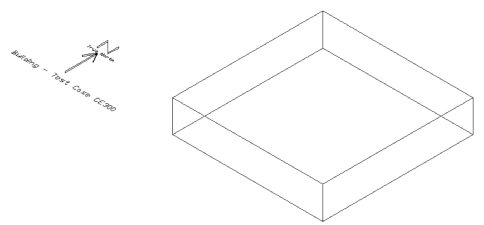

**Figure 1 Base Building (Case CE300) - Isometric View of Southeast Corner**

  
**Wall, Roof and Floor Construction:**

<table>
<col align="left"/>
<col align="right"/>
<col align="right"/>
<col align="right"/>
<col align="right"/>
<thead>
<tr>
  <th>Element</th>
  <th>k ( $\frac{W}{mK}$ )</th>
  <th>Thickness (m)</th>
  <th>U ( $\frac{W}{m^2K}$ )</th>
  <th>R ( $\frac{m^2K}{W}$ )</th>
</tr>
</thead>
<tr>
  <td>Int. Surface Coeff.</td>
  <td></td>
  <td></td>
  <td>8.290</td>
  <td>0.121</td>
</tr>
<tr>
  <td>Insulation</td>
  <td>0.00308</td>
  <td>1.000</td>
  <td>0.00308</td>
  <td>325.000</td>
</tr>
<tr>
  <td>Ext. Surface Coeff.</td>
  <td></td>
  <td></td>
  <td>29.300</td>
  <td>0.034</td>
</tr>
<tr>
  <td></td>
  <td></td>
  <td></td>
  <td></td>
  <td></td>
  <td></td>
  <td></td>
</tr>
<tr>
  <td>Overall, air-to-air</td>
  <td></td>
  <td></td>
  <td>0.00308</td>
  <td>325.155</td>
</tr>
</table>


 
**Opaque Surface Radiative Properties:**

<table>
<tr>
  <th></th>
  <th>Interior Surface</th>
  <th>Exterior Surface</th>
</tr>
<tr>
  <td>Solar Absorptance</td>
  <td>0.6</td>
  <td>0.1</td>
</tr>
<tr>
  <td>Infrared Emittance</td>
  <td>0.9</td>
  <td>0.9</td>
</tr>
</table>


**Infiltration:** None

**Internal Load:** 
- 18,758 W sensible peak, scheduled over day, 100% convective
- 1,466 W latent; scheduled over day

**Mechanical System:** Simple unitary vapor compression cooling system with air cooled condenser and indoor evaporator coil, 100% convective air system, single speed, draw-through air distribution fan which operates continuously, outdoor fans cycle on/off with compressor, no cylinder unloading, no hot gas bypass, crankcase heater and other auxiliary energy = 0. Performance characteristics at ARI rating conditions of 35.00°C outdoor dry-bulb, 26.67°C cooling coil entering dry-bulb and 19.44°C cooling coil entering wet-bulb are:

- Gross Total Capacity 33.28 kW
- Gross Sensible Capacity 26.04 kW
- Airflow 1.888 $\frac{m^3}{s}$  
- Compressor Power 10 kW
- Indoor Fan Power 1242 W
- Outdoor Fan Power 930 W
- COP 3.045
- SHR 0.78245

There is a non-proportional-type thermostat, heat always off, cooling on if zone air temperature >25.0°C and heat extraction rate is assumed to equal the maximum capacity of the equipment for the hour’s environmental conditions. For further specifications and equipment’s full-load and part load performance map, see Section 5.3.3.10.3 and Tables 31a and 31b of Standard 140 (Section 1.3.1.4.3 and Tables 1-7a and 1-7b in HVAC BESTEST specification).


### Weather Data

An hourly weather data file for a one year period labeled CE300.TM2 in TMY2 format was provided first with Standard 140-2007 and then later with Standard 140-2011 for use with all of the test cases. This weather file was converted to EnergyPlus format using the latest EnergyPlus weather conversion program and was then used to generate the EnergyPlus Version 2.2.0.023 results and other results reported later. Prior to EnergyPlus Version 2.2.0.023, all testing was done in accordance with the IEA HVAC BESTEST specification which used a weather file labeled NEW-ORL.TM2 which was in TMY2 format and contained the same weather set as the CE300.TM2 weather file.


### Simulation and Reporting Period

Simulations for all cases were run for a full 12 month period. Results for each test case were to be entered into spreadsheets provided with Standard 140.


**Table 1 Standard 140-2011 Space Cooling Performance Test Case Descriptions**

<table>
 <tr >
  <td rowspan=3 >Case #</td>
  <td colspan=5 >Zone</td>
  <td rowspan=3 >Comments</td>
 </tr>
 <tr >
  <td colspan=2 >Internal Gains</td>
  <td >Setpoint</td>
  <td >Infil.</td>
  <td>Outside Air</td>
 </tr>
 <tr >
  <td >Sensible (W)</td>
  <td >Latent (W)</td>
  <td >Cooling (C)</td>
  <td >(ACH)</td>
  <td >(ACH)</td>
 </tr>
 <tr >
  <td colspan=7 >**Basic Tests**</td>
 </tr>
 <tr >
  <td >CE300 Base Case (15% OA)</td>
  <td >mid</td>
  <td >mid</td>
  <td >25</td>
  <td >0</td>
  <td >1.734</td>
  <td >Supply fans run continuously, compressor cycles, expanded performance data.</td>
 </tr>
 <tr >
  <td >CE310 High latent load</td>
  <td >mid</td>
  <td >high</td>
  <td >25</td>
  <td >0</td>
  <td >1.734</td>
  <td >Tests high latent load vs CE300</td>
 </tr>
 <tr >
  <td >CE320 Infiltration</td>
  <td >mid</td>
  <td >mid</td>
  <td >25</td>
  <td >11.558</td>
  <td >0</td>
  <td >Tests high infiltration vs CE300, CE350</td>
 </tr>
 <tr >
  <td >CE330 Outside Air</td>
  <td >mid</td>
  <td >mid</td>
  <td >25</td>
  <td >0</td>
  <td >11.558</td>
  <td >Tests high outside air vs CE300, CE350</td>
 </tr>
 <tr >
  <td >CE340 Infil./OA Interaction</td>
  <td >mid</td>
  <td >mid</td>
  <td >25</td>
  <td >5.779</td>
  <td >5.779</td>
  <td >Tests infil./OA interaction vs CE300 and CE320 or CE330.</td>
 </tr>
 <tr >
  <td >CE350 Thermostat set up</td>
  <td >mid</td>
  <td >mid</td>
  <td >25/35</td>
  <td >0</td>
  <td >1.734</td>
  <td >Tests thermostat set up control vs CE300.</td>
 </tr>
 <tr >
  <td >CE360 Undersize</td>
  <td >high</td>
  <td >mid</td>
  <td >25</td>
  <td >0</td>
  <td >1.734</td>
  <td >Tests overload system vs CE300.</td>
 </tr>
 <tr >
  <td colspan=7 >**Economizer Series**</td>
 </tr>
 <tr >
  <td >CE400 Temperature control</td>
  <td >mid</td>
  <td >mid</td>
  <td >25</td>
  <td >0</td>
  <td >1.734</td>
  <td >Tests temperature economizer vs CE300.</td>
 </tr>
 <tr >
  <td >CE410 Compressor lockout</td>
  <td >mid</td>
  <td >mid</td>
  <td >25</td>
  <td >0</td>
  <td >1.734</td>
  <td >Tests CE400 with compressor lockout vs CE300</td>
 </tr>
 <tr >
  <td >CE420 ODB limit</td>
  <td >mid</td>
  <td >mid</td>
  <td >25</td>
  <td >0</td>
  <td >1.734</td>
  <td >Tests ODB limit (20C) control vs CE300.</td>
 </tr>
 <tr >
  <td >CE430 Enthalpy limit</td>
  <td >mid</td>
  <td >mid</td>
  <td >25</td>
  <td >0</td>
  <td >1.734</td>
  <td >Tests enthalpy control vs CE300</td>
 </tr>
 <tr >
  <td >CE440 Outdoor enthalpy limit</td>
  <td >mid</td>
  <td >mid</td>
  <td >25</td>
  <td >0</td>
  <td >1.734</td>
  <td >Tests outdoor enthalpy limit control vs CE300.</td>
 </tr>
 <tr >
  <td colspan=7 >**No Outside Air Series**</td>
 </tr>
 <tr >
  <td >CE500 Base Case (0% OA)</td>
  <td >mid2</td>
  <td >mid2</td>
  <td >25</td>
  <td >0</td>
  <td >0</td>
  <td >Wet coil, supply fan cycles with compressor</td>
 </tr>
 <tr >
  <td >CE510 High PLR</td>
  <td >high2</td>
  <td >high2</td>
  <td >25</td>
  <td >0</td>
  <td >0</td>
  <td >Wet coil, high PLR</td>
 </tr>
 <tr >
  <td >CE520 Low EDB = 15C</td>
  <td >mid2</td>
  <td >mid2</td>
  <td >15</td>
  <td >0</td>
  <td >0</td>
  <td >Wet coil, tests EDB = 15C</td>
 </tr>
 <tr >
  <td >CE522 Low EDB = 20C</td>
  <td >mid2</td>
  <td >mid2</td>
  <td >20</td>
  <td >0</td>
  <td >0</td>
  <td >Wet coil, tests EDB = 20C</td>
 </tr>
 <tr >
  <td >CE525 High EDB</td>
  <td >mid2</td>
  <td >mid2</td>
  <td align=right >35</td>
  <td >0</td>
  <td >0</td>
  <td >Wet coil, tests EDB = 35C</td>
 </tr>
 <tr >
  <td >CE530 Dry coil</td>
  <td >mid2</td>
  <td  >0</td>
  <td >25</td>
  <td >0</td>
  <td >0</td>
  <td >Dry coil</td>
 </tr>
 <tr >
  <td >CE540 Dry coil, low EDB</td>
  <td >mid2</td>
  <td >0</td>
  <td >15</td>
  <td >0</td>
  <td >0</td>
  <td >Dry coil, tests EDB = 15C</td>
 </tr>
 <tr >
  <td >CE545 Dry coil, high EDB</td>
  <td >mid2</td>
  <td >0</td>
  <td >35</td>
  <td >0</td>
  <td >0</td>
  <td >Dry coil, tests EDB = 35C</td>
 </tr>
 <tr >
  <td >Abbreviations:</td>
  <td colspan=4>PLR = part load ratio</td>
  <td colspan=2 >ODB = outdoor dry-bulb temp</td>
 </tr>
 <tr >
  <td >&nbsp;</td>
  <td colspan=4>EDB = cooling coil entering dry-bulb temp</td>
  <td colspan=2 >OA = outside air</td>
 </tr>
 <tr >
  <td >Notes:</td>
  <td colspan=6 >&quot;mid&quot; internal gains schedules are relatively high daytime and low nighttime</td>
 </tr>
 <tr >
  <td ><span
  > </span></td>
  <td colspan=6 >&quot;mid2&quot; is similar to &quot;mid&quot; but with 0 cooler-month internal gains and 0 cooling at ODB &lt; 55F for OA</td>
 </tr>
 <tr >
  <td >&nbsp;</td>
  <td colspan=6 >&quot;high&quot; and &quot;high2&quot; are greater loads relative to &quot;mid&quot; and &quot;mid2&quot;</td>
 </tr>
</table>
 
  

# Modeler Report

The material included in this section up through Section 2.15 is a slightly revised copy of the Modeler Report which was prepared by GARD Analytics at NREL’s request for inclusion in their final report to the International Energy Agency (IEA) Tool Evaluation and Improvement Experts Group. It documents the modeling approach taken to simulate the HVAC BESTEST cases using EnergyPlus. During the early rounds of testing only cases E300 - E360 were analyzed. Beginning with Round 3C, the results for cases E400 – E440 and cases E500 – E545 were also included. Several iterations occurred during which the input models were fine tuned, bugs were found in EnergyPlus and software changes were made. This Modeler Report was written to chronicle these experiences and demonstrate how the HVAC BESTEST test suite can be used in the development of whole building energy analysis software.


## Modeling Methodology

For modeling of the simple unitary vapor compression cooling system, the EnergyPlus Unitary Air-to-Air Heat Pump model was utilized. The Heat Pump model was the only DX cooling system available in EnergyPlus which allowed both a draw-thru fan configuration and an economizer. Since cooling only was required during the simulation, the heat pump controls were set to prevent operation of the heat pump in the heating mode. As configured for this test series, the following heat pump modules were exercised: a DX cooling coil, an indoor fan and outside air mixer.

The building envelope loads and internal loads were calculated each hour to determine the zone load that the mechanical HVAC system must satisfy. The EnergyPlus DX coil model then uses performance information at rated conditions along with curve fits for variations in total capacity, energy input ratio and part load fraction to determine performance at part load conditions. Sensible/latent capacity splits are determined by the rated sensible heat ratio (SHR) and the apparatus dew-point/bypass factor approach.

The EnergyPlus DX coil model requires that the rated total cooling capacity, rated sensible heat ratio, rated COP and rated air volume flow rate be specified for the ARI rating condition of 35 C outside air dry-bulb, 26.7 C entering evaporator dry-bulb and 19.4 C entering evaporator wet-bulb. Since the equipment performance data as provided in the BESTEST specification dated March 2002 did not include equipment performance data at the ARI rating point, the performance data were first curve fit and then the resulting curves were used to determine the cooling capacity, energy consumption and SHR at the ARI rating condition. In September 2002, revised specifications were provided which included performance at the ARI rating point. The revised rating point was used in Round 3B and later.

Five equipment performance curves were required:

1)  The Total Cooling Capacity Modifier Curve (function of temperature)
    is a bi-quadratic curve with two independent variables: wet-bulb
    temperature of the air entering (EWB) the cooling coil, and outdoor
    dry-bulb temperature (ODB) of the air entering the air-cooled
    condenser. The output of this curve is multiplied by the rated total
    cooling capacity to give the total cooling capacity at specific
    temperature operating conditions (i.e., at temperatures different
    from the rating point temperatures).

2)  The Total Cooling Capacity Modifier Curve (function of flow
    fraction) is a quadratic curve with the independent variable being
    the ratio of the actual air flow rate across the cooling coil to the
    rated air flow rate (i.e., fraction of full load flow). The output
    of this curve is multiplied by the rated total cooling capacity and
    the total cooling capacity modifier curve (function of temperature)
    to give the total cooling capacity at the specific temperature and
    air flow conditions at which the coil is operating.

3)  The Energy Input Ratio (EIR) Modifier Curve (function of
    temperature) is a bi-quadratic curve with two independent variables:
    wet-bulb temperature of the air entering (EWB) the cooling coil, and
    outdoor dry-bulb temperature (ODB) of the air entering the
    air-cooled condenser. The output of this curve is multiplied by the
    rated EIR (inverse of the rated COP) to give the EIR at specific
    temperature operating conditions (i.e., at temperatures different
    from the rating point temperatures).

4)  The Energy Input Ratio (EIR) Modifier Curve (function of flow
    fraction) is a quadratic curve with the independent variable being
    the ratio of the actual air flow rate across the cooling coil to the
    rated air flow rate (i.e., fraction of full load flow). The output
    of this curve is multiplied by the rated EIR (inverse of the rated
    COP) and the EIR modifier curve (function of temperature) to give
    the EIR at the specific temperature and airflow conditions at which
    the coil is operating.

5)  The part load fraction correlation (function of part load ratio) is
    a quadratic curve with the independent variable being part load
    ratio (sensible cooling load / steady-state sensible cooling
    capacity). The output of this curve is used in combination with the
    rated EIR and EIR modifier curves to give the “effective” EIR for a
    given simulation time step. The part load fraction correlation
    accounts for efficiency losses due to compressor cycling.


## Modeling Assumptions


### Thermostat Control

Ideal thermostat control was assumed with no throttling range.


### ARI Rating Point Conditions

During the early rounds of testing the first draft versions of the modeling specifications (October 2001 and March 2002) did not give the equipment performance at the ARI rated conditions of 35 C outside air dry-bulb, 26.7 C entering evaporator dry-bulb and 19.4 C entering evaporator wet-bulb. The conditions closest to the ARI rating conditions were 35/26.7/18.33C. A set of performance curves for use with EnergyPlus were therefore developed using the data provided for 35/26.7/18.33C as the nominal point. This, however, caused problems with the simulation (see Section 2.4.1). These initial curve fits were then used to interpolate and determine the following estimated ARI standard rated
performance:


**Interpolated From Revised Test Spec**

<table>
<tr>
  <th></th>
  <th>Interpolated</th>
  <th>From Revised Test Spec</th>
</tr>
<tr>
  <td>Rated gross cooling capacity</td>
  <td>33.084 kW</td>
  <td>33.28 kW</td>
</tr>
<tr>
  <td>Rated sensible heat ratio</td>
  <td>0.8043</td>
  <td>0.7825</td>
</tr>
<tr>
  <td>Rated COP</td>
  <td>3.028</td>
  <td>3.328</td>
</tr>
<tr>
  <td>Rated energy consumption</td>
  <td>10.924 kW</td>
  <td>10.0 kW</td>
</tr>
</table>


The rated energy consumption includes the compressor (9.994 kW) and outdoor condenser fans (0.93 kW). These values were revised in Round 3B when an updated HVAC BESTEST E300-E400-E500 test specification was issued in September 2002 which contained the manufacturer performance data for ARI standard conditions.


### DX Coil Curve Fits

Equipment performance data from Table 1-7a Equipment Full Load Performance with Gross Capacities (SI Units) of the BESTEST specification were used to develop the input parameters required for the EnergyPlus performance curves. Although performance data for a range of entering dry-bulb temperatures (EDB) is given in the table, the EnergyPlus performance curves were developed for the ARI rated condition of 26.67 C EDB. The resulting coefficients are presented below. These curves were normalized based on the estimated performance (see discussion in Section 2.2.2) at the standard ARI rating conditions of 35C outside air dry-bulb, 26.7 C entering evaporator dry-bulb and 19.4 C entering evaporator wet-bulb.

1. Total cooling capacity modifier curve (function of temperature)

    Form: Bi-quadratic curve

    >  $curve=a+b*EWB+c*{EWB}^2+d*ODB+e*{ODB}^2+f*EWB*ODB$
      
    Independent variables: wet-bulb temperature of the air entering (EWB) the cooling coil, and dry-bulb temperature of the air entering (ODB) the air-cooled condenser.

    > - a = 0.953441251
    > - b = -0.000938414
    > - c = 0.000932679
    > - d = -0.001299058
    > - e = -2.67478E-05
    > - f = -0.000306850  

    These values were revised in Round 3B.

2. Total cooling capacity modifier curve (function of flow fraction)

    Form: Quadratic curve
  
    > $curve=a+b*FF+c*{FF}^2$  
  
    Independent variables: ratio of the actual air flow rate across the cooling coil to the rated air flow rate (i.e., fraction of full load flow, FF).

    Since indoor fan always operates at constant volume flow, modifier will be 1.0, therefore:

    > - a = 1.0
    > - b = 0.0
    > - c = 0.0  

3. Energy input ratio (EIR) modifier curve (function of temperature)

    Form: Bi-quadratic curve
    
    > $curve=a+b*EWB+c*{EWB}^2+d*ODB+e*{ODB}^2+f*EWB*ODB$ 
    
    Independent variables: wet-bulb temperature of the air entering (EWB) the cooling coil, and dry-bulb temperature of the air entering (ODB) the air-cooled condenser.

    > - a = 0.537791667
    > - b = -0.000895849
    > - c = -0.000154388
    > - d = 0.012700780
    > - e = 0.000162966
    > - f = -0.000157276  

    These values were revised in Round 3B.

4. Energy input ratio (EIR) modifier curve (function of flow fraction)

    Form: Quadratic curve
    
    > $curve=a+b*FF+c*{FF}^2$ 

    Independent variables: ratio of the actual air flow rate across the cooling coil to the rated air flow rate (i.e., fraction of full load flow, FF).

    Since indoor fan always operates at constant volume flow, modifier will be 1.0, therefore:

    > - a = 1.0
    > - b = 0.0
    > - c = 0.0  

5) Part load fraction correlation (function of part load ratio, PLR)

    Form: Quadratic curve

    >  $curve=a+b*PLR+c*{PLR}^2$  
    
    Independent variable: part load ratio (sensible cooling load/steady state sensible cooling capacity)

    Part load performance specified in Figure 1-3 of the BESTEST specification, therefore:

    > - a = 0.771
    > - b = 0.229
    > - c = 0.0  


## Modeling Difficulties


### Building Envelope Construction

The BESTEST specification for the building envelope indicates that the exterior walls, roof and floor are made up of one opaque layer of insulation (R=325, SI units) with differing radiative properties for the interior surface and exterior surface (ref. Table 1-5 of BESTEST specification). To allow the interior and exterior surface radiative properties to be set at different values, the exterior wall, roof and floor had to be simulated as two insulation layers, each with an R=162.5. The EnergyPlus description for this construction was as follows:


    Material:NoMass,
     INSULATION-EXT, !- Name
     VerySmooth, !- Roughness
     162.5, !- Thermal Resistance {m2-K/W}
     0.9000, !- Thermal Absorptance
     0.1000, !- Solar Absorptance
     0.1000; !- Visible Absorptance

    Material:NoMass,
     INSULATION-INT, !- Name
     VerySmooth, !- Roughness
     162.5, !- Thermal Resistance {m2-K/W}
     0.9000, !- Thermal Absorptance
     0.6000, !- Solar Absorptance
     0.6000; !- Visible Absorptance

    CONSTRUCTION,
     LTWALL, !- Name
     INSULATION-EXT, !- Outside layer
     INSULATION-INT; !- Layer 2


### Compressor and Condenser Fan Breakout

The rated COP required as input by the EnergyPlus DX coil model requires that the input power be the combined power for the compressor and condenser fans. As such, there are no separate input variables or output variables available for the compressor or condenser fan. The only output variable available for reporting in EnergyPlus is the DX coil electricity consumption which includes compressor plus condenser fan.


## Software Errors Discovered and/or Comparison Between Different Versions of the Same Software – Round 1


### Rated Performance and Bypass Factor Calculations

As mentioned in Section 2.2.2, the initial set of performance data was based on using 18.33C EWB, because this was directly available from the performance data tables. Even though the EnergyPlus documentation stated clearly that the rated performance inputs were to be entered for rated ARI conditions (19.4C EWB), it was wrongly assumed that a different entering condition could be used as long as the performance curves were normalized around the same condition. This caused a fatal error, because EnergyPlus attempts to calculate a rated bypass factor by starting with entering air at ARI standard conditions and then applying the nominal total capacity and SHR. Using a data point corresponding to a drier entering condition caused the leaving air to be supersaturated and the bypass factor search algorithm failed. Further investigation by the EnergyPlus development team resulted in source code changes for additional error checking in the DX coil routines and an improved error message to help users know how to solve this problem.


### Temperatures Out of Control

The draft BESTEST specification dated March 2002 did not contain any empirical results or results from other programs to compare to, so it is not possible to determine for certain if any software errors existed. One potential problem was identified however. For cases E300 and E310, the air-conditioner did not maintain the space temperature at the required 25 C. There were hours during periods of low or no internal loads, November 6 for example, when the air-conditioner did not cycle on to provide cooling and subsequently the space temperature rose to as high as 30 C. A change request (bug report) was submitted to the EnergyPlus development team to determine why the air-conditioner would not operate during low part load conditions.


## Results –Round 1

Results from the Round 1 modeling with EnergyPlus Version 1.0.2.004 are presented below.

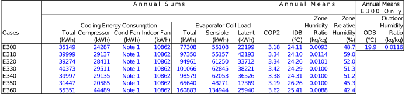

Note 1: Condenser fan energy consumption included with compressor energy consumption; cannot break out.


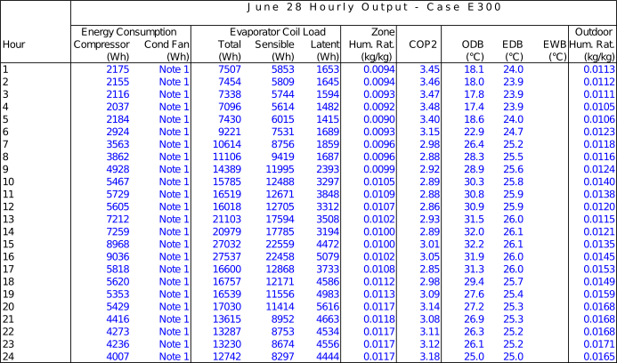

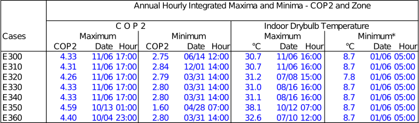

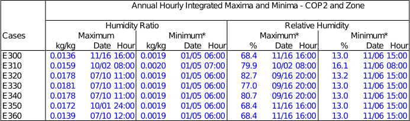


## Software Errors Discovered and/or Comparison Between Different Versions of the Same Software – Round 3A

*Note: Other whole building energy analysis programs participating in this IEA comparative study had gone through two rounds of testing while EnergyPlus, which joined in later, had only gone through one round of testing. To be consistent with results reported by other program participants, the round of testing with EnergyPlus as reported below is being referred to as Round 3 testing and results.*

As a result of testing done during Round 1, two changes were made to the EnergyPlus code to correct algorithm errors and bring results more in line with what the BESTEST specification called for.

- Latent Cooling Loads

    In EnergyPlus Version 1.0.3.001, an $h_g$  function replaced the $h_{fg}$ function in the psychrometric routines. This change produced only small changes in the results.

- Dry Coil Conditions

    An error found during Round 1 with calculating outlet conditions (humidity ratio and temperature) from the cooling coil when dry conditions (no dehumidification) occurred was corrected in EnergyPlus Version 1.0.3.005. This error was causing the cooling coil not to operate during certain hours. The change made to the code to correct this problem in EnergyPlus Version 1.0.3.005 corrected the zone temperature control problems in cases E300 and E310 and corrected the low minimum COP that had occurred in case E350.


## Results – Round 3A

Results from the Round 3A modeling with EnergyPlus Version 1.0.3.005 are presented below.

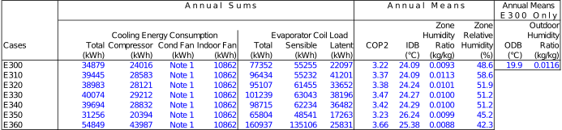

Note 1: Condenser fan energy consumption included with compressor energy
consumption; cannot break out.

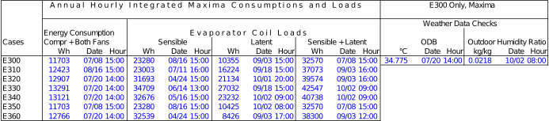

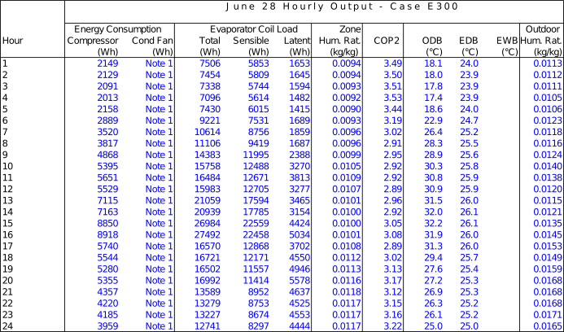

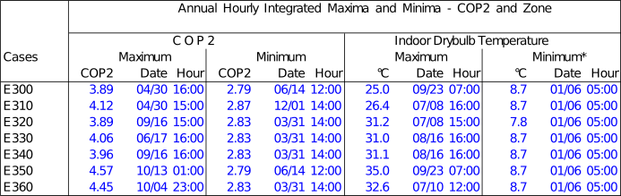

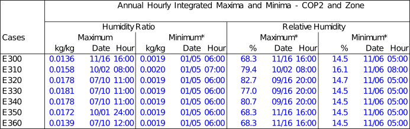


## Software Errors Discovered and/or Comparison Between Different Versions of the Same Software – Round 3B

With the issuance of a revised draft HVAC BESTEST specification in September 2002 with equipment performance data for the ARI rating condition of 35C ODB/26.7C EDB/19.4C EWB, a new set of performance curve fits were generated for EnergyPlus based on this new data point. The coefficients for those curves that changed are shown below. The
coefficients for the other EnergyPlus curves as described in Section 2.2.3 remained unchanged.

1. Total cooling capacity modifier curve (function of temperature)

    Form: Bi-quadratic curve

    > $curve=a+b*EWB+c*{EWB}^2+d*ODB+e*{ODB}^2+f*EWB*ODB$
    
    Independent variables: wet-bulb temperature of the air entering (EWB) the cooling coil, and dry-bulb temperature of the air entering (ODB) the air-cooled condenser.

    > - a = 0.952735372
    > - b = -0.000932873
    > - c = 0.000927172
    > - d = -0.001291389
    > - e = -2.65899E-05
    > - f = -0.000305038

2. Energy input ratio (EIR) modifier curve (function of temperature)

    Form: Bi-quadratic curve

    > $curve=a+b*EWB+c*{EWB}^2+d*ODB+e*{ODB}^2+f*EWB*ODB$
    
    Independent variables: wet-bulb temperature of the air entering (EWB) the cooling coil, and dry-bulb temperature of the air entering (ODB) the air-cooled condenser.

    > - a = 0.535665387
    > - b = -0.000900699
    > - c = -0.000155223
    > - d = 0.012769543
    > - e = 0.000163848
    > - f = -0.000158128


    Use of the new curve fits lowered the annual cooling energy consumption slightly which resulted in a correspondingly small increase in the COP.


## Results – Round 3B

Results from the Round 3B modeling with EnergyPlus Version 1.0.3.005 are presented below.

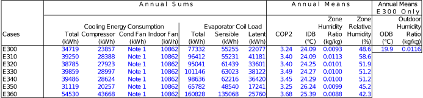

Note 1: Condenser fan energy consumption included with compressor energy
consumption; cannot break out.


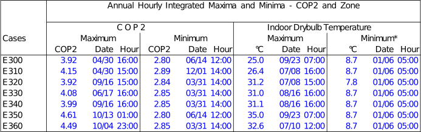

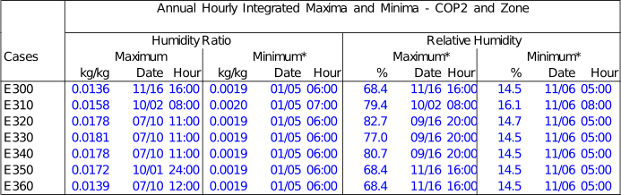


## Software Errors Discovered and/or Comparison Between Different Versions of the Same Software – Round 3C

### Change in Weather Data Interpolation

In a report by NREL dated July 11, 2002 prepared for the IEA SHC Task 22, Subtask A2 working group, the results of the second round of testing for Cases E300 – E545 were presented and discussed. One of the comments
made by the authors was that the outdoor dry-bulb temperature reported by EnergyPlus seemed to be one hour out of phase with some of the other programs and that the method of “weather averaging” that EnergyPlus used
may be at fault. EnergyPlus does not do any weather averaging but rather
uses *weather interpolation* to estimate the value of outdoor parameters
when simulation time steps less than one hour are used. The EnergyPlus
simulations performed for the HVAC BESTEST E300 – E360 test series used
a TIMESTEP = 4 which means the building envelope time step is 15 minutes, or 4 time steps per hour. In EnergyPlus Version 1.0.3.006, the interpolation method was changed and better agreement resulted with what other programs were using.


## Results – Round 3C

Results from the Round 3C modeling with EnergyPlus Version 1.0.3.006 are
presented below. During Round 3C testing the following additional tests cases were simulated for the first time: cases E400 – E440 and cases E500 – E545. The following comments are provided regarding certain input parameters, assumptions and results related to modeling of these new cases with EnergyPlus:

- Case E410 Compressor Lockout
    Case E410 required the air conditioning compressor to be locked out from operation anytime the economizer was operating. The EnergyPlus CONTROLLER:OUTSIDE AIR input object does have an optional compressor lockout feature but at the time of testing it has not been implemented yet within the code. The EnergyPlus results for cases E400 and E410 are therefore identical.

- Cases E500 – E545 No Outside Air
    For cases E500 through E545, during the initial period of simulation there is no sensible heat gain in the space due to the adiabatic building envelope, no outside air or infiltration, no fan heat because fan operates in a cycling mode, and no sensible internal load due to the schedule which does not allow either a sensible or latent internal load until March 11th. During the simulation of these cases EnergyPlus issued a warning that “Loads initialization did not converge.” Putting a sensible load as small as 750 W for the first hour of the simulation or even changing to a continuous fan operation eliminated this error. The results reported below for cases E500 through E525 were simulated as per the specification with no sensible or latent loads from January 1 through March 10^th^. The initialization warning issued by EnergyPlus appeared to have very minimal impact on the results. For cases E530, E540 and E545, see discussion which follows in item (3) below.

- Dry Coil cases E530, E540 and E545
    Initial simulations with EnergyPlus for these cases resulted in very low  humidity levels in the space. This situation is due to EnergyPlus’ initialization methodology and was alleviated by introducing a small amount of infiltration during the first week of the simulation. Even though EnergyPlus initializes all nodes to the outdoor humidity ratio at the beginning of the simulation, conditions during the simulation warmup days overdry the zone for these cases. Without the infiltration during the first week, there is no source of moisture to overcome the overdrying and establish the desired equilibrium. For cases E330, E340 and E345, a constant infiltration load of $\frac{m^3}{s}$ was turned on for January 1 through January 7 and then turned off.

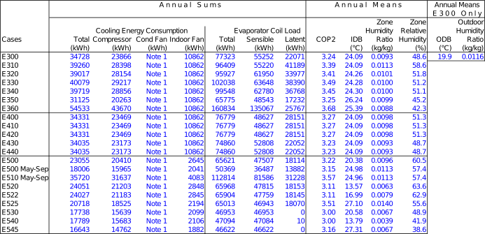

Note 1: Condenser fan energy consumption
included with compressor energy consumption; cannot break out.

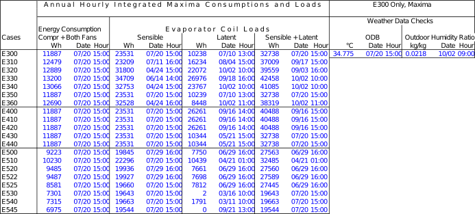

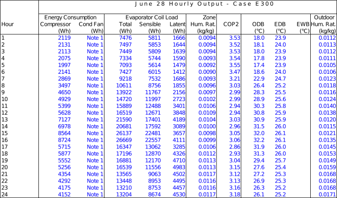

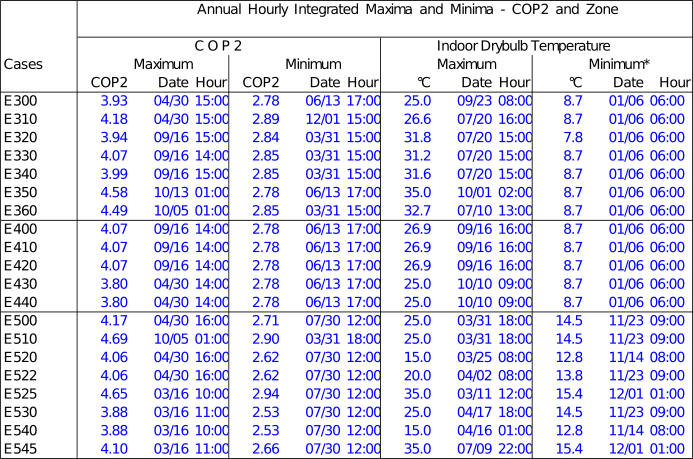

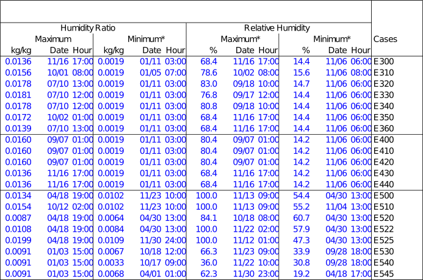

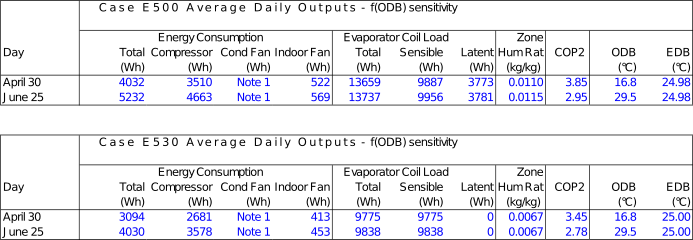


## Software Errors Discovered and/or Comparison Between Different Versions of the Same Software – Round 4

A comparison of EnergyPlus results from Round 3C with results from other programs (Ref: *HVAC BESTEST Cases E300-E545, Summary of 3rd Set of Results*, 12 Nov. 2002, J. Neymark) indicated that there were disagreements with regard to economizer control results (Cases E400 -
E440) and DX cooling system performance for Cases E500 – E545. Further investigation into the reasons for these differences indicated several input errors had been made:


## Results – Round 4

- Cases 400 - 440
    A fan outlet node name for the mixed air set point manager had been incorrectly identified and caused the economizer control to operate not in accordance with the specification.

- Case 410
    This case required that the DX cooling compressor be locked out from operating whenever the economizer was in operation. This capability has not yet been implemented in EnergyPlus so no results are being shown for this case.

- Case 420
    The economizer high temperature limit of 20C for this case had not been specified as required and was defaulting to a different setting.

- Cases 500 – 545
    The EnergyPlus total electricity consumption results for these cases are consistently low compared to the results of other programs. The DX coil model may be imposing some temperature limits on the use of the performance curves. During Round 4 the input temperature limits which defined the boundaries of the performance curves were opened up and some slight improvement in results occurred for Cases 520 and 540. This problem will be further investigated.

The results for Round 4 which are presented below were produced using
EnergyPlus 1.0.3.013.

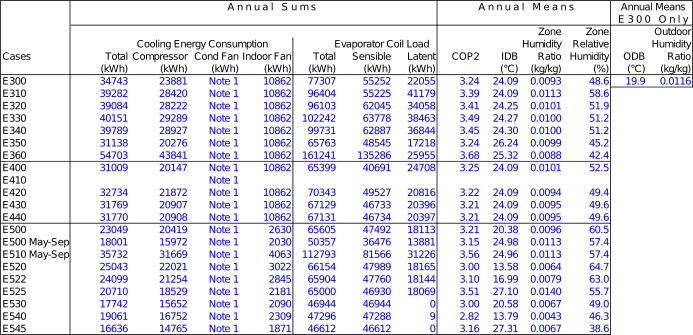

Note 1: Condenser fan energy consumption included with compressor energy
consumption; cannot break out.

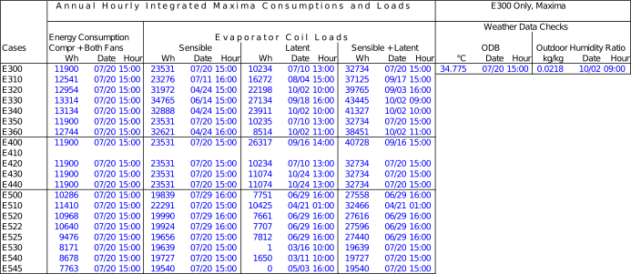

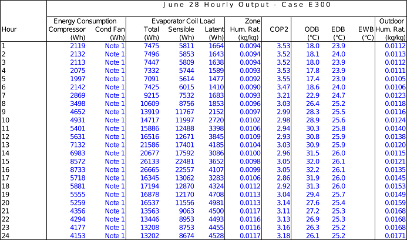

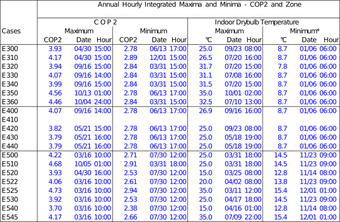

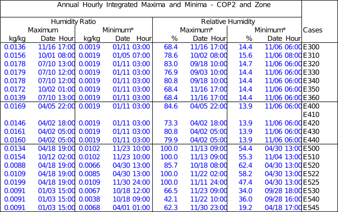

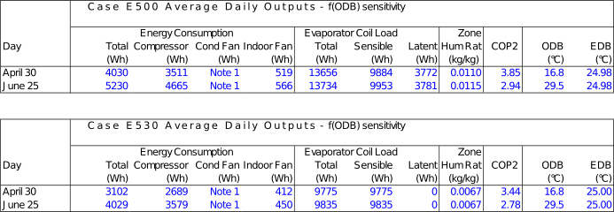


## Software Errors Discovered and/or Comparison Between Different Versions of the Same Software – Round 5


### Error in Reporting Round 4 Results

An error was made in the Round 4 “Energy Consumption – Compr + Both Fans” results reported in the “Annual Hourly Integrated Maxima Consumptions and Loads” table for Cases E500 through E545. The indoor fan energy consumption had been omitted from the totals. This error has been corrected in the results reported below for Round 5.


### Error in Space Humidity Ratio Algorithm

A comparison of EnergyPlus results from Round 4 to the results of other programs indicated that the maximum space humidity ratios for Cases E500 through E545 were high. Further investigation into the problem indicated that these maximum values were actually happening one to two hours after the internal loads and HVAC system had been scheduled off. This was occurring because of the way the moisture balance algorithm had been set up. Internal loads during each time step of the simulation in EnergyPlus were being accounted for after the HVAC system simulation. With EnergyPlus version 1.1.0.004 and subsequent releases the space internal loads are now accounted for before the system simulation. This brought the EnergyPlus results more in line with the results of the other programs. Also, for cases E530, E540 and E545 the maximum space humidity ratio was occurring during the beginning of the year before the AC unit came on for the first time (March 11). The period for determining maximum space humidity ratio was therefore changed to March 11 through December 31. This then brought the EnergyPlus results for cases E530 and E540 closer to results for the other programs. The Round 5 results which
follow present the revised results.


### Error in Economizer Enthalpy Limit for Case E440

In accordance with changes to the test suite specification, the economizer enthalpy limit for case E440 was changed from 65.13 kJ/kg to 47.25 kJ/kg.

The results for Round 5 which are presented below were produced using
EnergyPlus 1.1.0.020.

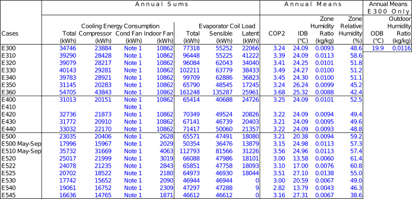

Note 1: Condenser fan energy consumption included with compressor energy consumption; cannot break out.


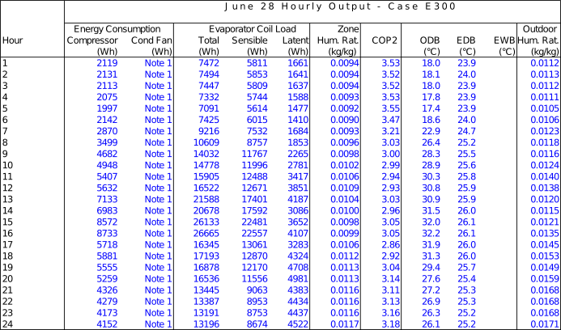

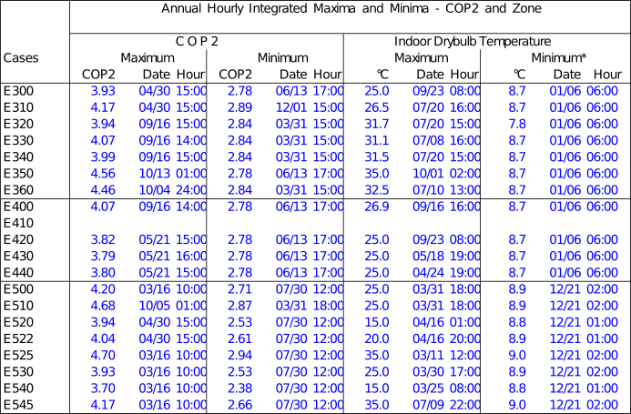

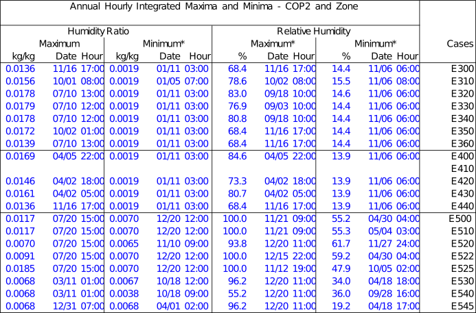


## Software Errors Discovered and/or Comparison Between Different Versions of the Same Software – Round 6

During Round 6 Case E410 with compressor lockout was added to the results suite since this feature was now available. The results for Round 6 which are presented below were produced using EnergyPlus 1.2.3.031. Except for a few cases where there are very small changes, the results are the same as Round 5 except that results for Case E410 are now included.


Note 1: Condenser fan energy consumption included with compressor energy
consumption; cannot break out.


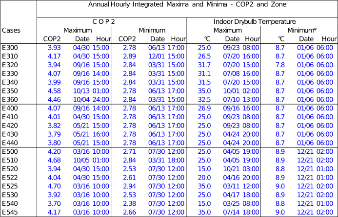

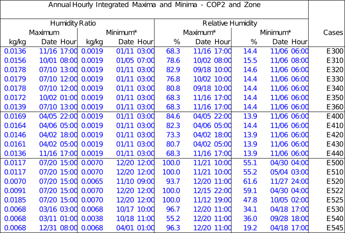


## Results With Subsequent Releases of EnergyPlus

The IEA HVAC BESTEST workgroup has completed their activities and final
results are recorded in a report authored and released by NREL in
December 2004 (Neymark & Judkoff 2004). Since the completion of that study, further capabilities and improvements have been added to EnergyPlus with new releases occurring in April 2005 (version 1.2.2) and continuing through the current release (version {{ engine.config["EnergyPlusVersion"] }}).

With EnergyPlus version 1.3.0.018 a new SITE ATMOSPHERIC VARIATION input object
became available (beginning with EnergyPlus 3.0.0 the name of this object
changed to Site:HeightVariation) to simulate changes in outside air temperature
and wind speed that typically occur vertically across building surfaces versus
the outdoor air temperature and wind speed that are obtained each hour from the
weather file. Typically the meteorological wind speed is measured in an open
field at 10m above the ground and meteorological air temperature is measured at
1.5m above ground level. To accommodate atmospheric variation EnergyPlus now
automatically calculates the local outdoor air temperature and wind speed
separately for each zone and surface exposed to the outdoor environment. The
zone centroid or surface centroid are used to determine the height above
ground. Only local outdoor air temperature and wind speed are currently
calculated because they are important factors for the exterior convection
calculation for surfaces and can also be factors in the zone infiltration and
ventilation calculations. Since Standard 140 assumes that the temperature of
the outside surfaces of the building are at the outdoor dry-bulb temperature
read from the weather file, the SITE ATMOSPHERIC VARIATION temperature
calculation feature was turned off by setting the air temperature gradient
coefficient to 0.0. The wind speed variation calculation was left active but
had no effect because the building’s exterior surfaces were configured to be
near adiabatic with an insulation layer of R-325 $\frac{m^2K}{W}$ . For Cases
CE320 and CE340 which had infiltration, there was also no change in results
since the infiltration rate was set to a constant. The SITE ATMOSPHERIC
VARIATION object was allowed to be active for all of the test cases simulated
with EnergyPlus 1.3.0.018 and later versions with the following inputs:


    SITE ATMOSPHERIC VARIATION,  
     0.22, !- Wind Speed Profile Exponent  
     370, !- Wind Speed Profile Boundary Layer Thickness {m}  
     0.0; !- Air Temperature Gradient Coefficient {K/m}


New output variables to report the surface exterior outdoor dry-bulb temperature and surface exterior wind speed allow the user to track hourly changes when the SITE ATMOSPHERIC VARIATION features are active.

With EnergyPlus version 1.4.0.025, a change was made to make the DX coil sensible and latent outputs agree with the Window AC outputs. The total cooling output did not change but there were small changes in sensible cooling (-0.3% or less) and latent cooling (1.0% or less).

The results of running the Standard 140 HVAC Tests CE300-CE545 with EnergyPlus versions 1.4.0.025 through 3.0.0.028 remained unchanged and are presented below.

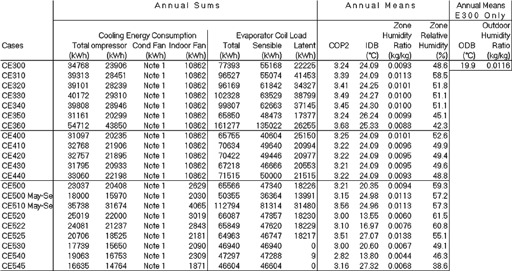

Note 1: Condenser fan energy consumption included with compressor energy
consumption; cannot break out.

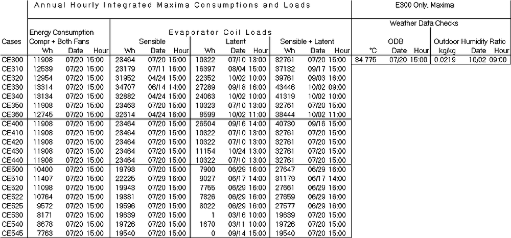

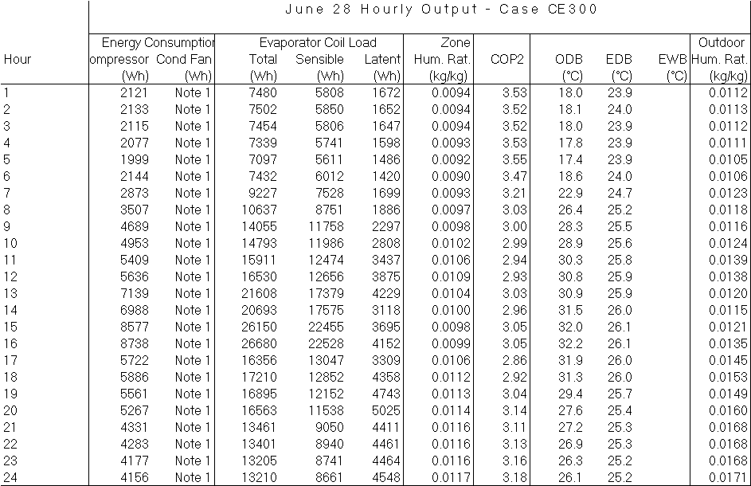


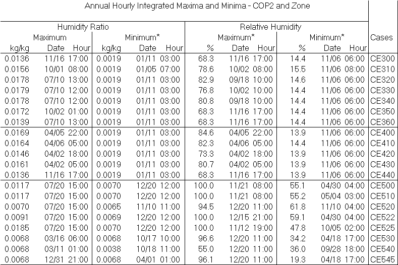

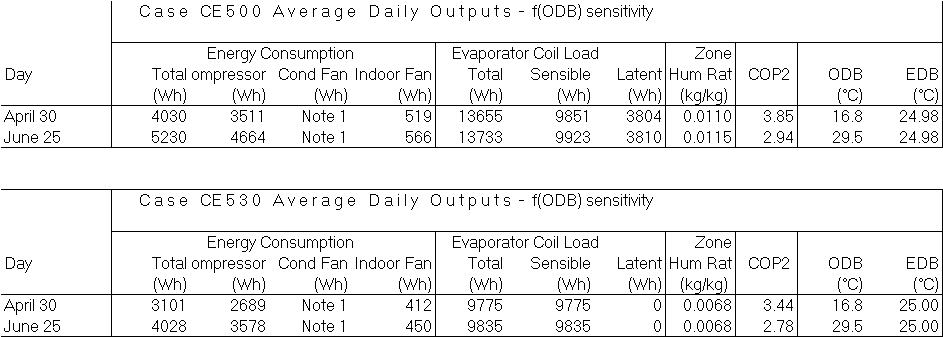

With EnergyPlus version 3.1.0.016, the DX coil controls were improved to
prevent operation at very small loads and improve interaction with economizer lockout a change with the manner in which the economizer lockout feature was handled and that affected the results for Case CE410 the Compressor Lockout test case. The impact was to reduce the compressor and condenser fan electricity consumption by 4.4% compared to the results obtained with EnergyPlus 3.0.0.028. This caused corresponding reductions of from 3.8% to 5.1% in the amount of sensible, latent and total cooling done by the DX cooling coil. The full set of results for EnergyPlus version 3.1.0.027 are presented below.

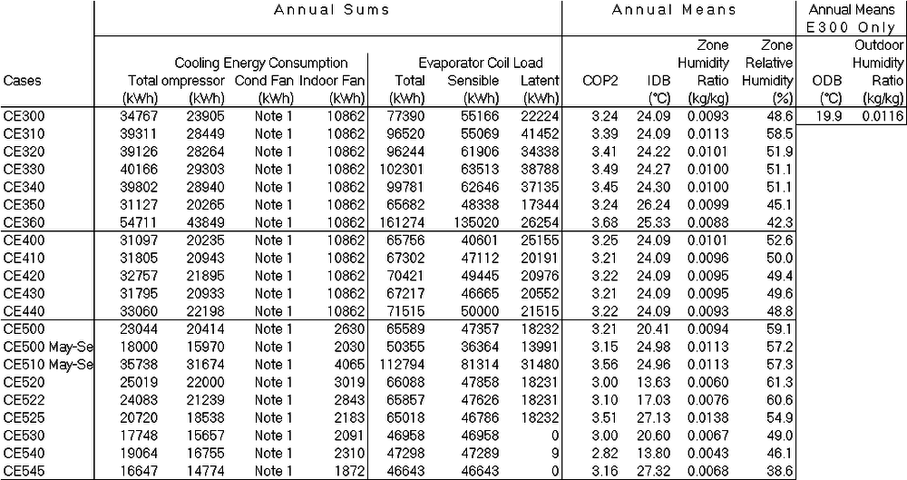

Note 1: Condenser fan energy consumption included with compressor energy
consumption; cannot break out.

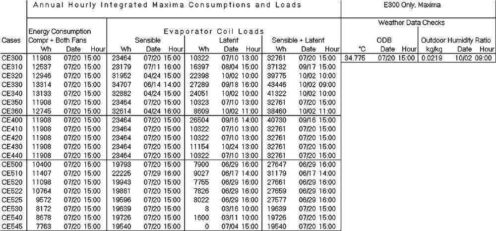


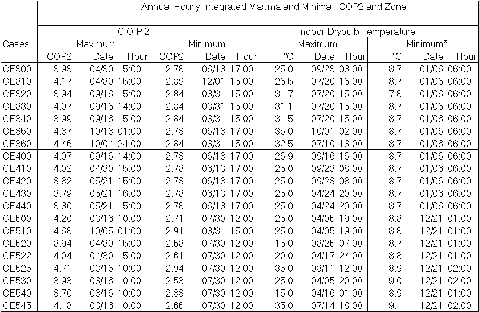

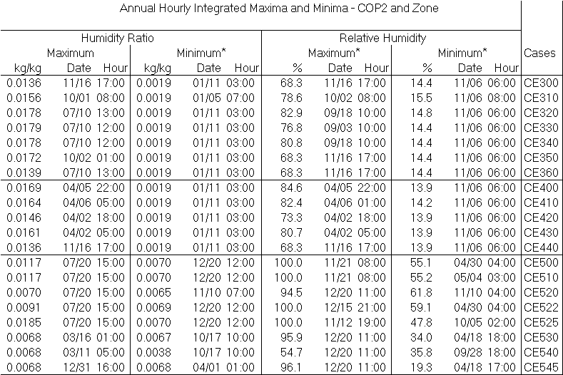


With Energyplus 4.0.0.024 the DX coil performance curves were changed by
first eliminating 5 data points which were for dry coil conditions and then redoing the curve fit. This was done at the suggestion of Don Shirey from the Florida Solar Energy Center who noticed from the data presented in Table 31a Equipment Full-Load Performance with Gross Capacities (SI Units) of Standard 140-2011 that the total cooling
capacity at the lowest entering wet-bulb for most outdoor dry-bulb temperatures was at “dry coil conditions” instead of wet coil conditions. This was the case for 5 of the 35 data points (all of which were at entering dry-bulb conditions of 26.67 C) which had been used in the previous curve fits. Eliminating these 5 dry coil data points gave new curve fits as follows which also resulted in a better R-squared
values for each curve fit:

1. Total cooling capacity modifier curve (function of temperature)

    Form: Bi-quadratic curve

    > $curve=a+b*EWB+c*{EWB}^2+d*ODB+e*{ODB}^2+f*EWB*ODB$
    
    Independent variables: wet-bulb temperature of the air entering (EWB) the cooling coil, and dry-bulb temperature of the air entering (ODB) the air-cooled condenser.

    > - a = 0.825119244
    > - b = 0.014461436
    > - c = 0.000525383
    > - d = -0.003805859
    > - e = -2.71284E-05
    > - f = -0.000198505

2. Energy input ratio (EIR) modifier curve (function of temperature)

    Form: Bi-quadratic curve

    > $curve=a+b*EWB+c*{EWB}^2+d*ODB+e*{ODB}^2+f*EWB*ODB$
    
    Independent variables: wet-bulb temperature of the air entering (EWB) the cooling coil, and dry-bulb temperature of the air entering (ODB) the air-cooled condenser.

    > - a = 0.630055851
    > - b = -0.011998189
    > - c = 0.000136923
    > - d = 0.014636637
    > - e = 0.000164506
    > - f = -0.000238463

Also as a result of this re-examining of the DX coil performance data, the rated SHR was changed from 0.804 to 0.78245 to correct an earlier input error.

The overall result was that for test Cases CE300 through CE510 the total
energy consumption and COP2 increased by <1% and for test Cases CE520 through CE545 (dry coil cases) there were increases up to 5.5%. At the same time there were decreases in zone humidity ratios of from 1% to 3% across all cases. For all test cases where the EnergyPlus results were already within the bounds of other programs except for dry coil cases, results with EnergyPlus 4.0.0.024 and the new performance curves moved closer to the middle of the range of other program results.

For the dry coil test cases CE540 and CE545 where EnergyPlus sensitivity to coil dry-bulb entering air temperature had been previously different compared to other programs, significant changes occurred with the new performance curves as shown below which brought EnergyPlus results much closer to the results of the other programs.

<table>
<tr>
  <th>Sensitivity Parameter (Case CE545 – Case CE540)</th>
  <th>Prior to EnergyPlus 4.0.0.024</th>
  <th>EnergyPlus 4.0.0.024</th>
  <th>Other Program Range</th>
</tr>
<tr>
  <td>Total Consumption (kWh)</td>
  <td>-2417</td>
  <td>-3514</td>
  <td>-3743 to -4083</td>
</tr>
<tr>
  <td>Peak Consumption (Wh)</td>
  <td>-914</td>
  <td>-1308</td>
  <td>-1494 to -1593</td>
</tr>
<tr>
  <td>COP2</td>
  <td>0.334</td>
  <td>0.470</td>
  <td>0.510 to 0.560</td>
</tr>
</table>


See appropriate charts in Appendix A for further comparisons of EnergyPlus results to other programs.

### The complete set of results with EnergyPlus versions 4.0.0.025 through 8.2.0 are presented below.

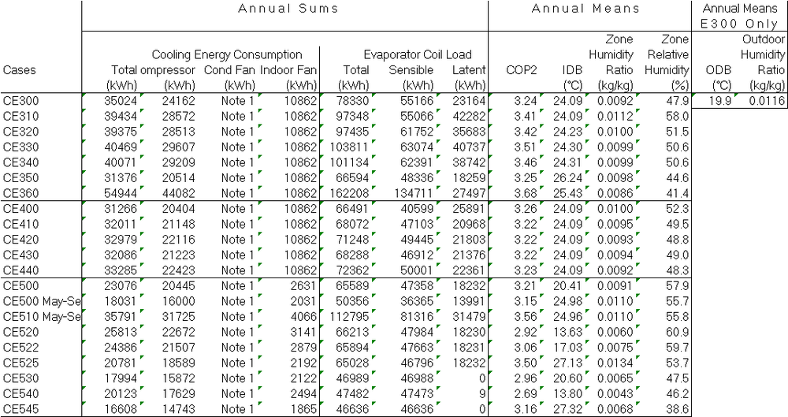

Note 1: Condenser fan energy consumption included with compressor energy
consumption; cannot break out.

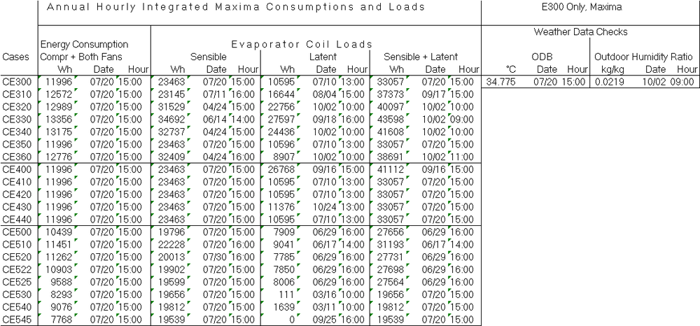

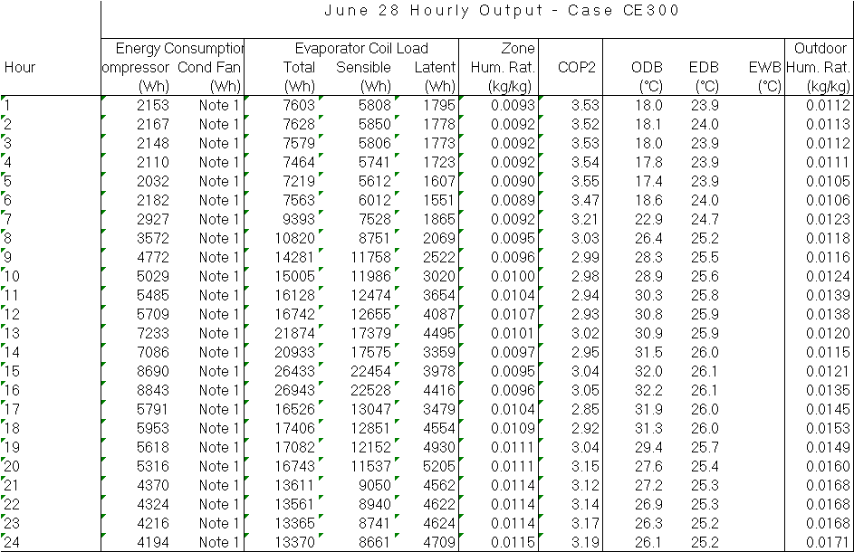

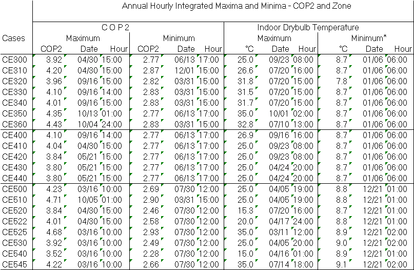

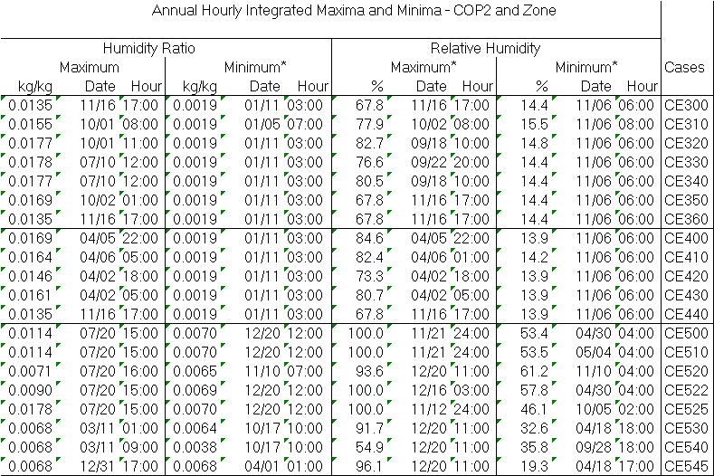

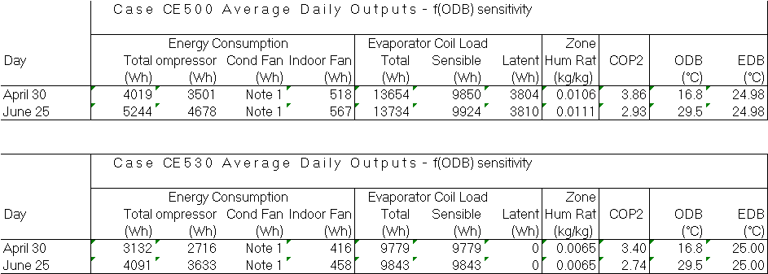


### The complete set of results with EnergyPlus version {{ engine.config["EnergyPlusVersion"] }} are presented below in tabular form.

{{ engine.create_table_from_excel_range("GARD Results E300OUT2-Round 5-Revised-NewCurves.xlsx", "A", "A56:N82") }}

Note 1: Condenser fan energy consumption included with compressor energy
consumption; cannot break out.

{{ engine.create_table_from_excel_range("GARD Results E300OUT2-Round 5-Revised-NewCurves.xlsx", "A", "P56:AH81") }}

{{ engine.create_table_from_excel_range("GARD Results E300OUT2-Round 5-Revised-NewCurves.xlsx", "A", "A84:L112") }}

{{ engine.create_table_from_excel_range("GARD Results E300OUT2-Round 5-Revised-NewCurves.xlsx", "A", "P84:AB108") }}

{{ engine.create_table_from_excel_range("GARD Results E300OUT2-Round 5-Revised-NewCurves.xlsx", "A", "AC84:AO108") }}

{{ engine.create_table_from_excel_range("GARD Results E300OUT2-Round 5-Revised-NewCurves.xlsx", "A", "A115:L121") }}

{{ engine.create_table_from_excel_range("GARD Results E300OUT2-Round 5-Revised-NewCurves.xlsx", "A", "A124:L130") }}


## Summary of Changes that were Implemented During Testing

This section documents the comparative changes that took place in results (see Appendix B) as modifications were made to the EnergyPlus code or changes were made in the modeling approach (see Table 2). No analytical results were available for this series of tests. The results
from running the HVAC BESTEST Cases CE300 – CE545 with each release through EnergyPlus version 1.3.0 has remained unchanged except that the results for Case CE410 have now been added since the compressor lockout feature when using an economizer is now activated. With EnergyPlus versions 1.4.0 through 3.0.0.028 very small changes (less than 1%) occurred in the cooling coil sensible and latent loads due to changes
described below in Table 2. With EnergyPlus 3.1.0.027, due to changes
described below the results for Case 410 Compressor Lockout caused the
compressor and condenser fan energy consumption and the DX cooling coil
load to move lower by as much as 5%. With EnergyPlus 4.0.0.024 where the
DX coil curves were modified and an earlier input error was corrected,
better zone humidity control resulted and EnergyPlus results moved closer to those of the other programs. A new feature regarding interpolation of rain and snow flags in the weather data was added to EnergyPlus 7.1.0.012. Although the building envelope for this test suite was near adiabatic and a small impact on exterior surface heat transfer occurred due to changes in the surface exterior film coefficient and
temperature difference across the surface, these changes were extremely
small compared to the large internal loads, and consequently no changes
in results occurred compared to previous versions of EnergyPlus..

For EnergyPlus version 8.2.0, the source code was converted from FORTRAN to C++. This produced negligible differences in results.

**Table 2 – Summary of Pertinent EnergyPlus Changes that were Implemented**

{{ engine.create_table_from_yaml("EnergyPlusChanges.yaml", ["Version", "Input-File-Changes", "Code-Changes"]) }}


# Results and Discussion

The results of the EnergyPlus HVAC comparison with other whole building
energy analysis programs that participated in the HVAC BESTEST Comparison are summarized on a set of charts which are reproduced in Appendix A. The nomenclature for the various programs referred to on
these charts along with the program author and modeler responsible for using the program as part of the HVAC BESTEST project are presented below.

<table>
<tr>
  <th>Code Name</th>
  <th>Authoring Organization</th>
  <th>Implemented by</th>
  <th>Chart Abbreviation</th>
</tr>
<tr>
  <td>CODYRUN/LGIMAT</td>
  <td>Universite de la Reunion Island, France</td>
  <td>Universite de la Reunion Island, France</td>
  <td>CODYRUN/UR</td>
</tr>
<tr>
  <td>DOE-2.1E-ESTSC version</td>
  <td>LANL/LBNL/ESTSC/JJH, U.S.</td>
  <td>NREL/JNA, U.S.</td>
  <td>DOE-2.1E-E/NREL</td>
</tr>
<tr>
  <td>DOE-2.2 NT</td>
  <td>LBNL/JJH, U.S.</td>
  <td>NREL/JNA, U.S.</td>
  <td>DOE-2.2/NREL</td>
</tr>
<tr>
  <td>EnergyPlus version {{ engine.config["EnergyPlusVersion"] }}</td>
  <td>LBNL/UIUC/CERL/OSU/GARD Analytics/FSEC/DOE-BT, U.S</td>
  <td>GARD Analytics, U.S.</td>
  <td>ENERGY+/GARD</td>
</tr>
<tr>
  <td>HOT3000</td>
  <td>CETC/ESRU, Canada/United Kingdom</td>
  <td>CETC, Canada</td>
  <td>HOT3000/NRCan</td>
</tr>
<tr>
  <td>TRNSYS 14.2-TUD with real controller model</td>
  <td>University of Wisconsin, U.S.; Technische Univ. Dresden, Germany</td>
  <td>Technische Univ. Dresden, Germany</td>
  <td>TRNSYS/TUD</td>
</tr>
</table>

                                                            
> LANL/LBNL: Los Alamos National Laboratory/Lawrence Berkeley Laboratory, U.S.  
> ESTAC: Energy Science & Technology Software Center (at Oak Ridge National Laboratory), U.S.  
> JJH: James J. Hirsch & Associates, U.S.  
> NREL/JNA: National Renewable Energy Laboratory/J. Neymark & Associates, U.S.  
> UIUC: University of Illinois Urbana/Champaign, U.S.  
> CERL: U.S. Army Corps of Engineers, Construction Engineering Research
laboratories, U.S.  
> OSU: Oklahoma State University, U.S.  
> FSEC: University of Central Florida, Florida Solar Energy Center, U.S.  
> DOE-BT: U.S. Dept. of Energy, Office of Building Technologies, Energy Efficiency and Renewable Energy, U.S.  
> CETC: CANMET Energy Technology Centre, Natural Resources Canada, Canada  
> ESRU: Energy Systems Research Unit, University of Strathclyde, Scotland, United Kingdom  

The series of charts in Appendix A compare the results of EnergyPlus
{{ engine.config["EnergyPlusVersion"] }} with five other programs. The charts are presented in the
following order:

- Total Electric Consumption
- Indoor Fan Electricity Consumption
- Coefficient of Performance
- Total Cooling Coil Load
- Sensible Cooling Coil Load
- Latent Cooling Coil Load
- Mean Indoor Dry-bulb Temperature
- Mean Indoor Humidity Ratio.

Since there were no analytical results available for Cases CE300 – CE545, comparisons of results can only be limited to the disagreement between the program participant results where disagreement is the difference between the maximum and minimum results for each test case divided by the mean of the results for each test case or ((max- min) / mean). As reported in the IEA/NREL final report, during the initial rounds of testing there was a 3% - 21% disagreement among the cases for the simulated energy consumption results and there was a lot of scatter among all the programs. During the final round of testing, after correcting software errors and input errors, the disagreement of results for annual total energy consumption between all programs was 2% - 6% with very little scatter among the programs. EnergyPlus’ results for the various test cases usually fell between the min and max limits of the
other programs.


# Conclusions

EnergyPlus Version 1.0.0.023 and subsequent versions up through the most
recent release, EnergyPlus {{ engine.config["EnergyPlusVersion"] }}, were used to model a range of HVAC equipment load specifications as specified in ANSI/ASHRAE Standard 140-2011, *Standard Method of Test for the Evaluation of Building Energy Analysis Computer Programs.* The ability of EnergyPlus to predict zone loads, cooling coil loads, cooling equipment energy consumption and
resulting zone environment was tested using a test suite of 20 cases which included varying sensible internal gains, latent internal gains, infiltration rates, outside air fraction, thermostat set points and economizer control settings. The results predicted by EnergyPlus for 20 different cases were compared to results from 5 other whole building energy simulation programs that participated in an International Energy Agency (IEA) project. Total energy consumption between the 6 programs for the various test cases differed by 2% - 6% compared to the mean. EnergyPlus results generally fell within the min/max of the results for each case.

The Standard 140 HVAC tests are a very valuable testing tool which provides excellent benchmarks for testing HVAC system and equipment algorithms versus the results of other international building simulation programs. As discussed above, the Standard 140 HVAC tests allowed the developers of EnergyPlus to identify errors in algorithms and improve simulation accuracy.


# References

ANSI/ASHRAE 2011. Standard 140-2011, Standard Method of Test for the
Evaluation of Building Energy Analysis Computer Programs, American Society of Heating, Refrigerating and Air-Conditioning Engineers, Atlanta, GA.

EnergyPlus 2014. U.S. Department of Energy, Energy Efficiency and
Renewable Energy, Office of Building Technologies.
[www.energyplus.gov](http://www.energyplus.gov)

Henninger, Robert H, Michael J Witte, and Drury B Crawley. 2004.
"Analytical and Comparative Testing of EnergyPlus using IEA HVAC BESTEST
E100-E200 Test Suite," pp 855-863, *Energy and Buildings*, 36:8.

Henninger, Robert H, Michael .J Witte. 2008. "EnergyPlus Testing with
HVAC Equipment Tests CE100 to CE200 from ANSI/ASHRAE Standard 140-2004,"
May 2008. U.S. Department of Energy,
[www.energyplus.gov](http://www.energyplus.gov)

Neymark, J., and R. Judkoff. 2001. *International Energy Agency Solar Heating and Cooling Programme Task 22 Building Energy Simulation Testand Diagnostic Method for HVAC Equipment Models (HVAC BESTEST)*, National Renewable Energy Laboratory, Golden, Colorado, October 2001.

Neymark, J., and R. Judkoff. 2002. *International Energy Agency Solar Heating and Cooling Programme Task 22 Building Energy Simulation Test and Diagnostic Method for HVAC Equipment Models (HVAC BESTEST)*, National Renewable Energy Laboratory, Golden, Colorado, NREL/TP-550-30152, January 2002.

Neymark, J., and R. Judkoff. 2004. *International Energy Agency Building Simulation Test and Diagnostic Method for Heating, Ventilating, and Air-Conditioning Equipment Models (HVAC BESTEST), Volume 2: Cases E300 – E545*, national Renewable Energy Laboratory, Golden, Colorado, NREL/TP-550-36754, December 2004.

Witte, M. J., Henninger, R.H., Glazer, J., and D. B. Crawley. 2001.
"Testing and Validation of a New Building Energy Simulation Program,"
*Proceedings of Building Simulation 2001*, August 2001, Rio de Janeiro,
Brazil, International Building Performance Simulation Association
(IBPSA).


# Appendix A

**Charts Comparing EnergyPlus {{ engine.config["EnergyPlusVersion"] }} Results with Other Whole Building Energy Simulation Programs** 


```{exec_python}


engine.write_chart('ColumnClustered', 'Qtot', 'Standard 140 HVAC: E300 - E545\nTotal Electricity Consumption', '', 'Electricity Consumption (kWh)', 'NREL Xcomp Charts-With Revised Performance Curves-NoLinks.xlsx', 'Qdata', 'B9:H30', '(C9,B10:B30,C10:C30,1);(D9,B10:B30,D10:D30,2);(E9,B10:B30,E10:E30,3);(F9,B10:B30,F10:F30,4);(G9,B10:B30,G10:G30,5);(H9,B10:B30,H10:H30,6);', [])
engine.write_chart('ColumnClustered', 'dQtot', 'Standard 140 HVAC: E300 - E545\nTotal Space Cooling Electricity Consumption Sensitivities', '', 'Electricity Consumption (kWh)', 'NREL Xcomp Charts-With Revised Performance Curves-NoLinks.xlsx', 'Tdata', 'B9:H27', '(C9,B10:B27,C10:C27,1);(D9,B10:B27,D10:D27,2);(E9,B10:B27,E10:E27,3);(F9,B10:B27,F10:F27,4);(G9,B10:B27,G10:G27,5);(H9,B10:B27,H10:H27,6);', [])
engine.write_chart('ColumnClustered', 'Ptot', 'Standard 140 HVAC: E300 - E545\nPeak Hour Total Electricity Consumption', '', 'Electricity Consumption (Wh)', 'NREL Xcomp Charts-With Revised Performance Curves-NoLinks.xlsx', 'Rdata', 'B10:H30', '(C10,B11:B30,C11:C30,1);(D10,B11:B30,D11:D30,2);(E10,B11:B30,E11:E30,3);(F10,B11:B30,F11:F30,4);(G10,B11:B30,G11:G30,5);(H10,B11:B30,H11:H30,6);', [])
engine.write_chart('ColumnClustered', 'dPtot', 'Standard 140 HVAC: E300 - E545\nHourly Maximum Total Space Cooling Consumption Sensitivities', '', 'Electricity Consumption (Wh)', 'NREL Xcomp Charts-With Revised Performance Curves-NoLinks.xlsx', 'Tdata', 'B245:H263', '(C245,B246:B263,C246:C263,1);(D245,B246:B263,D246:D263,2);(E245,B246:B263,E246:E263,3);(F245,B246:B263,F246:F263,4);(G245,B246:B263,G246:G263,5);(H245,B246:B263,H246:H263,6);', [])
engine.write_chart('ColumnClustered', 'Qcomp', 'Standard 140 HVAC: E300 - E545\nCompressor Electricity Consumption', '', 'Electricity Consumption (kWh)', 'NREL Xcomp Charts-With Revised Performance Curves-NoLinks.xlsx', 'Qdata', 'B33:H54', '(C33,B34:B54,C34:C54,1);(D33,B34:B54,D34:D54,2);(E33,B34:B54,E34:E54,3);(F33,B34:B54,F34:F54,4);(G33,B34:B54,G34:G54,5);(H33,B34:B54,H34:H54,6);', [])
engine.write_chart('ColumnClustered', 'dQcomp', 'Standard 140 HVAC: E300 - E545\nCompressor Electricity Consumption Sensitivities', '', 'Electricity Consumption (kWh)', 'NREL Xcomp Charts-With Revised Performance Curves-NoLinks.xlsx', 'Tdata', 'B30:H48', '(C30,B31:B48,C31:C48,1);(D30,B31:B48,D31:D48,2);(E30,B31:B48,E31:E48,3);(F30,B31:B48,F31:F48,4);(G30,B31:B48,G31:G48,5);(H30,B31:B48,H31:H48,6);', [])
engine.write_chart('ColumnClustered', 'Qidfan', 'Standard 140 HVAC: E300 - E545\nIndoor Fan Electricity Consumption', '', 'Electricity Consumption (kWh)', 'NREL Xcomp Charts-With Revised Performance Curves-NoLinks.xlsx', 'Qdata', 'B59:H80', '(C59,B60:B80,C60:C80,1);(D59,B60:B80,D60:D80,2);(E59,B60:B80,E60:E80,3);(F59,B60:B80,F60:F80,4);(G59,B60:B80,G60:G80,5);(H59,B60:B80,H60:H80,6);', [])
engine.write_chart('ColumnClustered', 'dQidfan', 'Standard 140 HVAC: E300 - E545\nIndoor Fan Electricity Consumption Sensitivities', '', 'Electricity Consumption (kWh)', 'NREL Xcomp Charts-With Revised Performance Curves-NoLinks.xlsx', 'Tdata', 'B54:H72', '(C54,B55:B72,C55:C72,1);(D54,B55:B72,D55:D72,2);(E54,B55:B72,E55:E72,3);(F54,B55:B72,F55:F72,4);(G54,B55:B72,G55:G72,5);(H54,B55:B72,H55:H72,6);', [])
engine.write_chart('ColumnClustered', 'Qodfan', 'Standard 140 HVAC: E300 - E545\nOutdoor Fan Electricity Consumption', '', 'Electricity Consumption (kWh)', 'NREL Xcomp Charts-With Revised Performance Curves-NoLinks.xlsx', 'Qdata', 'B83:H104', '(C83,B84:B104,C84:C104,1);(D83,B84:B104,D84:D104,2);(E83,B84:B104,E84:E104,3);(F83,B84:B104,F84:F104,4);(G83,B84:B104,G84:G104,5);(H83,B84:B104,H84:H104,6);', [])
engine.write_chart('ColumnClustered', 'dQodfan', 'Standard 140 HVAC: E300 - E545\nCondenser Fan Electricity Consumption Sensitivities', '', 'Electricity Consumption (kWh)', 'NREL Xcomp Charts-With Revised Performance Curves-NoLinks.xlsx', 'Tdata', 'B75:H93', '(C75,B76:B93,C76:C93,1);(D75,B76:B93,D76:D93,2);(E75,B76:B93,E76:E93,3);(F75,B76:B93,F76:F93,4);(G75,B76:B93,G76:G93,5);(H75,B76:B93,H76:H93,6);', [])
engine.write_chart('ColumnClustered', 'QCtot', 'Standard 140 HVAC: E300 - E545\nTotal Coil Load', '', 'Load (kWh thermal)', 'NREL Xcomp Charts-With Revised Performance Curves-NoLinks.xlsx', 'Qdata', 'B128:H149', '(C128,B129:B149,C129:C149,1);(D128,B129:B149,D129:D149,2);(E128,B129:B149,E129:E149,3);(F128,B129:B149,F129:F149,4);(G128,B129:B149,G129:G149,5);(H128,B129:B149,H129:H149,6);', [])
engine.write_chart('ColumnClustered', 'PCtot', 'Standard 140 HVAC: E300 - E545\nPeak Hour Total Coil Load', '', 'Load (Wh thermal)', 'NREL Xcomp Charts-With Revised Performance Curves-NoLinks.xlsx', 'Rdata', 'B79:H99', '(C79,B80:B99,C80:C99,1);(D79,B80:B99,D80:D99,2);(E79,B80:B99,E80:E99,3);(F79,B80:B99,F80:F99,4);(G79,B80:B99,G80:G99,5);(H79,B80:B99,H80:H99,6);', [])
engine.write_chart('ColumnClustered', 'dPCtot', 'Standard 140 HVAC: E300 - E545\nHourly Maximum Total Coil Load Sensitivities', '', 'Load (Wh thermal)', 'NREL Xcomp Charts-With Revised Performance Curves-NoLinks.xlsx', 'Tdata', 'B269:H287', '(C269,B270:B287,C270:C287,1);(D269,B270:B287,D270:D287,2);(E269,B270:B287,E270:E287,3);(F269,B270:B287,F270:F287,4);(G269,B270:B287,G270:G287,5);(H269,B270:B287,H270:H287,6);', [])
engine.write_chart('ColumnClustered', 'QCSens', 'Standard 140 HVAC: E300 - E545\nSensible Coil Load', '', 'Load (kWh thermal)', 'NREL Xcomp Charts-With Revised Performance Curves-NoLinks.xlsx', 'Qdata', 'B152:H173', '(C152,B153:B173,C153:C173,1);(D152,B153:B173,D153:D173,2);(E152,B153:B173,E153:E173,3);(F152,B153:B173,F153:F173,4);(G152,B153:B173,G153:G173,5);(H152,B153:B173,H153:H173,6);', [])
engine.write_chart('ColumnClustered', 'dQCsens', 'Standard 140 HVAC: E300 - E545\nSensible Cooling Load Sensitivities', '', 'Load (kWh thermal)', 'NREL Xcomp Charts-With Revised Performance Curves-NoLinks.xlsx', 'Tdata', 'B102:H120', '(C102,B103:B120,C103:C120,1);(D102,B103:B120,D103:D120,2);(E102,B103:B120,E103:E120,3);(F102,B103:B120,F103:F120,4);(G102,B103:B120,G103:G120,5);(H102,B103:B120,H103:H120,6);', [])
engine.write_chart('ColumnClustered', 'PCSens', 'Standard 140 HVAC: E300 - E545\nPeak Hour Sensible Coil Load', '', 'Load (Wh thermal)', 'NREL Xcomp Charts-With Revised Performance Curves-NoLinks.xlsx', 'Rdata', 'B33:H53', '(C33,B34:B53,C34:C53,1);(D33,B34:B53,D34:D53,2);(E33,B34:B53,E34:E53,3);(F33,B34:B53,F34:F53,4);(G33,B34:B53,G34:G53,5);(H33,B34:B53,H34:H53,6);', [])
engine.write_chart('ColumnClustered', 'QClat', 'Standard 140 HVAC: E300 - E545\nLatent Coil Load', '', 'Load (kWh thermal)', 'NREL Xcomp Charts-With Revised Performance Curves-NoLinks.xlsx', 'Qdata', 'B176:H197', '(C176,B177:B197,C177:C197,1);(D176,B177:B197,D177:D197,2);(E176,B177:B197,E177:E197,3);(F176,B177:B197,F177:F197,4);(G176,B177:B197,G177:G197,5);(H176,B177:B197,H177:H197,6);', [])
engine.write_chart('ColumnClustered', 'dQClat', 'Standard 140 HVAC: E300 - E545\nLatent Cooling Load Sensitivities', '', 'Load (kWh thermal)', 'NREL Xcomp Charts-With Revised Performance Curves-NoLinks.xlsx', 'Tdata', 'B123:H141', '(C123,B124:B141,C124:C141,1);(D123,B124:B141,D124:D141,2);(E123,B124:B141,E124:E141,3);(F123,B124:B141,F124:F141,4);(G123,B124:B141,G124:G141,5);(H123,B124:B141,H124:H141,6);', [])
engine.write_chart('ColumnClustered', 'PClat', 'Standard 140 HVAC: E300 - E545\nPeak Hour Latent Coil Load', '', 'Load (Wh thermal)', 'NREL Xcomp Charts-With Revised Performance Curves-NoLinks.xlsx', 'Rdata', 'B56:H76', '(C56,B57:B76,C57:C76,1);(D56,B57:B76,D57:D76,2);(E56,B57:B76,E57:E76,3);(F56,B57:B76,F57:F76,4);(G56,B57:B76,G57:G76,5);(H56,B57:B76,H57:H76,6);', [])
engine.write_chart('ColumnClustered', 'dPClat', 'Standard 140 HVAC: E300 - E545\nHourly Maximum Latent Coil Load Sensitivities', '', 'Load (Wh thermal)', 'NREL Xcomp Charts-With Revised Performance Curves-NoLinks.xlsx', 'Tdata', 'B311:H329', '(C311,B312:B329,C312:C329,1);(D311,B312:B329,D312:D329,2);(E311,B312:B329,E312:E329,3);(F311,B312:B329,F312:F329,4);(G311,B312:B329,G312:G329,5);(H311,B312:B329,H312:H329,6);', [])
engine.write_chart('ColumnClustered', 'COP2', 'Standard 140 HVAC: E300 - E545\nCOP2', '', 'COP2', 'NREL Xcomp Charts-With Revised Performance Curves-NoLinks.xlsx', 'Qdata', 'B208:H229', '(C208,B209:B229,C209:C229,1);(D208,B209:B229,D209:D229,2);(E208,B209:B229,E209:E229,3);(F208,B209:B229,F209:F229,4);(G208,B209:B229,G209:G229,5);(H208,B209:B229,H209:H229,6);', [])
engine.write_chart('ColumnClustered', 'dCOP2', 'Standard 140 HVAC: E300 - E545\nCOP2 Sensitivities', '', 'COP2', 'NREL Xcomp Charts-With Revised Performance Curves-NoLinks.xlsx', 'Tdata', 'B148:H166', '(C148,B149:B166,C149:C166,1);(D148,B149:B166,D149:D166,2);(E148,B149:B166,E149:E166,3);(F148,B149:B166,F149:F166,4);(G148,B149:B166,G149:G166,5);(H148,B149:B166,H149:H166,6);', [])
engine.write_chart('ColumnClustered', 'MxCOP2', 'Standard 140 HVAC: E300 - E545\nMaximum COP2', '', 'COP2', 'NREL Xcomp Charts-With Revised Performance Curves-NoLinks.xlsx', 'Rdata', 'B114:H134', '(C114,B115:B134,C115:C134,1);(D114,B115:B134,D115:D134,2);(E114,B115:B134,E115:E134,3);(F114,B115:B134,F115:F134,4);(G114,B115:B134,G115:G134,5);(H114,B115:B134,H115:H134,6);', [])
engine.write_chart('ColumnClustered', 'dMxCOP2', 'Standard 140 HVAC: E300 - E545\nHourly Maximum COP2 Sensitivities', '', 'COP2', 'NREL Xcomp Charts-With Revised Performance Curves-NoLinks.xlsx', 'Tdata', 'B344:H362', '(C344,B345:B362,C345:C362,1);(D344,B345:B362,D345:D362,2);(E344,B345:B362,E345:E362,3);(F344,B345:B362,F345:F362,4);(G344,B345:B362,G345:G362,5);(H344,B345:B362,H345:H362,6);', [])
engine.write_chart('ColumnClustered', 'MnCOP2', 'Standard 140 HVAC: E300 - E545\nMinimum COP2', '', 'COP2', 'NREL Xcomp Charts-With Revised Performance Curves-NoLinks.xlsx', 'Rdata', 'B137:H157', '(C137,B138:B157,C138:C157,1);(D137,B138:B157,D138:D157,2);(E137,B138:B157,E138:E157,3);(F137,B138:B157,F138:F157,4);(G137,B138:B157,G138:G157,5);(H137,B138:B157,H138:H157,6);', [])
engine.write_chart('ColumnClustered', 'dMnCOP2', 'Standard 140 HVAC: E300 - E545\nHourly Minimum COP2 Sensitivities', '', 'COP2', 'NREL Xcomp Charts-With Revised Performance Curves-NoLinks.xlsx', 'Tdata', 'B365:H383', '(C365,B366:B383,C366:C383,1);(D365,B366:B383,D366:D383,2);(E365,B366:B383,E366:E383,3);(F365,B366:B383,F366:F383,4);(G365,B366:B383,G366:G383,5);(H365,B366:B383,H366:H383,6);', [])
engine.write_chart('ColumnClustered', 'IDB', 'Standard 140 HVAC: E300 - E545\nIndoor Dry-Bulb Temperature', '', 'Temperature (°C)', 'NREL Xcomp Charts-With Revised Performance Curves-NoLinks.xlsx', 'Qdata', 'B232:H253', '(C232,B233:B253,C233:C253,1);(D232,B233:B253,D233:D253,2);(E232,B233:B253,E233:E253,3);(F232,B233:B253,F233:F253,4);(G232,B233:B253,G233:G253,5);(H232,B233:B253,H233:H253,6);', [])
engine.write_chart('ColumnClustered', 'dIDB', 'Standard 140 HVAC: E300 - E545\nIDB Sensitivities', '', 'Temperature (°C)', 'NREL Xcomp Charts-With Revised Performance Curves-NoLinks.xlsx', 'Tdata', 'B169:H187', '(C169,B170:B187,C170:C187,1);(D169,B170:B187,D170:D187,2);(E169,B170:B187,E170:E187,3);(F169,B170:B187,F170:F187,4);(G169,B170:B187,G170:G187,5);(H169,B170:B187,H170:H187,6);', [])
engine.write_chart('ColumnClustered', 'MxIDB', 'Standard 140 HVAC: E300 - E545\nMaximum Indoor Dry-Bulb Temperature', '', 'Temperature (°C)', 'NREL Xcomp Charts-With Revised Performance Curves-NoLinks.xlsx', 'Rdata', 'B160:H180', '(C160,B161:B180,C161:C180,1);(D160,B161:B180,D161:D180,2);(E160,B161:B180,E161:E180,3);(F160,B161:B180,F161:F180,4);(G160,B161:B180,G161:G180,5);(H160,B161:B180,H161:H180,6);', [])
engine.write_chart('ColumnClustered', 'dMxIDB', 'Standard 140 HVAC: E300 - E545\nHourly Maximum IDB Sensitivities', '', 'Temperature (°C)', 'NREL Xcomp Charts-With Revised Performance Curves-NoLinks.xlsx', 'Tdata', 'B389:H407', '(C389,B390:B407,C390:C407,1);(D389,B390:B407,D390:D407,2);(E389,B390:B407,E390:E407,3);(F389,B390:B407,F390:F407,4);(G389,B390:B407,G390:G407,5);(H389,B390:B407,H390:H407,6);', [])
engine.write_chart('ColumnClustered', 'MnIDB', 'Standard 140 HVAC: E300 - E545\nMinimum Indoor Dry-Bulb Temperature', '', 'Temperature (°C)', 'NREL Xcomp Charts-With Revised Performance Curves-NoLinks.xlsx', 'Rdata', 'B183:H203', '(C183,B184:B203,C184:C203,1);(D183,B184:B203,D184:D203,2);(E183,B184:B203,E184:E203,3);(F183,B184:B203,F184:F203,4);(G183,B184:B203,G184:G203,5);(H183,B184:B203,H184:H203,6);', [])
engine.write_chart('ColumnClustered', 'Humrat', 'Standard 140 HVAC: E300 - E545\nZone Humidity Ratio', '', 'Humidity Ratio (kg/kg)', 'NREL Xcomp Charts-With Revised Performance Curves-NoLinks.xlsx', 'Qdata', 'B258:H279', '(C258,B259:B279,C259:C279,1);(D258,B259:B279,D259:D279,2);(E258,B259:B279,E259:E279,3);(F258,B259:B279,F259:F279,4);(G258,B259:B279,G259:G279,5);(H258,B259:B279,H259:H279,6);', [])
engine.write_chart('ColumnClustered', 'dHumrat', 'Standard 140 HVAC: E300 - E545\nHumidity Ratio Sensitivities', '', 'Humidity Ratio (kg/kg)', 'NREL Xcomp Charts-With Revised Performance Curves-NoLinks.xlsx', 'Tdata', 'B194:H212', '(C194,B195:B212,C195:C212,1);(D194,B195:B212,D195:D212,2);(E194,B195:B212,E195:E212,3);(F194,B195:B212,F195:F212,4);(G194,B195:B212,G195:G212,5);(H194,B195:B212,H195:H212,6);', [])
engine.write_chart('ColumnClustered', 'MxHum', 'Standard 140 HVAC: E300 - E545\nMaximum Zone Humidity Ratio', '', 'Humidity Ratio (kg/kg)', 'NREL Xcomp Charts-With Revised Performance Curves-NoLinks.xlsx', 'Rdata', 'B218:H238', '(C218,B219:B238,C219:C238,1);(D218,B219:B238,D219:D238,2);(E218,B219:B238,E219:E238,3);(F218,B219:B238,F219:F238,4);(G218,B219:B238,G219:G238,5);(H218,B219:B238,H219:H238,6);', [])
engine.write_chart('ColumnClustered', 'dMxHumrat', 'Standard 140 HVAC: E300 - E545\nHourly Maximum Humidity Ratio Sensitivities', '', 'Humidity Ratio (kg/kg)', 'NREL Xcomp Charts-With Revised Performance Curves-NoLinks.xlsx', 'Tdata', 'B434:H452', '(C434,B435:B452,C435:C452,1);(D434,B435:B452,D435:D452,2);(E434,B435:B452,E435:E452,3);(F434,B435:B452,F435:F452,4);(G434,B435:B452,G435:G452,5);(H434,B435:B452,H435:H452,6);', [])
engine.write_chart('ColumnClustered', 'MnHum', 'Standard 140 HVAC: E300 - E545\nMinimum Zone Humidity Ratio', '', 'Humidity Ratio (kg/kg)', 'NREL Xcomp Charts-With Revised Performance Curves-NoLinks.xlsx', 'Rdata', 'B241:H261', '(C241,B242:B261,C242:C261,1);(D241,B242:B261,D242:D261,2);(E241,B242:B261,E242:E261,3);(F241,B242:B261,F242:F261,4);(G241,B242:B261,G242:G261,5);(H241,B242:B261,H242:H261,6);', [])
engine.write_chart('ColumnClustered', 'RelHum', 'Standard 140 HVAC: E300 - E545\nRelative Humidity', '', 'Relative Humidity (%)', 'NREL Xcomp Charts-With Revised Performance Curves-NoLinks.xlsx', 'Qdata', 'B282:H303', '(C282,B283:B303,C283:C303,1);(D282,B283:B303,D283:D303,2);(E282,B283:B303,E283:E303,3);(F282,B283:B303,F283:F303,4);(G282,B283:B303,G283:G303,5);(H282,B283:B303,H283:H303,6);', [])
engine.write_chart('ColumnClustered', 'dRelHum', 'Standard 140 HVAC: E300 - E545\nRelative Humidity Sensitivities', '', 'Relative Humidity (%)', 'NREL Xcomp Charts-With Revised Performance Curves-NoLinks.xlsx', 'Tdata', 'B215:H233', '(C215,B216:B233,C216:C233,1);(D215,B216:B233,D216:D233,2);(E215,B216:B233,E216:E233,3);(F215,B216:B233,F216:F233,4);(G215,B216:B233,G216:G233,5);(H215,B216:B233,H216:H233,6);', [])
engine.write_chart('ColumnClustered', 'MxRelHum', 'Standard 140 HVAC: E300 - E545\nMaximum Zone Relative Humidity', '', 'Relative Humidity (%)', 'NREL Xcomp Charts-With Revised Performance Curves-NoLinks.xlsx', 'Rdata', 'B264:H284', '(C264,B265:B284,C265:C284,1);(D264,B265:B284,D265:D284,2);(E264,B265:B284,E265:E284,3);(F264,B265:B284,F265:F284,4);(G264,B265:B284,G265:G284,5);(H264,B265:B284,H265:H284,6);', [])
engine.write_chart('ColumnClustered', 'dMxRelHum', 'Standard 140 HVAC: E300 - E545\nHourly Maximum Relative Humidity Sensitivities', '', 'Relative Humidity (%)', 'NREL Xcomp Charts-With Revised Performance Curves-NoLinks.xlsx', 'Tdata', 'B479:H497', '(C479,B480:B497,C480:C497,1);(D479,B480:B497,D480:D497,2);(E479,B480:B497,E480:E497,3);(F479,B480:B497,F480:F497,4);(G479,B480:B497,G480:G497,5);(H479,B480:B497,H480:H497,6);', [])
engine.write_chart('ColumnClustered', 'MnRelHum', 'Standard 140 HVAC: E300 - E545\nMinimum Zone Relative Humidity', '', 'Relative Humidity (%)', 'NREL Xcomp Charts-With Revised Performance Curves-NoLinks.xlsx', 'Rdata', 'B287:H307', '(C287,B288:B307,C288:C307,1);(D287,B288:B307,D288:D307,2);(E287,B288:B307,E288:E307,3);(F287,B288:B307,F288:F307,4);(G287,B288:B307,G288:G307,5);(H287,B288:B307,H288:H307,6);', [])


engine.write_chart('ColumnClustered', 'Qf(ODB)', 'Standard 140 HVAC: f(ODB) for E500, E530\nSpecific Day Electricity Consumptions\nTotal (compr + both fans)', '', 'Consumption (Wh)', 'NREL Xcomp Charts-With Revised Performance Curves-NoLinks.xlsx', 'Qdata', 'B320:H338', '(C320,B321:B326,C321:C326,1);(D320,B321:B326,D321:D326,2);(E320,B321:B326,E321:E326,3);(F320,B321:B326,F321:F326,4);(G320,B321:B326,G321:G326,5);(H320,B321:B326,H321:H326,6);', ['Left: E500 Wet Coil; Right: E530 Dry Coil'])
engine.write_chart('ColumnClustered', 'Qf(ODB)', 'Standard 140 HVAC: f(ODB) for E500, E530\nSpecific Day Electricity Consumptions\nOutdoor Fan', '', 'Consumption (Wh)', 'NREL Xcomp Charts-With Revised Performance Curves-NoLinks.xlsx', 'Qdata', 'B320:H338', '(C320,B327:B332,C327:C332,1);(D320,B327:B332,D327:D332,2);(E320,B327:B332,E327:E332,3);(F320,B327:B332,F327:F332,4);(G320,B327:B332,G327:G332,5);(H320,B327:B332,H327:H332,6);', ['Left: E500 Wet Coil; Right: E530 Dry Coil'])
engine.write_chart('ColumnClustered', 'Qf(ODB)', 'Standard 140 HVAC: f(ODB) for E500, E530\nSpecific Day Electricity Consumptions\nIndoor Fan', '', 'Consumption (Wh)', 'NREL Xcomp Charts-With Revised Performance Curves-NoLinks.xlsx', 'Qdata', 'B320:H338', '(C320,B333:B338,C333:C338,1);(D320,B333:B338,D333:D338,2);(E320,B333:B338,E333:E338,3);(F320,B333:B338,F333:F338,4);(G320,B333:B338,G333:G338,5);(H320,B333:B338,H333:H338,6);', ['Left: E500 Wet Coil; Right: E530 Dry Coil'])


engine.write_chart('ColumnClustered', 'QCf(ODB)', 'Standard 140 HVAC: f(ODB) for E500, E530\nSpecific Day Coil Loads\nTotal Loads', '', 'Daily Load (Wh thermal)', 'NREL Xcomp Charts-With Revised Performance Curves-NoLinks.xlsx', 'Qdata', 'B339:H357', '(C339,B340:B345,C340:C345,1);(D339,B340:B345,D340:D345,2);(E339,B340:B345,E340:E345,3);(F339,B340:B345,F340:F345,4);(G339,B340:B345,G340:G345,5);(H339,B340:B345,H340:H345,6);', ['Left: E500 Wet Coil; Right: E530 Dry Coil'])
engine.write_chart('ColumnClustered', 'QCf(ODB)', 'Standard 140 HVAC: f(ODB) for E500, E530\nSpecific Day Coil Loads\nSensible Loads', '', 'Daily Load (Wh thermal)', 'NREL Xcomp Charts-With Revised Performance Curves-NoLinks.xlsx', 'Qdata', 'B339:H357', '(C339,B346:B351,C346:C351,1);(D339,B346:B351,D346:D351,2);(E339,B346:B351,E346:E351,3);(F339,B346:B351,F346:F351,4);(G339,B346:B351,G346:G351,5);(H339,B346:B351,H346:H351,6);', ['Left: E500 Wet Coil; Right: E530 Dry Coil'])
engine.write_chart('ColumnClustered', 'QCf(ODB)', 'Standard 140 HVAC: f(ODB) for E500, E530\nSpecific Day Coil Loads\nLatent Loads', '', 'Daily Load (Wh thermal)', 'NREL Xcomp Charts-With Revised Performance Curves-NoLinks.xlsx', 'Qdata', 'B339:H357', '(C339,B352:B357,C352:C357,1);(D339,B352:B357,D352:D357,2);(E339,B352:B357,E352:E357,3);(F339,B352:B357,F352:F357,4);(G339,B352:B357,G352:G357,5);(H339,B352:B357,H352:H357,6);', ['Left: E500 Wet Coil; Right: E530 Dry Coil'])


engine.write_chart('ColumnClustered', 'COP2f(ODB)', 'Standard 140 HVAC: f(ODB) for E500, E530\nSpecific Day COP2', '', 'COP2', 'NREL Xcomp Charts-With Revised Performance Curves-NoLinks.xlsx', 'Qdata', 'B381:H387', '(C381,B382:B387,C382:C387,1);(D381,B382:B387,D382:D387,2);(E381,B382:B387,E382:E387,3);(F381,B382:B387,F382:F387,4);(G381,B382:B387,G382:G387,5);(H381,B382:B387,H382:H387,6);', ['Left: E500 Wet Coil; Right: E530 Dry Coil'])
engine.write_chart('ColumnClustered', 'Humratf(ODB)', 'Standard 140 HVAC: f(ODB) for E500, E530\nSpecific Day Humidity Ratio', '', 'Humidity Ratio (kg/kg)', 'NREL Xcomp Charts-With Revised Performance Curves-NoLinks.xlsx', 'Qdata', 'B374:H380', '(C374,B375:B380,C375:C380,1);(D374,B375:B380,D375:D380,2);(E374,B375:B380,E375:E380,3);(F374,B375:B380,F375:F380,4);(G374,B375:B380,G375:G380,5);(H374,B375:B380,H375:H380,6);', ['Left: E500 Wet Coil; Right: E530 Dry Coil'])
engine.write_chart('ScatterLines', 'HrQ', 'Standard 140 HVAC: E300\nJune 28 Hourly Electricity Consumption', 'Hour', 'Electricity Consumption (Wh)', 'NREL Xcomp Charts-With Revised Performance Curves-NoLinks.xlsx', 'Sdata', 'B7:G31', '(B7,A8:A31,B8:B31,1);(C7,A8:A31,C8:C31,2);(D7,A8:A31,D8:D31,3);(E7,A8:A31,E8:E31,4);(F7,A8:A31,F8:F31,5);(G7,A8:A31,G8:G31,6);', ['Compressor + OD Fan'])
engine.write_chart('ScatterLines', 'HrQC', 'Standard 140 HVAC: E300\nJune 28 Hourly Coil Loads', 'Hour', 'Load (Wh thermal)', 'NREL Xcomp Charts-With Revised Performance Curves-NoLinks.xlsx', 'Sdata', 'A35:N59', '(B35,A36:A59,B36:B59,1);(C35,A36:A59,C36:C59,2);(D35,A36:A59,D36:D59,3);(E35,A36:A59,E36:E59,4);(F35,A36:A59,F36:F59,5);(G35,A36:A59,G36:G59,6);(I35,A36:A59,I36:I59,7);(J35,A36:A59,J36:J59,8);(K35,A36:A59,K36:K59,9);(L35,A36:A59,L36:L59,10);(M35,A36:A59,M36:M59,11);(N35,A36:A59,N36:N59,12);', ['Top: Sensible', 'Bottom: Latent'])
engine.write_chart('ScatterLines', 'HrCOP2', 'Standard 140 HVAC: E300\nJune 28 Hourly COP2', 'Hour', 'COP2', 'NREL Xcomp Charts-With Revised Performance Curves-NoLinks.xlsx', 'Sdata', 'A94:G118', '(B94,A95:A118,B95:B118,1);(C94,A95:A118,C95:C118,2);(D94,A95:A118,D95:D118,3);(E94,A95:A118,E95:E118,4);(F94,A95:A118,F95:F118,5);(G94,A95:A118,G95:G118,6);', [])
engine.write_chart('ScatterLines', 'HrHum', 'Standard 140 HVAC: E300\nJune 28 Hourly Zone Humidity Ratio', 'Hour', 'Humidity Ratio (kg/kg)', 'NREL Xcomp Charts-With Revised Performance Curves-NoLinks.xlsx', 'Sdata', 'A64:G88', '(B64,A65:A88,B65:B88,1);(C64,A65:A88,C65:C88,2);(D64,A65:A88,D65:D88,3);(E64,A65:A88,E65:E88,4);(F64,A65:A88,F65:F88,5);(G64,A65:A88,G65:G88,6);', [])
engine.write_chart('ScatterLines', 'HrEDB,EWB', 'Standard 140 HVAC: E300\nJune 28 Hourly EDB & EWB', 'Hour', 'Temperature (°C)', 'NREL Xcomp Charts-With Revised Performance Curves-NoLinks.xlsx', 'Sdata', 'A154:N178', '(B154,A155:A178,B155:B178,1);(C154,A155:A178,C155:C178,2);(D154,A155:A178,D155:D178,3);(E154,A155:A178,E155:E178,4);(F154,A155:A178,F155:F178,5);(G154,A155:A178,G155:G178,6);(I154,A155:A178,I155:I178,7);(J154,A155:A178,J155:J178,8);(K154,A155:A178,K155:K178,9);(L154,A155:A178,L155:L178,10);(M154,A155:A178,M155:M178,11);(N154,A155:A178,N155:N178,12);', ['Top: EDB', 'Bottom: EWB'])
engine.write_chart('ScatterLines', 'HrODB', 'Standard 140 HVAC: E300\nJune 28 Hourly ODB', 'Hour', 'Temperature (°C)', 'NREL Xcomp Charts-With Revised Performance Curves-NoLinks.xlsx', 'Sdata', 'A124:G148', '(B124,A125:A148,B125:B148,1);(C124,A125:A148,C125:C148,2);(D124,A125:A148,D125:D148,3);(E124,A125:A148,E125:E148,4);(F124,A125:A148,F125:F148,5);(G124,A125:A148,G125:G148,6);', [])
engine.write_chart('ScatterLines', 'HrOHR', 'Standard 140 HVAC: E300\nJune 28 Hourly OHR', 'Hour', 'Humidity Ratio (kg/kg)', 'NREL Xcomp Charts-With Revised Performance Curves-NoLinks.xlsx', 'Sdata', 'A184:G208', '(B184,A185:A208,B185:B208,1);(C184,A185:A208,C185:C208,2);(D184,A185:A208,D185:D208,3);(E184,A185:A208,E185:E208,4);(F184,A185:A208,F185:F208,5);(G184,A185:A208,G185:G208,6);', [])

```


# Appendix B


**EnergyPlus Program Characteristics Summary "Proforma"**


**Program name (please include version number)**

*EnergyPlus Version {{ engine.config["EnergyPlusVersion"] }}*

**Your name, organisation, and country**

*Michael J. Witte, GARD Analytics, Inc., United States*

**Program status**

<table>
<tr><td></td><td> Public domain</td></tr>
<tr><td></td><td> Commercial:</td></tr>
<tr><td></td><td> Research</td></tr>
<tr><td>x</td><td> Other (please specify): *Government-sponsored, end-user license is no charge, other license types have fees associated with them*</td></tr>
</table>


**Solution method for unitary space cooling equipment**


<table>
<tr><td>x</td><td>Overall Performance Maps</td></tr>
<tr><td></td><td>Individual Component Models</td></tr>
<tr><td></td><td>Constant Performance (no possible variation with entering or ambient conditions)</td></tr>
<tr><td></td><td>Other (please specify)</td></tr>
</table>


**Interaction between loads and systems calculations**


<table>
<tr><td>x</td><td>Both are calculated during the same timestep</td></tr>
<tr><td></td><td>First, loads are calculated for the entire simulation period, then equipment performance is calculated separately</td></tr>
<tr><td></td><td>Other (please specify)</td></tr>
</table>


**Time step**


<table>
<tr><td></td><td>Fixed within code (please specify time step):</td></tr>
<tr><td>x</td><td>User-specified (please specify time step): 15 minute</td></tr>
<tr><td>x</td><td>Other (please specify): *program automatically adjusts HVAC time step, \<= envelope time step*</td></tr>
</table>

**Timing convention for meteorological data : sampling interval**


<table>
<tr><td></td><td>Fixed within code (please specify interval):</td></tr>
<tr><td>x</td><td>User-specified: *one hour*</td></tr>
</table>


**Timing convention for meteorological data : period covered by first
record**


<table>
<tr><td>x</td><td>Fixed within code (please specify period or time which meteorological record covers): *0:00 - 1:00*</td></tr>
<tr><td></td><td>User-specified</td></tr>
</table>


**Meteorological data reconstitution scheme**


<table>
<tr><td></td><td>Climate assumed stepwise constant over sampling interval</td></tr>
<tr><td>x</td><td>Linear interpolation used over climate sampling interval</td></tr>
<tr><td></td><td>Other (please specify)</td></tr>
</table>


**Output timing conventions**


<table>
<tr><td></td><td>Produces spot predictions at the end of each time step</td></tr>
<tr><td></td><td>Produces spot output at end of each hour</td></tr>
<tr><td>x</td><td>Produces average outputs for each hour (please specify period to which value relates): *user-specified, hourly data is average or sum for previous hour, can specify output at each time step*</td></tr>
</table>


**Treatment of zone air**


<table>
<tr><td>x</td><td>Single temperature (i.e. good mixing assumed)</td></tr>
<tr><td></td><td>Stratified model</td></tr>
<tr><td></td><td>Simplified distribution model</td></tr>
<tr><td></td><td>Full CFD model</td></tr>
<tr><td></td><td>Other (please specify)</td></tr>
</table>


**Zone air initial conditions**


<table>
<tr><td>x</td><td>Same as outside air</td></tr>
<tr><td></td><td>Other (please specify)</td></tr>
</table>


**Internal gains output characteristics**


<table>
<tr><td></td><td>Purely convective</td></tr>
<tr><td></td><td>Radiative/Convective split fixed within code</td></tr>
<tr><td>x</td><td>Radiative/Convective split specified by user: *100% convective for these tests*</td></tr>
<tr><td></td><td>Detailed modeling of source output</td></tr>
</table>


**Mechanical systems output characteristics**


<table>
<tr><td>x</td><td>Purely convective</td></tr>
<tr><td></td><td>Radiative/Convective split fixed within code</td></tr>
<tr><td>a</td><td>Radiative/Convective split specified by user: *for types of equipment not used in these tests*</td></tr>
<tr><td></td><td>Detailed modeling of source output</td></tr>
</table>


**Control temperature**


<table>
<tr><td>x</td><td>Air temperature</td></tr>
<tr><td></td><td>Combination of air and radiant temperatures fixed within the code</td></tr>
<tr><td></td><td>User-specified combination of air and radiant temperatures</td></tr>
<tr><td></td><td>User-specified construction surface temperatures</td></tr>
<tr><td></td><td>User-specified temperatures within construction</td></tr>
<tr><td></td><td>Other (please specify)</td></tr>
</table>


**Control properties**


<table>
<tr><td>x</td><td>Ideal control as specified in the user's manual</td></tr>
<tr><td></td><td>On/Off thermostat control</td></tr>
<tr><td></td><td>On/Off thermostat control with hysteresis</td></tr>
<tr><td></td><td>On/Off thermostat control with minimum equipment on and/or off durations</td></tr>
<tr><td></td><td>Proportional control</td></tr>
<tr><td></td><td>More comprehensive controls (please specify)</td></tr>
</table>


**Performance Map: characteristics**


<table>
<tr><td></td><td>Default curves</td></tr>
<tr><td>  x  </td><td>Custom curve fitting</td></tr>
<tr><td></td><td>Detailed mapping not available</td></tr>
<tr><td></td><td>Other (please specify)</td></tr>
</table>


**Performance Map: independent variables**


<table>
<tr><td></td><td>Entering Drybulb Temperature: *program calculates adjustments internally*</td></tr>
<tr><td>  x  </td><td>Entering Wetbulb Temperature</td></tr>
<tr><td>  x  </td><td>Outdoor Drybulb Temperature</td></tr>
<tr><td>  x  </td><td>Part Load Ratio</td></tr>
<tr><td>  a  </td><td>Indoor Fan Air Flow Rate: *always=1, because fan always operates at rated conditions *</td></tr>
<tr><td></td><td>Other (please specify)</td></tr>
</table>


**Performance Map: dependent variables**


<table>
<tr><td>  x  </td><td>Coefficient of Performance (or other ratio of load to electricity consumption)</td></tr>
<tr><td>  x  </td><td>Total Capacity</td></tr>
<tr><td></td><td>Sensible Capacity: *program calculates internally based on user-specified nominal SHR*</td></tr>
<tr><td></td><td>Bypass Factor: *program calculates internally based on nominal SHR and current conditions*</td></tr>
<tr><td>  x  </td><td>Other (please specify): *indoor fan power (function of PLR)*</td></tr>
</table>


**Performance Map: available curve fit techniques**

<table>
<tr><td>  x  </td><td>Linear, f(one independent variable): *flow fraction curves set to constant=1*</td></tr>
<tr><td>  x  </td><td>Quadratic, f(one independent variable) : *PLF-FPLR (cycling loss)*</td></tr>
<tr><td>  a  </td><td>Cubic, f(one independent variable):</td></tr>
<tr><td>  a  </td><td>Bi-Linear, f(two independent variables)</td></tr>
<tr><td>  x  </td><td>Bi-Quadratic, f(two independent variables): *CAP-FT, EIR-FT*</td></tr>
<tr><td></td><td>Other (please specify)</td></tr>
</table>


**Performance Map: extrapolation limits**


<table>
<tr><td>  x  </td><td>Limits independent variables: *27.4 \<= ODB \<=48.1; 13.0 \<= EWB \<= 23.7, 0.0 \<= PLR \<= 1.0*</td></tr>
<tr><td></td><td>Limits dependent variables</td></tr>
<tr><td></td><td>No extrapolation limits</td></tr>
<tr><td></td><td>Extrapolation not allowed</td></tr>
<tr><td></td><td>Other (please specify)</td></tr>
</table>


**Cooling coil and supply air conditions model**


<table>
<tr><td></td><td>Supply air temperature = apparatus dew point (ADP); supply air humidity ratio = humidity ratio of saturated air at ADP</td></tr>
<tr><td></td><td>Bypass factor model using listed ADP data</td></tr>
<tr><td>x</td><td>Bypass factor model with ADP calculated from extending condition line: *nominal BF is calculated from user-specified nominal SHR*</td></tr>
<tr><td>x</td><td>Fan heat included</td></tr>
<tr><td></td><td>More comprehensive model (please specify)</td></tr>
</table>


**Disaggregation of fans' electricity use directly in the simulation and output**


<table>
<tr><td>x</td><td>Indoor fan only</td></tr>
<tr><td></td><td>Outdoor fan only</td></tr>
<tr><td></td><td>Both indoor and outdoor fans disaggregated in the output</td></tr>
<tr><td></td><td>None - disaggregation of fan outputs with separate calculations by the user</td></tr>
</table>


**Economizer settings available (for E400 series)**


<table>
<tr><td>x</td><td>Temperature</td></tr>
<tr><td>x</td><td>Enthalpy</td></tr>
<tr><td>x</td><td>Compressor Lockout</td></tr>
<tr><td></td><td>Other (please specify)</td></tr>
</table>


