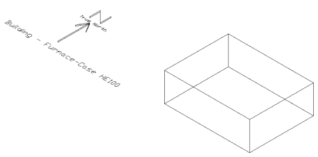
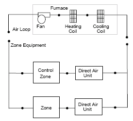
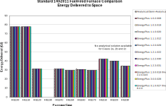
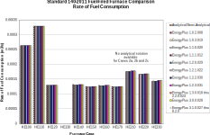
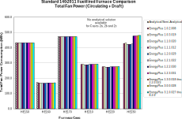

EnergyPlus Version {{ engine.config["EnergyPlusVersion"] }}  
Automatically Generated {{ engine.month_year() }}


Prepared for:

U.S. Department of Energy  
Energy Efficiency and Renewable Energy  
Office of Building Technologies  
Washington, D.C.

Originally Prepared by:

Robert H. Henninger and Michael J. Witte  
115 S. Wilke Road, Suite 105  
Arlington Heights, IL 60005-1500  
USA  
www.gard.com

This report was developed based upon funding from the Alliance for Sustainable
Energy, LLC, Managing and Operating Contractor for the National Renewable
Energy Laboratory for the U.S. Department of Energy.  Any opinions, findings,
and conclusions or recommendations expressed in this material are those of the
author(s) and do not necessarily reflect those of the sponsor. Earlier work was
supported by the Ernest Orlando Lawrence Berkeley National Laboratory, and by
the National Energy Technology Laboratory and the National Renewable Energy
Laboratory by subcontract through the University of Central Florida/Florida
Solar Energy Center.

This report was prepared as an account of work sponsored by an agency of the
United States Government. Neither the United States Government nor any agency
thereof, nor any of their employees, makes any warranty, express or implied, or
assumes any legal liability or responsibility for the accuracy, completeness,
or usefulness of any information, apparatus, product, or process disclosed, or
represents that its use would not infringe privately owned rights. Reference
herein to any specific commercial product, process, or services by trade name,
trademark, manufacturer, or otherwise does not necessarily constitute or imply
its endorsement, recommendation, or favoring by the United States Government or
any agency thereof. The views and opinions of authors expressed herein do not
necessarily state or reflect those of the United States Government or any
agency thereof.


# Test Objectives and Overview

## Introduction

This report describes the modeling methodology and results for testing done of
HVAC system tests designated as Cases HE100 through HE230 of ANSI/ASHRAE
Standard 140-2011 titled *Standard Method of Test for the Evaluation of
Building Energy Analysis Computer Programs* with the EnergyPlus Version {{ engine.config["EnergyPlusVersion"] }}
The results of EnergyPlus are also compared with analytical results as well as
results from several other whole building energy analysis programs that
simulated the same test cases.


## Test Type: Analytical and Comparative – HVAC

The ANSI/ASHRAE Standard 140-2011 contains a set of analytical tests as well as
a set of comparative results from several whole building simulation programs
that participated in an International Energy Agency (IEA) project to test HVAC
equipment performance modeling procedures for fuel-fired furnaces. Analytical
tests compare a program’s results to mathematical solutions for simple cases.
This is an excellent method to use for assessing the accuracy of results since
there is only one solution for the case analyzed given the boundary conditions.
Comparative tests compare a program to itself or to other simulation programs.
Both types of testing accomplish results on two different levels, both
validation and debugging. Validation is accomplished when the results of the
test program compare favorably with the analytical results. Debugging is
accomplished when the results for certain cases do not compare favorably with
the analytical results and then through systematic checking it is determined
that the source of the difference is due to an input error, a modeling
inconsistency or flaw in the program logic.


## Test Suite: ANSI/ASHRAE Standard 140-2011 Space Cooling Performance Tests

The tests described in Section 5.4 of ANSI/ASHRAE Standard 140-2011, *Standard
Method of Test for the Evaluation of Building Energy Analysis Computer
Programs*, were performed using the EnergyPlus program. This standard builds
upon work previously performed by the International Energy Agency (IEA) Solar
Heating and Cooling Programme Task 22, *Building Energy Simulation Test and
Diagnostic Method for HVAC Equipment Models (HVAC BESTEST): Fuel-Fired Test
Cases* (Purdy & Beausoleil-Mossison 2003). The testing done with EnergyPlus
actually started as part of the IEA HVAC BESTEST activities before these HVAC
equipment performance testing procedures were incorporated into ANSI/ASHRAE
Standard 140-2011. The discussion which follows chronicles the experiences that
occurred while using EnergyPlus to simulate the HVAC BESTEST Fuel-Fired Furnace
test suite, the same tests that are now part of ANSI/ASHRAE Standard 140-2011
where the test cases are now referenced as Cases HE100 – HE230. In the
following discussions where sections, tables or figures are referenced from
Standard 240-2011, the corresponding reference in the HVAC BESTEST
specification follows in parentheses. Beginning with the results for EnergyPlus
version 2.2.0.023, the new “HE” test case designation is used in tables and
charts while for all previous versions of EnergyPlus the “1a, 1b, …., 2a, 2b…”
test case designation was used.

Section 5.4 of ANSI/ASHRAE Standard 140-2011 and the IEA document (subsequently
referred to in this report as the IEA Fuel-Fired Furnace Test Cases report)
describe a series of eleven cases which isolate a single facet of the furnace
model in each case, starting with the simplest case and progressively adding
complexity. The test cases are grouped into two tiers: Tier 1 test cases employ
simple boundary conditions and test the basic functionally of the furnace model
using constant hourly or sinusoidal outdoor dry-bulb temperatures. Tier 2 uses
continuously varying hourly outdoor dry-bulb temperatures from a cold weather
location. Specific cases are designed to test a building energy simulation
program with respect to the following components:

-   Furnace steady state efficiency
-   Furnace part load ratio
-   Outdoor temperature
-   Indoor set-point temperature
-   Circulating fan operation
-   Draft fan operation.

The following tests were performed as specified in both ANSI/ASHRAE
Standard 140-2011 and the IEA Fuel-Fired Furnace Test Cases report (test
case designation shown in parenthesis below):

-   Case HE100 – Base Case Building and Mechanical System (Case 1a)
-   Case HE110 – Efficiency Test (Case 1b)
-   Case HE120 – Steady Part-Load Test (Case 1c)
-   Case HE130 – No Load Test (Case 1d)
-   Case HE140 – Periodically Varying Part-Load Test (Case 1e)
-   Case HE150 – Circulating Fan Test (Case 1f)
-   Case HE160 – Cycling Circulating Fan Test (Case 1g)
-   Case HE170 – Draft Fan Test (Case 1h)
-   Case HE210 – Realistic Weather Data (Case 2a)
-   Case HE220 – Setback Thermostat (Case 2b)
-   Case HE230 – Undersized Furnace (Case 2c)


### Case HE100 – Base Case Building and Mechanical System

The basic test building (Figure 1) is a rectangular 48 $m^2$ single zone (8 m
wide x 6 m long x 2.7 m high) with no interior partitions and no windows. The
building is intended as a near-adiabatic cell with energy transfer through a
single surface to drive the heating loads. Energy is transferred to the
outdoors through the roof. Material properties are described below. For further
details refer to Section 5.4.1 of Standard 140-2011.



**Figure 1 Base Case Building - Isometric View of Southeast Corner**

**Wall and Floor Construction:**

<table>
<tr>
  <th>Element</th>
  <th>k ( $\frac{W}{mK}$ )</th>
  <th>Thickness (m)</th>
  <th>U ( $\frac{W}{m^2K}$ )</th>
  <th>R ( $\frac{m^2K}{W}$ )</th>
</tr>
<tr>
  <td>Int. Surface Coeff.</td>
  <td></td>
  <td></td>
  <td>20.0</td>
  <td>0.05</td>
</tr>
<tr>
  <td>Insulation</td>
  <td>0.010</td>
  <td>1.000</td>
  <td>0.010</td>
  <td>100.000</td>
</tr>
<tr>
  <td>Ext. Surface Coeff.</td>
  <td></td>
  <td></td>
  <td>20.0</td>
  <td>0.05</td>
</tr>
</table>


**Roof Construction:**

<table>
<tr>
  <th>Element</th>
  <th>k ( $\frac{W}{mK}$ )</th>
  <th>Thickness (m)</th>
  <th>U ( $\frac{W}{m^2K}$ )</th>
  <th>R ( $\frac{m^2K}{W}$ )</th>
</tr>
<tr>
  <td>Int. Surface Coeff.</td>
  <td></td>
  <td></td>
  <td>20.0</td>
  <td>0.05</td>
</tr>
<tr>
  <td>Insulation</td>
  <td>0.0714</td>
  <td>0.01</td>
  <td>7.14</td>
  <td>0.14</td>
</tr>
<tr>
  <td>Ext. Surface Coeff.</td>
  <td></td>
  <td></td>
  <td>20.0</td>
  <td>0.05</td>
</tr>
</table>


**Opaque Surface Radiative Properties:**

<table>
<tr>
  <th></th>
  <th>Interior Surface</th>
  <th>Exterior Surface</th>
</tr>
<tr>
  <td>Solar Absorptivity</td>
  <td>0.0</td>
  <td>0.0</td>
</tr>
<tr>
  <td>Longwave Emissivity</td>
  <td>0.0</td>
  <td>0.0</td>
</tr>
</table>


**Infiltration:** None  
**Internal Load:** None  
**Mechanical System:** Simple sealed combustion, fuel-fired, convective heating system with the following characteristics:

- Heating Capacity 10,000 W
- Indoor Fan Power 200 W
- Draft Fan Power 50 W
- Full-load Efficiency 80%
- No pilot light
- No air or thermal losses from distribution ducts
- Combustion air is drawn directly from outdoors

There is a non-proportional-type thermostat, cool always off, heating on if zone air temperature <20.0°C. When operating at part load the furnace heat input ratio (HIR) is a function of the part load ratio (PLR):

> $HIR=a+b*PLR+c*{PLR}^2+d*{PLR}^3$  
> 
> a = 0.0080472574  
> b = 0.87564457  
> c = 0.29249943    
> d = -0.17624156

For those tests where the supply fan and draft fan are to be simulated,the following is assumed:

- Supply fan power = 200 W  
- Draft fan power = 50 W and cycles with burner

Table 1 summarizes the mechanical system options that were simulated for
each test.


### Weather Data

Five three-month long (January – March) weather files in WYEC2 format
were provided with the Standard 140-2007 test suite for the first time
with files names as shown below. The WYEC2 versions of these weather
files were converted to EnergyPlus format using the latest EnergyPlus
weather conversions program and used to generate results for EnergyPlus
Version 2.2.0.023 and later releases.

- HE100W.WY2 (weather file: a in HVAC BESTEST)  
- HE120W.WY2 (weather file: c in HVAC BESTEST)  
- HE130W.WY2 (weather file: d in HVAC BESTEST)  
- HE140W.WY2 (weather file: e in HVAC BESTEST)  
- HE210W.WY2 (weather file: f in HVAC BESTEST)

Although hourly values are provided for various weather variables, the only parameter that varies for each weather file is the ambient dry-bulb
temperature. For HE100W.WY2, the outdoor dry-bulb temperature remains constant at -30°C for the three month period. Similarly, HE120W.WY2 has
a constant 0°C outdoor temperature and HE130W.WY2 has a constant 20°C outdoor temperature. HE140W.WY2 features the outdoor temperature varying sinusoidally each 24-hour period from -20°C to +20°C. Diffuse and direct normal solar intensity and wind speed are all set to 0.0 for all hours thus eliminating the impact of these effects on the results and outdoor air relative humidity is held constant at 50% for all weather files. HE210W.WY2 represents a more realistic weather set from a cold winter location.

Early versions of the first four weather files were not provided in a standard weather data format and EnergyPlus compatible weather files had to be created. Because weather file ‘f’ was the only one provided originally in WYEC2 format, it was decoded directly using the EnergyPlus weather converting utility. The final version of the Fuel-Fired Furnace
Test Cases report as well as Standard 140-2011 now provide all five weather files in WYEC2 format. These weather files were subsequently decoded using the EnergyPlus weather conversion program to create .epw weather files. The results presented and discussed in Section 2.8 use these .epw weather files.

### Simulation and Reporting Period

Simulations for all cases were run for a three month period. For cases which used weather files HE100W.WY2, HE120W.WY2 or HE130W.WY2 , the results do not vary from hour to hour. For cases which use HE140W.WY2, the results vary within a 24 hour period and then repeat for each day of the simulation. For Cases HE210, HE220 and HE230 which use weather file HE210W.WY2, the results vary hourly over the entire 3-month simulation period.

**Table 1 Standard 140-2011 Space Heating Performance Test Case Descriptions**

<table>
<tr>
  <th>Case #</th>
  <th>Furnace Capacity (W)</th>
  <th>Furnace Full Load Efficiency (%)</th>
  <th>Part Load Simulation</th>
  <th>Weather File &amp; Outdoor Temperature (C)</th>
  <th>Circulating Fan Power (W)</th>
  <th>Draft Fan Power (W)</th>
  <th>Comments</th>
</tr>
<tr>
  <td>HE100</td>
  <td>10,000</td>
  <td>100</td>
  <td>No</td>
  <td>HE100W: -30</td>
  <td>0</td>
  <td>0</td>
  <td>Base Case Building</td>
</tr>
<tr>
  <td>HE110</td>
  <td>10,000</td>
  <td>80</td>
  <td>No</td>
  <td>HE100W: -30</td>
  <td>0</td>
  <td>0</td>
  <td>Efficiency Test</td>
</tr>
<tr>
  <td>HE120</td>
  <td>10,000</td>
  <td>80</td>
  <td>Yes</td>
  <td>HE120W: 0</td>
  <td>0</td>
  <td>0</td>
  <td>Simple Part Load Test</td>
</tr>
<tr>
  <td>HE130</td>
  <td>10,000</td>
  <td>80</td>
  <td>No</td>
  <td>HE130W: 20</td>
  <td>0</td>
  <td>0</td>
  <td>No Load Test</td>
</tr>
<tr>
  <td>HE140</td>
  <td>10,000</td>
  <td>80</td>
  <td>Yes</td>
  <td>HE140W: Sinusoidal</td>
  <td>0</td>
  <td>0</td>
  <td>Complex Part Load Test</td>
</tr>
<tr>
  <td>HE150</td>
  <td>10,000</td>
  <td>80</td>
  <td>Yes</td>
  <td>HE140W: Sinusoidal</td>
  <td>200 continuous</td>
  <td>0</td>
  <td>Circulating Fan Test</td>
</tr>
<tr>
  <td>HE160</td>
  <td>10,000</td>
  <td>80</td>
  <td>Yes</td>
  <td>HE140W: sinusoidal</td>
  <td>200 cycles with burner</td>
  <td>0</td>
  <td>Cycling Circulating Fan Test</td>
</tr>
<tr>
  <td>HE170</td>
  <td>10,000</td>
  <td>80</td>
  <td>Yes</td>
  <td>HE140W: sinusoidal</td>
  <td>200 continuous</td>
  <td>50 cycles with burner</td>
  <td>Draft Fan Test</td>
</tr>
<tr>
  <td>HE210</td>
  <td>10,000</td>
  <td>80</td>
  <td>Yes</td>
  <td>HE210W: varying</td>
  <td>200 cycles with furnace</td>
  <td>50 cycles with burner</td>
  <td>Realistic Weather</td>
</tr>
<tr>
  <td>HE220</td>
  <td>10,000</td>
  <td>80</td>
  <td>Yes</td>
  <td>HE210W: varying</td>
  <td>200 cycles with furnace</td>
  <td>50 cycles with burner</td>
  <td>Setback Thermostat</td>
</tr>
<tr>
  <td>HE230</td>
  <td>5,000</td>
  <td>80</td>
  <td>Yes</td>
  <td>HE210W: varying</td>
  <td>200 cycles with furnace</td>
  <td>50</td>
  <td>Undersized Furnace</td>
</tr>
</table>

   
  

# Modeler Report

## Modeling Methodology

For modeling of the simple fuel-fired furnace, the EnergyPlus AirLoopHVAC:Unitary:Furnace:HeatOnly object (previous to EnergyPlus 3.0.0 this object was called Unitary:Furnace:HeatOnly) was utilized. As indicated in Figure 2, the components of the furnace model include a supply fan and gas-fired heating coil which supplies heated air to the conditioned spaces. A single action thermostat in the control zone controls the amount of heat delivered to the space by cycling the burner. The supply fan operation can also be specified as either continuous or cycling. If a draft fan is present, its electric power is specified using the parasitic electric load input parameter on the COIL:Gas:Heating object. The model also allows for a furnace part load performance curve to be specified where the heat input ratio (HIR) is expressed as a cubic function of the part load.



**Figure 2 EnergyPlus Furnace Model**


## Modeling Assumptions

During the Fuel-Fired Furnace Test Cases analysis using EnergyPlus the following assumptions, consistent with the testing specification, were
followed:

-   The furnace is a convective heating system that injects heat directly into the zone air
-   The zone air is fully mixed
-   The furnace has no pilot light
-   The furnace draws combustion air directly from outdoors
-   The furnace has a sealed combustion chamber where the flue does not extract air from the zone
-   The air distribution ducts have no thermal or air losses
-   Ideal thermostat control with no throttling range.
 

## Modeling Difficulties

### Weather Data

As discussed previously in Section 1.3.2, several of the original weather files a, c, d, e and f provided as part of the Furnace HVAC BESTEST package were not directly usable by EnergyPlus. The first four weather files had data presented in a tab delimited test format and contained only the following data for each hourly weather record:

- Outdoor dry-bulb temperature, °C
- Relative humidity, %
- Wind speed, m/s
- Wind direction, clockwise degrees from north
- Direct normal solar intensity, $\frac{W}{m^2}$
- Diffuse solar on the horizontal, $\frac{W}{m^2}$

Except for the dry-bulb temperature and relative humidity, all other parameters had values of 0.0 for every hour. Weather file f was a WYEC2 weather file for Ottawa, Canada. EnergyPlus comes with a weather decoding utility that works with weather files that are in WYEC2 format. The first four Furnace HVAC BESTEST weather files were not in either of these formats and therefore the EnergyPlus weather files had to be custom made.

The new WYEC2 weather files provided with Standard 140-2007 converted into EnergyPlus epw format were used with EnergyPlus 2.2.0.023 and later
releases to generate the results that are presented and discussed in Section 2.8.


### Building Envelope Construction

The specification for the building envelope indicates that the exterior walls and floor are made up of one opaque layer of insulation (R=100) to
approach an almost adiabatic condition while the roof was constructed of opaque layer with an R=0.14. The heating requirement in the zone each
hour was due to the heat transfer through the roof surface. The analytical solution assumed that the inside and outside surface film coefficients for the roof surface were constant at 20 $\frac{W}{m^2K}$. Prior to EnergyPlus version 1.1.0.018 released in April 2003, the user could not independently specify these coefficients. In accordance with ASHRAE accepted methodology, EnergyPlus recognized the difference between horizontal and vertical heat transfer through surfaces and assigned different convection coefficient values for walls, ceilings and floors depending on the type of convection coefficient chosen. For the case of NO WIND and NO SUN and with INSIDE CONVECTION ALGORITHM and OUTSIDE
CONVECTION ALGORITHM set equal to SIMPLE, EnergyPlus sets the surface film coefficients as follows:

- E-Plus Interior Film          4.04 $\frac{W}{m^2K}$   
- E-Plus Outside Film           8.23 $\frac{W}{m^2K}$ 

The values used in the Fuel-Fired Furnace analytical solution are so much greater than the EnergyPlus values, that even by adjusting the roof R-value in EnergyPlus to a very small number, i.e., R=0.0001, the resulting EnergyPlus roof heat loss of 9,079 W was still much lower than the 9,998 W indicated in the analytical solution for Case HE100. Therefore, the roof area in EnergyPlus had to be increased from 48 $m^2$  to 101.16 $m^2$ in order to achieve the desired 9,998 W heat loss for Cases HE100, HE110, HE120 and HE130. For Cases HE140 through HE170 where the outdoor temperature varied sinusoidually over a 24-hour period, the roof area was set to 87.96 $m^2$ in order to match the heat loss for the first hour of the day. For all other hours in the day, there was a
slight difference between the Fuel-Fired Furnace analytical heat loss and the EnergyPlus heat loss through the roof, differing by < 0.3%. Cases HE210, HE220 and HE230 used the same building model as Case HE170.

Standard 140-2011 and the final HVAC BESTEST Fuel-Fired Furnace Test Cases report contain an alternate approach for simulation programs that do not allow the user to define the convection heat transfer coefficients. This applied to EnergyPlus releases prior to Version 1.3.0.018. The alternate procedure requires the user to set the properties of all surfaces in the space including the roof to near-adiabatic test cell conditions. The load on the space each hour is then imposed by a constant infiltration of outdoor air at 0.2 kg/s (mass flow rate). This still created problems for EnergyPlus since the user is required to specify an infiltration rate in terms of $\frac{m^3}{s}$ (volume flow rate) which is then converted to a mass flow rate each hour using the actual outdoor air density for each hour. A constant infiltration mass flow rate of 0.2 kg/s could therefore not be imposed on EnergyPlus.

The results reported and discussed in Section 2.8 with subsequent versions of EnergyPlus 1.3.0.018 and later were generated by using the new CONVECTIONCOEFFICIENTS object to set the inside and outside convection coefficient of the roof surface to a constant 20 $\frac{w}{m^2K}$. This resulted in a roof heat flux of 10,000 W comparing favorably to the
9,998 gotten with the analytical solution.


### EnergyPlus Furnace Model Enhancements

Prior to EnergyPlus Version 1.0.1.017, the EnergyPlus furnace model did not have capability to simulate part load performance and account for
parasitic electric power such as that used by the draft fan. These features were added to the furnace model and were available for the first time in EnergyPlus Version 1.0.1.017. This then allowed EnergyPlus to simulate all of the Tier 1 Furnace HVAC BESTEST cases.


### Circulating Fan Flow Rate

The only information that the test suite specification gives for the indoor circulating fan is that it uses 200 W of power. This is not a direct input for the EnergyPlus fan object. The EnergyPlus fan object requires the user to define the following parameters from which the fan
input power is calculated:

- Air volume flow rate, $\frac{m^3}{s}$ [Q]  
- Delta pressure, Pa $[\Delta P]$  
- Total fan efficiency, dimensionless [Eff]

The fan input power W in watts is then:

$W=\frac{Q*\Delta P}{Eff}$

It was assumed that $Q=2\frac{m^3}{s}$ and $\Delta P = 1 Pa$. For 200 W input power the
total fan efficiency is therefore 0.01.


## Results – Round 1

Results from the first modeling with EnergyPlus Version 1.0.1.019 are presented in Table 2. Note that all results are expressed in Watts (W) to conform with the units of the analytical results reported in early versions of the test suite specification. The part load operation of the supply fan in Case 1g indicated that there may be a bug in the EnergyPlus code. All other results are within 0.2%.

<div style="page-break-inside: avoid;">
**Table 2 – Round 1 Furnace HVAC BESTEST Results for EnergyPlus Version 1.0.1.019 (Note that energy values are reported in units of watts)**


</div>


## Results – Round 2

During Round 2 of the testing, EnergyPlus Version 1.0.2.008 was used to perform the simulations. Also during Round 2 the three new Tier 2 tests were added and the results for the Tier 1 cases were expressed instead in units of GJ and $\frac{m^3}{s}$ to be consistent with the calculated analytical results reported in the August 2002 version of the test suite specification. Fuel-Fired Furnace analytical results were not available for the Tier 2 tests.

Results from the second round of simulations with EnergyPlus Version 1.0.2.008 are presented in Table 3.


## Software Errors Discovered and/or Comparison Between Different Versions of the Same Software – Round 2

The suite of Fuel-Fired Furnace test cases were simulated again using EnergyPlus Version 1.0.2.008 (the first public release of Version 1.0.2, July 2002). The EnergyPlus input files were identical to those used in Round 1 for Cases 1a through 1h. New EnergyPlus input files, however, had to be developed for the new cases 2a through 2c.

EnergyPlus Version 1.0.2.008 had one significant code change compared to Version 1.0.1.019 which did result in some changes compared to Round 1:

-   A change was made to the manner in which the supply fan was simulated during part load operation

The following changes in EnergyPlus results were observed:

-   The total fan power disagreement between EnergyPlus and BESTEST for Case 1g improved and were within <2% of each other
-   Results for all other Tier 1 cases were within 1.4% of the BESTEST analytical results


## Results – Round 3

In March 2003, an additional requirement was added to the test suite specification, i.e., the circulating fan volume flow rate was set to 0.355 $\frac{m^3}{s}$ . To accommodate this change and still have the fan input power remain at 200 W, the fan total efficiency input was changed from the previous value of 0.01 used in Rounds 1 and 2 to a new value of 0.441975. As expected, the results for Round 3 were identical to the Round 2 results presented in Table 3.

<div style="page-break-inside: avoid;">
**Table 3 – Rounds 2 and 3 Furnace HVAC BESTEST Results for EnergyPlus Version 1.0.2.008 (Note that energy values are reported in units of GJ)**


</div>

<div style="page-break-inside: avoid;">
**Table 3 – Rounds 2 and 3 Furnace HVAC BESTEST Results for EnergyPlus Version 1.0.2.008 (Note that energy values are reported in units of GJ)**  
**(Continued)**


</div>

Note: BESTEST analytical results were not available for Cases 2a through 2c, therefore percentage differences could not be calculated


## Results With Latest Release of EnergyPlus and Summary of Pertinent Changes Between Versions of EnergyPlus

Since the publishing of the IEA task group final report titled *Building Energy
Simulation Test and Diagnostic Method for Heating, Ventilation, and
Air-Conditioning Equipment Models: Fuel-Fired Furnace Test Cases* in May 2003,
further capabilities and improvements have been added to EnergyPlus with new
releases in beginning in August 2002 (version 1.0.2) and continuing through the
current release in (version {{ engine.config["EnergyPlusVersion"] }}). The results of running the
Standard 140 heating tests with EnergyPlus versions 1.3.0.018, 1.4.0.025,
2.0.0.025, 2.1.0.023, and 2.2.0.023 remained unchanged and are reported in
Table 4. Small changes of less than 0.75% occurred in versions 3.0.0.028 and
3.1.0.027 due to code changes and are presented in Table 5 along with the
results for versions 4.0.0.024 through 8.2.0 which are the same as version
3.1.0.027 results. These changes did bring the fan power consumption for Case
HE160 closer to the Standard 140 result. Input and code modifications that have
taken place over the testing process are summarized below:

-   In EnergyPlus version 1.1.0.012 simulation code was added to iterate for the cases of cycling fan and cycling coil when the heater has a part-load performance curve. This was needed to correctly account for the amount of fan heat, with the balance of the heating load being picked up by the heater. This change affected cases that had a cycling circulating fan (cases HE170, HE210, HE220 and HE230).

-   With the publication of the IEA HVAC BESTEST Fuel-Fired Furnace final report (Purdy and Beausoleil-Morrison 2003), a complete set of weather files in WYEC2 format were made available. Beginning with EnergyPlus version 1.2.2.030, these weather files were converted into EnergyPlus format and used to generate the EnergyPlus 1.2.2.030 results.

-   Beginning with EnergyPlus version 1.2.2.030, surface convection coefficients were set manually to conform exactly to the test specification.

-   Beginning with EnergyPlus version 1.2.2.030, tightened up temperature and loads convergence tolerances to ensure achievement of steady state during the warm-up period.

-   Beginning with EnergyPlus version 1.2.2.030, for Case HE230 with undersized furnace, both the furnace capacity and heating coil capacity should have been set to 5000W. Although furnace capacity had been set to 5000W, the heating coil capacity was set to 10000W. Heating coil capacity was reset to 5000W. This input error was discovered following the release of the NREL report and results from other programs were available to compare to.

-   Beginning with EnergyPlus version 1.3.0.018 a new SITE ATMOSPHERIC VARIATION input object became available (beginning with EnergyPlus 3.0.0 the name of this object changed to Site:HeightVariation) to simulate changes in outside air temperature and wind speed that typically occur vertically across building surfaces versus the outdoor air temperature and wind speed that are obtained each hour from the weather file. Typically the meteorological wind speed is measured in an open field at 10m above the ground and meteorological air temperature is measured at 1.5m above ground level. To accommodate atmospheric variation EnergyPlus now automatically calculates the local outdoor air temperature and wind speed separately for each zone and surface exposed to the outdoor environment. The zone centroid or surface centroid are used to determine the height above ground. Only local outdoor air temperature and wind speed are currently calculated because they are important factors for the exterior convection calculation for surfaces and can also be factors in the zone infiltration and ventilation calculations. Since the Furnace HVAC BESTEST analytical solutions assume that the temperature of the outside surfaces of the building are at the outdoor dry-bulb temperature read from the weather file, the SITE ATMOSPHERIC VARIATION temperature calculation feature was turned off by setting the air temperature gradient coefficient to 0.0. Nothing had to be done to turn off the wind speed calculation since the wind speed on the weather files for all test cases was 0.0 m/s. The SITE ATMOSPHERIC VARIATION object inputs were set as shown below for all test cases.
    

        SITE ATMOSPHERIC VARIATION,
         0.22, !- Wind Speed Profile Exponent
         370, !- Wind Speed Profile Boundary Layer Thickness {m}
         0.0; !- Air Temperature Gradient Coefficient {K/m}


    New output variables to report the surface exterior outdoor dry-bulb temperature and surface exterior wind speed allow the user to track hourly changes when the SITE ATMOSPHERIC VARIATION features are active.
    
-   EnergyPlus 2.2.0.023 results used the WYEC2 weather files that were provided with Standard 140-2007. Although these weather files had different names than those used with prior versions of EnergyPlus (see discussion in Section 1.3.2), the results were identical to results obtained with earlier versions back to Version 1.3.0.018.

-   EnergyPlus 3.0.0.028 included a change where the algorithm for variable system timestep was revised. Changes included a uniform system timestep length across zone timestep and stricter management of history terms for zone air conditions. This change had no impact on EnergyPlus results for this test suite.

-   EnergyPlus 3.1.0.027 included a correction in fan run-time fraction calculation for on-off fan when gas heating coil PLF curve output is greater than 1.

Table 6 also presents a summary of input file and code changes that were made as the testing progressed with each new release of EnergyPlus. Figures 3 - 5 graphically depict the changes in results between versions. More detailed comparisons of the EnergyPlus version {{ engine.config["EnergyPlusVersion"] }} results versus analytical results on an hour by hour basis for those cases where there was varying part load are presented in Appendix A.

<div style="page-break-inside: avoid;">
**Table 4 – Standard 140-2007 Furnace HVAC Results for EnergyPlus Versions 1.3.0.018, 1.4.0.025, 2.0.0.025, 2.1.0.023 and 2.2.0.023**


</div>


<div style="page-break-inside: avoid;">
**Table 4 – Standard 140-2007 Furnace HVAC Results for EnergyPlus Versions 1.3.0.018, 1.4.0.025, 2.0.0.025, 2.1.0.023 and 2.2.0.023**  
**(Continued)**


</div>

Note: analytical results were not available for Cases HE210 through HE230, therefore percentage differences could not be calculated

<div style="page-break-inside: avoid;">
**Table 5 – Standard 140-2011 Furnace HVAC Results for EnergyPlus Versions 3.0.0.028 through 8.2.0**


</div>

<div style="page-break-inside: avoid;">
**Table 5 – Standard 140-2011 Furnace HVAC Results for EnergyPlus Versions 3.0.0.028 through 8.2.0**  
**(Continued)**


Note: BESTEST analytical results were not available for Cases HE210 through HE230, therefore percentage differences could not be calculated
</div>


<div style="page-break-inside: avoid;">
**Table 5.1 – Standard 140-2011 Furnace HVAC Results for EnergyPlus Version {{ engine.config["EnergyPlusVersion"] }}**

{{ engine.create_table_from_excel_range("Test HE100-130.xlsx", "Data", "A5:D48") }}
</div>

{{ engine.create_table_from_excel_range("Test HE100-130.xlsx", "Data", "A54:D95") }}

Note: BESTEST analytical results were not available for Cases HE210 through HE230, therefore percentage differences could not be calculated


<div style="page-break-inside: avoid;">
**Table 6 – Summary of Pertinent EnergyPlus Changes that were Implemented**

{{ engine.create_table_from_yaml("EnergyPlusChanges.yaml", ["Version", "Input-File-Changes", "Code-Changes"]) }}
</div>




**Figure 3 Energy Delivered to Space Results for Various Release Versions of EnergyPlus**



**Figure 4 Rate of Fuel Consumption Results for Various Release Versions of EnergyPlus**



**Figure 5 Total Fan Power Results for Various Release Versions of EnergyPlus**  
*(An input error was corrected for Case HE230 with version 1.2.2.032 once NREL report was released and results from other programs were available to compare to.)*


# Results and Discussion

The results of the EnergyPlus Standard 140-2011 test cases HE100 - HE230 comparison with the analytical results for cases where results varied hourly, i.e., Cases HE140 through HE170 and Cases HE210 through HE230, are summarized on a set of charts which are presented in Appendix A. The nomenclature for the various programs referred to on these charts along
with the program author and modeler responsible for using the program as part of the Fuel-Fired Furnace HVAC BESTEST project are presented below.

<table>
<tr>
  <th>Code Name</th>
  <th>Authoring Organization</th>
  <th>Implemented by</th>
  <th>Abbreviation</th>
</tr>
<tr>
  <td>ESP-r/HOT3000</td>
  <td>University of Strathclyde, Glasgow, UK</td>
  <td>CANMET Energy Technology Centre, Ottawa, Canada</td>
  <td>ESR-r/HOT3000</td>
</tr>
<tr>
  <td>DOE-2.1E-c133</td>
  <td>LANL/LBNL/JJH, U.S</td>
  <td>CANMET Energy Technology Centre, Ottawa, Canada</td>
  <td>DOE-2.1E</td>
</tr>
<tr>
  <td>Analytical/Semi-Analytical Solution</td>
  <td>CANMET Energy Technology Centre, Ottawa, Canada</td>
  <td>CANMET Energy Technology Centre, Ottawa, Canada</td>
  <td>Analytical/Semi-Analytical</td>
</tr>
<tr>
  <td>ENERGYPLUS {{ engine.config["EnergyPlusVersion"] }}</td>
  <td>U.S. Dept. of Energy</td>
  <td>GARD Analytics, Inc., U.S.</td>
  <td>EnergyPlus Ver {{ engine.config["EnergyPlusVersion"] }}</td>
</tr>
</table>
  

> LANL/LBNL: Los Alamos National Laboratory/Lawrence Berkeley  
> JJH: James J. Hirsch & Associates

A series of charts that compare the results of EnergyPlus with other programs and the analytical results are presented below in Figures 6-8. The DOE-2 results shown on these charts were updated to reflect small changes that were made as part of ASHRAE Standard 140-2007 Errata Sheet issued in December 2008. A visual inspection of these charts indicates that EnergyPlus compares extremely well to the analytical results. As was indicated in Table 5 in Section 2.8, for tests where analytical results were available, EnergyPlus version {{ engine.config["EnergyPlusVersion"] }} results were within {{ engine.percent_range("Test HE100-130.xlsx", "Data", "D8,D14,D19,D24,D29,D35,D41,D47") }}
 for fuel consumption and within {{ engine.percent_range("Test HE100-130.xlsx", "Data", "D30,D36,D42,D48") }} for fan power consumption compared to the analytical results.

{{ engine.write_chart('ColumnClustered', 'Energy Delivered', 'Standard 140-2011 Fuel-Fired Furnace Comparison\nEnergy Delivered to Space', 'Furnace Case', 'Energy Delivered (GJ)', 'HE100 thru HE230 Comparison Results.xlsx', 'Data', 'A6:E17', '(B6,A7:A17,B7:B17,1);(C6,A7:A17,C7:C17,2);(D6,A7:A17,D7:D17,3);(E6,A7:A17,E7:E17,4);', ['No analytical solution available  for Cases HE210, HE220 and HE230']) }}

**Figure 6 Energy Delivered to Space Results for Various Programs**

{{ engine.write_chart('ColumnClustered', 'Fuel Consumption', 'Standard 140-2011 Fuel-Fired Furnace Comparison\nRate of Fuel Consumption', 'Furnace Case', 'Rate of Fuel Consumption (m3/s)', 'HE100 thru HE230 Comparison Results.xlsx', 'Data', 'A21:E32', '(B21,A22:A32,B22:B32,1);(C21,A22:A32,C22:C32,2);(D21,A22:A32,D22:D32,3);(E21,A22:A32,E22:E32,4);', ['No analytical solution available  for Cases HE210, HE220 and HE230']) }}

**Figure 7 Rate of Fuel Consumption Results for Various Programs**

{{ engine.write_chart('ColumnClustered', 'Fan Power', 'Standard 140-2011 Fuel-Fired Furnace Comparison\nTotal Fan Power (Circulating + Draft)', 'Furnace Case', 'Total Fan Power Consumption (kWh)', 'HE100 thru HE230 Comparison Results.xlsx', 'Data', 'A38:E44', '(B38,A39:A44,B39:B44,1);(C38,A39:A44,C39:C44,2);(D38,A39:A44,D39:D44,3);(E38,A39:A44,E39:E44,4);', ['No analytical solution available  for Cases HE210, HE220 and HE230']) }}

**Figure 8 Total Fan Power Results for Various Programs**


# Conclusions

EnergyPlus Version {{ engine.config["EnergyPlusVersion"] }} was used to model a range of HVAC specifications for a fuel-fired furnace as specified in ANSI/ASHRAE 140-2011 *Standard Method of Test for the Evaluation of Building Energy Analysis Computer Programs.* The ability of EnergyPlus to predict the heat delivered to the zone, the fuel consumed by the furnace and electric energy usage of the circulating fan and draft fan were tested using a test suite of 11 test cases. The results predicted by EnergyPlus for the 8 different cases making up Tier 1 were compared to results of analytical solutions which were provided as part of the Standard. EnergyPlus results agreed with the analytical results to within a range of {{ engine.percent_range("Test HE100-130.xlsx", "Data", "D8,D14,D19,D24,D29,D35,D41,D47") }} for fuel consumption and to within a range of {{ engine.percent_range("Test HE100-130.xlsx", "Data", "D30,D36,D42,D48") }} for fan power consumption.


The ANSI/ASHRAE Standard 140-2011 is a valuable testing tool which provides excellent benchmarks for testing HVAC system and equipment algorithms versus the results of analytical solutions. As discussed above, these tests allowed the developers of EnergyPlus to identify the following errors in algorithms and improve simulation accuracy.

-   Prompted addition of gas heating coil part load efficiency
-   Algorithm was improve for part load operation of circulating fan and gas heating coil which is part of the EnergyPlus AirLoopHVAC:Unitary:Furnace:HeatOnly object.


# References

ANSI/ASHRAE 2011. Standard 140-2011, Standard Method of Test for the Evaluation of Building Energy Analysis Computer Programs, American Society of Heating, Refrigerating and Air-Conditioning Engineers, Atlanta, GA.

EnergyPlus 2014. U,S. Department of Energy, Energy Efficiency and Renewable Energy, Office of Building Technologies. <http://www.energyplus.gov/>

Purdy, J. and Beausoleil-Morrison, I. 2003. *International Energy Agency Building Energy Simulation Test for Heating, Ventilating, and Air-Conditioning Equipment Models (HVAC BESTEST): Fuel-Fired Furnace Test Cases*, CANMET Energy Technology Centre, Ottawa, Canada. March 2003.<span id="_Toc500051534" class="anchor"></span>


# Appendix A - Charts Comparing EnergyPlus Results with Analytical Solutions For Cases with Varying Part Load 


```{exec_python}


engine.write_chart('Combo', 'Chart', 'Standard 140-2007 - Furnace Test HE140, January 1\nBaseline Building, 20C Indoor\nSinusoidal Change in External Temperature\n80% Efficient 10,000W Furnace with Part Load Curve, 0W Supply Fan', 'Hour of Day', ['Heat Delivered to Space or\nFurnace Fuel Input (W)', 'Outdoor Temperature (C)'], 'Test HE140.xlsx', 'Furnace BESTEST', 'B6:J78', "('Furnace BESTEST'!D7,'Furnace BESTEST'!B8:B31,'Furnace BESTEST'!D8:D31,1);('EPlus Results'!I6,'EPlus Results'!B7:B30,'EPlus Results'!I7:I30,2);('Furnace BESTEST'!E7,'Furnace BESTEST'!B8:B31,'Furnace BESTEST'!E8:E31,3);('EPlus Results'!J6,'EPlus Results'!B7:B30,'EPlus Results'!J7:J30,4)#('Furnace BESTEST'!C7,'Furnace BESTEST'!B8:B31,'Furnace BESTEST'!C8:C31,5);('EPlus Results'!C6,'EPlus Results'!B7:B30,'EPlus Results'!C7:C30,6)", [], [], ['gx', 'y-', 'g<', 'b-', 'ms',  'm--'])


engine.write_chart('Combo', 'Chart', 'Standard 140-2007 - Furnace Test HE150, January 1\nBaseline Building, 20C Indoor\nSinusoidal Change in External Temperature\n80% Efficient 10,000W Furnace with Part Load Curve\n200W Supply Fan, Continuous Fan & Cycling Burner Operation', 'Hour of Day', ['Heat Delivered to Space or\nFurnace Fuel Input (W)', 'Outdoor Temperature (C)'], 'Test HE150.xlsx', 'Furnace BESTEST', 'B6:J78', "('Furnace BESTEST'!D7,'Furnace BESTEST'!B8:B31,'Furnace BESTEST'!D8:D31,1);('EPlus Results'!I6,'EPlus Results'!B7:B30,'EPlus Results'!I7:I30,2);('Furnace BESTEST'!E7,'Furnace BESTEST'!B8:B31,'Furnace BESTEST'!E8:E31,3);('EPlus Results'!J6,'EPlus Results'!B7:B30,'EPlus Results'!J7:J30,4)#('Furnace BESTEST'!C7,'Furnace BESTEST'!B8:B31,'Furnace BESTEST'!C8:C31,5);('EPlus Results'!C6,'EPlus Results'!B7:B30,'EPlus Results'!C7:C30,6)", [], [], ['gx', 'y-', 'g<', 'b-', 'ms',  'm--'])

engine.write_chart('Combo', 'Chart', 'Standard 140-2007 - Furnace Test HE160, January 1\nBaseline Building, 20C Indoor\nSinusoidal Change in External Temperature\n80% Efficient 10,000W Furnace with Part Load Curve\n200W Supply Fan, Cycling Fan & Burner Operation', 'Hour of Day', ['Heat Delivered to Space or\nFurnace Fuel Input (W)', 'Outdoor Temperature (C)'], 'Test HE160.xlsx', 'Furnace BESTEST', 'B6:J78', "('Furnace BESTEST'!D7,'Furnace BESTEST'!B8:B31,'Furnace BESTEST'!D8:D31,1);('EPlus Results'!I6,'EPlus Results'!B7:B30,'EPlus Results'!I7:I30,2);('Furnace BESTEST'!E7,'Furnace BESTEST'!B8:B31,'Furnace BESTEST'!E8:E31,3);('EPlus Results'!J6,'EPlus Results'!B7:B30,'EPlus Results'!J7:J30,4)#('Furnace BESTEST'!C7,'Furnace BESTEST'!B8:B31,'Furnace BESTEST'!C8:C31,5);('EPlus Results'!C6,'EPlus Results'!B7:B30,'EPlus Results'!C7:C30,6)", [], [], ['gx', 'y-', 'g<', 'b-', 'ms',  'm--'])


engine.write_chart('Combo', 'Fan Power', 'Standard 140-2007 - Furnace Test HE160, January 1\nBaseline Building, 20C Indoor\nSinusoidal Change in External Temperature\n80% Efficient 10,000W Furnace with Part Load Curve\n200W Supply Fan, Cycling Fan & Burner Operation', 'Hour of Day', ['Fan Power (W)', 'Outdoor Temperature (C)'], 'Test HE160.xlsx', 'Furnace BESTEST', 'B6:H78', "('Furnace BESTEST'!F7,'Furnace BESTEST'!B8:B31,'Furnace BESTEST'!F8:F31,3);('EPlus Results'!H6,'EPlus Results'!B7:B30,'EPlus Results'!H7:H30,4)#('Furnace BESTEST'!C7,'Furnace BESTEST'!B8:B31,'Furnace BESTEST'!C8:C31,5);('EPlus Results'!C6,'EPlus Results'!B7:B30,'EPlus Results'!C7:C30,6)", [], [], ['b<', 'b-', 'ms',  'm--'])


engine.write_chart('Combo', 'Chart', 'Standard 140-2007 - Furnace Test HE170, January 1\nBaseline Building, 20C Indoor\nSinusoidal Change in External Temperature\n80% Efficient 10,000W Furnace with Part Load Curve\n200W Supply Fan, Continuous Fan & Cycling Burner Operation\n50W Draft Fan', 'Hour of Day', ['Heat Delivered to Space or\nFurnace Fuel Input (W)', 'Outdoor Temperature (C)'], 'Test HE170.xlsx', 'Furnace BESTEST', 'B6:J78', "('Furnace BESTEST'!D7,'Furnace BESTEST'!B8:B31,'Furnace BESTEST'!D8:D31,1);('EPlus Results'!I6,'EPlus Results'!B7:B30,'EPlus Results'!I7:I30,2);('Furnace BESTEST'!E7,'Furnace BESTEST'!B8:B31,'Furnace BESTEST'!E8:E31,3);('EPlus Results'!J6,'EPlus Results'!B7:B30,'EPlus Results'!J7:J30,4)#('Furnace BESTEST'!C7,'Furnace BESTEST'!B8:B31,'Furnace BESTEST'!C8:C31,5);('EPlus Results'!C6,'EPlus Results'!B7:B30,'EPlus Results'!C7:C30,6)", [], [], ['gx', 'y-', 'g<', 'b-', 'ms',  'm--'])

engine.write_chart('Combo', 'Fan Power', 'Standard 140-2007 - Furnace Test HE170, January 1\nSinusoidal Change in External Temperature\n80% Efficient 10,000W Furnace with Part Load Curve\n200W Supply Fan, Continuous Fan & Cycling Burner Operation\n50W Draft Fan', 'Hour of Day', 'Supply Fan + Draft Fan Power (W)', 'Test HE170.xlsx', 'Furnace BESTEST', 'B6:H78', "('Furnace BESTEST'!F7,'Furnace BESTEST'!B8:B31,'Furnace BESTEST'!F8:F31,3);('EPlus Results'!H6,'EPlus Results'!B7:B30,'EPlus Results'!N7:N30,4)", [], [], ['g^', 'b-'])

engine.write_chart('Combo', 'Chart', 'Standard 140-2007 - Furnace Test HE210, January 1\nBaseline Building, 20C Indoor\nOttawa Weather File\n80% Efficient 10,000W Furnace with Part Load Curve\n200W Supply Fan, 50W Draft Fan\nFans Cycling with Burner Operation', 'Hour of Day', ['Heat Delivered to Space or\nFurnace Fuel Input (W)', 'Outdoor Temperature (C)'], 'Test HE210.xlsx', 'Furnace BESTEST', 'B6:J78', "('EPlus Results'!I6,'EPlus Results'!B7:B30,'EPlus Results'!I7:I30,2);('EPlus Results'!J6,'EPlus Results'!B7:B30,'EPlus Results'!J7:J30,4)#('EPlus Results'!C6,'EPlus Results'!B7:B30,'EPlus Results'!C7:C30,6);('EPlus Results'!F6,'EPlus Results'!B7:B30,'EPlus Results'!F7:F30,6)", ['No analytical results available for this test'], [], ['yo-', 'b^-', 'ms-', 'gd-'])

engine.write_chart('Combo', 'Fan Power', 'Standard 140-2007 - Furnace Test HE210, January 1\nBaseline Building, 20C Indoor\nOttawa Weather File\n80% Efficient 10,000W Furnace with Part Load Curve\n200W Supply Fan, 50W Draft Fan\nFans Cycling with Burner Operation', 'Hour of Day', 'Supply Fan + Draft Fan Power (W)', 'Test HE210.xlsx', 'Furnace BESTEST', 'B6:L108', "(H7,'EPlus Results'!B7:B47,H8:H108,1);('EPlus Results'!N6,'EPlus Results'!B7:B78,'EPlus Results'!N7:N30,2);('EPlus Results'!H6,'EPlus Results'!B7:B47,'EPlus Results'!H7:H30,3);('EPlus Results'!L6,'EPlus Results'!B7:B47,'EPlus Results'!L7:L30,4);", ['No analytical results available for this test'])


engine.write_chart('Combo', 'Chart', 'Standard 140-2007 - Furnace Test HE220, January 1\nBaseline Building, 20C Indoor with Night Setback to 15C\nOttawa Weather File\n80% Efficient 10,000W Furnace with Part Load Curve\n200W Supply Fan, 50W Draft Fan\nFans Cycling with Burner Operation', 'Hour of Day', ['Heat Delivered to Space or\nFurnace Fuel Input (W)', 'Outdoor Temperature (C)'], 'Test HE220.xlsx', 'Furnace BESTEST', 'B6:J78', "('EPlus Results'!I6,'EPlus Results'!B7:B30,'EPlus Results'!I7:I30,2);('EPlus Results'!J6,'EPlus Results'!B7:B30,'EPlus Results'!J7:J30,4)#('EPlus Results'!C6,'EPlus Results'!B7:B30,'EPlus Results'!C7:C30,6);('EPlus Results'!F6,'EPlus Results'!B7:B30,'EPlus Results'!F7:F30,6)", ['No analytical results available for this test'], [], ['yo-', 'b^-', 'ms-', 'gd-'])


engine.write_chart('Combo', 'Fan Power', 'Standard 140-2007 - Furnace Test HE220, January 1\nBaseline Building, 20C Indoor with Night Setback to 15C\nOttawa Weather File\n80% Efficient 10,000W Furnace with Part Load Curve\n200W Supply Fan, 50W Draft Fan\nFans Cycling with Burner Operation', 'Hour of Day', 'Supply Fan + Draft Fan Power (W)', 'Test HE220.xlsx', 'Furnace BESTEST', 'B6:L108', "(H7,'EPlus Results'!B7:B47,H8:H108,1);('EPlus Results'!N6,'EPlus Results'!B7:B78,'EPlus Results'!N7:N30,2);('EPlus Results'!H6,'EPlus Results'!B7:B47,'EPlus Results'!H7:H30,3);('EPlus Results'!L6,'EPlus Results'!B7:B47,'EPlus Results'!L7:L30,4);", ['No analytical results available for this test'])

engine.write_chart('Combo', 'Chart', 'Standard 140-2007 - Furnace Test HE230, January 1\nBaseline Building, 20C Indoor with Night Setback to 15C\nOttawa Weather File\n80% Efficient Undersized 5,000W Furnace with Part Load Curve\n200W Supply Fan, 50W Draft Fan\nFans Cycling with Burner Operation', 'Hour of Day', ['Heat Delivered to Space or\nFurnace Fuel Input (W)', 'Outdoor Temperature (C)'], 'Test HE230.xlsx', 'Furnace BESTEST', 'B6:J78', "('EPlus Results'!I6,'EPlus Results'!B7:B30,'EPlus Results'!I7:I30,2);('EPlus Results'!J6,'EPlus Results'!B7:B30,'EPlus Results'!J7:J30,4)#('EPlus Results'!C6,'EPlus Results'!B7:B30,'EPlus Results'!C7:C30,6);('EPlus Results'!F6,'EPlus Results'!B7:B30,'EPlus Results'!F7:F30,6)", ['No analytical results available for this test'], [], ['yo-', 'b^-', 'ms-', 'gd-'])

engine.write_chart('Combo', 'Fan Power', 'Standard 140-2007 - Furnace Test HE230, January 1\nBaseline Building, 20C Indoor with Night Setback to 15C\nOttawa Weather File\n80% Efficient Undersized 5,000W Furnace with Part Load Curve\n200W Supply Fan, 50W Draft Fan\nFans Cycling with Burner Operation', 'Hour of Day', 'Supply Fan + Draft Fan Power (W)', 'Test HE230.xlsx', 'Furnace BESTEST', 'B6:L108', "(H7,'EPlus Results'!B7:B47,H8:H108,1);('EPlus Results'!N6,'EPlus Results'!B7:B78,'EPlus Results'!N7:N30,2);('EPlus Results'!H6,'EPlus Results'!B7:B47,'EPlus Results'!H7:H30,3);('EPlus Results'!L6,'EPlus Results'!B7:B47,'EPlus Results'!L7:L30,4);", [])

```
