Automatically Generated {{ engine.month_year() }}

Originally Prepared by
R. Henninger & M. Witte, GARD Analytics, Inc.  

# Introduction

**Software:** EnergyPlus Version {{ engine.config["EnergyPlusVersion"] }}  
**Authoring Organization:** Department of Energy, Energy Efficiency and Renewable Energy, Office of Building Technologies  
**Authoring Country:** USA

This report describes progress for modeling tests which are part of the
European Standard EN ISO 13791 using the EnergyPlus software. The specifications for the test suite are described in *Thermal Performance of Buildings – Calculation of Internal Temperatures of a Room in Summer Without Mechanical Cooling – General Criteria and Validation Procedures, November 2004* (CEN 2004) (referred to as the CEN 13791 specification in this report).

# Description of Tests

The CEN 13791 test suite consists of the following test cases as described in Section 7 Validation Procedures of the standard:

- Heat conduction through opaque elements (4 test cases)  
- Internal long-wave radiation exchanges (4 test cases)  
- Sunlit area of a window due to external obstructions (6 test cases)  
- Whole calculation method (18 test cases)

Details and specifications for each of these tests are described in Section 7 Validation Procedures of the standard.

# Results and Discussion

EnergyPlus models have been developed for the all 32 test cases that are
part of the heat conduction, internal long wave radiation, sunlit area
of window, and whole calculation method tests. The various tests utilize
a single zone with varying wall construction, aspect ratios, window
shading configurations, and internal loads and ventilation rates. The
important output parameter from each test is the resulting zone operative temperature or window sunlit factor. Validation for each test requires that the resulting zone operative temperature be within 0.5C or the resulting sunlit factor be within 0.05 of those results specified in the Standard.

Information in the Standard for some of the test cases seem to be incomplete, and even incorrect for one case, but we could not find a later version of the Standard that had been updated since the November 2004 release. Some of these problems are discussed below. Many of the test specifications were in a form that is not a direct input to
EnergyPlus. In places where it was difficult to understand the
specification, published comments from others who had performed the same
modeling using another program were helpful (Strachan, et. al. 2006 and
Kokogiannakis 2008).

## Heat Conduction Through Opaque Surfaces Tests

The test zone is a 1m x 1m x 1m cube with all six opaque surfaces exposed to outdoor air and at the same boundary conditions. Short-wave radiative heat transfer within the zone is assumed to be zero. Long-wave radiative heat transfer on the internal and external surfaces are assumed to be zero. The external air temperature is constant at 20°C and then undergoes a linear change from 20°C to 30°C over a one hour period
and then remains constant at 30°C. The inside temperature is allowed to
float in response to surface heat conduction. Each of the four test
cases requires a different surface construction as described below.

Output results are required for the internal zone temperature for the
following times after the external temperature changes from 20°C to
30°C: 2 hours, 6 hours, 12 hours, 24 hours and 120 hours.

An EnergyPlus model was prepared for each of the four tests with a
simulation period from Jan 1 through Feb 10. Since no weather file was
provided with the specification, an EnergyPlus formatted weather file
was created where the outdoor dry-bulb temperature was a constant 20°C
during the month of January and then on February 1 changed to 30°C and
was held constant at that temperature for the remainder of the simulation period. All solar radiation parameters and wind speed were set to zero. The EnergyPlus results compared to the CEN Standard results for each conduction test are shown in Figures 1 to 4. EnergyPlus results were within the 0.5°C tolerance limit for all test cases except for COND-2 where results were above the tolerance limit for both 2 hours and 6 hours after start. When the simulation timestep was increased from 6
to 60, only the 2 hour after start result was beyond the tolerance
limit. Case COND-2 differs from the other cases due to its light weight
construction, i.e. single layer construction with density of 50 $\frac{kg}{m^3}$, whereas the other cases all have a construction layer of 2000 $\frac{kg}{m^3}$.

<table>
 <thead>
 <tr>
  <th>Test No.</th>
  <th>Thickness (m)</th>
  <th>Thermal Conductivity ( $\frac{W}{mK}$ )</th>
  <th>Density ( $\frac{kg}{m^3}$ )</th>
  <th>Specific Heat ( $\frac{kj}{kgK}$)</th>
 </tr>
 </thead>
 <tr>
  <td>Cond - 1</td>
  <td>0.20</td>
  <td>1.2</td>
  <td>2000</td>
  <td>1.0</td>
 </tr>
 <tr>
  <td>Cond - 2</td>
  <td>0.10</td>
  <td>0.04</td>
  <td>50</td>
  <td>1.0</td>
 </tr>
 <tr>
  <td>Cond - $3^a$</td>
  <td>0.20</td>
  <td>1.2</td>
  <td>2000</td>
  <td>1.0</td>
 </tr>
 <tr>
  <td></td>
  <td>0.10</td>
  <td>0.04</td>
  <td>50</td>
  <td>1.0</td>
 </tr>
 <tr>
  <td></td>
  <td>0.005</td>
  <td>0.14</td>
  <td>800</td>
  <td>1.5</td>
 </tr>
 <tr>
  <td>Cond - $4^a$</td>
  <td>0.005</td>
  <td>0.14</td>
  <td>800</td>
  <td>1.0</td>
 </tr>
 <tr>
  <td></td>
  <td>0.10</td>
  <td>0.04</td>
  <td>50</td>
  <td>1.0</td>
 </tr>
 <tr>
  <td></td>
  <td>0.20</td>
  <td>1.2</td>
  <td>2000</td>
  <td>1.0</td>
 </tr>
 <tr>
  <td>$^a$ Material layers are listed starting from the external side</td>
 </tr>
</table>  

{{ engine.create_table_from_excel_range("CEN 13791 EnergyPlus Compare Results-DiffFloorCeil-FullSolar.xlsx", "Test COND-1", "A1:E17", [0,1,2,3,16]) }}

{{ engine.create_table_from_excel_range("CEN 13791 EnergyPlus Compare Results-DiffFloorCeil-FullSolar.xlsx", "Test COND-1", "A22:E33", [11]) }}

{{ engine.write_chart('Scatter', 'Test COND-1', '', [], [], 'CEN 13791 EnergyPlus Compare Results-DiffFloorCeil-FullSolar.xlsx', 'Test COND-1', 'A9:C14', "(B9,A10:A14,B10:B14,1);(C9,A10:A14,C10:C14,2);", [], [], [], False) }}

**Figure 1 EnergyPlus Results for Test COND-1 for Both Timestep=6 and Timestep=60**

{{ engine.create_table_from_excel_range("CEN 13791 EnergyPlus Compare Results-DiffFloorCeil-FullSolar.xlsx", "Test COND-2", "A1:E17", [0,1,2,3,16]) }}

{{ engine.create_table_from_excel_range("CEN 13791 EnergyPlus Compare Results-DiffFloorCeil-FullSolar.xlsx", "Test COND-2", "A22:E33", [11]) }}

{{ engine.write_chart('Scatter', 'Test COND-2', '', [], [], 'CEN 13791 EnergyPlus Compare Results-DiffFloorCeil-FullSolar.xlsx', 'Test COND-2', 'A9:C14', "(B9,A10:A14,B10:B14,1);(C9,A10:A14,C10:C14,2);", [], [], [], False) }}

**Figure 2 EnergyPlus Results for Test COND-2 for Both Timestep=6 and Timestep=60**

{{ engine.create_table_from_excel_range("CEN 13791 EnergyPlus Compare Results-DiffFloorCeil-FullSolar.xlsx", "Test COND-3", "A1:E17", [0,1,2,3,16]) }}

{{ engine.create_table_from_excel_range("CEN 13791 EnergyPlus Compare Results-DiffFloorCeil-FullSolar.xlsx", "Test COND-3", "A22:E33", [11]) }}

{{ engine.write_chart('Scatter', 'Test COND-3', '', [], [], 'CEN 13791 EnergyPlus Compare Results-DiffFloorCeil-FullSolar.xlsx', 'Test COND-3', 'A9:C14', "(B9,A10:A14,B10:B14,1);(C9,A10:A14,C10:C14,2);", [], [], [], False) }}

**Figure 3 EnergyPlus Results for Test COND-3 for Both Timestep=6 and Timestep=60**

{{ engine.create_table_from_excel_range("CEN 13791 EnergyPlus Compare Results-DiffFloorCeil-FullSolar.xlsx", "Test COND-4", "A1:E17", [0,1,2,3,16]) }}

{{ engine.create_table_from_excel_range("CEN 13791 EnergyPlus Compare Results-DiffFloorCeil-FullSolar.xlsx", "Test COND-4", "A22:E33", [11]) }}

{{ engine.write_chart('Scatter', 'Test COND-4', '', [], [], 'CEN 13791 EnergyPlus Compare Results-DiffFloorCeil-FullSolar.xlsx', 'Test COND-4', 'A9:C14', "(B9,A10:A14,B10:B14,1);(C9,A10:A14,C10:C14,2);", [], [], [], False) }}

**Figure 4 EnergyPlus Results for Test COND-4 for Both Timestep=6 and Timestep=60**

##  Internal Long-Wave Radiation Tests

These tests require the modeling of a single room with varying aspect
ratios with one external wall and the other five surfaces treated as
partitioning walls with the exterior side of each surface held at a
constant temperature. The room geometry for each test is shown in Table
1 and Figures 5 to 8. The exterior air temperature of Surface No. 2 was
to be held at 30°C while the external air temperature on all other
surfaces was 20°C. During each test the internal surface of the external
wall absorbs a short-wave radiative density of heat flow at a rate equal
to 100 W/m2, time-independent. To simulate this radiative internal load,
a Lights object was used with its capacity set to that required for each
test and the visible fraction set to 1.0. Although the specification
called for the interior solar absorptance for all surfaces to be set to 0.9, this had to be changed in order to ensure that all of the internal
radiation was absorbed by the interior of Surface No. 2. The interior
solar absorptance of Surface No. 2 was set to 1.0 while all other interior surfaces were set to 0.000001 (close to zero).

**Table 1 IntRad Test Surface Identification and Areas (Table 7, CEN 2004)**

<table>
<thead>
<tr>
<td>Test No.</td><td>Surface No. 1</td><td>Surface No. 2</td><td>Surface No. 3a) + 3b) + 3c)</td><td>Surface No. 4</td><td>Surface No. 5</td><td>Volume</td>
</tr>
<tr>
<td></td><td>Partition vertical wall</td><td>External vertical wall</td><td>Partition vertical wall</td><td>Ceiling</td><td>Floor</td><td></td>
</tr>
<tr>
<td></td><td>$m^2$</td><td>$m^2$</td><td>$m^2$</td><td>$m^2$</td><td>$m^2$</td><td>$m^3$</td>
</tr>
</thead>
<tr><td>1</td><td>1</td><td>1</td><td>2</td><td>1</td><td>1</td><td>1</td></tr>
<tr><td>2</td><td>18</td><td>12</td><td>30</td><td>24</td><td>24</td><td>72</td></tr>
<tr><td>3</td><td>9</td><td>90</td><td>99</td><td>90</td><td>90</td><td>270</td></tr>
<tr><td>4</td><td>18</td><td>6</td><td>36</td><td>24</td><td>24</td><td>72</td></tr>
</table>

Once again the required output variable was internal air temperature and
validation required the test program’s results to be within a 0.5°C tolerance of the CEN Standard results. The EnergyPlus results as shown below were within the tolerance limits for all test cases.

{{ engine.create_table_from_excel_range("CEN 13791 EnergyPlus Compare Results-DiffFloorCeil-FullSolar.xlsx", "Test IntRad", "A1:E22", [0,1,2,3,21,20,19,18,17,16]) }}

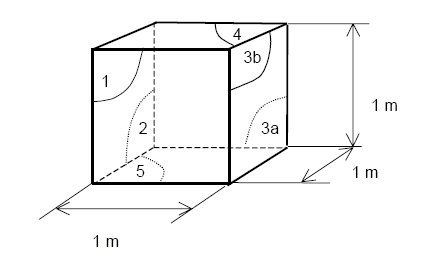

**Figure 5 Test IntRad-1 Geometry (Figure 9a, CEN 2004)**

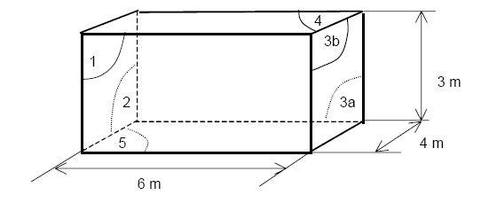

**Figure 6 Test IntRad-2 Geometry (Figure 9b, CEN 2004)**

**Figure 7 Test IntRad-3 Geometry (Figure 9c, CEN 2004)**

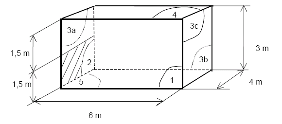

**Figure 8 Test IntRad-4 Geometry (Figure 9d, CEN 2004)**

## Sunlit Area of Window Tests

These tests require the modeling of six different combinations of a south and an east oriented window with different shading configurations. Figures 9 to 11 depict the configurations for each test. It would appear that the borders below and above the window in test Shade-1 are not correct and should be 0.5 m instead of 1.0 m so that they conform with the borders indicated in tests Shade-2 and Shade-3. When the 1.0 m border is used, the EnergyPlus results for this test are significantly different from those reported in the specification.

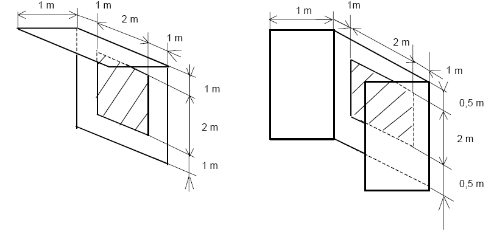

**Figure 9 Test Shade-1: South Orientation (left) and Test Shade-2: South Orientation (right) (Figures 10a and 10b, CEN 2004)**

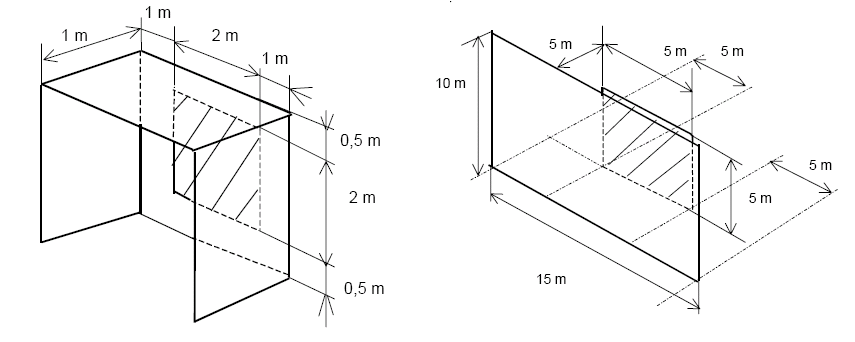

**Figure 10 Test Shade-3: South Orientation (left) and Test Shade-4: South Orientation (right) (Figures 10c and 10d, CEN 2004)**

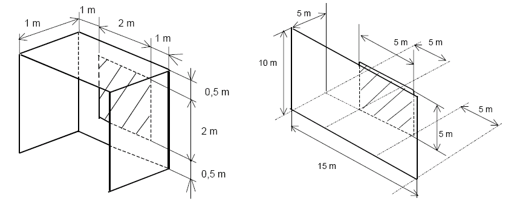

**Figure 11 Test Shade-5: East Orientation (left) and Test Shade-6: East Orientation (right) (Figures 10e and 10f, CEN 2004)**

For this test series the CEN Standard specifies the solar altitude and
solar azimuth angles in half-hour increments that are to be used.
Through a trial and error process and with help from other persons who
had performed these tests with other programs, it was determined that
the following coordinates gave solar altitude and azimuth angles very
close to those specified in the Standard. See Figures 12 and 13 for a
comparison of the CEN specified solar angles versus the EnergyPlus solar
angles.

> Latitude 52.0° North  
> Longitude 0.5° West  
> June 15

The validation requires comparison of the sunlit factors for each half-hour from 7:00 AM to 12:00 noon with an allowable tolerance of 0.05. The EnergyPlus results were within tolerance for all test cases as indicated in Figures 14 to 19.

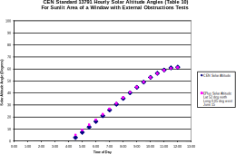

**Figure 12 EnergyPlus versus CEN Standard 13791 solar altitude angles for Sunlit Area of Window Test Cases**

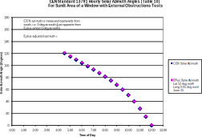

**Figure 13 EnergyPlus versus CEN Standard 13791 solar azimuth angles for Sunlit Area of Window Test Cases**

{{ engine.create_table_from_excel_range("CEN 13791 EnergyPlus Compare Results-DiffFloorCeil-FullSolar.xlsx", "Test Shade 1", "A1:E29", [0,1,2,3,21,22,23,24,25,26,27,28]) }}

{{ engine.write_chart('Scatter', 'Test Shade 1', '', [], [], 'CEN 13791 EnergyPlus Compare Results-DiffFloorCeil-FullSolar.xlsx', 'Test Shade 1', 'A8:C19', "(B8,A9:A19,B9:B19,1);(C8,A9:A19,C9:C19,2);", [], [], [], False) }}

**Figure 14 EnergyPlus Results for Test Shade-1**

{{ engine.create_table_from_excel_range("CEN 13791 EnergyPlus Compare Results-DiffFloorCeil-FullSolar.xlsx", "Test Shade 2", "A1:E21", [0,1,2,3,20]) }}

{{ engine.write_chart('Scatter', 'Test Shade 2', '', [], [], 'CEN 13791 EnergyPlus Compare Results-DiffFloorCeil-FullSolar.xlsx', 'Test Shade 2', 'A8:C19', "(B8,A9:A19,B9:B19,1);(C8,A9:A19,C9:C19,2);", [], [], [], False) }}

**Figure 15 EnergyPlus Results for Test Shade-2**

{{ engine.create_table_from_excel_range("CEN 13791 EnergyPlus Compare Results-DiffFloorCeil-FullSolar.xlsx", "Test Shade 3", "A1:E21", [0,1,2,3,20]) }}

{{ engine.write_chart('Scatter', 'Test Shade 3', '', [], [], 'CEN 13791 EnergyPlus Compare Results-DiffFloorCeil-FullSolar.xlsx', 'Test Shade 3', 'A8:C19', "(B8,A9:A19,B9:B19,1);(C8,A9:A19,C9:C19,2);", [], [], [], False) }}

**Figure 16 EnergyPlus Results for Test Shade-3**

{{ engine.create_table_from_excel_range("CEN 13791 EnergyPlus Compare Results-DiffFloorCeil-FullSolar.xlsx", "Test Shade 4", "A1:E21", [0,1,2,3,20]) }}

{{ engine.write_chart('Scatter', 'Test Shade 4', '', [], [], 'CEN 13791 EnergyPlus Compare Results-DiffFloorCeil-FullSolar.xlsx', 'Test Shade 4', 'A8:C19', "(B8,A9:A19,B9:B19,1);(C8,A9:A19,C9:C19,2);", [], [], [], False) }}

**Figure 17 EnergyPlus Results for Test Shade-4**

{{ engine.create_table_from_excel_range("CEN 13791 EnergyPlus Compare Results-DiffFloorCeil-FullSolar.xlsx", "Test Shade 5", "A1:E21", [0,1,2,3,20]) }}

{{ engine.write_chart('Scatter', 'Test Shade 5', '', [], [], 'CEN 13791 EnergyPlus Compare Results-DiffFloorCeil-FullSolar.xlsx', 'Test Shade 5', 'A8:C19', "(B8,A9:A19,B9:B19,1);(C8,A9:A19,C9:C19,2);", [], [], [], False) }}

**Figure 18 EnergyPlus Results for Test Shade-5**

{{ engine.create_table_from_excel_range("CEN 13791 EnergyPlus Compare Results-DiffFloorCeil-FullSolar.xlsx", "Test Shade 6", "A1:E21", [0,1,2,3,20]) }}

{{ engine.write_chart('Scatter', 'Test Shade 6', '', [], [], 'CEN 13791 EnergyPlus Compare Results-DiffFloorCeil-FullSolar.xlsx', 'Test Shade 6', 'A8:C19', "(B8,A9:A19,B9:B19,1);(C8,A9:A19,C9:C19,2);", [], [], [], False) }}

**Figure 19 EnergyPlus Results for Test Shade-6**

## Whole Calculation Method Tests

### Building Geometry and Construction

The last series of CEN tests requires the modeling of a single room
simulated for two geometries, three configurations of construction/boundary conditions, and three ventilation schedules. Each room geometry has a different window size and window type with external shades. The two room configurations designated as Geometry A and Geometry B are depicted below. The wall with the window is an exterior wall while the other 3 walls are partition walls adjacent to similar rooms. The floor and ceiling are also adjacent to similar rooms for the first two construction configurations but for the third configuration
the ceiling is a roof exposed to outdoor conditions.

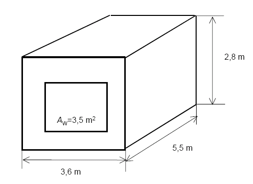

**Figure 20 Geometry A for Whole Calculation Method Test with West Window (Figure 11, CEN 2004)**

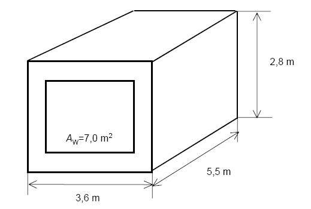

**Figure 21 Geometry B for Whole Calculation Method Test with West Window (Figure 12, CEN 2004)**

Several different construction types are used for the opaque surfaces
depending upon the configuration modeled. Each construction type is
described in Table 2 with their use in each of the two geometries indicated in Tables 3 and 4. It was assumed that in Tables 3 and 4 where the column titles specifying the type of construction are labeled “Partition vertical wall to similar room,” “Ceiling to similar room,” and “Floor to similar room” that this means that there is no temperature difference across these surfaces and therefore they should be modeled as adiabatic surfaces in EnergyPlus.

**Table 2 Description of Opaque Surface Constructions (Table 13, CEN 2004)**

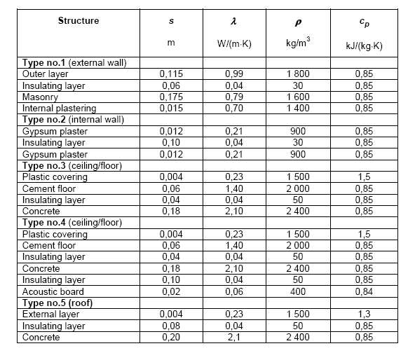

**Table 3 Description of Test Cases with Geometry A (Table 19, CEN 2004)**

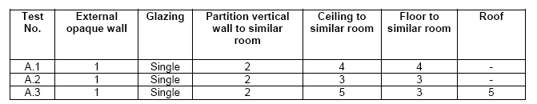

**Table 4 Description of Test Cases with Geometry B (Table 20, CEN 2004)**

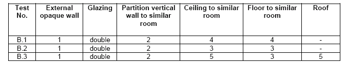

### Window Construction

The window used for Geometry A is single pane with an external shade (Figure 22) while the window used for Geometry B is double pane with an external shade (Figure 23). The external shade is completely closed but  does allow some solar radiation through.

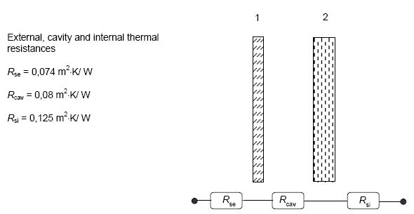

**Figure 22 Single Pane Window Properties for Geometry A (Figure 13, CEN 2004)**

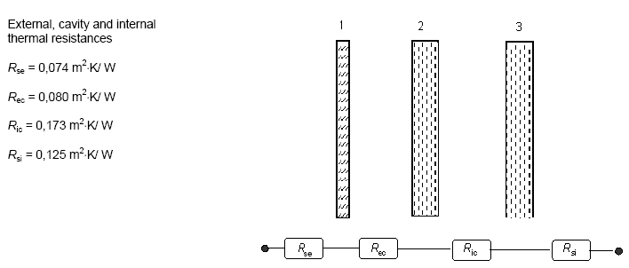

**Figure 23 Double Pane Window Properties for Geometry B (Figure 14, CEN 2004)**

The properties as specified in the Standard for the windows are as
follows:

- Geometry A Window (from outside to inside)
    - External surface resistance 0.074 $\frac{m^2K}{W}$  
    - External shade 0.2 solar transmittance  
    - 0.50 solar/visible reflectance (mislabeled in CEN Standard, Table 14 as long-wave radiative reflectance)  
    - Cavity resistance 0.08 $\frac{m^2K}{W}$  
    - Single pane glass 0.84 solar transmittance  
    - 0.08 solar/visible reflectance (mislabeled in CEN Standard, Table 14 as long-wave radiative reflectance)  
    - Internal surface resistance 0.125 $\frac{m^2K}{W}$

- Geometry B Window (from outside to inside)
    - External surface resistance 0.074 $\frac{m^2K}{W}$  
    - External shade 0.2 solar transmittance  
    - 0.50 solar/visible reflectance (mislabeled in CEN Standard, Table 14 as long-wave radiative reflectance)   
    - Cavity resistance 0.08 $\frac{m^2K}{W}$  
    - Single pane glass 0.84 solar transmittance  
    - 0.08 long-wave radiative reflectance  
    - Inner pane cavity resistance 0.173 $\frac{m^2K}{W}$  
    - Single pane glass 0.84 solar transmittance  
    - 0.08 solar/visible reflectance (mislabeled in CEN Standard, Table 14 as long-wave radiative reflectance)  
    - Internal surface resistance 0.125 $\frac{m^2K}{W}$

### Internal Loads

A single internal load is present within the room and is the same for all test cases. It is transferred to the room by convection and radiation in equal proportions (50% for each) according to the schedule shown in Table 5.

**Table 5 Heat Flow Due to Internal Sources Per Floor Area (Table 17, CEN 2004)**

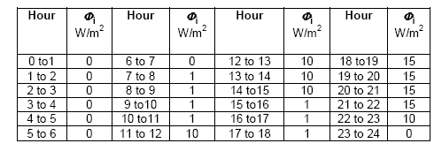

### Ventilation

Three different ventilation patterns were to be considered for each room
geometry and are described below in Table 6 as “a”, “b” and “c” in terms
of air changes per hour.

**Table 6 Ventilation Patterns in Air Changes Per Hour (Table 18, CEN 2004)**

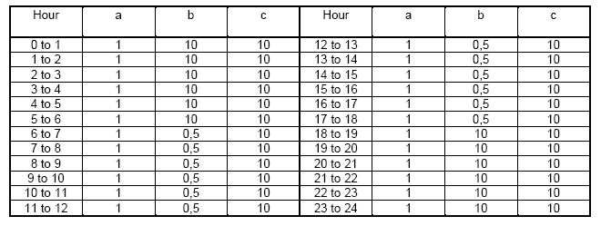

### Outdoor Temperature and Solar Data

No electronic weather files were provided with the Standard. Instead,
one-day hourly schedules for outdoor dry-bulb temperature (see Tables 7
and 8) and solar radiation (see Tables 9 and 10) were provided in tabular form for the Geometry A tests and Geometry B tests.

**Table 7 Outdoor Dry-Bulb Temperature Schedule for Geometry A (Table 16a, CEN 2004)**

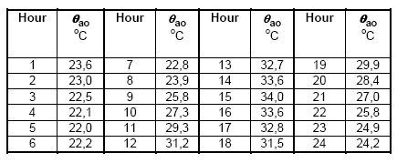

**Table 8 Outdoor Dry-Bulb Temperature Schedule for Geometry B (Table 16b, CEN 2004)**

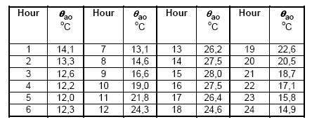

**Table 9 Solar Radiation Components for Geometry A (Table 15a, CEN 2004)**

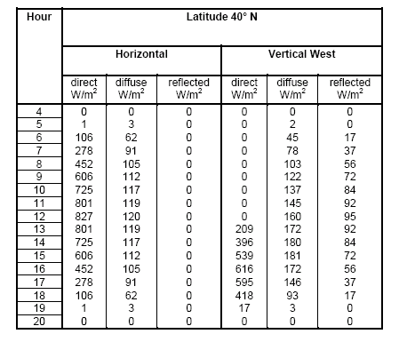

**Table 10 Solar Radiation Components for Geometry B (Table 15b, CEN 2004)**

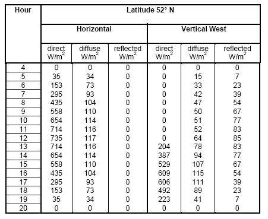

In order to communicate these temperature and solar data to EnergyPlus, use was made of the SizingPeriod:DesignDay object and the options for:

- Dry-bulb Temperature Range Modifier Schedule  
- Beam Solar Day Schedule  
- Diffuse Solar Day Schedule

Using a simulation TimeStep = 4, temperature, beam solar and diffuse
solar schedules were developed. The dry-bulb temperature data and the diffuse solar data did not present any modeling problems for EnergyPlus and a straight-forward method was used to create these values for quarter-hour increments using straight line interpolation. The beam solar data required further manipulation. The Standard provided direct solar data for a horizontal surface while EnergyPlus required beam (direct normal) solar data. Using the solar altitude angles from EnergyPlus for a Latitude 40° N and Longitude 0°, the horizontal direct solar data from Table 9 were manipulated to get the beam solar values required by EnergyPlus. A similar approach was used with the data in Table 10 to get the EnergyPlus beam solar data for 52°N Latitude. Figures 24 to 31 show comparisons of the CEN solar data to that used by EnergyPlus during the simulations for Geometry A and B tests. Good agreement is indicated for all except the diffuse solar data for the Vertical West as shown in Figure 27A. Comparing the CEN Vertical West Diffuse Solar for 40° N in Table 9 to the same data in Table 10 for 52°N seems to indicate that the former data is not correct. If you subtract
the Vertical West Reflected data in Table 9 from the Vertical West
Diffuse data in Table 9, you get more reasonable results as shown in
Figure 27B which compares more closely with the EnergyPlus data. So,
this appears to be a mistake in the specification that needs to be
corrected.

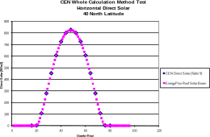

**Figure 24 Comparison of CEN Horizontal Direct Solar to EnergyPlus for Whole Calculation Method – Geometry A Tests**

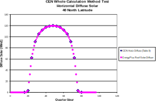

**Figure 25 Comparison of CEN Horizontal Diffuse Solar to EnergyPlus for Whole Calculation Method – Geometry A Tests**

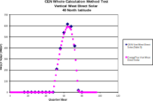

**Figure 26 Comparison of CEN Vertical West Direct Solar to EnergyPlus for Whole Calculation Method – Geometry A  Tests**

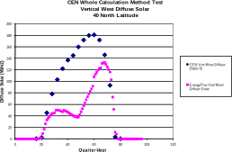

**Figure 27A Comparison of CEN Vertical West Diffuse Solar to EnergyPlus for Whole Calculation Method – Geometry A Tests**

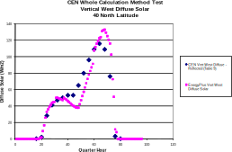

**Figure 27B Same as Figure 27A but with the CEN Vertical West Diffuse Solar adjusted by Subtracting Off the CEN Vertical West Reflected Solar from Table 9**

**Figure 28 Comparison of CEN Horizontal Direct Solar to EnergyPlus for Whole Calculation Method – Geometry B Tests**

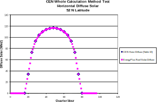

**Figure 29 Comparison of CEN Horizontal Diffuse Solar to EnergyPlus for Whole Calculation Method – Geometry B Tests**

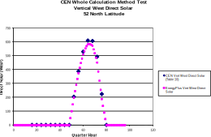

**Figure 30 Comparison of CEN Vertical West Direct Solar to EnergyPlus for Whole Calculation Method – Geometry B Tests**

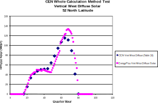

**Figure 31 Comparison of CEN Vertical West Diffuse Solar to EnergyPlus for Whole Calculation Method – Geometry B Tests**

Since there was no way to directly input into EnergyPlus the vertical west ground reflected data in Tables 9 and 10, a ground reflectivity was determined using the following equation:

> $GroundReflectivity=\frac{2\cdot Reflected}{Horizontal Direct+HorizontalDiffuse}$

For both the 40° N latitude and 52° N latitude cases the calculated ground reflectivity for each hour when the sun was up was 0.2. This was then specified by using the EnergyPlus Site:GroundReflectance object and
for the Vertical West surface and window setting the View Factor to Ground to 0.5.

### Window Modeling

To model windows in EnergyPlus, the physical, thermal and solar properties of each window pane is required, i.e. thickness (m), conductivity (W/m-K), and solar and infrared reflectance and transmittance at normal incidence. And where multi-pane windows are used, the thickness of the gap and type of gas between panes are required. The windows specified in the CEN Standard for the Whole Calculation Method test cases are non-standard type windows since the window panes were assumed to have zero thermal resistance and solar transmittance and reflectance were constant and did not change with angle of incidence. Instead of the physical properties of the glazing and gap being specified, the resistances on either side of the window pane(s) were given which required additional assumptions or approximations to match these specifications in EnergyPlus. Some of these are discussed below:

- Thermal resistance of the window pane glass is specified to be zero
    (ref. Section 7.3.4 of Standard) – This was modeled in EnergyPlus by
    setting the conductivity in the WindowMaterial:Glazing object to a
    large value, i.e. 100.

- Window external, cavity and internal thermal resistances (see
    Figures 22 and 23) – Thermal resistances as shown below were
    specified for the single pane and double pane windows where 1 is the
    external shade, 2 is the external pane and 3 is the internal pane.
    The external and internal films for the window were specified in
    EnergyPlus using the SurfaceProperty:ConvectionCoefficients object
    where the inside and outside coefficients were set to

    > $h_{in}=\frac{1}{0.074+0.080}=6.5 \frac{W}{m^2K}$
    >
    > $h_{out}=\frac{1}{0.125}=8.0 \frac{W}{m^2K}$

- Other Window Properties (ref. Table 14 and Section 7.3.5 of
    Standard) – In order to satisfy the requirements for the window pane
    to have a solar transmittance of 0.84 and the solar/visible
    reflectance (which we believe has been mislabeled long-wave
    radiative reflectance) of 0.08 and the requirement for the solar
    loss factor of the room to be 0.0, the inputs for the glazing
    element were set using the EnergyPlus WindowMaterial:Glazing object
    as follows:

        WindowMaterial:Glazing,
         Glass Type 1, !- Name  
         SpectralAverage, !- Optical Data Type  
         , !- Window Glass Spectral Data Set Name  
         0.003175, !- Thickness {m}  
         0.84, !- Solar Transmittance at Normal Incidence  
         0.08, !- Front Side Solar Reflectance at Normal Incidence  
         0.08, !- Back Side Solar Reflectance at Normal Incidence  
         0.84, !- Visible Transmittance at Normal Incidence  
         0.08, !- Front Side Visible Reflectance at Normal Incidence  
         0.08, !- Back Side Visible Reflectance at Normal Incidence  
         0.0, !- Infrared Transmittance at Normal Incidence  
         0.000001, !- Front Side Infrared Hemispherical Emissivity  
         0.000001, !- Back Side Infrared Hemispherical Emissivity  
         100.; !- Conductivity { $\frac{W}{mK}$ }

- Double Pane Window Gap Resistance (see Figure 23) – the Standard
    specifies the gap resistance for the double pane window to be 0.173
    m2-K/W. Window gaps in EnergyPlus are specified using the
    WindowMaterial:Gas object by specifying the type of gas and
    thickness of the gap, and the overall resistance of the gap varies
    with the temperature difference across the gap. The Standard
    specifies a fixed resistance for the air gap. For EnergyPlus, a gas
    type of AIR was assumed. From the EnergyPlus EIO file the details of
    the various surface constructions are reported when the Construction
    Report option is turned on. The nominal conductance of the window
    construction (glazing plus gaps plus films) is reported for the
    double pane window. With the Standard specifying the window pane
    resistance as 0.0 and the gap between panes resistance as 0.173
    m2-K/W along with film resistances (see Figure 23), the resulting
    conductance of the overall window system is 1/0.452 = 2.21 W/m2-K.
    The gap (window gas material) thickness was adjusted to match the
    nominal overall conductance. A thickness of 2.4mm gave an overall
    nominal window system conductance of 2.22 W/m2-K.

- External Window Shade (ref. Table 14 and Section 7.3.9 of Standard)
    – This was modeled in EnergyPlus using the Shading:Building:Detailed
    object with a shade surface the same size as the window located
    0.02m in front of the window with a transmittance of 0.2. EnergyPlus
    also has a window shade option, but there is no direct control of
    the resistance of the air gap between the window glass and shade as
    specified in the Standard. The Shading:Building:Detailed object is
    only a shading device, so this allowed the shade gap resistance to
    be added as part of the exterior convection coefficient.

- Room Solar Loss Factor (ref. Section 7.3.5 of Standard) – the solar
    loss factor of the room is specified to be 0.0. In order to model
    this condition the solar absorptance of the room internal surfaces
    (walls, ceiling and floor) were set to 1.0 so there would be no
    reflected solar within the room which could then escape back out the
    window.

### Results

The results obtained from EnergyPlus for the Whole Calculation Method
test cases are shown in Tables 11 and 12. Although simulations were run
with both Timestep = 6 and Timestep = 60, results are shown for Timestep
= 60, one reason being that better agreement with the reference results
was achieved with this approach for the conduction tests (see Figures 1
through 4). For Geometry A, the maximum operative temperature was within
acceptable tolerance for all but four cases. The resulting minimum
operative temperatures for these cases were all lower than the target
Standard values by at least 1.5°C. This would seem to indicate that the
EnergyPlus overall window conductance is too high thus giving min temperatures that are too low which in turn lowers the average temperatures. For three cases the average temperature was within
tolerance with one other case only out of bounds by 0.1°C.

For Geometry B, very few of the test cases were within the allowable
tolerance. The min and max temperatures were the farthest out of tolerance indicating that EnergyPlus may not be modeling the double pane window system in the same way that the specification did. Other assumptions that were discussed above that EnergyPlus also probably contribute to the differences.

**Table 11 Results for Geometry A Tests**

{{ engine.create_table_from_excel_range("CEN 13791 EnergyPlus Compare Results-DiffFloorCeil-FullSolar.xlsx", "Whole Calc Method-Case A", "A1:Q22", [0,1,2,3,4,21]) }}

**Table 12 Results for Geometry B Tests**

{{ engine.create_table_from_excel_range("CEN 13791 EnergyPlus Compare Results-DiffFloorCeil-FullSolar.xlsx", "Whole Calc Method-Case B-2.4mm", "A1:Q22", [0,1,2,3,4,21]) }}

# Conclusions

EnergyPlus version {{ engine.config["EnergyPlusVersion"] }} was used to model the test cases described in
CEN Standard 13791 titled Thermal Performance of Buildings – Calculation
of Internal Temperatures of a Room in Summer Without Mechanical Cooling
– General Criteria and Validation Procedures. Four types of tests were
conducted for:

- Heat conduction through opaque elements (4 test cases)  
- Internal long-wave radiation exchanges (4 test cases)  
- Sunlit area of a window due to external obstructions (6 test cases)  
- Whole calculation method (18 test cases)

No changes to the EnergyPlus source code were made to model all of the tests specified in Standard CEN 13791. Various inputs however had to be forced in non-standard ways to meet the test specifications as closely as possible. The specification presents reference results and acceptable tolerances for each test. EnergyPlus results were within the tolerance limits except as discussed below:

- For the Heat Conduction through Opaque Elements tests
    - All results were within tolerance limits except for test case COND-2 where the result for 2 hours after start was just outside the tolerance limit. Case COND-2 differs from the other cases due to its light weight construction, i.e. single layer construction with density of 50 $\frac{kg}{m^3}$, whereas the other cases all have a construction layer of 2000 $\frac{kg}{m^3}$ .
  
- For the Internal Long-Wave Radiation Exchange tests  
    - All results were within tolerance limits.

- For the Sunlit Area of Window Due to External Obstructions tests 
    - All results were within tolerance limits.

- For the Whole Calculation Method tests  
    - For the nine Geometry A test cases, results for maximum operative  temperature were within tolerance limits for 5 of the nine cases. For  operative average temperature, three out of nine cases were within tolerance. None of the minimum operative temperatures for the nine cases were within tolerance.

    - For the nine Geometry B test cases, one case for maximum operative temperature and two cases for average operative temperatures were within tolerance limits.

# References

CEN 2004. *Thermal Performance of Buildings – Calculation of Internal Temperatures of a Room in Summer Without Mechanical Cooling – General Criteria and Validation Procedures,* EN ISO 13791, European Committee for Standardization, November 2004

Strachan, P., Kokogiannakis, G., Macdonald, , and Beausoleil-Morrison,
I. *Integrated Comparative Validation Tests as an Aid for Building Simulation Tool Users and Developers*, ASHRAE Transactions, Volume 112, Part 2, July 2006, American Society of Heating, Refrigerating and Air-Conditioning Engineers.

Kokogiannakis, G., *Support for the Integration of Simulation in the European Energy Performance of Building Directive*, Ph.D. Thesis, December 2008.

EnergyPlus 2014. Department of Energy, Energy Efficiency and Renewable
Energy, Office of Building Technologies.
[www.energyplus.gov](http://www.energyplus.gov)

