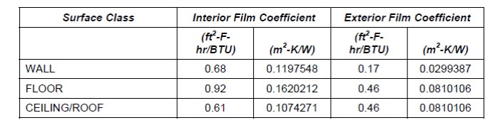

Automatically Generated {{ engine.month_year() }}

Originally Prepared by
R. Henninger & M. Witte, GARD Analytics, Inc.  

# Introduction

**Software:** EnergyPlus Version {{ engine.config["EnergyPlusVersion"] }}  
**Authoring Organization:** Department of Energy, Energy Efficiency and Renewable Energy, Office of Building Technologies  
**Authoring Country:** USA

This report describes progress thus far for modeling tests which are part of the Chartered Institution of Building Services Engineers (CIBSE) standard TM33: 2006 using the EnergyPlus software. The specifications for the test suite are described in *Tests for Software Accreditation and Verification, CIBSE TM33: 2006, April 2006* (referred to as the specification in this report).

# Description of Tests

The TM33 test suite consists of the following test cases:

- Test G1: Databases - tests the building material thermal properties for
several materials, climate data for three locations, and internal load
schedules that are packaged electronically within programs and compares them to acceptable values

- Test G2: Solar Position – tests that a program can correctly calculate the position of the sun in the sky with respect to the building’s location and the time of year

- Test G3: Basic Thermal Calculations – tests a program’s ability to calculate both the steady state and transient response of a range of heavyweight and lightweight constructions

- Test G4: Solar Shading – demonstrates that a program can account for the
shading effect of neighboring buildings, balconies, awnings, fins, overhangs, and other devices obstructing the solar gain to a building

- Test G5: Glazing Properties – tests that a program can calculate the
g-value for typical glazing configurations

- Test G6: Steady State Heat Loss from Rooms – tests that a program can
calculate the steady-state heat loss from a room with and without
neighboring rooms and with infiltration/ventilation

-  Test G7: Annual Cooling and Heating Demand – tests a program’s ability
to calculate annual space heating and cooling loads due to external
climate alone for a period of one year using a simple one-story two-zone
building

- Test G8: Overheating Risk – tests the calculation of internal temperature when there is no heating or cooling

- Test G9: Infiltration and Ventilation – this test is appropriate for programs that use airflow networks to model air exchange

- Test G10: Air Handling Unit Test – this test is appropriate for programs
that use component plant models for the calculation of cooling and heating demand and fan energy consumption

Details and specifications for each of these tests are described in Section 2 General Purpose Tests of the specification.

# Progress to Date

EnergyPlus models have been developed for all Test Cases. Tests G7 and G10 require the use of a CIBSE TM33 Test Reference Year weather file which is provided by CIBSE. We have had considerable trouble determining
whether the weather file provided by CIBSE is indeed the weather file
which was used to generate the results shown in the specification. Consequently, the EnergyPlus results for G7 and G10 are questionable.
Test G8 requires a CIBSE Design Summer Year weather file which has not
been obtained yet.

# Results to Date

The specification presents reference results and acceptable tolerances
for each test. The following pages present the EnergyPlus results along
with the reference results and an indication as to whether the
EnergyPlus results are within acceptable tolerances.
 

## Test G2: Solar Position

Good agreement was obtained between EnergyPlus and the Reference results
with all EnergyPlus values being within the allowed tolerance limits for all test cases. See comparison table below.

## Test G3.1: Derived Properties

Test G3.1 required the reporting of the transmittance value or (U-value)
calculated by the program for various constructions. EnergyPlus calculates and reports a thermal conductance or Nominal U-Value for each construction with film coefficients included. For opaque surfaces, interior and exterior film coefficients are added to the surface
construction based on the prescribed R-values for interior and exterior
film coefficients as found in ASHRAE 90.1-2004, Appendix A as shown
below.

Since these values differ from those specified in Table 2.11 of the CIBSE TM33 test specification, the Nominal U-Value calculated and reported by EnergyPlus for each construction had to be adjusted by first removing the interior and exterior film coefficients used by EnergyPlus and then adding back in the surface resistance values as specified in Table 2.11 of the TM33 specification. These adjusted results are reported below for EnergyPlus for Test G3.1.

For windows, the “Nominal U with film coeffs” that EnergyPlus calculates
and reports uses the following assumptions from the WINDOW 5 program
(also NFRC winter conditions):

 - Indoor air temperature = 21 C  
 - Outdoor air temperature = -18 C  
 - Exterior film coefficient = 26 $\frac{w}{m^2}$  
 - Interior film coefficient = Calculated by EnergyPlus convection algorithm  
 - No incident solar beam radiation

Because these conditions do not correspond to those required by the TM33
spec, it is not possible to report EnergyPlus values for the window
constructions in Test G3.1.

## Test G3.2: Dynamic Conduction

Good agreement was obtained between EnergyPlus and the Reference results
with all EnergyPlus values being within the allowed tolerance limits except for Test Case G3.2.2, at the 2 hour mark which was just slightly out of range. EnergyPlus results are shown for both Timestep=6 and Timestep=60. The latter gave better agreement with the reference
results.

## Test G4: Solar Shading

Good agreement was obtained between EnergyPlus and the Reference results
with all EnergyPlus values being within the allowed tolerance limits for all test cases.

## Test G6: Steady State Heat Loss from Rooms

EnergyPlus gave mixed results for the Test G6 series of test cases which
may due in part to the modeling approach taken and assumptions made about certain inputs required by EnergyPlus that were not completely specified by the CIBSE document. Various issues are discussed below.

- In order to perform this test the EnergyPlus ZoneHVAC:Baseboard:RadiantConvective:Electric object was used. This
    object requires as input the fraction of the total radiant baseboard
    output that is incident on each surface and on people. The people
    radiant fraction was set to zero since there were no people present
    and the fraction of radiant energy incident on each surface was
    apportioned based on the surface area. There were several places
    where the specification’s instructions were unclear and assumptions
    had to be made:

-  For external surfaces, EnergyPlus does not normally allow the
    external surface temperature to be set to a specific value.
    EnergyPlus has an option called “OtherSideCoefficients” to specify
    an outside surface temperature, but it was not clear if the window
    model would accept this. The method selected for this test was to
    specify the outdoor air temperature as -4C. In order to approach
    the -4C external surface temperature that the specification called
    for, the external surface convection coefficient was set equal to
    1000 $\frac{W}{m^2K}$, the highest value allowed by EnergyPlus. The resulting external surface temperature was -3.98C for the external wall
    (Surface 4 in Tests A1and A2 and Surfaces 2,3 and 4 in Tests B1 and
    B2) and -3.92C for the window (Surface 7 in Tests A1, A2, B1 and
    B2).

-  It was not clear what the window construction was to be for these
    tests. Table 2.19 specified the window construction type for Tests
    A1 and A2 as “Window” while Table 2.20 specified the window
    construction type for Tests B1 and B2 as “Window 1”. It was assumed
    that the window construction to be used was that specified as
    “Window 1” in Test G3.1 (Table 2.10 in the specification). This
    construction was a double pane window with clear glass and an air
    gap with a thermal resistance of 0.16 m2-K/W. For window gas-filled
    spaces, EnergyPlus requires the gap thickness (mm) to be input
    rather than the thermal resistance. It was assumed that the air gap
    thickness for this window construction was 0.12 mm.

-  In order to lockout any radiation exchange on the outside of the
    window while allowing the internal window surface emissivity to be
    set to 0.8 as specified in Table 2.19 and 2.20 of the specification,
    the front side and back side infrared hemispherical emissivities for each pane of glass were set as follows:

    > Inside Pane 
    >  
    >  - Front-side infrared hemispherical emissivity = 0.8 (Table 2.19 and 2.20 of spec)  
    >  - Back-side infrared hemispherical emissivity = 0.8 (Table 2.19 and 2.20 of spec)  
    >  
    > Outside pane 
    >  
    >  - Front-side infrared hemispherical emissivity = 0.01  
    >  - Back-side infrared hemispherical emissivity = 0.8 (Table 2.19 and 2.20 of spec)

-  Although the infiltration rates of 0.25 ACH (Tests A1 and A2) and
    1.0 ACH (Tests B1 and B2) were set in EnergyPlus as required by the
    specification, the resulting space infiltration heat loss as
    reported by EnergyPlus uses the outdoor mass flow rate rather than
    the indoor air mass flow rate used by the CIBSE TM33. The EnergyPlus
    infiltration heat losses differ from the Reference heat losses by as
    much as 8.7% for Tests A1 and A2 and by as much as 10.5% for Tests
    B1 and B2.

- The specification states that for these tests the zone is to be maintained at a dry resultant temperature of 21C. CIBSE defines the dry resultant temperature ( $T_{dry}$ ) as a combination of the inside air temperature ( $T_{ai}$ ) and the mean radiant temperature ( $T_{rm}$ )which when indoor air velocities are less than 0.1 m/s, is  

    > $T_{dry}=0.5T_{ai}+0.5T_{rm}$  
  
    which is referred to as Operative Temperature in EnergyPlus. Proper zone temperature control in EnergyPlus for these tests therefore  required the use of the ZoneControl:Thermostat:OperativeTemperature object. The Reference zone temperature to be compared to in Table 2.21 of the specification corresponded to the EnergyPlus Zone Mean Air  Temperature.

## Test G7: Annual Cooling and Heating Demand

Good agreement was obtained between EnergyPlus and the Reference results
for the heating demand cases but cooling demand results were much lower
than the Reference results indicating that something may be in error
with the EnergyPlus model for simulating cooling.

## Test G9: Infiltration and Ventilation

For this test case the EnergyPlus Airflow Network objects were used to
simulate this case. Mixed results were obtained here with 28 of the 40
cases showing acceptable results.

## Test G10: Air Handling Unit Test

For this test the EnergyPlus IdealLoadsAirSystem object was used.
Several of these cases require limiting the zone humidity level to
certain maximum limits which the IdealLoadsAior System was having
problems doing. This problem is being investigated. No results for Test
G10 are shown.

# Comparison of Results

{{ engine.create_table_from_excel_range("Comparison of Results-v8.2.0.xlsx", "Test G2", "A1:N25", [0,1,2] )}}

----------------------------

{{ engine.create_table_from_excel_range("Comparison of Results-v8.2.0.xlsx", "Test G3.1", "B1:K61", [0,1,2,25,24,23,22,54,45,30]) }}

----------------------------

{{ engine.create_table_from_excel_range("Comparison of Results-v8.2.0.xlsx", "Test G3.2", "A1:L43", [0,1,2]) }}

----------------------------

{{ engine.create_table_from_excel_range("Comparison of Results-v8.2.0.xlsx", "Test G4", "A1:N50", [0,1,2]) }}

----------------------------

{{ engine.create_table_from_excel_range("Comparison of Results-v8.2.0.xlsx", "Test G5", "A1:K42", [0,1,2,41,40,39,38]) }}

----------------------------

{{ engine.create_table_from_excel_range("Comparison of Results-v8.2.0.xlsx", "Test G6", "A1:U73", [0,1,2,3]) }}

----------------------------

{{ engine.create_table_from_excel_range("Comparison of Results-v8.2.0.xlsx", "Test G7-CIBSE Weather", "A1:F39", [0,1,2,3,4,38,37]) }}

----------------------------

{{ engine.create_table_from_excel_range("Comparison of Results-v8.2.0.xlsx", "Test G9-Infil+Vent", "A1:J73", [0,1,2,3,72]) }}

