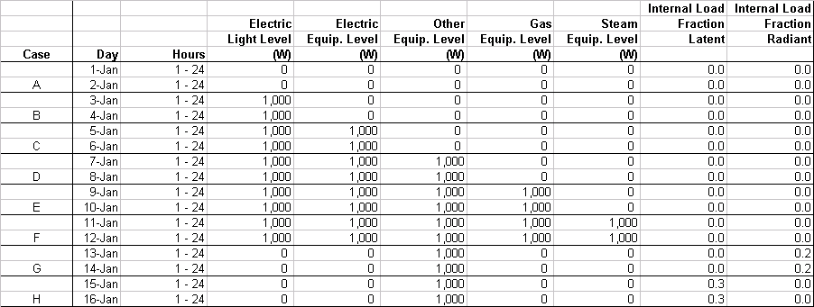
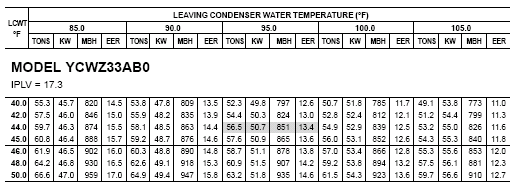

EnergyPlus Version {{ engine.config["EnergyPlusVersion"] }}  
Automatically Generated {{ engine.month_year() }}

Prepared for:

U.S. Department of Energy  
Energy Efficiency and Renewable Energy  
Office of Building Technologies  
Washington, D.C.

Originally Prepared by:  
Robert H. Henninger and Michael J. Witte  
GARD Analytics, Inc.  
115 S. Wilke Road, Suite 115  
Arlington Heights, IL 60005  
USA   
www.gard.com

This report was developed based upon funding from the Alliance for Sustainable
Energy, LLC, Managing and Operating Contractor for the National Renewable
Energy Laboratory for the U.S. Department of Energy. Any opinions, findings,
and conclusions or recommendations expressed in this material are those of the
author(s) and do not necessarily reflect those of the sponsor. Earlier work was
supported by the Ernest Orlando Lawrence Berkeley National Laboratory, and by
the National Energy Technology Laboratory and the National Renewable Energy
Laboratory by subcontract through the University of Central Florida/Florida
Solar Energy Center.

This report was prepared as an account of work sponsored by an agency of the
United States Government. Neither the United States Government nor any agency
thereof, nor any of their employees, makes any warranty, express or implied, or
assumes any legal liability or responsibility for the accuracy, completeness,
or usefulness of any information, apparatus, product, or process disclosed, or
represents that its use would not infringe privately owned rights. Reference
herein to any specific commercial product, process, or services by trade name,
trademark, manufacturer, or otherwise does not necessarily constitute or imply
its endorsement, recommendation, or favoring by the United States Government or
any agency thereof. The views and opinions of authors expressed herein do not
necessarily state or reflect those of the United States Government or any
agency thereof.

# Test Objectives and Overview

## Test Type: Comparative

The EnergyPlus Global Energy Balance Test checks the accuracy of EnergyPlus in
regards to energy balances at various boundary volumes when simulating the
operation of HVAC systems and equipment. The test procedure makes use of
ANSI/ASHRAE Standard 140-2011 procedures for generating hourly equipment loads
and ASHRAE Standard 140-2011 weather files. The test suites described within
this report are for testing of:

- EnergyPlus DX cooling system referred to within EnergyPlus by the object named ZoneHVAC:WindowAirConditioner with electric baseboard heat (ZoneHVAC:Baseboard:Convective:Electric)

- EnergyPlus hydronic heating/cooling system which utilizes chilled water, hot water and condenser water loops along with an electric chiller (Chiller:Electric:EIR), cooling tower (CoolingTower:SingleSpeed), and gas-fired boiler (Boiler:HotWater to provide cooling and heating to a 4-pipe fan coil system (ZoneHVAC:FourPipeFanCoil).

## Test Suite: EnergyPlus Global Energy Balance Test Description

The EnergyPlus Global Energy Balance Test makes use of the basic test
building geometry and envelope described as Case E100 in Section 5.3.1
of ANSI/ASHRAE Standard 140-2011, *Standard Method of Test for the Evaluation of Building Energy Analysis Computer* Programs.

### Base Case Building Description

The basic test building (Figure 1) is a rectangular 48 $m^2$ single zone (8 m
wide x 6 m long x 2.7 m high) with no interior partitions and no windows. The
building as specified in Standard 140 is intended as a near-adiabatic cell with
cooling and heating loads driven by user specified internal gains. For Global
Energy Balance Test purposes, the building envelope is made totally adiabatic
so that the cooling or heating load in the space during any hour of the
simulation is solely due to internal loads. How this was done in EnergyPlus is
discussed further in Section 1.2.2. Material properties for the building
envelope as specified in Standard 140 are described below. For further details
on building geometry and building envelope thermal properties refer to Section
5.3.1 of ANSI/ASHRAE Standard 140.

Figure 1 Base Building Geometry - Isometric View of Southeast Corner

**Wall, Roof and Floor Construction:**

<table>
<tr>
  <th>Element</th>
  <th>k ( $\frac{W}{mK}$ )</th>
  <th>Thickness (m)</th>
  <th>U ( $\frac{W}{m^2K}$ )</th>
  <th>R ( $\frac{m^2K}{W}$ )</th>
</tr>
<tr>
  <td>Int. Surface Coeff.</td>
  <td></td>
  <td></td>
  <td>8.290</td>
  <td>0.121</td>
</tr>
<tr>
  <td>Insulation</td>
  <td>0.010</td>
  <td>1.000</td>
  <td>0.010</td>
  <td>100.000</td>
</tr>
<tr>
  <td>Ext. Surface Coeff.</td>
  <td></td>
  <td></td>
  <td>29.300</td>
  <td>0.034</td>
</tr>
<tr>
  <td></td>
  <td></td>
  <td></td>
  <td></td>
  <td></td>
</tr>
<tr>
  <td>Overall, air-to-air</td>
  <td></td>
  <td></td>
  <td>0.010</td>
  <td>100.155</td>
</tr>
</table>

**Opaque Surface Radiative Properties:**

<table>
<tr>
  <th></th>
  <th>Interior Surface</th>
  <th>Exterior Surface</th>
</tr>
<tr>
  <td>Solar Absorptance</td>
  <td>0.6</td>
  <td>0.1</td>
</tr>
<tr>
  <td>Infrared Emittance</td>
  <td>0.9</td>
  <td>0.9</td>
</tr>
</table>

**Infiltration:** None

### Adiabatic Surfaces

An opaque exterior surface can be made adiabatic in EnergyPlus by specifying
the outside face environment of the exterior surface to be another surface and
then setting the object of the outside face environment to be the exterior
surface itself. In other words, the surface is forced to see itself. As an
example, the input stream for specifying the east facing exterior wall as an
adiabatic surface is as follows:

    BuildingSurface:Detailed,  
     ZONE SURFACE EAST, !- Name  
     WALL, !- Surface Type  
     LTWALL, !- Construction Name  
     ZONE ONE, !- Zone Name  
     Surface, !- Outside Boundary Condition  
     ZONE SURFACE EAST, !- Outside Boundary Condition Object  
     NoSun, !- Sun Exposure  
     NoWind, !- Wind Exposure  
     0.0, !- View Factor to Ground  
     4, !- Number of Vertices  
     8.00, 0.00, 2.70, !- X,Y,Z ==> Vertex 1 {m}  
     8.00, 0.00, 0.00, !- X,Y,Z ==> Vertex 2 {m}  
     8.00, 6.00, 0.00, !- X,Y,Z ==> Vertex 3 {m}  
     8.00, 6.00, 2.70; !- X,Y,Z ==> Vertex 4 {m}  

This approach was used on all 6 exterior surfaces of the of the Base
Case building to make the building exterior adiabatic and ensure that
the resulting cooling load or heating load in the space each hour was
always exactly equal to the total of the internal space gains.

## Window Air Conditioner Global Energy Balance Test

### Internal Loads

Two different types of tests were conducted with varying internal loads:
a limited daily comparison test with cooling only and an annual comparison test with cooling and heating.

#### Daily Comparison Test

In order to create a cooling load for the cooling system, various internal gain
scenarios are imposed on the building interior space according to a fixed
schedule which holds the internal load constant throughout a certain test
duration. Five types of internal loads (lights, electric equipment, other
equipment, gas equipment and steam equipment) which can be modeled by
EnergyPlus are tested for sensible, latent, radiant, convective, etc. fractions
to test the program’s ability to properly transfer these space loads to the
HVAC system. Table 1 describes eight test cases (A through H), each of two day
duration, and the internal load schedule by day of the simulation. The first
day of each case is simulated to allow steady state to be achieved. Energy
balances are then done for the second day of each test case. Zone internal
gains are assumed to be distributed evenly throughout the zone air. These are
internally generated sources of heat that are not related to the operation of
the mechanical cooling system or its air distribution fan.

#### Annual Comparison Test

A second test was also performed with internal loads that created either a
heating load or cooling load in the space for each month over a 12 month
period. A constant space cooling load of 1,000 W/hr was scheduled for the
cooling season which ran from May 1st through September 30th. A constant space
heating load of –1,000 W/hr was scheduled for the heating season which ran from
January 1st through April 30th and October 1st through December 31st. Zone
internal gains are assumed to be distributed evenly throughout the zone air.
These are internally generated sources of heat that are not related to the
operation of the mechanical cooling system or its air distribution fan. Table 2
describes the internal load schedules used for each month of the test (Test
Cases I through T).

T**able 1 Schedule of Internal Loads for Daily Test Cases – Window AC System**

**Table 2 Schedule of Internal Loads for Annual Test Case – Window AC System with Baseboard Heat**

### Air Distribution System

A simple and ideal air distribution system is used with the following
characteristics to provide whatever cooling the space needs in order to
maintain the setpoint temperature:

- 100% convective air system
- 100% efficient with no duct losses and no capacity limitation
- Zone air is perfectly mixed
- Supply air fan has the following characteristics
    - Cycles on when compressor operates
    - Flow rate = 0.425 $\frac{m^3}{s}$
    - Located in the air stream and adds heat to the air stream
    - Fan efficiency = 0.5
    - Delta pressure = 10 Pa
    - Motor efficiency = 0.9
- No outside air; no exhaust air
- Non-proportional-type thermostat, heat always off, cooling on if zone air temperature 22.2°C (72°F)

### HVAC Cooling System

The mechanical cooling system specified in Standard 140 is a simple unitary
vapor compression cooling system with air cooled condenser and indoor
evaporator coil, 100% convective air system, no outside air or exhaust air,
single speed, draw-through air distribution fan, indoor and outdoor fans cycle
on/off with compressor, no cylinder unloading, no hot gas bypass, crankcase
heater and other auxiliary energy = 0. Performance characteristics at ARI
rating conditions of 35.0°C outdoor dry-bulb, 26.7°C cooling coil entering
dry-bulb and 19.4°C cooling coil entering wet-bulb as presented in Table 26c of
Standard 140 is:

- Gross Total Capacity 8,818 W  
- Airflow 0.425 $\frac{m^3}{s}$  
- Compressor Power 1858 W  
- Outdoor Fan Power 108 W  
- Indoor Fan Power 230 W  
- COP (includes outdoor fan) 4.16

### Zone Heating System

For the annual comparison test, an electric baseboard convective heating
system was added to the zone to provide any hourly heating that the zone
required. The heating capacity of the baseboard was set to 1100 W and
was assumed to be 100% efficient.

### Weather Data

#### Daily Comparison Test

A three-month long (January – March) TMY format weather file provided as part
of ANSI/ASHRAE Standard 140-2011 with the file name of CE100A.TM2 was used for
the daily test case simulations. The outdoor dry-bulb temperature of 46.1°C is
constant for every hour of the three-month long period.

#### Annual Comparison Test

For the 12 month annual simulation test case, a TMY2 format weather file for
Chicago O’hare converted to EnergyPlus epw format (IL\_Chicago\_TMY2.epw) was
used for the simulation.

### Summary of Test Cases

Eight test cases (A through H) as summarized in Table 1 are designed to
test the accuracy of the EnergyPlus Window AC system to handle internal
space gains and the ability of the cooling system to satisfy these
loads. Twelve additional test cases (I through T) as summarized in Table
2 perform a similar series of tests but for a one year period.

### Simulation and Reporting Period

A 16 day simulation period from January 1 through January 16 was used to cover
the full range of scheduled internal loads as described in Table 1. The 12
month annual simulation period which used the internal load schedule described
in Table 2 was January 1 through December 31.

### Output Data Requirements

The following hourly output data as a minimum are required to test the
accuracy of EnergyPlus using the Global Energy Balance Test:

- Hourly internal load (sensible, latent and total) for each type of internal space gain which is present in Wh
- Hourly space cooling load (sensible, latent and total) in Wh
- Hourly amount of cooling performed by the DX cooling coil (sensible, latent and total) in Wh
- Hourly HVAC system cooling (sensible, latent and total) delivered to the space in Wh
- Hourly resulting space temperature in C
- Hourly electric cooling energy used by the HVAC system
- Hourly electric energy used by the HVAC system supply fan

## Hydronic Heating/Cooling System Global Energy Balance Test

Similar to the Global Energy Balance Test described in Section 1.3 for
the Window Air Conditioner, a limited daily comparison test and annual
comparison test with varying internal space loads are also prescribed
for a typical hydronic heating/cooling system as further described below
which contains:

- Hot water loop containing:
    - Simple hot water boiler
    - Hot water pump

- Chilled water loop containing:
    - Water chiller
    - Chilled water pump

- Condenser water loop containing:
    - Single speed cooling tower
    - Condenser water pump

- Air loop containing:
    - Four-pipe fan coil unit serving one zone
    - Constant speed fan
    - Water heating coil
    - Water cooling coil

### Internal Loads

Two different types of tests were conducted with varying internal loads:
a limited daily comparison test and an annual comparison test.

#### Daily Comparison Test

The same eight internal load schedules that were used for the Window Air
Conditioner global energy test (see Section 1.3.1.1) are also used here
for the limited daily comparison test for the hydronic heating/cooling
system except that the magnitude of the internal load is increased to a
constant 10,000 W each hour. Table 3 describes Test Cases A through H.

#### Annual Comparison Test

A constant space cooling load of 10,000 W/hr was scheduled for the cooling season which ran from May 1st through September 30th. A constant space heating load of –10,000 W/hr was scheduled for the heating season which ran from January 1st through April 30th and
October 1st through December 31st. Zone internal gains are assumed to be distributed evenly throughout the zone air. These are internally generated sources of cooling and heating that are not related to the operation of the mechanical heating or cooling equipment or the 4-pipe fan coil HVAC system. Table 4 describes the internal load schedules used for each month of the test (Test Cases I through T).

**Table 3 Schedule of Internal Loads for Daily Test Cases – Hydronic Heating/Cooling System**

**Table 4 Schedule of Internal Loads for Annual Test Case – Hydronic Heating/Cooling System**

### Air Distribution System

A simple air distribution system was modeled as a 4-pipe fan coil HVAC system
(EnergyPlus object ZoneHVAC:FourPipeFanCoil) with the following characteristics
to provide whatever heating or cooling the space needs in order to maintain the
setpoint temperature:

- 100% convective air system
- 100% efficient with no duct losses and no capacity limitation
- Zone air is perfectly mixed
- No outside air; no exhaust air
- Indoor circulating fan autosized based on heating and cooling design day conditions (total efficiency = 50%) which operates against a 100 Pa delta pressure and has its motor (motor efficiency = 90%) located in the air stream
- Non-proportional-type single heating/cooling setpoint thermostat set at a temperature of 22.2°C (72°F)
- Heating provided by hot water heating coil and cooling provided by chilled water cooling coil, both of which are autosized based on heating and cooling design conditions.

### Central Plant Heating Equipment

The central plant heating equipment was a constant flow natural gas-fired hot water boiler (EnergyPlus object Boiler:HotWater) whose full load heating efficiency is assumed to be 80%. The boiler was autosized by EnergyPlus based on winter design day conditions. Hot water is supplied to a hot water loop which includes the HVAC system heating
coil.

Other simulation assumptions for the heating plant included:

-   Hot water pump with a motor efficiency of 90% was autosized to
    operate against a 500,000 Pa head. Motor located outside of fluid
    and adds no heat to fluid..

-   Hot water loop piping is assumed to be perfectly insulated such that
    the entire amount of heating provided by the boiler plus the pump
    heat during each time increment goes completely to heat the space.

-   Hot water flow is assumed to be constant.

-   Boiler was oversized by 10%.

### Central Plant Cooling Equipment

Cooling was provided by a water cooled electric water chiller whose full load
performance is described by a York Model YCWZ33AB0 water cooled reciprocating
chiller as indicated below in Table 5 where data are in English units. Although
the performance data shown in Table 5 is for a chiller of specific rated
cooling capacity (56.5 tons), it is assumed that a set of capacity and electric
consumption performance curves normalized to the standard rated conditions of
44°F (6.67°C) leaving chilled water temperature and 95°F (29.44°C) entering
condenser water temperature can be developed and used to simulate the full load
and part load conditions of a similar chiller of this type and any cooling
capacity rating. The water chiller provides chilled water to a chilled water
loop which includes the HVAC system cooling coil. Condenser water is supplied
to the chiller condenser from a condenser water loop which includes a cooling
tower.

**Table 5 Performance Data for Model Water Cooled Electric Reciprocating Chiller (York)**

> TONS = total cooling capacity, 12,000 Btu/Hr  
> KW = electric input, kilowatts  
> MBH = condenser heat rejection rate, 1000 Btu/Hr  
> EER = energy efficiency ratio, Btu/W

Water chiller performance data shown in Table 5 is for a 10°F range on
both the chilled water and condenser water temperatures. Other simulation assumptions included:

- Chilled water and condenser water pumps are autosized by EnergyPlus
  using summer design day conditions with chilled water pump operating
  against a 500,000 Pa head and the condenser water pump operating
  against a 500,000 Pa head. Motors located outside of fluid and add
  no heat to the fluid.

- Chilled water and condenser water loop piping are assumed to be
  perfectly insulated such that the entire amount of cooling provided
  by the chiller, less any heat added by the chilled water pump during
  each time increment, goes completely to cool the space.

- Chilled water and condenser water flows are assumed to be constant.

- Water chiller was oversized by 10%.

### Weather Data

#### Design Day Conditions

Chicago design day weather conditions were used to size the heating and
cooling equipment for both of the daily and annual comparison tests. Those conditions are as follows:

- Location: CHICAGO-OHARE  
- Latitude: 41.98 deg  
- Longitude: -87.9 deg  
- Time Zone: -6.0  
- Elevation: 201.0 m

Annual Heating 99% Design Conditions DB

 - -17.3 Maximum Dry-Bulb Temperature {C}
 - 0.0 Daily Temperature Range { $\Delta C$ }
 - 99063.0 Barometric Pressure {Pa}
 - 4.9 Wind Speed {m/s}
 - 270 Wind Direction {deg}
 - 0.0 Sky Clearness
 - 21 Day Of Month
 - 1 Month

Annual Cooling 1% Design Conditions DB/MCWB  

- 31.5 Maximum Dry-Bulb Temperature {C}
- 10.7 Daily Temperature Range { $\Delta C$ }
- 23.0 Humidity Indicating Conditions (wet-bulb) at Max Dry-Bulb
- 99063.0 Barometric Pressure {Pa}
- 5.3 Wind Speed {m/s}
- 230 Wind Direction {deg}
- 1.0 Sky Clearness
- 21 Day Of Month
- 7 Month

#### Daily Comparison Test

A three-month long (January – March) TMY2 format weather file provided as part
of ANSI/ASHRAE Standard 140-2011 with the file name of CE100A.TM2 was used for
the daily test case simulations. The numeric code that is part of the file name
represents the outdoor dry-bulb temperature (without the decimal) used in the
weather file. The outdoor dry-bulb temperature of 46.1°C is constant for every
hour of the three-month long period.

#### Annual Comparison Test

A TMY2 format weather file for Chicago O’Hare converted to EnergyPlus epw format (IL\_Chicago\_TMY2.epw) was used for the simulations required as part of this 12-month test series.

### Summary of Test Cases

The eight test cases (A through H), as summarized in Table 3, are designed to
test the accuracy of an EnergyPlus hydronic heating/cooling system with four
pipe fan coil HVAC system to handle internal space gains and the ability of the
heating and cooling equipment to satisfy these loads. Twelve additional test
cases (I through T), as summarized in Table 4, perform a similar series of
tests but for a one year period.

### Simulation and Reporting Period

A 16 day simulation period from January 1 through January 16 was used to
cover the full range of scheduled internal loads as described in Table
3. The 12 month annual simulation period which used the internal load
schedule described in Table 4 was January 1 through December 31.

### Output Data Requirements

The following hourly output data as a minimum are required to test the
accuracy of EnergyPlus using this Global Energy Balance Test:

- Hourly internal load (sensible, latent and total) for each type of internal space gain which is present in Wh  
- Hourly space cooling or heating load  (sensible, latent and total) in Wh  
- Hourly amount of cooling performed by the cooling coil (sensible, latent and total) in Wh  
- Hourly amount of heating performed by the heating coil in Wh  
- Hourly HVAC system cooling (sensible, latent and total) delivered to the space in Wh  
- Hourly HVAC system heating delivered to the space in Wh  
- Hourly electric consumption of the HVAC fan and amount of fan heat added to the air stream in Wh  
- Hourly resulting space temperature in C  
- Hourly resulting space humidity ratio  
- Hourly cooling output by the central plant water chiller  
- Hourly heating output by the central plant hot water boiler  
- Hourly cooling load on the cooling tower in Wh  
- Hourly electric consumption of the water chiller in Wh  
- Hourly electric consumption of the chilled water pump, hot water pump and condenser water pump and amount of heat added to water loop in Wh  

# Modeler Report

## Modeling Methodology

### Window Air Conditioner

The EnergyPlus Window Air Conditioner model is a simple unitary vapor
compression cooling system. This system is specified in EnergyPlus as
ZoneHVAC:WindowAirConditioner and consists of three modules for which
specifications can be entered: DX cooling coil, indoor fan and outside air
mixer. The outside air quantity was set to 0.0 $\frac{m^3}{s}$. The indoor fan
delta pressure was set to 0.0 Pa in order to zero out the possibility of any
fan motor heat being added to the air stream. EnergyPlus has several DX cooling
coil models to select from. The Coil:Cooling:DX:SingleSpeed model was used for
this test. The performance characteristics of this DX coil model were set as
described below in accordance with performance characteristics presented in
Standard 140. The zone thermostat was modeled as a
ThermostatSetpoint:SingleHeatingOrCooling type with a constant setting of
22.2°C throughout the simulation period.

The building internal loads are simulated each hour to determine the zone load
that the mechanical HVAC system must satisfy. The DX coil model then uses
performance information at rated conditions along with curve fits for
variations in total capacity, energy input ratio and part load fraction to
determine performance at part load conditions. Sensible/latent capacity splits
are determined by the rated sensible heat ratio (SHR) and the apparatus
dewpoint/bypass factor approach.

Five performance curves are required by the EnergyPlus window air conditioner
model as described below. Performance data for a range of operating conditions
as presented in Table 26c of Standard 140 was used along with the Excel LINEST
function to perform a least squares curve fit of the performance data and
determine the coefficients of the curves.
 
1) The **total cooling capacity modifier curve (function of temperature)** is a bi-quadratic curve with two independent variables: wet bulb temperature of the air entering the cooling coil, and dry bulb temperature of the air entering the air-cooled condenser. The output of this curve is multiplied by the rated total cooling capacity to give the total cooling capacity at specific temperature operating conditions (i.e., at temperatures different from the rating point temperatures).

    > $CoolCapFT = a + b*{wb} + c*{wb}^2 + d*{edb} + e*{edb}^*2 + f*{wb}*{edb}$
    >  
    > where
    >   
    > - wb = wet-bulb temperature of air entering the cooling coil   
    > - edb = dry-bulb temperature of the air entering the air-cooled condenser  
    > - a = 0.43863482  
    > - b = 0.04259180  
    > - c = 0.00015024  
    > - d = 0.00100248  
    > - e = -0.00003314  
    > - f = -0.00046664  
  
    Data points were taken from first three columns of Table 26c of Standard 140. CoolCap data was normalized to ARI rated net capacity of 8,181 W, i.e. CoolCapFT = 1.0 at 19.4 C wb and 35.0 C edb.

2)  The **energy input ratio (EIR) modifier curve (function of temperature)** is a bi-quadratic curve with two independent variables: wet bulb temperature of the air entering the cooling coil, and dry bulb temperature of the air entering the air-cooled condenser. The output of this curve is multiplied by the rated EIR (inverse of the rated COP) to give the EIR at specific temperature operating conditions (i.e., at temperatures different from the rating point temperatures).

    > $EIRFT = a + b*{wb} + c*{wb}^2 + d*{edb} + e*{edb}^*2 + f*{wb}*{edb}$ 
    >   
    > where
    >   
    > - wb = wet-bulb temperature of air entering the cooling coil  
    > - edb = dry-bulb temperature of the air entering the air-cooled condenser  
    > - a = 0.77127580   
    > - b = -0.02218018  
    > - c = 0.00074086  
    > - d = 0.01306849  
    > - e = 0.00039124  
    > - f = -0.00082052  

    edb and wb data points were taken from the first two columns of Table 26c of Standard 140. Energy input data points for corresponding pairs of edb and wb were taken from column labeled “Compressor Power” in Table 26c of Standard 140 with an additional 108 W added to them for outdoor fan power. EIR is energy input ratio [(compressor + outdoor fan power)/cooling capacity] normalized to ARI rated conditions, i.e. EIRFT = 1.0 at 19.4 C wb and 35.0 C edb.

3)  The **total cooling capacity modifier curve (function of flow fraction)** is a quadratic curve with one independent variable: ratio of the actual air flow rate across the cooling coil to the rated air flow rate (i.e., fraction of full load flow). The output of this curve is multiplied by the rated total cooling capacity and the total cooling capacity modifier curve (function of temperature) to give the total cooling capacity at the specific temperature and air flow conditions at which the coil is operating.

    > $CAPFFF = a + b*{ff} + c*{ff}^2$
    >   
    > where  
    > 
    >  ff = fraction of full load flow  
    
    Since the indoor fan always operates at constant volume flow, the modifier will be 1.0, therefore:

    > - a = 1.0  
    > - b = 0.0  
    > - c = 0.0

4)  The **energy input ratio (EIR) modifier curve (function of flow fraction)** is a quadratic curve with one independent variable: ratio of the actual air flow rate across the cooling coil to the rated air flow rate (i.e., fraction of full load flow). The output of this curve is multiplied by the rated EIR (inverse of the rated COP) and the EIR modifier curve (function of temperature) to give the EIR at the specific temperature and airflow conditions at which the coil is operating.

    > $EIRFFF = a + b*{ff} + c*{ff}^2$ 
    >   
    > where
    >   
    >  ff = fraction of full load flow  

    Since the indoor fan always operates at constant volume flow, the modifier will be 1.0, therefore:

    > - a = 1.0  
    > - b = 0.0  
    > - c = 0.0  

5)  The **part load fraction correlation (function of part load ratio)** is a quadratic curve with one independent variable: part load ratio (sensible cooling load / steady-state sensible cooling capacity). The output of this curve is used in combination with the rated EIR and EIR modifier curves to give the “effective” EIR for a given simulation time step. The part load fraction correlation accounts for efficiency losses due to compressor cycling.

    > $PLFFPLR = a + b*{PLR} + c*{PLR}^2$
    >   
    > where
    >   
    >  PLR = part load ratio  

    Part load performance was specified in Figure 10 of Standard 140, therefore:

    > - a = 0.771  
    > - b = 0.229   
    > - c = 0.0  

### Hydronic Heating/Cooling System

To simulate the Bolier:HotWater model in EnergyPlus requires that a fuel use/part load ratio curve be defined. EnergyPlus uses the following equation to calculate fuel use.

> $FuelUsed=\frac{TheoreticalFuelUsed}{C1+C2\cdot OperatingPartLoadRatio+C3\cdot {OperatingPartLoadRatio}^2}$

where

> $TheoreticalFuelU\tfrac{}{}se=\frac{BoilerLoad}{BoilerEfficiency}$

User inputs include the Boiler Efficiency and the coefficients C1, C2
and C3. The EnergyPlus model of the Boiler:HotWater determines the
Boiler Load and Operating Part Load Ratio for each simulated time
increment. The Operating Part Load is calculated as the Boiler Load
divided by the Boiler Rated Heating Capacity. For the hot water boiler
described here the Boiler Heating Capacity was autosized based on winter
design day conditions and the Boiler Efficiency was set to 80%. The
resulting boiler and hot water pump capacities and flows were as follows:

-   For Daily Comparison Test

    - Boiler capacity 10,996 W  
    - Hot water pump flow rate 0.000239 $\frac{m^3}{s}$  
    - Hot water pump size 170.3 W

-   For Annual Comparison Test

    - Boiler capacity 10,996 W  
    - Hot water pump flow rate 0.000239 $\frac{m^3}{s}$  
    - Hot water pump size 170.3 W  

The boiler capacity is the same for both tests since the maximum heating load for each test plus a 10% oversize factor results in the same design load (see Tables 3 and 4).

The Fuel Used equation which describes the part load performance of the hot water boiler has coefficient values of:

 - C1 = 0.97  
 - C2 = 0.0633  
 - C3 = -0.0333  

Some additional input parameters required by EnergyPlus included:

- Design boiler water outlet temperature, parameter left to default to 81°C
- Maximum design boiler water flow rate, parameter set to “autosize”
- Minimum part load ratio, parameter left to default to 0.0
- Maximum part load ratio, parameter set to 1.1
- Boiler flow mode, parameter set to “constant flow”
- Parasitic electric load, parameter set to 0.0 W

To simulate the Chiller:Electric:EIR model in EnergyPlus requires three
performance curves:

1)  **Cooling Capacity Function of Temperature Curve** - The total
    cooling capacity modifier curve (function of temperature) is a
    bi-quadratic curve with two independent variables: leaving chilled water temperature and entering condenser fluid temperature. The output of this curve is multiplied by the design capacity to give the total cooling capacity at specific temperature operating conditions (i.e., at temperatures different from the design temperatures). The curve has a value of 1.0 at the design
    temperatures.

2)  **Energy Input to Cooling Output Ratio Function of Temperature** -
    The energy input ratio (EIR) modifier curve (function of
    temperature) is a bi-quadratic curve with two independent variables:
    leaving chilled water temperature and entering condenser fluid
    temperature. The output of this curve is multiplied by the design
    EIR (inverse of the COP) to give the EIR at specific temperature
    operating conditions (i.e., at temperatures different from the
    design temperatures). The curve has a value of 1.0 at the design
    temperatures.

3)  **Electric Input to Cooling Output Ratio Function of Part Load Ratio** - The energy input ratio (EIR) modifier curve (function of
    part load ratio) is a quadratic curve that parameterizes the
    variation of the energy input ratio (EIR) as a function of part load
    ratio.. The EIR is the inverse of the COP, and the part load ratio
    is the actual cooling load divided by the chiller’s available
    cooling capacity. The output of this curve is multiplied by the
    design EIR and the Energy Input to Cooling Output Ratio Function of
    Temperature Curve to give the EIR at the specific temperatures and
    part-load ratio at which the chiller is operating. The curve has a
    value of 1.0 when the part-load ratio equals 1.0.

Before the curve fitting of the performance data could be done the
performance data as available from the manufacturer’s catalog (see Table
2) which is in IP units was converted to SI units. A least squares curve fit was then performed using the Excel LINEST function to determine the coefficients of the curves. Appendix A presents the details of this exercise for the first two curves. The following results were obtained:

1)  **Cooling Capacity Function of Temperature Curve**
    
    - Form: Bi-quadratic curve
      
        > $curve = a + b*{tchwl} + c*{tchwl}^2 + d*{tcnwe} + e*{tcnwe}^2 + f*{tchwl}*{tcnwe}$  
      
    - Independent variables: tchwl, leaving chilled water temperature, and tcnwe, entering condenser water temperature.

        > - a = 1.018907198 
        > - Adjusted a = 1.018707198    
        > - b = 0.035768388  
        > - c = 0.000335718  
        > - d = -0.006886487  
        > - e = -3.51093E-05  
        > - f = -0.00019825

The resulting $R^2$ for this curve fit of the catalog data was 0.999. The value of the a-coefficient was adjusted by -0.0002 so that the value given by the quadratic curve would exactly equal the catalog value at rated conditions.

2)  **Energy Input to Cooling Output Ratio Function of Temperature**
    
    - Form: Bi-quadratic curve

        > $curve = a + b*{tchwl} + c*{tchwl}^2 + d*{tcnwe} + e*{tcnwe}^2 + f*{tchwl}*{tcnwe}$
        
    - Independent variables: tchwl, leaving chilled water temperature, and
      tcnwe, entering condenser water temperature. The value of the
      a-coefficient was adjusted by -0.0021 so that the value given by the quadratic curve would exactly equal the catalog value at rated
      conditions.

        > - a = 0.54807728 
        > - Adjusted a = 0.54597728  
        > - b = -0.020497  
        > - c = 0.000456  
        > - d = 0.015890  
        > - e = 0.000218  
        > - f = -0.000440  

    The resulting $R^2$ for this curve fit of the catalog data was 0.999.

3)  **Electric Input to Cooling Output Ratio Function of Part Load Ratio**
    
    - Form: Quadratic curve
      
        > $curve=a+b*{plr} + c*{plr}^2$  
     
    - Independent variable: part load ratio (sensible cooling load/steady state sensible cooling capacity)

    - Since part load performance as required by EnergyPlus was not available from the catalog for this piece of equipment, the part load curve from the DOE-2 program for a hermetic reciprocating chiller was used. The coefficients for the DOE-2 curve specified as EIRPLR4 in the DOE-2 documentation (DOE-2 1993a) are as follows:

        > - a = 0.88065  
        > - b = 1.137742  
        > - c = -0.225806  

Some additional inputs required by EnergyPlus included:

- Design capacity (W), set to “autosize”
- Design COP, set at 3.926 based on catalog data at rated conditions of 6.67°C leaving chilled water temperature and 29.44°C entering condenser water temperature
- Design leaving chilled water temperature (°C), set at 6.67°C (44°F)
- Design entering condenser water temperature (°C), set at 29.44°C (85°F)
- Design evaporator volumetric water flow rate (m3/s), parameter set to “autosize”
- Design condenser volumetric water flow rate (${m^3}/s$), parameter set to “autosize”
- Minimum part-load ratio, left to default to 0.1
- Maximum part-load ratio, set at 1.2

The cooling tower was modeled using the EnergyPlus object CoolingTower:SingleSpeed. All size related parameters were left to autosize.

The resulting chiller, cooling tower, chilled water pump and condenser
water pump capacities and flows were as follows:

- For Daily Comparison Test

    - Chiller capacity 55,005 W  
    - Chilled water pump flow rate 0.00197 $\frac{m^3}{s}$  
    - Chilled water pump size 1,405.2 W  
    - Cooling tower fan size 724.7 W  
    - Cooling tower fan flow rate 1.907 $\frac{m^3}{s}$  
    - Condenser water pump size 2,100 W  
    - Condenser water pump flow rate 0.00295 $\frac{m^3}{s}$

- For Annual Comparison Test

    - Chiller capacity 11,005 W  
    - Chilled water pump flow rate 0.000395 $\frac{m^3}{s}$  
    - Chilled water pump size 281.1 W  
    - Cooling tower fan size 144.9 W  
    - Cooling tower fan flow rate 0.390 $\frac{m^3}{s}$  
    - Condenser water pump size 420.1 W  
    - Condenser water pump flow rate 0.000590 $\frac{m^3}{s}$  

The chiller capacity for the daily comparison test is five times greater than
that for the annual comparison test because of the difference in internal load
schedules (see Tables 3 and 4). A 10% oversize factor was also included when
calculating the cooling design load for each test.

## Modeling Difficulties

### Building Envelope Construction

The specification for the building envelope indicates that the exterior walls,
roof and floor are made up of one opaque layer of insulation (R=100) with
differing radiative properties for the interior surface and exterior surface
(ref. Table 24 of Standard 140). To allow the surface radiative properties to
be set at different values, the exterior wall, roof and floor had to be
simulated as two insulation layers. In addition, the wall layers were defined
using the Material feature of EnergyPlus. The wall, roof and floor
constructions described in Section 5.3.1 from Standard 140 are massless and
typically these constructions would be defined using the Material:NoMass
feature of EnergyPlus where only the thermal resistance of the material layer
along with surface absorptances are required. When this approach was used
however, EnergyPlus generated a severe warning as indicated below:

    ** Severe ** This building has no thermal mass which can cause an unstable solution.
    ** ~~~ ** Use Material for all opaque material types except very light  insulation layers.

To avoid this possible severe error, the wall, roof and floor materials
were defined using the construction as follows:

    Material,  
      INSULATION-EXT, !- Name  
      VeryRough, !- Roughness  
      1.0, !- Thickness {m}  
      3.9999999E-02, !- Conductivity {w/m-K}  
      32.03, !- Density {kg/m3}  
      830.0, !- Specific Heat {J/kg-K}  
      0.0000001, !- Thermal Emittance  
      0.0000001, !- Solar Absorptance  
      0.0000001; !- Visible Absorptance  

    Material,  
      INSULATION-INT, !- Name  
      VeryRough, !- Roughness  
      1.0, !- Thickness {m}  
      3.9999999E-02, !- Conductivity {w/m-K}  
      32.03, !- Density {kg/m3}  
      830.0, !- Specific Heat {J/kg-K}  
      0.0000001, !- Thermal Emittance  
      0.0000001, !- Solar Absorptance  
      0.0000001; !- Visible Absorptance  

    Construction,  
      LTWALL, ! Construction Name  
      INSULATION-EXT, !- Outside layer  
      INSULATION-INT; !- Layer 2  

## Software Errors Discovered

During the initial testing of EnergyPlus with the new global energy balance test suite, one software error was discovered as part of the testing which was subsequently corrected:

- The sensible and latent cooling coil loads did not agree with the
  sensible and latent cooling loads reported by the Window AC HVAC
  system. There was agreement however with the total cooling load.
  This discrepancy was corrected in EnergyPlus version 1.4.0.020.

- Plant solver routines were reworked which caused minor changes in
  some results (changed in EnergyPlus version 7.0.0.036)

## Results

### Window Air Conditioner

For the Window AC Global Energy Balance Test energy balances were performed at the following boundary volumes:

- Zone boundary
- Coil boundary
- HVAC system boundary

At each level all energy flows into and out of the boundary volume are assessed using standard output variables and node values to determine energy balances. Before such energy balances are performed, the results of the simulation are first examined to ensure that the space temperature setpoint is maintained for all hours and space humidity
ratios are constant for all hours indicating that all space loads have
been met.

#### Daily Comparison Test

Daily comparison results from running the Global Energy Balance Test
with EnergyPlus {{ engine.config["EnergyPlusVersion"] }} for the one-zone building described in Section 1
which is cooled by an EnergyPlus Window AC system are shown in spreadsheet format on the following three pages for:

- Zone Level Energy Balance
- Coil Level Energy Balance
- HVAC Cooling System Energy Balance
- Equipment Performance Summary

{{ engine.create_table_from_excel_range("Comparison of Global Loads-16Days-8.2.0.xlsx","16 Days-Breakup", "A6:N31") }}

{{ engine.create_table_from_excel_range("Comparison of Global Loads-16Days-8.2.0.xlsx","16 Days-Breakup", "A37:H59") }}

{{ engine.create_table_from_excel_range("Comparison of Global Loads-16Days-8.2.0.xlsx","16 Days-Breakup", "A63:L69,A73:L73,A75:L75,A77:L77,A79:L79,A81:L81,A83:L83,A85:L85,A87:L87") }}

{{ engine.create_table_from_excel_range("Comparison of Global Loads-16Days-8.2.0.xlsx","16 Days-Breakup", "A93:H95,A99:H99,A101:H101,A103:H103,A105:H105,A107:H107,A109:H109,A111:H111,A113:H113") }}

{{ engine.create_table_from_excel_range("Comparison of Global Loads-16Days-8.2.0.xlsx","16 Days-Breakup", "A121:I127,A131:I131,A133:I133,A135:I135,A137:I137,A139:I139,A141:I141,A143:I143,A145:I145") }}

{{ engine.create_table_from_excel_range("Comparison of Global Loads-16Days-8.2.0.xlsx","16 Days-Breakup", "A151:H153,A157:H157,A159:H159,A161:H161,A163:H163,A165:H165,A167:H167,A169:H169,A171:H171") }}

{{ engine.create_table_from_excel_range("Comparison of Global Loads-16Days-8.2.0.xlsx","16 Days-Breakup", "A175:F180,A183:F183,A185:F185,A187:F187,A189:F189,A191:F191,A193:F193,A195:F195,A197:F197") }}

The following is observed from examining the results:

-   Zone Level Energy Balance

    - For each hour of the second day of each test case the zone setpoint
      temperature of 22.2 C was maintained and the zone humidity level
      remained constant

    - 100% of the internal loads showed up as sensible and latent cooling
      loads in the space, therefore energy balance at the zone level was
      achieved.

-   Coil Level Energy Balance

    - For all test cases the amount of sensible cooling performed by the cooling coil was equal to the zone sensible cooling requirement plus fan heat except for Case H where there was a very small difference of 0.26%. Sensible energy balance was therefore achieved for all cases except Case H.

    - For Case H when space latent gains did occur within the space, the amount of latent cooling performed by the cooling coil was less than that required by 0.01% while the total cooling by the cooling coil was differing by only 0.18%. For Case H the internal load is 30% latent and surface temperatures did not reach steady state condition until late in the second day.

- HVAC Cooling System Energy Balance

    - When comparing the HVAC system cooling delivered to the zone versus the cooling required by the zone, energy balance was achieved for all c cases as shown below. 
    {{ engine.create_table_from_excel_range("Comparison of Global Loads-16Days-8.2.0.xlsx","16 Days-Breakup", "A203:N228") }}

In previous versions of EnergyPlus there were differences between the sensible and latent cooling coil loads versus the sensible and latent  cooling loads indicated for the Window AC system for all cases. This  error was corrected in EnergyPlus 1.4.0.025.

- Equipment Performance Summary

    - The Window AC system average COP during each of the test cases ranged from 1.97 to 2.36 while the outdoor drybulb temperature remained constant at 46.1°C. Entering coil wet-bulb temperature for Tests B through F when there was no latent load was about 14°C (dry coil). Full load COP and gross cooling capacity at these conditions for this equipment are 6,250 kW and 2.81. During Test B when the hourly space sensible load was held constant at 1,000 kW and the hourly fan heat was 48 W (PLR = 0.16), the COP degradation factor according to Standard 140 is 0.81. It is expected that the resulting COP during these tests would then be 2.81 x 0.81 = 2.27 which falls within the range of COPs reported above.

#### Annual Comparison Test

Monthly comparison results from running the Global Energy Balance Test
with EnergyPlus {{ engine.config["EnergyPlusVersion"] }} for the one-zone building described in Section 1
which is cooled by an EnergyPlus Window AC system and heated by electric
baseboard are shown in spreadsheet format on the following four pages
for:

{{ engine.create_table_from_excel_range("Comparison of Global Loads-Annual-8.2.0.xlsx","Annual", "A9:J27") }}

{{ engine.create_table_from_excel_range("Comparison of Global Loads-Annual-8.2.0.xlsx","Annual", "A33:L49") }}

{{ engine.create_table_from_excel_range("Comparison of Global Loads-Annual-8.2.0.xlsx","Annual", "A55:L63,A68:L72") }}

{{ engine.create_table_from_excel_range("Comparison of Global Loads-Annual-8.2.0.xlsx","Annual", "A81:H84,A89:L93") }}

{{ engine.create_table_from_excel_range("Comparison of Global Loads-Annual-8.2.0.xlsx","Annual", "A106:H113,A119:H121") }}

{{ engine.create_table_from_excel_range("Comparison of Global Loads-Annual-8.2.0.xlsx","Annual", "A127:I135,A140:I144") }}

{{ engine.create_table_from_excel_range("Comparison of Global Loads-Annual-8.2.0.xlsx","Annual", "A153:H156,A161:I165") }}

{{ engine.create_table_from_excel_range("Comparison of Global Loads-Annual-8.2.0.xlsx","Annual", "A174:G185,A191:G193") }}

{{ engine.create_table_from_excel_range("Comparison of Global Loads-Annual-8.2.0.xlsx","Annual", "A198:J216") }}

- Zone Level Energy Balance
- Coil Level Energy Balance
- HVAC Cooling and Heating System Energy Balance.
- Equipment Performance Summary

The following is observed from examining the results:

- Zone Level Energy Balance

    - For each month of the simulation the zone setpoint temperature of 22.2 C was maintained.

    - During the summer cooling months the HVAC system did not maintain
      constant humidity ratios in the space. The largest difference
      occurred during May when the latent cooling load occurred for the
      first time and several hours were required during the first day in
      May for semi steady-state humidity conditions to be achieved.

    - 100% of the internal loads were showing up as sensible and latent
      cooling loads in the space, therefore energy balance at the zone
      level was achieved.

- Coil Level Energy Balance for Cooling Months

    - For all five of the cooling months there were very small differences between the amount of sensible cooling performed by the cooling coil and the zone sensible cooling requirement plus fan heat. The percentage difference was less than 0.35% for these months.

    -  For each of the cooling months when latent cooling loads were present, the amount of latent cooling performed by the cooling coil was less than that required by as much as 0.48% while the total cooling by the cooling coil was differing by as much as 0.38%.

- Coil Level Energy Balance for Heating Months

    - During the heating months the baseboard heater output equaled the
      space heating requirement except for January and October where small
      differences occurred (0.05% or less).

- HVAC Cooling System Energy Balance

    - When comparing the HVAC system cooling delivered to the zone versus the cooling required by the zone, energy balance was achieved for all cases as shown below.

    {{ engine.create_table_from_excel_range("Comparison of Global Loads-Annual-8.2.0.xlsx","Annual", "A229:N248") }}

In previous versions of EnergyPlus there were differences between the sensible and latent cooling coil loads versus the sensible and latent cooling loads indicated for the Window AC system for all cases. This error was corrected in EnergyPlus 1.4.0.025.

- Equipment Performance Summary

    -  The Window AC system average COP during each of the test cases ranged from 3.57 to 3.94 with varying outdoor drybulb temperature. Nominal cooling capacity and full load COP for the system at ARI conditions is 8,181 W and 4.16. The average PLR for the cooling system which had an hourly cooling load of 1,000 kW plus hourly fan heat of 34 W is 0.13. The corresponding COP degradation factor is 0.80 resulting in an operating COP of 4.16 x 0.80 = 3.33. Outdoor temperatures in Chicago during the cooling season would typically be less than the 35 °C ARI condition and therefore COPs higher than the nominal would be expected as was the case.

### Hydronic Heating/Cooling System

For the hydronic heating/cooling system Global Energy Balance Test energy balances were performed for the following:

- Zone Level Energy Balance
- Coil Level Energy Balance
- Hot Water Loop Energy Balance
- Chilled Water Loop Energy Balance
- Condenser Water Loop Energy Balance
- Equipment Performance Summary

For each heating/cooling coil, HVAC system and water loop energy flows
into and out of the boundary volume are assessed using standard output
variables and node values to determine energy balances. Before such
energy balances are performed, the results of the simulation are first
examined to ensure that the space temperature setpoint is maintained for
all hours and space humidity ratios are constant for all hours
indicating that all space loads have been met.

#### Daily Comparison Test

Daily comparison results from running the Global Energy Balance Test
with EnergyPlus {{ engine.config["EnergyPlusVersion"] }} for the one-zone building described in Section 1
which is cooled by an EnergyPlus four-pipe fan coil system with water
supplied to the coils by a water chiller and hot water boiler are shown
in spreadsheet format on the following five pages.

The following is observed from examining the results:

-   Zone Level Energy Balance

    - For each hour of the second day of each test case the zone setpoint temperature of 22.2 C was maintained and the zone humidity level remained constant

    - 100% of the internal loads showed up as sensible and latent cooling loads in the space, therefore energy balance at the zone level was achieved.

{{ engine.create_table_from_excel_range("Global Energy Balance Sheet-WithPumpsAndFan-16Days-8.2.0.xlsx","CSV Labels Hidden", "A11:N33") }}

{{ engine.create_table_from_excel_range("Global Energy Balance Sheet-WithPumpsAndFan-16Days-8.2.0.xlsx","CSV Labels Hidden", "A39:H58") }}

{{ engine.create_table_from_excel_range("Global Energy Balance Sheet-WithPumpsAndFan-16Days-8.2.0.xlsx","CSV Labels Hidden", "A62:L69,A73:L73,A75:L75,A77:L77,A79:L79,A81:L81,A83:L83,A85:L85") }}

{{ engine.create_table_from_excel_range("Global Energy Balance Sheet-WithPumpsAndFan-16Days-8.2.0.xlsx","CSV Labels Hidden", "A91:H94,A98:H98,A100:H100,A102:H102,A104:H104,A106:H106,A108:H108,A110:H110") }}

{{ engine.create_table_from_excel_range("Global Energy Balance Sheet-WithPumpsAndFan-16Days-8.2.0.xlsx","CSV Labels Hidden", "A115:K122,A124:K124") }}

{{ engine.create_table_from_excel_range("Global Energy Balance Sheet-WithPumpsAndFan-16Days-8.2.0.xlsx","CSV Labels Hidden", "A130:L135,A137:L137") }}

{{ engine.create_table_from_excel_range("Global Energy Balance Sheet-WithPumpsAndFan-16Days-8.2.0.xlsx","CSV Labels Hidden", "A144:F147,A149:L149") }}

{{ engine.create_table_from_excel_range("Global Energy Balance Sheet-WithPumpsAndFan-16Days-8.2.0.xlsx","CSV Labels Hidden", "A154:L156,A158:L160,A164:L164,A166:L166,A168:L168,A170:L170,A172:L172,A174:L174,A176:L176") }}

{{ engine.create_table_from_excel_range("Global Energy Balance Sheet-WithPumpsAndFan-16Days-8.2.0.xlsx","CSV Labels Hidden", "A182:F185,A189:F189,A191:F191,A193:F193,A195:F195,A197:F197,A199:F199,A201:F201") }}

{{ engine.create_table_from_excel_range("Global Energy Balance Sheet-WithPumpsAndFan-16Days-8.2.0.xlsx","CSV Labels Hidden", "A206:I212,A216:I216,A218:I218,A220:I220,A222:I222,A224:I224,A226:I226,A228:I228") }}

{{ engine.create_table_from_excel_range("Global Energy Balance Sheet-WithPumpsAndFan-16Days-8.2.0.xlsx","CSV Labels Hidden", "A234:I240,A242:I242,A244:I244,A246:I246,A248:I248,A250:I250,A252:I252,A254:I254,A256:I256") }}

- Coil Level Energy Balance

    - For the test cases where cooling was required (Cases B through H) there were small amounts of differences between the sensible, latent and total cooling performed by the cooling coil versus what was required for some cases with the maximum difference being 1.65%.

    - For the heating test case (Case A), the output of the heating coil was 0.03% greater than that required.

- Hot Water Loop Energy Balance

    - For Case A where the zone had a heating requirement, energy
      balance was achieved when comparing the heating output of the
      boiler to the heating coil output less the monthly hot water
      pump heat added to the hot water loop.

    - For Case A where the zone had a heating requirement, energy
      balance was also achieved when comparing the heating output of
      the boiler to the zone monthly heating requirement less the monthly fan heat added to the air stream less the hot water pump heat added to the hot water loop.

- Chilled Water Loop Energy Balance

    - For each Case B through H where zone cooling was required, energy
      balance was achieved when comparing the cooling output of the
      chiller to the monthly total cooling coil output plus the chilled
      water pump heat added to the chilled water loop.

    - Very small energy balance differences (0.42% or less) occurred for four out of seven cooling cases when comparing the cooling output of the chiller to the monthly zone total cooling requirement plus the fan heat added to the air stream plus the chilled water pump heat added to the chilled water loop.

- Condenser Water Loop Energy Balance

    - For each of the seven cooling cases, energy balance was achieved
      when comparing the monthly cooling tower load to the monthly
      chiller load plus the chiller electric consumption plus the condenser water pump heat added to the condenser water loop.

- Equipment Performance Summary

    - For the heating day (Case A) the boiler average efficiency was 79.9%
      comparing favorably to the rated steady state efficiency of 80%.

    - During the seven cooling cases (Cases B through H) the average
      chiller COP ranged from 2.65 to 3.87. The rated cooling capacity
      and COP of the chiller at ARI conditions is 55,005 W and 3.926.
      The chiller entering condenser water temperature and leaving chilled water temperature was held constant at the ARI standard conditions of 29.44 °C and 6.67 °C for all test cases. For Case B where the hourly chiller load was 10,000 W space load plus 1,090 W fan heat plus 1,265 W pump heat for a total cooling load of 12,355 W, the PLR is 0.22. The EIRfPLR at this PLR is 0.332. The COP at this PLR is therefore $\frac{12,355}{0.332\cdot \frac{55,005}{3.926}}=2.65$ which is the resulting average COP for Test B.

#### Annual Comparison Test

The following is observed from examining the results (see following five
pages) of the hydronic heating/cooling energy balance test performed
with the annual comparison tests:

- Zone Level Energy Balance

    - For each month of each test case the zone setpoint temperature of 22.2 C was maintained and the zone humidity level remained constant except for Case I

    - 100% of the internal loads showed up in the space, therefore energy balance at the zone level was achieved.

- Coil Level Energy Balance for Cooling Months

    - For all five of the cooling months the amount of sensible cooling
      performed by the cooling coil equaled the zone sensible cooling
      requirement plus fan heat. Energy balance was therefore achieved
      at the cooling coil level.

- Coil Level Energy Balance for Heating Months

    - During each of the heating months the heating coil output equaled the space heating requirement less the fan heat,therefore, energy balance at the heating coil level was achieved.

- Hot Water Loop Energy Balance

    - For each month of the seven month heating season, energy balance was
      achieved when comparing the heating output of the boiler to the
      heating coil output less the monthly hot water pump heat added to
      the hot water loop.
   
    - For each month of the seven month heating season, energy balance was
      also achieved when comparing the heating output of the boiler to
      the zone monthly heating requirement less the monthly fan heat
      added to the air stream less the hot water pump heat added to the
      hot water loop.

- Chilled Water Loop Energy Balance

    - For each month of the five month cooling season, energy balance
      was achieved when comparing the cooling output of the chiller
      to the monthly total cooling coil output plus the chilled
      water pump heat added to the chilled water loop.

    - For each month of the five month cooling season, energy balance
      was also achieved when comparing the cooling output of the
      chiller to the monthly zone total cooling requirement plus the
      fan heat added to the air stream plus the chilled water pump
      heat added to the chilled water loop.

-   Condenser Water Loop Energy Balance

    - For each month of the five month cooling season, energy balance was
      achieved when comparing the monthly cooling tower load to the
      monthly chiller load plus the chiller electric consumption plus
      the condenser water pump heat added to the condenser water loop

- Equipment Performance Summary

    - For the heating months (Cases I throughL and R through T) the boiler
      average efficiency was 80.0% each month matching the rated steady
      state efficiency of 80%.

    - During the five cooling cases (Cases M through Q) the average
      chiller COP was 3.87. The rated cooling capacity and COP of the
      chiller at ARI conditions is 11,005 W and 3.926. The chiller
      entering condenser water temperature and leaving chilled water
      temperature was held constant at the ARI standard conditions of
      29.44 °C and 6.67 °C for all test cases. For each cooling month
      the hourly chiller load was 10,000 W space load plus 223 W fan
      heat plus 253 W pump heat for a total cooling load of 10,476 W,
      the PLR is 0.95. The EIRfPLR at this PLR is 0.966. The COP at this
      PLR is therefore  $\frac{10,476}{0.966\cdot \frac{11,005}{3.926}}=3.87$ which is the resulting average COP for each of the cooling months.

{{ engine.create_table_from_excel_range("Global Energy Balance Sheet-WithPumpsAndFan-8.2.0.xlsx","CSV Labels Hidden", "A7:J28") }}

{{ engine.create_table_from_excel_range("Global Energy Balance Sheet-WithPumpsAndFan-8.2.0.xlsx","CSV Labels Hidden", "A34:H50") }}

{{ engine.create_table_from_excel_range("Global Energy Balance Sheet-WithPumpsAndFan-8.2.0.xlsx","CSV Labels Hidden", "A56:L62,A68:L72") }}

{{ engine.create_table_from_excel_range("Global Energy Balance Sheet-WithPumpsAndFan-8.2.0.xlsx","CSV Labels Hidden", "A81:H89") }}

{{ engine.create_table_from_excel_range("Global Energy Balance Sheet-WithPumpsAndFan-8.2.0.xlsx","CSV Labels Hidden", "A94:K108") }}

{{ engine.create_table_from_excel_range("Global Energy Balance Sheet-WithPumpsAndFan-8.2.0.xlsx","CSV Labels Hidden", "A114:L116,A118:L127") }}

{{ engine.create_table_from_excel_range("Global Energy Balance Sheet-WithPumpsAndFan-8.2.0.xlsx","CSV Labels Hidden", "A133:F143") }}

{{ engine.create_table_from_excel_range("Global Energy Balance Sheet-WithPumpsAndFan-8.2.0.xlsx","CSV Labels Hidden", "A147:L149,A151:L158") }}

{{ engine.create_table_from_excel_range("Global Energy Balance Sheet-WithPumpsAndFan-8.2.0.xlsx","CSV Labels Hidden", "A164:F172") }}

{{ engine.create_table_from_excel_range("Global Energy Balance Sheet-WithPumpsAndFan-8.2.0.xlsx","CSV Labels Hidden", "A177:I187") }}

{{ engine.create_table_from_excel_range("Global Energy Balance Sheet-WithPumpsAndFan-8.2.0.xlsx","CSV Labels Hidden", "A193:K211") }}

# Conclusions

EnergyPlus version {{ engine.config["EnergyPlusVersion"] }} was used to model
the operation of a DX cooling system and hydronic heating/cooling system and
perform global energy balances across various energy boundaries to determine
how accurately energy was being transferred between the building space being
cooled and various components of the HVAC system and equipment for various
types of internal loads. The Global Energy Balance Test suite as described in
this report makes use of the basic test building geometry and envelope
described as Case E100 in Section 5.3.1 of ANSI/ASHRAE Standard 140-2011,
*Standard Method of Test for the Evaluation of Building Energy Analysis
Computer* Programs to generate a set of controlled heating and cooling loads on
the HVAC system. The global energy balance test was performed for the DX
cooling system in EnergyPlus referred to as ZoneHVAC:WindowAirConditioner.
Energy balances and flows into and out of three boundary volumes were performed
for the zone boundary, coil boundary and HVAC system boundary for both daily
comparison cases and annual comparison cases with the following results.

- Zone Level Energy Balance – exact agreement was obtained between the
  internal loads generated within the space and the resulting cooling
  load in the space

- Coil Level Energy Balance – sensible cooling coil energy balance was
  achieved between the sensible cooling performed by the cooling coil and the zone sensible cooling requirement plus fan heat. Small
  differences (1.36% or less) occurred when comparing the amount of
  latent cooling performed by the cooling coil versus what was
  required. Small differences (0.02%) also occurred when comparing the
  sensible cooling performed by the cooling coil versus what was
  required.

- HVAC Cooling System Level Energy Balance – energy balance was
  achieved when comparing the HVAC system cooling provided to the zone
  to the cooling coil output.

- Equipment Performance Summary – the resulting cooling system COPs
  and heating system efficiencies were within range of expected
  results.

The global energy balance test was also performed for a hydronic
heating/cooling system which utilized chilled water, hot water and condenser
water loops, electric chiller, gas-fired hot water boiler, cooling tower and
4-pipe fan coil HVAC system. Energy balances performed for each of the three
water loops for both daily comparison cases and annual comparison cases yielded
the following results:

- Zone Level Energy Balance – exact agreement was obtained between the
  internal loads generated within the space and the resulting cooling
  load in the space

- Coil Level Energy Balance – small differences (1.65% or less)
  occurred when comparing the amount of sensible or latent cooling
  performed by the cooling coil versus what was required. Heating coil
  energy output compared favorably with the space required heating.

- Hot Water Loop Energy Balance – for each day or month when heating
  was required exact agreement was obtained between the heating
  required and delivered to the space by the hot water loop and the
  boiler after accounting for pump heat added to the hot water loop

- Chilled Water Loop Energy Balance – for each day or month during the
  both the daily and annual comparison tests when cooling was required
  exact agreement was obtained between the cooling required and
  delivered to the space by the chilled water loop and water chiller
  after accounting for pump heat added to the chilled water loop.
  Small differences (0.42% or less) when comparing the chiller output
  to the zone cooling load plus fan heat plus chilled water pump heat.

- Condenser Water Loop Energy Balance - for each day or month when
  cooling was required, exact agreement was obtained between the
  cooling performed by the cooling tower and that required by the
  water chiller condenser and condenser water pump.

- Equipment Performance Summary – the resulting chiller COPs and
  heating system efficiencies were within range of expected results.

As a result of the testing several discrepancies were uncovered that
need to be investigated:

- differences between amount of sensible and latent cooling done by
  water cooling coils versus that required by the zone (-1.65% to
  0.88%)

- differences between the amount of cooling provided by the chilled
  water loop versus the zone cooling plus fan heat plus chilled water
  pump heat added to the fluid (-0.18% to 0.42%)

- differences between the amount of heating done by water heating
  coils versus that required by the zone (-0.03 to 0.0%)

As discussed in this report, one discrepancy, the difference between the
sensible and latent loads reported for the DX cooling coil versus the
sensible and latent cooling loads reported for the Window AC system, was
discovered and corrected.

# References

ANSI/ASHRAE 2011. Standard 140-2011, Standard Method of Test for the
Evaluation of Building Energy Analysis Computer Programs.

EnergyPlus {{ engine.year() }}. U.S. Department of Energy, Energy Efficiency and
Renewable Energy, Office of Building Technologies.
[www.energyplus.gov](http://www.energyplus.gov)

York, “Millennium Liquid Chillers, Water Cooled Chiller & Remote
Condenser Models, 60 to 250 Tons, Models YCWZ, YCRZ, YCWJ and YCRJ,
Engineering Guide,” Form 150.24-EG2(899).

# Appendix A

**Curve Fitting of Manufacturer Catalog Data for York Model YCWZ33AB0 Millennium Water Cooled Chiller** 

