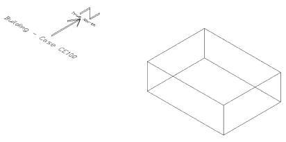
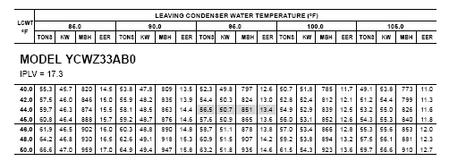

EnergyPlus Version {{ engine.config["EnergyPlusVersion"] }}  
Automatically Generated {{ engine.month_year() }}

Prepared for:

U.S. Department of Energy  
Energy Efficiency and Renewable Energy  
Office of Building Technologies  
Washington, D.C.  

Originally Prepared by:

Robert H. Henninger and Michael J. Witte  
GARD Analytics, Inc.  
115 S. Wilke Road, Suite 115  
Arlington Heights, IL 60005   
USA  
www.gard.com

This report was developed based upon funding from the Alliance for
Sustainable Energy, LLC, Managing and Operating Contractor for the
National Renewable Energy Laboratory for the U.S. Department of Energy.
Any opinions, findings, and conclusions or recommendations expressed in
this material are those of the author(s) and do not necessarily reflect
those of the sponsor. Earlier work was supported by the Ernest Orlando
Lawrence Berkeley National Laboratory, and by the National Energy
Technology Laboratory and the National Renewable Energy Laboratory by
subcontract through the University of Central Florida/Florida Solar
Energy Center.

This report was prepared as an account of work sponsored by an agency of the
United States Government. Neither the United States Government nor any agency
thereof, nor any of their employees, makes any warranty, express or implied, or
assumes any legal liability or responsibility for the accuracy, completeness,
or usefulness of any information, apparatus, product, or process disclosed, or
represents that its use would not infringe privately owned rights. Reference
herein to any specific commercial product, process, or services by trade name,
trademark, manufacturer, or otherwise does not necessarily constitute or imply
its endorsement, recommendation, or favoring by the United States Government or
any agency thereof. The views and opinions of authors expressed herein do not
necessarily state or reflect those of the United States Government or any
agency thereof.

# Test Objectives and Overview

## Test Type: Comparative - HVAC

The EnergyPlus HVAC Component Test checks the accuracy of EnergyPlus 
{{ engine.config["EnergyPlusVersion"] }} component simulation results compared to
manufacturer catalog data, when available. The test procedure makes use of
ANSI/ASHRAE Standard 140 procedures for generating hourly equipment loads and
ASHRAE Standard 140 weather files.  The test suites described within this
report are for testing of the EnergyPlus electric chiller referred to within
EnergyPlus by the object name Chiller:Electric:EIR and the EnergyPlus hot water
boiler referred to within EnergyPlus by the object name Boiler:HotWater.

## Test Suite: EnergyPlus HVAC Component Test Description

The EnergyPlus HVAC Component Test makes use of the basic test building
geometry and envelope described as Case CE100 in Section 5.3.1 of ANSI/ASHRAE
Standard 140-2011, *Standard Method of Test for the Evaluation of Building
Energy Analysis Computer* Programs.

### Base Case Building Description

The basic test building (Figure 1) is a rectangular 48 $m^2$ single zone (8 m
wide x 6 m long x 2.7 m high) with no interior partitions and no windows. The
building is intended as a near-adiabatic cell with cooling or heating load
driven by user specified internal gains. Material properties are described
below. For further details on building geometry and building envelope thermal
properties refer to Section 5.3.1 of ANSI/ASHRAE Standard 140.

**Figure 1 Base Building Geometry - Isometric View of Southeast Corner**

**Wall, Roof and Floor Construction: **

<table>
<col align="left"/>
<col align="right"/>
<col align="right"/>
<col align="right"/>
<col align="right"/>

<thead>
<tr>
  <th>Element</th>
  <th>k ( $\frac{W}{mK}$ )</th>
  <th>Thickness (m)</th>
  <th>U ( $\frac{W}{m^2K}$ )</th>
  <th>R ( $\frac{m^2K}{W}$ )</th>
</tr>
</thead>
<tr>
  <td>Int. Surface Coeff.</td>
  <td></td>
  <td></td>
  <td>8.290</td>
  <td>0.121</td>
</tr>
<tr>
  <td>Insulation</td>
  <td>0.010</td>
  <td>1.000</td>
  <td>0.010</td>
  <td>100.000</td>
</tr>
<tr>
  <td>Ext. Surface Coeff.</td>
  <td></td>
  <td></td>
  <td>29.300</td>
  <td>0.034</td>
</tr>
<tr>
  <td></td>
  <td></td>
  <td></td>
  <td></td>
  <td></td>
</tr>
<tr>
  <td>Overall, air-to-air</td>
  <td></td>
  <td></td>
  <td>0.010</td>
  <td>100.155</td>
</tr>
</table>

**Opaque Surface Radiative Properties:**

<table>
<tr>
  <th></th>
  <th>Interior Surface</th>
  <th>Exterior Surface</th>
</tr>
<tr>
  <td>Solar Absorptance</td>
  <td>0.6</td>
  <td>0.1</td>
</tr>
<tr>
  <td>Infrared Emittance</td>
  <td>0.9</td>
  <td>0.9</td>
</tr>
</table>

**Infiltration:** None

Depending upon whether type of cooling equipment or heating equipment
that is being tested, the internal loads, HVAC systems and plant
equipment for the base building will change appropriately as described
below.

### Adiabatic Surfaces

An opaque exterior surface can be made adiabatic in EnergyPlus by specifying
the outside face environment of the exterior surface to be an
“OtherZoneSurface” and then setting the object of the outside face environment
to be the exterior surface itself. In other words, the surface is forced to see
itself. As an example, the input stream for specifying the east facing exterior
wall as an adiabatic surface is as follows:

    BuildingSurface:Detailed,
     ZONE SURFACE EAST, !- Name  
     WALL, !- Surface Type  
     LTWALL, !- Construction Name  
     ZONE ONE, !- Zone Name  
     Surface, !- Outside Boundary Condition  
     ZONE SURFACE EAST, !- Outside Boundary Condition Object  
     NoSun, !- Sun Exposure  
     NoWind, !- Wind Exposure  
     0.0, !- View Factor to Ground  
     4, !- Number of Vertices  
     8.00, 0.00, 2.70, !- X,Y,Z ==> Vertex 1 {m}  
     8.00, 0.00, 0.00, !- X,Y,Z ==> Vertex 2 {m}  
     8.00, 6.00, 0.00, !- X,Y,Z ==> Vertex 3 {m}  
     8.00, 6.00, 2.70; !- X,Y,Z ==> Vertex 4 {m}

This approach was used on all 6 exterior surfaces of the of the Base Case
building to make the building exterior adiabatic and ensure that the resulting
cooling or heating load in the space was always exactly equal to the total of
the internal space gains.

## EIR Chiller Test

### Internal Loads

In order to create a cooling load for the cooling equipment, a sensible
internal gain ranging from 8,400 W to 13,000 W is imposed on the
building interior space according to a fixed schedule which holds the
internal load constant throughout any one day but varies by day of the
simulation. The sensible gains are assumed to be 100% convective. Latent
internal loads are always 0.0 W. Table 1 further describes the internal
load schedule by day of the simulation. Zone sensible internal gains are
assumed to be distributed evenly throughout the zone air. These are
internally generated sources of heat that are not related to the
operation of the mechanical cooling system or its air distribution fan.
The reason for the range of internal sensible loads is to ensure that
there will be at least one day during the simulation period when a
chiller part load ratio of 1.0 (PLR=1.0) will occur for the combinations
of leaving chiller water temperatures and entering condenser water
temperatures that are to be tested. The chiller cooling capacity is set
to 10,000 W.

Another series of tests are required to determine the chiller’s performance
over a range of part loads varying from 5% to 100% in 5% increments. To perform
these part load tests the internal load schedule described in Table 2 is used.

### Air Distribution System

A simple and ideal air distribution system is used with the following
characteristics to provide whatever cooling the space needs in order to
maintain the setpoint temperature:

- 100% convective air system
- 100% efficient with no duct losses and no capacity limitation, no latent heat extraction
- Zone air is perfectly mixed
- No outside air; no exhaust air
- Indoor circulating fan uses no power (W = 0.0) and adds no heat to the air stream
- Non-proportional-type thermostat, heat always off, cooling on if zone air temperature >22.2°C (72°F)

**Table 1 Schedule of Internal Loads for Full Load Tests**

**Table 2 Schedule of Internal Loads for Part Load Tests**

### Central Cooling Plant

To perform the component test, cooling is provided by a water cooled
electric water chiller whose full load performance is described by a
York Model YCWZ33AB0 water cooled reciprocating chiller as indicated
below in Table 3 where data are in English units. Although the
performance data shown in Table 3 is for a chiller of specific rated
cooling capacity (56.5 tons), it is assumed that a set of capacity and
electric consumption performance curves normalized to the standard rated
conditions of 44°F (6.67°C) leaving chilled water temperature and 95°F
(29.44°C) entering condenser water temperature can be developed and used
to simulate the full load and part load conditions of a similar chiller
of this type and any cooling capacity rating.

**Table 3 Performance Data for Model Water Cooled Electric Reciprocating Chiller (York)**

>TONS = total cooling capacity, 12,000 Btu/Hr  
> KW = electric input, kilowatts  
> MBH = condenser heat rejection rate, 1000 Btu/Hr  
> EER = energy efficiency ratio, Btu/W

Water chiller performance data shown in Table 3 is for a 10°F range on both the chilled water and condenser water temperatures. Other simulation assumptions included:

- Ideal chilled water and condenser water pumps are assumed to consume
  no electricity and add no heat to the chilled water or condenser
  water loops.

- Chilled water and condenser water loop piping are assumed to be
  perfectly insulated such that the entire amount of cooling provided
  by the chiller during each time increment goes completely to cool
  the space.

- Chilled water and condenser water flows are assumed to be constant.

### Weather Data

A three-month long (January – March) TMY format weather file developed
previously as part of ANSI/ASHRAE Standard 140-2011 with the file name
of CE200A.TM2 was used for the simulations required as part of this
component test series. The outdoor dry-bulb temperature of 35.0°C is
constant for every hour of the three-month long period.

### Summary of Test Cases

A set of 54 test cases are used to test the water chiller’s full load
performance over a range of combinations of leaving chilled water temperatures and entering condenser water temperatures. The objective of each test is to determine the chiller’s cooling capacity and electric consumption for the defined set of operating temperature pairs at the full load condition (PLR=1.0). Table 4 summarizes the various test cases and parameters that are varied between cases.

In addition, 6 additional tests are used to test the chiller’s part load
performance at the standard condition of 6.67°C leaving chilled water temperature and varying entering condenser water temperatures. The conditions for these tests are described in Table 4 as Cases TC-PL1 through TC-PL6.

### Simulation and Reporting Period

Simulations for all cases were run for the period from January 1 through
February 20 which covers the full range of internal loads.

### Output Data Requirements

For chiller full load performance Tests TC-1A through TC-9F

- Steady state hourly cooling capacity in Wh for PLR=1.0
- Steady state hourly electric consumption in Wh for PLR=1.0
- Calculated coefficient of performance (COP) (dimensionless)

For chiller part load performance Tests TC-PL1 through TC-PL5

- Steady state hourly electric consumption in Wh for PLR=1.0
- Calculated coefficient of performance (COP) (dimensionless)

For each of the full load performance tests, the hourly results file is
searched for the first hour where the chiller PLR=1.0. The chiller
cooling capacity, electric consumption and COP for this hour then
represent the data that is plotted on the charts that are presented in
Section 2.3 of this report. For most cases the range of scheduled
internal loads does not produce an hour when the PLR of the chiller is
exactly 1.0. In those cases then it is necessary to interpolate between
hours to determine what the cooling capacity and electric consumption of
the chiller is at a PLR=1.0.

**Table 4 HVAC Component Test Case Descriptions**

<table>
 <col align='center'/>
 <col align='center'/>
 <col align='center'/>
 <col align='center'/>
 <col align='center'/>
 <col align='center'/>
 <col align='center'/>
 <tr  >
  <td rowspan=4    >Case #</td>
  <td colspan=3   >Zone</td>
  <td   >Weather</td>
  <td colspan=2   >Water Chiller Operating Temperatures</td>
 </tr>
 <tr  >
  <td colspan=2   >Internal Gains</td>
  <td >Setpoint</td>
  <td rowspan=3   >ODB ('C)</td>
  <td rowspan=3   >Leaving Chilled Water Temp ('C)</td>
  <td rowspan=3   >Entering Condenser Water Temp ('C)</td>
 </tr>
 <tr  >
  <td rowspan=2    >Sensible(W)</td>
  <td rowspan=2   >Latent (W)</td>
  <td rowspan=2   >IDB ('C)</td>
 </tr>
 <tr  >
 </tr>
 <tr  >
  <td   >TC-1A</td>
  <td >8,000 - 13,000</td>
  <td >0</td>
  <td >22.2</td>
  <td >35.0</td>
  <td >3.33</td>
  <td >23.89</td>
 </tr>
 <tr  >
  <td   >TC-1B</td>
  <td >8,000 - 13,000</td>
  <td >0</td>
  <td >22.2</td>
  <td >35.0</td>
  <td >3.33</td>
  <td >26.67</td>
 </tr>
 <tr  >
  <td   >TC-1C</td>
  <td >8,000 - 13,000</td>
  <td >0</td>
  <td >22.2</td>
  <td >35.0</td>
  <td >3.33</td>
  <td >29.44</td>
 </tr>
 <tr  >
  <td   >TC-1D</td>
  <td >8,000 - 13,000</td>
  <td >0</td>
  <td >22.2</td>
  <td >35.0</td>
  <td >3.33</td>
  <td >32.22</td>
 </tr>
 <tr  >
  <td   >TC-1E</td>
  <td >8,000 - 13,000</td>
  <td >0</td>
  <td >22.2</td>
  <td >35.0</td>
  <td >3.33</td>
  <td >35.00</td>
 </tr>
 <tr  >
  <td   >TC-1F</td>
  <td >8,000 - 13,000</td>
  <td >0</td>
  <td >22.2</td>
  <td >35.0</td>
  <td >3.33</td>
  <td >37.78</td>
 </tr>
 <tr  >
  <td   >TC-2A</td>
  <td >8,000 - 13,000</td>
  <td >0</td>
  <td >22.2</td>
  <td >35.0</td>
  <td >4.44</td>
  <td >23.89</td>
 </tr>
 <tr  >
  <td   >TC-2B</td>
  <td >8,000 - 13,000</td>
  <td >0</td>
  <td >22.2</td>
  <td >35.0</td>
  <td >4.44</td>
  <td >26.67</td>
 </tr>
 <tr  >
  <td   >TC-2C</td>
  <td >8,000 - 13,000</td>
  <td >0</td>
  <td >22.2</td>
  <td >35.0</td>
  <td >4.44</td>
  <td >29.44</td>
 </tr>
 <tr  >
  <td   >TC-2D</td>
  <td >8,000 - 13,000</td>
  <td >0</td>
  <td >22.2</td>
  <td >35.0</td>
  <td >4.44</td>
  <td >32.22</td>
 </tr>
 <tr  >
  <td   >TC-2E</td>
  <td >8,000 - 13,000</td>
  <td >0</td>
  <td >22.2</td>
  <td >35.0</td>
  <td >4.44</td>
  <td >35.00</td>
 </tr>
 <tr  >
  <td   >TC-2F</td>
  <td >8,000 - 13,000</td>
  <td >0</td>
  <td >22.2</td>
  <td >35.0</td>
  <td >4.44</td>
  <td >37.78</td>
 </tr>
 <tr  >
  <td   >TC-3A</td>
  <td >8,000 - 13,000</td>
  <td >0</td>
  <td >22.2</td>
  <td >35.0</td>
  <td >5.56</td>
  <td >23.89</td>
 </tr>
 <tr  >
  <td   >TC-3B</td>
  <td >8,000 - 13,000</td>
  <td >0</td>
  <td >22.2</td>
  <td >35.0</td>
  <td >5.56</td>
  <td >26.67</td>
 </tr>
 <tr  >
  <td   >TC-3C</td>
  <td >8,000 - 13,000</td>
  <td >0</td>
  <td >22.2</td>
  <td >35.0</td>
  <td >5.56</td>
  <td >29.44</td>
 </tr>
 <tr  >
  <td   >TC-3D</td>
  <td >8,000 - 13,000</td>
  <td >0</td>
  <td >22.2</td>
  <td >35.0</td>
  <td >5.56</td>
  <td >32.22</td>
 </tr>
 <tr  >
  <td   >TC-3E</td>
  <td >8,000 - 13,000</td>
  <td >0</td>
  <td >22.2</td>
  <td >35.0</td>
  <td >5.56</td>
  <td >35.00</td>
 </tr>
 <tr  >
  <td   >TC-3F</td>
  <td >8,000 - 13,000</td>
  <td >0</td>
  <td >22.2</td>
  <td >35.0</td>
  <td >5.56</td>
  <td >37.78</td>
 </tr>
 <tr  >
  <td   >TC-4A</td>
  <td >8,000 - 13,000</td>
  <td >0</td>
  <td >22.2</td>
  <td >35.0</td>
  <td >6.67</td>
  <td >23.89</td>
 </tr>
 <tr  >
  <td   >TC-4B</td>
  <td >8,000 - 13,000</td>
  <td >0</td>
  <td >22.2</td>
  <td >35.0</td>
  <td >6.67</td>
  <td >26.67</td>
 </tr>
 <tr  >
  <td   >TC-4C</td>
  <td >8,000 - 13,000</td>
  <td >0</td>
  <td >22.2</td>
  <td >35.0</td>
  <td >6.67</td>
  <td >29.44</td>
 </tr>
 <tr  >
  <td   >TC-4D</td>
  <td >8,000 - 13,000</td>
  <td >0</td>
  <td >22.2</td>
  <td >35.0</td>
  <td >6.67</td>
  <td >32.22</td>
 </tr>
 <tr  >
  <td   >TC-4E</td>
  <td >8,000 - 13,000</td>
  <td >0</td>
  <td >22.2</td>
  <td >35.0</td>
  <td >6.67</td>
  <td >35.00</td>
 </tr>
 <tr  >
  <td   >TC-4F</td>
  <td >8,000 - 13,000</td>
  <td >0</td>
  <td >22.2</td>
  <td >35.0</td>
  <td >6.67</td>
  <td >37.78</td>
 </tr>
 <tr  >
  <td   >TC-5A</td>
  <td >8,000 - 13,000</td>
  <td >0</td>
  <td >22.2</td>
  <td >35.0</td>
  <td >7.22</td>
  <td >23.89</td>
 </tr>
 <tr  >
  <td   >TC-5B</td>
  <td >8,000 - 13,000</td>
  <td >0</td>
  <td >22.2</td>
  <td >35.0</td>
  <td >7.22</td>
  <td >26.67</td>
 </tr>
 <tr  >
  <td   >TC-5C</td>
  <td >8,000 - 13,000</td>
  <td >0</td>
  <td >22.2</td>
  <td >35.0</td>
  <td >7.22</td>
  <td >29.44</td>
 </tr>
 <tr  >
  <td   >TC-5D</td>
  <td >8,000 - 13,000</td>
  <td >0</td>
  <td >22.2</td>
  <td >35.0</td>
  <td >7.22</td>
  <td >32.22</td>
 </tr>
 <tr  >
  <td   >TC-5E</td>
  <td >8,000 - 13,000</td>
  <td >0</td>
  <td >22.2</td>
  <td >35.0</td>
  <td >7.22</td>
  <td >35.00</td>
 </tr>
 <tr  >
  <td   >TC-5F</td>
  <td >8,000 - 13,000</td>
  <td >0</td>
  <td >22.2</td>
  <td >35.0</td>
  <td >7.22</td>
  <td >37.78</td>
 </tr>
 <tr  >
  <td   >TC-6A</td>
  <td >8,000 - 13,000</td>
  <td >0</td>
  <td >22.2</td>
  <td >35.0</td>
  <td >7.78</td>
  <td >23.89</td>
 </tr>
 <tr  >
  <td   >TC-6B</td>
  <td >8,000 - 13,000</td>
  <td >0</td>
  <td >22.2</td>
  <td >35.0</td>
  <td >7.78</td>
  <td >26.67</td>
 </tr>
 <tr  >
  <td   >TC-6C</td>
  <td >8,000 - 13,000</td>
  <td >0</td>
  <td >22.2</td>
  <td >35.0</td>
  <td >7.78</td>
  <td >29.44</td>
 </tr>
 <tr  >
  <td   >TC-6D</td>
  <td >8,000 - 13,000</td>
  <td >0</td>
  <td >22.2</td>
  <td >35.0</td>
  <td >7.78</td>
  <td >32.22</td>
 </tr>
 <tr  >
  <td   >TC-6E</td>
  <td >8,000 - 13,000</td>
  <td >0</td>
  <td >22.2</td>
  <td >35.0</td>
  <td >7.78</td>
  <td >35.00</td>
 </tr>
 <tr  >
  <td   >TC-6F</td>
  <td >8,000 - 13,000</td>
  <td >0</td>
  <td >22.2</td>
  <td >35.0</td>
  <td >7.78</td>
  <td >37.78</td>
 </tr>
 <tr  >
  <td colspan=2   >Abbreviations:</td>
  <td colspan=5 >IDB = indoor dry-bulb temperature</td>
 </tr>
 <tr  >
  <td   ></td>
  <td ></td>
  <td colspan=5 >ODB = outdoor dry-bulb temperature</td>
 </tr>
</table>

  

**Table 4 HVAC Component Test Case Descriptions (Cont’d)**

<table>
 <tr  >
  <td rowspan=4    >Case #</td>
  <td colspan=3   >Zone</td>
  <td   >Weather</td>
  <td colspan=2   >Water Chiller Operating Temperatures</td>
 </tr>
 <tr  >
  <td colspan=2   >Internal Gains</td>
  <td >Setpoint</td>
  <td rowspan=3   >ODB ('C)</td>
  <td rowspan=3   >Leaving Chilled Water Temp ('C)</td>
  <td rowspan=3   >Entering Condenser Water Temp ('C)</td>
 </tr>
 <tr  >
  <td rowspan=2    >Sensible(W)</td>
  <td rowspan=2   >Latent (W)</td>
  <td rowspan=2   >IDB ('C)</td>
 </tr>
 <tr  >
 </tr>
 <tr  >
  <td   >TC-7A</td>
  <td >8,000 - 13,000</td>
  <td >0</td>
  <td >22.2</td>
  <td >35.0</td>
  <td >8.89</td>
  <td >23.89</td>
 </tr>
 <tr  >
  <td   >TC-7B</td>
  <td >8,000 - 13,000</td>
  <td >0</td>
  <td >22.2</td>
  <td >35.0</td>
  <td >8.89</td>
  <td >26.67</td>
 </tr>
 <tr  >
  <td   >TC-7C</td>
  <td >8,000 - 13,000</td>
  <td >0</td>
  <td >22.2</td>
  <td >35.0</td>
  <td >8.89</td>
  <td >29.44</td>
 </tr>
 <tr  >
  <td   >TC-7D</td>
  <td >8,000 - 13,000</td>
  <td >0</td>
  <td >22.2</td>
  <td >35.0</td>
  <td >8.89</td>
  <td >32.22</td>
 </tr>
 <tr  >
  <td   >TC-7E</td>
  <td >8,000 - 13,000</td>
  <td >0</td>
  <td >22.2</td>
  <td >35.0</td>
  <td >8.89</td>
  <td >35.00</td>
 </tr>
 <tr  >
  <td   >TC-7F</td>
  <td >8,000 - 13,000</td>
  <td >0</td>
  <td >22.2</td>
  <td >35.0</td>
  <td >8.89</td>
  <td >37.78</td>
 </tr>
 <tr  >
  <td   >TC-8A</td>
  <td >8,000 - 13,000</td>
  <td >0</td>
  <td >22.2</td>
  <td >35.0</td>
  <td >10.00</td>
  <td >23.89</td>
 </tr>
 <tr  >
  <td   >TC-8B</td>
  <td >8,000 - 13,000</td>
  <td >0</td>
  <td >22.2</td>
  <td >35.0</td>
  <td >10.00</td>
  <td >26.67</td>
 </tr>
 <tr  >
  <td   >TC-8C</td>
  <td >8,000 - 13,000</td>
  <td >0</td>
  <td >22.2</td>
  <td >35.0</td>
  <td >10.00</td>
  <td >29.44</td>
 </tr>
 <tr  >
  <td   >TC-8D</td>
  <td >8,000 - 13,000</td>
  <td >0</td>
  <td >22.2</td>
  <td >35.0</td>
  <td >10.00</td>
  <td >32.22</td>
 </tr>
 <tr  >
  <td   >TC-8E</td>
  <td >8,000 - 13,000</td>
  <td >0</td>
  <td >22.2</td>
  <td >35.0</td>
  <td >10.00</td>
  <td >35.00</td>
 </tr>
 <tr  >
  <td   >TC-8F</td>
  <td >8,000 - 13,000</td>
  <td >0</td>
  <td >22.2</td>
  <td >35.0</td>
  <td >10.00</td>
  <td >37.78</td>
 </tr>
 <tr  >
  <td   >TC-9A</td>
  <td >8,000 - 13,000</td>
  <td >0</td>
  <td >22.2</td>
  <td >35.0</td>
  <td >11.11</td>
  <td >23.89</td>
 </tr>
 <tr  >
  <td   >TC-9B</td>
  <td >8,000 - 13,000</td>
  <td >0</td>
  <td >22.2</td>
  <td >35.0</td>
  <td >11.11</td>
  <td >26.67</td>
 </tr>
 <tr  >
  <td   >TC-9C</td>
  <td >8,000 - 13,000</td>
  <td >0</td>
  <td >22.2</td>
  <td >35.0</td>
  <td >11.11</td>
  <td >29.44</td>
 </tr>
 <tr  >
  <td   >TC-9D</td>
  <td >8,000 - 13,000</td>
  <td >0</td>
  <td >22.2</td>
  <td >35.0</td>
  <td >11.11</td>
  <td >32.22</td>
 </tr>
 <tr  >
  <td   >TC-9E</td>
  <td >8,000 - 13,000</td>
  <td >0</td>
  <td >22.2</td>
  <td >35.0</td>
  <td >11.11</td>
  <td >35.00</td>
 </tr>
 <tr  >
  <td   >TC-9F</td>
  <td >8,000 - 13,000</td>
  <td >0</td>
  <td >22.2</td>
  <td >35.0</td>
  <td >11.11</td>
  <td >37.78</td>
 </tr>
 <tr  >
  <td   >TC-PL1</td>
  <td >500 - 10,000</td>
  <td >0</td>
  <td >22.2</td>
  <td >35.0</td>
  <td >6.67</td>
  <td >23.89</td>
 </tr>
 <tr  >
  <td   >TC-PL2</td>
  <td >500 - 10,000</td>
  <td >0</td>
  <td >22.2</td>
  <td >35.0</td>
  <td >6.67</td>
  <td >26.67</td>
 </tr>
 <tr  >
  <td   >TC-PL3</td>
  <td >500 - 10,000</td>
  <td >0</td>
  <td >22.2</td>
  <td >35.0</td>
  <td >6.67</td>
  <td >29.44</td>
 </tr>
 <tr  >
  <td   >TC-PL4</td>
  <td >500 - 10,000</td>
  <td >0</td>
  <td >22.2</td>
  <td >35.0</td>
  <td >6.67</td>
  <td >32.22</td>
 </tr>
 <tr  >
  <td   >TC-PL5</td>
  <td >500 - 10,000</td>
  <td >0</td>
  <td >22.2</td>
  <td >35.0</td>
  <td >6.67</td>
  <td >35.00</td>
 </tr>
 <tr  >
  <td   >TC-PL6</td>
  <td >500 - 10,000</td>
  <td >0</td>
  <td >22.2</td>
  <td >35.0</td>
  <td >6.67</td>
  <td >37.78</td>
 </tr>
 <tr  >
  <td colspan=2   >Abbreviations:</td>
  <td colspan=5 >IDB = indoor dry-bulb temperature</td>
 </tr>
 <tr  >
  <td   ></td>
  <td ></td>
  <td colspan=5 >ODB = outdoor dry-bulb temperature</td>
 </tr>
</table>

  
## Hot Water Boiler Test

### Internal Loads

In order to create a heating load for the heating plant equipment, a
sensible internal gain ranging from -500 W to -12,000 W is imposed on
the building interior space according to a fixed schedule which holds
the internal load constant throughout any one day but varies by day of
the simulation. The sensible gains are assumed to be 100% convective.
Latent internal loads are always 0.0 W. Table 5 further describes the
internal load schedule by day of the simulation. Zone sensible internal
gains are assumed to be distributed evenly throughout the zone air.
These are internally generated loads that are not related to the
operation of the mechanical heating system or its air distribution fan.
The reason for the range of internal sensible loads is to exercise the
part load on the heating equipment throughout its entire load range,
i.e. PLR from 0.05 to 1.2. Other than the boiler full load heating
efficiency, the part load ratio is the only other parameter that effects
the part load performance of the boiler. The boiler heating capacity is
set to 10,000 W and the full load heating efficiency is assumed to be
80%.

**Table 5 Schedule of Internal Loads for Hot Water Boiler Tests**

### Central Heating Plant

To perform the component heating test, heating is provided by a hot water gas-fired boiler whose full load heating efficiency is assumed to be 80%. In the absence of actual part load performance data from a manufacturer’s catalog, a part load performance curve was taken from the DOE-2.1E Equipment-Quad Default Curves data base. The part load
performance curve for a hot water boiler is referred to as HW-BOILER-HIR-FPLR in the DOE-2.1E documentation (DOE-2 1993b) and is described as:

> HW-BOILER-HIR-FPLR = $a*PLR+b*PLR+c*{PLR}*{PLR}$  
>
> where
>
> HW-BOILER-HIR-FPLR is the heat input at a given part load ratio divided by the full load heat input (PLR = 1.0).
>
> PLR is the part load ratio which is the load on the boiler divided by
> the full load capacity of the boiler
>
> - a = 0.082597  
> - b = 0.996764   
> - c = -0.079361  

Other simulation assumptions for the heating plant included:

- Ideal hot water pump are assumed to consume no electricity and add
  no heat to the hot water loop.

- Hot water loop piping is assumed to be perfectly insulated such that
  the entire amount of heating provided by the boiler during each time
  increment goes completely to heat the space.

- Hot water flow is assumed to be constant.

### Weather Data

Since the test building is near adiabatic and the hot water boiler
performance is independent of outdoor weather conditions, the weather
file used with this test is irrelevant but the test was performed using
the same CE200A.TM2 weather file described previously in Section 1.3.4.

### Summary of Test Cases

As described in Table 5, only one test case was used to test the hot water boiler’s performance over its full part load range of operation.

### Output Data Requirements

To compare the EnergyPlus simulation results for the hot water boiler to
the reference performance data, the following output variables are
required:

- Steady state hourly heating load in Wh
- Steady-state hourly energy consumption in Wh

The hourly PLR for the hot water boiler is the hourly heating load divided by the rated heating capacity of the boiler.

# Modeler Report

## Modeling Methodology

### Base Building HVAC System

To simulate the ideal air distribution system for the base case building, the EnergyPlus ZoneHVAC:FourPipeFanCoil object was used. Cooling and heating was scheduled to be continuously available as needed. Outside air quantity was set to 0.0 m3/s. The zone thermostat
was modeled as a ThermostatSetpoint:SingleHeatingOrCooling type with a cooling setpoint of 22.2°C and a heating setpoint 20.0°C throughout the simulation period. The air distribution fan delta pressure was set to 0.0 Pa in order to zero out the possibility of any motor heat being
added to the air stream.

### Central Plant EIR Chiller

To simulate the Chiller:Electric:EIR model in EnergyPlus requires three
performance curves:

1.  **Cooling Capacity Function of Temperature Curve** - The total
    cooling capacity modifier curve (function of temperature) is a
    bi-quadratic curve with two independent variables: leaving chilled
    water temperature and entering condenser fluid temperature. The
    output of this curve is multiplied by the design capacity to give
    the total cooling capacity at specific temperature operating
    conditions (i.e., at temperatures different from the design
    temperatures). The curve has a value of 1.0 at the design
    temperatures.

2.  **Energy Input to Cooling Output Ratio Function of Temperature** -
    The energy input ratio (EIR) modifier curve (function of
    temperature) is a bi-quadratic curve with two independent variables:
    leaving chilled water temperature and entering condenser fluid
    temperature. The output of this curve is multiplied by the design
    EIR (inverse of the COP) to give the EIR at specific temperature
    operating conditions (i.e., at temperatures different from the
    design temperatures). The curve has a value of 1.0 at the design
    temperatures.

3.  **Electric Input to Cooling Output Ratio Function of Part Load
    Ratio** - The energy input ratio (EIR) modifier curve (function of
    part load ratio) is a quadratic curve that parameterizes the
    variation of the energy input ratio (EIR) as a function of part load
    ratio.. The EIR is the inverse of the COP, and the part load ratio
    is the actual cooling load divided by the chiller’s available
    cooling capacity. The output of this curve is multiplied by the
    design EIR and the Energy Input to Cooling Output Ratio Function of
    Temperature Curve to give the EIR at the specific temperatures and
    part-load ratio at which the chiller is operating. The curve has a
    value of 1.0 when the part-load ratio equals 1.0.

Before the curve fitting of the performance data could be done the
performance data as available from the manufacturer’s catalog (see Table
2) which is in IP units was converted to SI units. A least squares curve
fit was then performed using the Excel LINEST function to determine the
coefficients of the curves. Appendix A presents the details of this
exercise for the first two curves. The following results were obtained:

1)  **Cooling Capacity Function of Temperature Curve**
    
    - Form: Bi-quadratic curve

        > $curve = a + b*{tchwl} + c*{tchwl}^2 + d*{tcnwe} + e*{tcnwe}^2 +
          f*{tchwl}*{tcnwe}$
        
    - Independent variables: tchwl, leaving chilled water temperature, and
        tcnwe, entering condenser water temperature.

        >  - a = 1.018907198 Adjusted a = 1.018707198  
        >  - b = 0.035768388  
        >  - c = 0.000335718  
        >  - d = -0.006886487  
        >  - e = -3.51093E-05  
        >  - f = -0.00019825  
      
    The resulting $R^2$ for this curve fit of the catalog data was 0.999. The value of the a-coefficient was adjusted by -0.0002 so that the value given by the quadratic curve would exactly equal the catalog value at rated conditions.

2)  **Energy Input to Cooling Output Ratio Function of Temperature**
    
    - Form: Bi-quadratic curve
         
        > $curve = a + b*{tchwl} + c*{tchwl}^2 + d*{tcnwe} + e*{tcnwe}^2 + f*{tchwl}*{tcnwe}$
        
    - Independent variables: tchwl, leaving chilled water temperature, and tcnwe, entering condenser water temperature. The value of the a-coefficient was adjusted by -0.0021 so that the value given by the quadratic curve would exactly equal the catalog value at rated conditions.

        > - a = 0.54807728 Adjusted a = 0.54597728  
        > - b = -0.020497  
        > - c = 0.000456  
        > - d = 0.015890  
        > - e = 0.000218  
        > - f = -0.000440

    The resulting $R^2$ for this curve fit of the catalog data was 0.999.

3)  **Electric Input to Cooling Output Ratio Function of Part Load Ratio**
    
    - Form: Quadratic curve
         
        > $curve=a+b*{plr}+c*{plr}^2$
      
    - Independent variable: part load ratio (sensible cooling load/steady state sensible cooling capacity)

        Since part load performance as required by EnergyPlus was not available from the catalog for this piece of equipment, the part load curve from the DOE-2 program for a hermetic reciprocating chiller was used. The coefficients for the DOE-2 curve specified as EIRPLR4 in the DOE-2 documentation (DOE-2 1993a) are as follows:

        > - a = 0.88065  
        > - b = 1.137742  
        > - c = -0.225806

Some additional inputs required by EnergyPlus included:

- Design capacity (W), set at 10,000 W for this series of tests
- Design COP, set at 3.926 based on catalog data at rated conditions of  6.67°C leaving chilled water temperature and 29.44°C entering condenser water temperature
- Design leaving chilled water temperature (°C), set at 6.67°C (44°F)
- Design entering condenser water temperature (°C), set at 29.44°C (85°F)
- Design evaporator volumetric water flow rate ( $\frac{m^3}{s}$ ), parameter set to  “autosized”
- Design condenser volumetric water flow rate ( $\frac{m^3}{s}$ ), parameter set to  “autosized”
- Minimum part-load ratio, left to default to 0.1
- Maximum part-load ratio, set at 1.2

### Central Plant Hot Water Boiler

To simulate the Boiler:HotWater model in EnergyPlus requires that a fuel
use/part load ratio curve be defined. EnergyPlus uses the following
equation to calculate fuel use.

> $FuelUsed = \frac{TheoreticalFuelUsed}{C1+C2\cdot OperatingPartLoadRatio+C3\cdot {OperatingPartLoadRatio}^2}$

where

> $TheoreticalFuelUse=\frac{BoilerLoad}{BoilerEfficiency}$

User inputs include the Boiler Efficiency and the coefficients C1, C2
and C3. The EnergyPlus model of the Boiler:HotWater determines the Boiler Load and Operating Part Load Ratio for each simulated time increment. The Operating Part Load is calculated as the Boiler Load divided by the Boiler Rated Heating Capacity. For the hot water boiler component test described here the Boiler Heating Capacity was set to
10,000 W and the Boiler Efficiency was set to 80%.

The Fuel Used equation which describes the part load performance of the
hot water boiler was taken from the DOE-2.1E equipment library (DOE-2
1993b) where the part load performance curve for a hot water boiler is
identified as HW-BOILER-HIR-FPLR and has coefficient values of:

> C1 = 0.082597  
> C2 = 0.996764  
> C3 = -0.079361  

Some additional input parameters required by EnergyPlus included:

- Design boiler water outlet temperature, parameter left to default to 81°C
- Maximum design boiler water flow rate, parameter set to “autosize”
- Minimum part load ratio, parameter left to default to 0.0
- Maximum part load ratio, parameter set to 1.2
- Boiler flow mode, parameter set to “constant flow”
- Parasitic electric load, parameter set to 0.0W

## Modeling Difficulties

### Building Envelope Construction

The specification for the building envelope indicates that the exterior
walls, roof and floor are made up of one opaque layer of insulation (R=100) with differing radiative properties for the interior surface and exterior surface (ref. Table 24 of Standard 140). To allow the surface radiative properties to be set at different values, the exterior wall, roof and floor had to be simulated as two insulation layers, each with an R=50. The EnergyPlus description for this construction was as
follows:

    INSULATION-EXT, ! Name  
     VerySmooth, ! Roughness  
     50.00, ! Thermal Resistance {m2-K/W}  
     0.9000, ! Thermal Absorptance  
     0.1000, ! Solar Absorptance  
     0.1000; ! Visible Absorptance  

    Material:NoMass,  
     INSULATION-INT, ! Name  
     VerySmooth, ! Roughness  
     50.00, ! Thermal Resistance {m2-K/W}  
     0.9000, ! Thermal Absorptance  
     0.6000, ! Solar Absorptance  
     0.6000; ! Visible Absorptance  

    Construction,  
     LTWALL, ! Name  
     INSULATION-EXT, !- Outside layer  
     INSULATION-INT; !- Layer 2  

## Software Errors Discovered

During the initial testing of EnergyPlus with the new chiller test suite, two software errors were discovered as part of the testing which was subsequently corrected:

- When the chiller was specified as “constant flow” as part of the Chiller:Electric:EIR object input, the chiller delivered more than capacity with no additional energy use (corrected in EnergyPlus version 1.2.3.031, CR# 6766)

- When the max PLR was greater than 1.0, the PLR was getting clipped at 1.0 but chiller was delivering load up to the max PLR with no increase in electric consumption (corrected in EnergyPlus version 1.3.0.008, CR# 6921)

- Plant solver routines were reworked which caused minor changes (<0.1%) in Chiller:Electric:EIR electric consumption and COP results (changed in EnergyPlus version 7.0.0.036)

## Results

### EIR Electric Chiller

Results from running the Chiller:Electric:EIR component test suite with EnergyPlus {{ engine.config["EnergyPlusVersion"] }} are depicted graphically in Figures 2 through 8.

{{ engine.write_chart('ScatterLinesNoMarkers', 'CAP vs LChWT Chart', 'Component Test - Cooling Capacity vs LChWT\nElectric EIR Chiller\n10000 W Capacity, 3.9 COP', 'Leaving Chilled Water Temp (C)', 'Evaporator Heat Transfer (W)', 'ResultsSummary35.0ODBWithConstantFlowChiller-AtPLR1.0.xlsx', 'DATA1', 'B64:G99', "(C64,B65:B73,C65:C73,1);(D64,B65:B73,D65:D73,2);(E64,B65:B73,E65:E73,3);(F64,B65:B73,F65:F73,4);(G64,B65:B73,G65:G73,5);(H64,B65:B73,H65:H73,6);(C92,B93:B99,C93:C99,7);(D92,B93:B99,D93:D99,8);(E92,B93:B99,E93:E99,9);(F92,B93:B99,F93:F99,10);(G92,B93:B99,G93:G99,11);", ['Legend Values: Entering Condenser Water Temp (C)', 'Solid Line = Simulated Data; Marker = Catalog Data'], styles=['b-', 'g-', 'r-', 'c-', 'm-', 'y-', 'bx', 'gx', 'rx', 'cx', 'mx', 'yx']) }}

**Figure 2 Chiller Cooling Capacity Versus Leaving Chilled Water Temperature – EnergyPlus Model Versus Manufacturer Data**

{{ engine.write_chart('ScatterLinesNoMarkers', 'CONS vs LChWT Chart', 'Component Test - Electric Consumption vs LChWT\nElectric EIR Chiller\n10000 W Capacity, 3.9 COP', 'Leaving Chilled Water Temperature (C)', 'Electric Consumption (W)', 'ResultsSummary35.0ODBWithConstantFlowChiller-AtPLR1.0.xlsx', 'DATA1', 'K64:P99', "(L64,K65:K73,L65:L73,1);(M64,K65:K73,M65:M73,2);(N64,K65:K73,N65:N73,3);(O64,K65:K73,O65:O73,4);(P64,K65:K73,P65:P73,5);(Q64,K65:K73,Q65:Q73,6);(L92,K93:K99,L93:L99,7);(M92,K93:K99,M93:M99,8);(N92,K93:K99,N93:N99,9);(O92,K93:K99,O93:O99,10);(P92,K93:K99,P93:P99,11);", ['Legend Values: Entering Condenser Water Temp (C)', 'Solid Line = Simulated Data; Marker = Catalog Data'], styles=['b-', 'g-', 'r-', 'c-', 'm-', 'y-', 'bx', 'gx', 'rx', 'cx', 'mx', 'yx']) }}

**Figure 3 Chiller Electric Consumption Versus Leaving Chilled Water Temperature – EnergyPlus Model Versus Manufacturer Data**

{{ engine.write_chart('ScatterLinesNoMarkers', 'CAP vs ECnWT Chart', 'Component Test - Cooling Capacity vs ECnWT\nElectric EIR Chiller\n10000 W Capacity, 3.9 COP', 'Entering Condenser Water Temp (C)', 'Evaporator Heat Transfer (W)', 'ResultsSummary35.0ODBWithConstantFlowChiller-AtPLR1.0.xlsx', 'DATA1', 'B64:H99', "(B65,C64:H64,C65:H65,1);(B66,C64:H64,C66:H66,2);(B67,C64:H64,C67:H67,3);(B68,C64:H64,C68:H68,4);(B69,C64:H64,C69:H69,5);(B70,C64:H64,C70:H70,6);(B71,C64:H64,C71:H71,7);(B72,C64:H64,C72:H72,8);(B73,C64:H64,C73:H73,9);(B93,C92:G92,C93:G93,10);(B94,C92:G92,C94:G94,11);(B95,C92:G92,C95:G95,12);(B96,C92:G92,C96:G96,13);(B97,C92:G92,C97:G97,14);(B98,C92:G92,C98:G98,15);(B99,C92:G92,C99:G99,16);", ['Legend Values: Leaving Chilled Water Temp (C)', 'Solid Line = Simulated Data; Marker = Catalog Data'], styles=['b-', 'g-', 'r-', 'c-', 'm-', 'y-', ('orange', '-', ''), ('black', '-', ''), ('grey', '-', ''), 'gx', 'rx', 'cx', 'mx', 'yx', ('orange', '', 'x'), ('black', '', 'x')]) }}

**Figure 4 Chiller Cooling Capacity Versus Entering Condenser Water Temperature – EnergyPlus Model Versus Manufacturer Data**

{{ engine.write_chart('ScatterLinesNoMarkers', 'CONS vs ECnWT Chart', 'Component Test - Electric Consumption vs ECnWT\nElectric EIR Chiller\n10000 W Capacity, 3.9 COP', 'Entering Condenser Water Temp (C)', 'Electric Consumption (W)', 'ResultsSummary35.0ODBWithConstantFlowChiller-AtPLR1.0.xlsx', 'DATA1', 'K64:Q99', "(K65,L64:Q64,L65:Q65,1);(K66,L64:Q64,L66:Q66,2);(K67,L64:Q64,L67:Q67,3);(K68,L64:Q64,L68:Q68,4);(K69,L64:Q64,L69:Q69,5);(K70,L64:Q64,L70:Q70,6);(K71,L64:Q64,L71:Q71,7);(K72,L64:Q64,L72:Q72,8);(K73,L64:Q64,L73:Q73,9);(K93,L92:P92,L93:P93,10);(K94,L92:P92,L94:P94,11);(K95,L92:P92,L95:P95,12);(K96,L92:P92,L96:P96,13);(K97,L92:P92,L97:P97,14);(K98,L92:P92,L98:P98,15);(K99,L92:P92,L99:P99,16);", ['Legend Values: Leaving Chilled Water Temp (C)', 'Solid Line = Simulated Data; Marker = Catalog Data'], styles=['b-', 'g-', 'r-', 'c-', 'm-', 'y-', ('orange', '-', ''), ('black', '-', ''), ('grey', '-', ''), 'gx', 'rx', 'cx', 'mx', 'yx', ('orange', '', 'x'), ('black', '', 'x')]) }}

**Figure 5 Chiller Electric Consumption Versus Entering Condenser Water Temperature – EnergyPlus Model Versus Manufacturer Data**

{{ engine.write_chart('ScatterLinesNoMarkers', 'COP vsELCnWT Chart', 'Component Test - COP vs ECnWT\nElectric EIR Chiller\n10000 W Capacity, 3.9 COP', 'Entering Condenser Water Temperature (C)', 'COP', 'ResultsSummary35.0ODBWithConstantFlowChiller-AtPLR1.0.xlsx', 'DATA1', 'U64:AA99', "(U65,V64:AA64,V65:AA65,1);(U66,V64:AA64,V66:AA66,2);(U67,V64:AA64,V67:AA67,3);(U68,V64:AA64,V68:AA68,4);(U69,V64:AA64,V69:AA69,5);(U70,V64:AA64,V70:AA70,6);(U71,V64:AA64,V71:AA71,7);(U72,V64:AA64,V72:AA72,8);(U73,V64:AA64,V73:AA73,9);(U93,V92:Z92,V93:Z93,10);(U94,V92:Z92,V94:Z94,11);(U95,V92:Z92,V95:Z95,12);(U96,V92:Z92,V96:Z96,13);(U97,V92:Z92,V97:Z97,14);(U98,V92:Z92,V98:Z98,15);(U99,V92:Z92,V99:Z99,16);", ['Legend Values: Leaving Chilled Water Temp (C)', 'Solid Line = Simulated Data; Marker = Catalog Data'], styles=['b-', 'g-', 'r-', 'c-', 'm-', 'y-', ('orange', '-', ''), ('black', '-', ''), ('grey', '-', ''), 'gx', 'rx', 'cx', 'mx', 'yx', ('orange', '', 'x'), ('black', '', 'x')]) }}

**Figure 6 Chiller COP Versus Entering Condenser Water Temperature**

{{ engine.write_chart('Scatter', 'Elect Cons vs PLR Chart', 'Component Test - Electric Consumption vs PLR\nElectric EIR Chiller\n10000 W Capacity, 3.9 COP', 'Part Load Ratio (PLR)', 'Electric Consumption (W)', 'ResultsSummary35.0ODBWithConstantFlowChiller-AtPLR1.0.xlsx', 'DATA2', 'C4:E3604', "(E4,C5:C3604,E5:E3604,1);", ['Constant Leaving Chilled Water Temperature = 6.67 C\nVarying Entering Condenser Water Temperatures', 'Data series from top to bottom: 37.8C, 35.0C, 32.2C, 29.4C, 26.7C, 23.9C', 'Entering Condenser\nWater Temp (C)']) }}

**Figure 7 Chiller Electric Consumption Versus Part Load Ratio**

{{ engine.write_chart('Scatter', 'COP vs PLR Chart', 'Component Test - COP vs PLR\nElectric EIR Chiller\n10000 W Capacity, 3.9 COP', 'Part Load Ratio (PLR)', 'COP', 'ResultsSummary35.0ODBWithConstantFlowChiller-AtPLR1.0.xlsx', 'DATA2', 'C4:F3604', "(F4,C5:C3604,F5:F3604,1);", ['Constant Leaving Chilled Water Temperature = 6.67 C\nVarying Entering Condenser Water Temperatures', 'Data series from top to bottom: 23.9C, 26.7C, 29.4C, 32.2C, 35.0C, 37.8C', 'Entering Condenser Water Temp (C)']) }}

**Figure 8 Chiller COP Versus Part Load Ratio**

Figures 2 through 6 show how the simulated results (represented by lines)
compare to catalog data. The EnergyPlus Chiller:Electric:EIR model was
simulated for higher and lower leaving chilled water temperatures and entering
condenser water temperatures than were available with the catalog data to show
that the curve fitted performance data behaves well even beyond the limits of
the curve fitted data. Good agreement was obtained between the simulated data
and the catalog data although there is some small variations.

Figures 7 and 8 are also provided to give an indication of how the
electric consumption and COP varies with the part load ratio. No catalog
data was available to include with these charts.

The three tables below summarize the percent differences between the
EnergyPlus results and catalog data for the chiller cooling capacity,
chiller electric consumption and chiller COP.

{{ engine.create_table_from_excel_range('ResultsSummary35.0ODBWithConstantFlowChiller-AtPLR1.0.xlsx', 'DATA1', "B114:G124") }}

{{ engine.create_table_from_excel_range('ResultsSummary35.0ODBWithConstantFlowChiller-AtPLR1.0.xlsx', 'DATA1', "K114:P124") }}

{{ engine.create_table_from_excel_range('ResultsSummary35.0ODBWithConstantFlowChiller-AtPLR1.0.xlsx', 'DATA1', "U114:Z124") }}

### Hot Water Boiler

Results from running the Boiler:HotWater component test with EnergyPlus {{ engine.config["EnergyPlusVersion"] }}
are shown graphically in Figure 9 and 10. Very good agreement (max {{ engine.max_percent_abs("ResultsSummary-SimpleBoiler-CaseE100.xlsx", "E-Plus Data", "L10:L489") }} difference)
was obtained between the EnergyPlus predicted fuel consumption and the fuel
consumption of the boiler when using the DOE-2 hot water boiler part load curve
which was used as a surrogate for catalog data. Similarly, very good agreement
(max {{ engine.max_percent_abs("ResultsSummary-SimpleBoiler-CaseE100.xlsx", "DOE-2 Data", "M15:M34") }} difference)
between the two also resulted when comparing boiler heating efficiency versus
the part load ratio.

{{ engine.write_chart('ScatterLinesNoMarkers', 'Fuel Consumption', 'Component Test - Fuel Consumption vs PLR\nHot Water Boiler\n10000 W Capacity, 80% Efficiency', 'Part Load Ratio', 'Fuel Consumption (W)', 'ResultsSummary-SimpleBoiler-CaseE100.xlsx', 'DOE-2 Data', 'C9:F489', "(E13,C14:C34,E14:E34,1);('E-Plus Data'!F9,'E-Plus Data'!E10:E489,'E-Plus Data'!F10:F489,2);", ['Solid Line = Catalog Data (represented by DOE-2 performance data)\nDashed Line = EnergyPlus Simulated Data'], [], ['bo', 'g-'], False) }}

**Figure 9 Hot Water Boiler Fuel Consumption Versus Part Load Ratio – EnergyPlus Model Versus DOE-2 Performance Curve**

{{ engine.write_chart('ScatterLinesNoMarkers', 'Efficiency', 'Component Test - Heating Efficiency vs PLR\nHot Water Boiler\n10000 W Capacity, 80% Efficiency', 'Part Load Ratio', 'Heating Efficiency (%)', 'ResultsSummary-SimpleBoiler-CaseE100.xlsx', 'DOE-2 Data', 'C9:N489', "(H13,C14:C34,H14:H34,1);('E-Plus Data'!N9,'E-Plus Data'!E10:E489,'E-Plus Data'!N10:N489,2);", ['Solid Line = Catalog Data (represented by DOE-2 performance data)\nDashed Line = EnergyPlus Simulated Data'], [], ['bo', 'g-'], False) }}

**Figure 10 Hot Water Boiler Heating Efficiency Versus Part Load Ratio – EnergyPlus Model Versus DOE-2 Performance Curve**

# Conclusions

## EIR Chiller Test

EnergyPlus version {{ engine.config["EnergyPlusVersion"] }} was used to model
the operation of an electric chiller with the EnergyPlus object called
Chller:Electric:EIR over a range of leaving chiller water and entering
condenser water temperatures and part load ratios. Results were compared to
manufacturer catalog data which were curve fit for modeling in EnergyPlus. The
HVAC Component Test suite as described in this report makes use of the basic
test building geometry and envelope described as Case E100 in Section 5.3.1 of
ANSI/ASHRAE Standard 140-2011, *Standard Method of Test for the Evaluation of
Building Energy Analysis Computer* Programs to generate a set of controlled
cooling loads on the chiller. The ability of EnergyPlus to model the cooling
capacity, electric consumption and part load operation of an electric chiller
was tested using 54 test cases which were run for varying internal loads and
fixed outdoor conditions.

Curve fits of the catalog data for cooling capacity and electric consumption
normalized to rated conditions using the least squares method gave an $R^2$ of
0.999. When these curve fits were used in EnergyPlus to simulate the modeled
electric chiller over a range of leaving chilled water and entering condenser
water temperatures, the EnergyPlus results agreed to within a maximum of 
{{ engine.max_percent_abs("ResultsSummary35.0ODBWithConstantFlowChiller-AtPLR1.0.xlsx", "DATA1", "C118:G124") }}
of the catalog data for cooling capacity and to within a maximum of 
{{ engine.max_percent_abs("ResultsSummary35.0ODBWithConstantFlowChiller-AtPLR1.0.xlsx", "DATA1", "L118:P124") }} of
the catalog data for electric consumption and to within a maximum of 
{{ engine.max_percent_abs("ResultsSummary35.0ODBWithConstantFlowChiller-AtPLR1.0.xlsx", "DATA1", "V118:Z124") }} of
the catalog based calculated COP. The EIR charts (Figures 3 and 5) do not
produce a smooth curve when the simulated data points are connected as might be
expected. It should be noticed however that the catalog data on these charts
also jumps around and the resulting EIR curve fit of the catalog data attempts
to emulate this behavior.

## Hot Water Boiler Test

EnergyPlus version {{ engine.config["EnergyPlusVersion"] }} was also used to
model the operation of a hot water boiler with the EnergyPlus object called
Boiler:HotWater over a range of part loads from 5% to 100%. Results were
compared to the specified performance data taken from the DOE-2 program part
load performance curve for the same type of equipment. Excellent agreement
between the EnergyPlus model and the specified performance data was achieved
with a max resulting {{ engine.max_percent_abs("ResultsSummary-SimpleBoiler-CaseE100.xlsx", "E-Plus Data", "L10:L489") }}
difference for fuel consumption and 
{{ engine.max_percent_abs("ResultsSummary-SimpleBoiler-CaseE100.xlsx", "DOE-2 Data", "M15:M34") }} heating efficiency.

# References

ANSI/ASHRAE 2011. Standard 140-2011, Standard Method of Test for the
Evaluation of Building Energy Analysis Computer Programs.

DOE-2 1993a. “DOE-2 Supplement, Version 2.1E,” Section 4 –Plant, page
4.81. LBL-34947. November 1993.

DOE-2 1993b. “DOE-2 Supplement, Version 2.1E,” Section 4 –Plant, page
4.82. LBL-34947. November 1993.

EnergyPlus {{ engine.year() }}. U.S. Department of Energy, Energy Efficiency and
Renewable Energy, Office of Building Technologies.
[www.energyplus.gov](http://www.energyplus.gov)

York, “Millennium Liquid Chillers, Water Cooled Chiller & Remote Condenser Models, 60 to 250 Tons, Models YCWZ, YCRZ, YCWJ and YCRJ, Engineering Guide,” Form 150.24-EG2(899).

# Appendix A

**Curve Fitting of Manufacturer Catalog Data for York Model YCWZ33AB0 Millennium Water Cooled Chiller**

