---
title: EnergyPlus Testing with IEA BESTEST Multi-Zone Non-Airflow In-Depth Diagnostic Cases MZ320 – MZ360
--- 

EnergyPlus Version {{ engine.config["EnergyPlusVersion"] }}  
Automatically generated {{ engine.month_year() }}

Prepared for:

U.S. Department of Energy  
Energy Efficiency and Renewable Energy  
Office of Building Technologies   
Washington, D.C.  

Originally Prepared by:

Robert H. Henninger and Michael J. Witte  
GARD Analytics, Inc.  
115 S. Wilke Road, Suite 105  
Arlington Heights, IL 60005-1500   
USA  
www.gard.com

This report was developed based upon funding from the Alliance for
Sustainable Energy, LLC, Managing and Operating Contractor for the
National Renewable Energy Laboratory for the U.S. Department of Energy.
Any opinions, findings, and conclusions or recommendations expressed in
this material are those of the author(s) and do not necessarily reflect
those of the sponsor. Earlier work was supported by the Ernest Orlando
Lawrence Berkeley National Laboratory, and by the National Energy
Technology Laboratory and the National Renewable Energy Laboratory by
subcontract through the University of Central Florida/Florida Solar
Energy Center.

This report was prepared as an account of work sponsored by an agency of the
United States Government. Neither the United States Government nor any agency
thereof, nor any of their employees, makes any warranty, express or implied, or
assumes any legal liability or responsibility for the accuracy, completeness,
or usefulness of any information, apparatus, product, or process disclosed, or
represents that its use would not infringe privately owned rights. Reference
herein to any specific commercial product, process, or services by trade name,
trademark, manufacturer, or otherwise does not necessarily constitute or imply
its endorsement, recommendation, or favoring by the United States Government or
any agency thereof. The views and opinions of authors expressed herein do not
necessarily state or reflect those of the United States Government or any
agency thereof.

# Test Objectives and Overview

## Introduction

This report describes the modeling methodology and results for testing done for
the *IEA BESTEST Multi-Zone Non-Airflow In-Depth Diagnostic Cases MZ320 -
MZ360* (Neymark and Judkoff 2008) which were simulated using the EnergyPlus
software. The specifications for the test suite are described in Section 1.0
Part I: User’s Manual: Procedure and Specification of that report. The results
of EnergyPlus are compared with results from an analytical solution for Case
MZ320 and results from other whole building energy simulation programs which
simulated all of the same test cases.

## Test Type: Analytical and Comparative - Loads

The IEA Multi-Zone Non-Airflow In-Depth test suite contains one analytical
solution as well as a set of comparative results from several whole building
simulation programs that participated in an International Energy Agency (IEA)
project to test multi-zone heat transfer models that do not include the heat
and mass transfer effects of airflow between zones. Analytical tests compare a
program’s results to mathematical solutions for simple cases. This is an
excellent method to use for assessing the accuracy of results since there is
only one solution for the case analyzed given the boundary conditions.
Comparative tests compare a program to itself or to other simulation programs.
Both types of testing accomplish results on two different levels, both
validation and debugging. Validation is accomplished when the results of the
test program compare favorably with the analytical results. Debugging is
accomplished when the results for certain cases do not compare favorably with
the analytical or comparative results and then through systematic checking it
is determined that the source of the difference is due to an input error, a
modeling inconsistency or flaw in the program logic.

## Test Suite: IEA BESTEST Multi-Zone Non-Airflow In-Depth Diagnostic Cases

The tests described in Section 1.0 Part I: User’s Manual: Procedure and
Specification of the *IEA BESTEST Multi-Zone Non-Airflow In-Depth Diagnostic
Cases MZ320 - MZ360* (Neymark and Judkoff 2008) were performed using
EnergyPlus. The test cases are designed to test the modeling of:

-   Interzonal conduction heat transfer, assuming one-dimensional conduction

-   Multi-zone shading, including the building itself

-   Internal windows between zones.

The set of five diagnostic test cases which comprise the test suite are
briefly described in Table 1. The Base Case (MZ320) is an analytical
verification test where simulation results can be

**Table 1 – Multi-Zone Non-Airflow Test Cases (Table 1-1, Neymark & Judkoff 2008)**

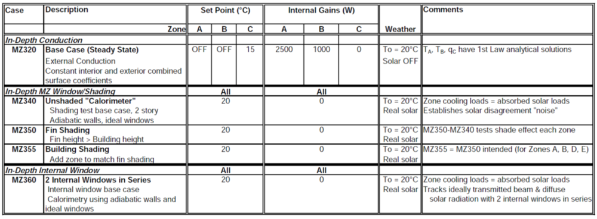

compared to an analytical solution. The remaining test cases are comparative tests where simulation results are compared to other program
results.

### Base Case MZ320 3-Zone Steady-State Conduction

This base case tests the steady-state heat conduction between zones in a
three zone building with the temperature controlled in one zone and the
temperature floating in the other two zones (Figure 1). Constant
internal loads within Zones A and B create cooling loads in each zone.
Interzonal heat transfer is driven by different temperatures in each
zone. Heat transfer is assumed to be one-dimensional conduction. The
outdoor air temperature is held constant at 20°C and solar radiation is
locked out. A TMY2 format weather file designated as MZ320.TM2 was
provided for use with this test. Other characteristics of the building
include:

-   Zone height 2.7 m  
-   Internal walls common to and separating the zones from each other
    have material properties as described in Table 2  
-   All exterior surfaces including exterior walls, floor and roof have
    material properties as described in Table 3  
-   Exterior solar absorptance is 0.0  
-   Interior solar absorptance is 0.0  
-   Ground reflectance is 0.0  
-   The floor is suspended above the ground such that it interacts with
    outdoor air  
-   No windows  
-   No infiltration or ventilation  
-   Internal gains are 100% convective, 0% radiative, 100% sensible, 0%
    latent  
-   Zones A and B have no heating or cooling equipment and those zone
    temperatures are allowed to float. Zone C has an ideal sensible
    cooling only system which is on if temperature >15°C; otherwise
    cooling is off. Heating is always off.

The simulation is to be run for one year and results are to be reported
for the last hour of the year as follows:

-   Sensible cooling load, Zone C, W
-   Air temperature, Zone A, °C
-   Air temperature, Zone B, °C
-   Air temperature, Zone C, °C

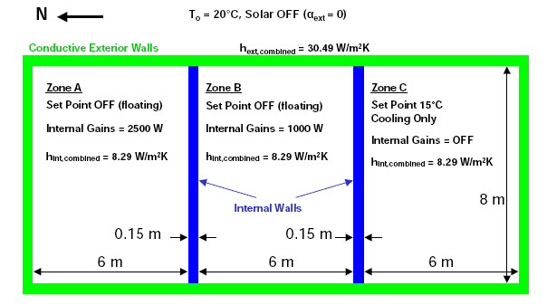

**Figure 1 – Schematic Diagram of Test Building for Test Case MZ320 Showing Dimensions and Boundary Conditions (Figure 1-1, Neymark and Judkoff 2008)**

**Table 2 – Common Wall Material Properties (Table 1-3a, Neymark & Judkoff 2008)**

**Table 3 – Exterior Wall Material Properties (Table 1-4a, Neymark & Judkoff 2008)**

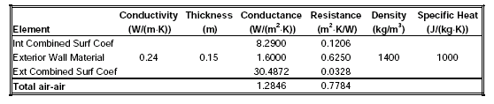

### Case MZ340 6-Zone Unshaded Base Case Test

The six-zone building configuration for Case MZ340 is shown in Figure 2.
The building is comprised of six geometrically identical zones with
windows on the west exposure. The details of a single zone are shown in
Figure 3. The six-zone building is designed to be a calorimeter for
measuring sensible cooling loads caused by transmitted solar radiation
through windows and is achieved by specifying ideal windows with a solar
transmittance of 1.0 and thermal conductance of 0.0 along with adiabatic
exterior and internal walls. A typical zone has the following
characteristics:

-   6m wide x 8m deep x 5m high
-   All opaque external boundaries and common walls are adiabatic and massless
-   Exterior solar absorptance is 0.0
-   Interior solar absorptance is 1.0
-   Ground reflectance is 0.0
-   Interior and exterior combined surface coefficient for all opaque surfaces is 30.4872 $\frac{W}{m^2K}$
-   One 4m x 4m window is centered on the west wall with following properties:
    - Single pane with thickness of 0.175 mm  
    - Solar transmittance is 1.0  
    - Index of refraction is 1.0  
    - Extinction coefficient is 0.0  
    - Thermal conductance is 0.0  
    - Thermal mass is 0.0, density is 0.0, specific heat is 0.0  
    -  Window is flush with exterior face of the wall with no setback

-   No internal loads  
-   No infiltration or ventilation  
-   All zones have an ideal sensible cooling only system which is on if
    temperature >20°C; otherwise cooling is off. Heating is always off.

A TMY2 format weather file designated as MZ340.TM2 was provided for use
with this test.

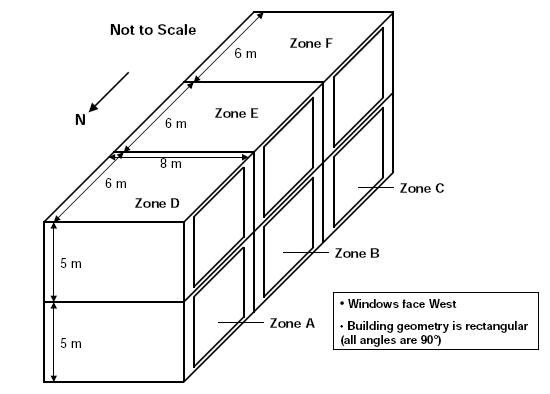

**Figure 2 – Schematic Diagram of Test Building for Test Case MZ340 (Figure 1-3, Neymark and Judkoff 2008)**

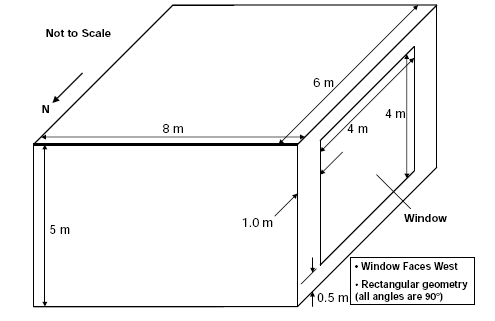

**Figure 3 – Single Zone Detail for Test Case MZ340 (Figure 1-4, Neymark and Judkoff 2008)**

The simulation is to be run for one year and results are to be reported as follows:

-   Annual sensible cooling load for the entire building and each zone
    (kWh)
-   Annual hourly integrated maximum sensible cooling load and time of
    occurrence for the entire building and each zone (Wh/h)
-   Annual average air temperature for each zone (°C)
-   Annual hourly integrated maximum air temperature and time of
    occurrence for each zone (°C)
-   Annual incident total solar radiation (diffuse + direct) and annual
    incident direct beam and diffuse solar radiation on west facing
    surface of Zone A ( $\frac{kWh}{m^2}$ )
-   Annual transmitted total solar radiation (diffuse + direct) and
    annual transmitted direct beam and diffuse solar radiation through
    each window (kWh)
-   Daily hourly transmitted total solar radiation (Wh/h) for Zone A
    for
    - March 15 (high direct normal radiation during afternoon)  
    - August 4 (high direct normal radiation after 18:00)  
    - October 14 (low direct normal radiation during afternoon)  
-   Daily hourly transmitted direct beam and diffuse solar radiation for
    Zone A for August 4 (Wh/h)  
-   Daily hourly sensible cooling load for Zone A for March 15 (Wh/h)

### Case MZ350 Multi-Zone Shading By External Fin

Case MZ350 tests the effect of shading on neighboring zones by adding a
shading fin that is not directly attached to any of the zones of the
building. The test building is the same as that modeled for Case MZ340
but with the shading fin depicted in Figure 4. The shade fin is 24m x
24m and primarily shades zones A, B, D and E during the afternoon hours.
The shade fin has the following properties:

- Solar absorptance is 1.0
- Infrared emittance is 0.0
- Both sides of the fin actively shade the building

If a program has several options for modeling a shading surface, each
different option is to be simulated in separate runs and reported as
results for:

- Case MZ350a – shading device associated with Zone C window

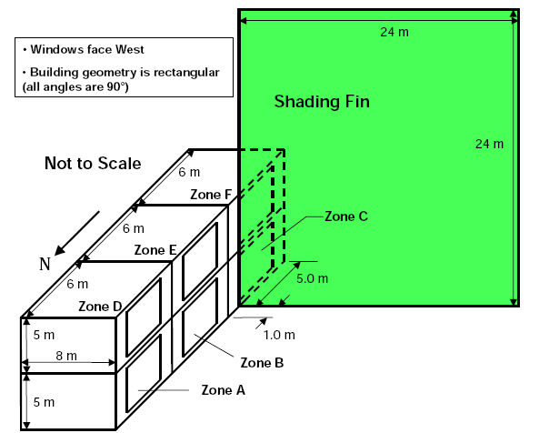

**Figure 4 – Schematic Diagram of Test Building for Test Case MZ350 (Figure 1-5, Neymark and Judkoff 2008)**

- Case MZ350b – shading device associated with Zone C exterior wall
- Case MZ350c – shading device defined as separate shading object
- Case MZ350d – other option

The simulations are to be run for one year using weather file MZ340.TM2
and results in addition to those reported for Case MZ340 are to include:

- Daily hourly transmitted total solar radiation (Wh/h) for Zones A, B, D and E for
    - March 15 (high direct normal radiation during afternoon)
    - October 14 (low direct normal radiation during afternoon)

- Daily hourly transmitted total solar radiation (Wh/h) for Zones C and F for
    - August 4 (high direct normal radiation after 18:00)
    - October 14 (low direct normal radiation during afternoon)

- Daily hourly sensible cooling load (Wh/h) for Zone B for March 15 and October 14

### Case MZ355 Multi-Zone Automated Building Self-Shading

This case tests a program’s ability to accurately model the shading
effect for a zone of a building by a neighboring zone of the same
building. The building to be modeled (Figure 5) is the same building
described in Case MZ340 except with the following changes:

-   An additional adiabatic Zone G is added to the west side at the south end of the building partially covering Zones C and F and has the following properties:
    - 24m long x 5m deep x 24m high
    - All opaque external surfaces and common walls (including all walls,
      floors and roofs) are massless and have a thermal conductance of 0 $\frac{W}{m^2K}$
    - Exterior solar absorptance is 1.0
    - Exterior surface infrared emittance is 0.0
    - Exterior combined surface coefficients for all exterior surfaces is 25.4 $\frac{W}{m^2K}$
    - Interior surface absorptance is 0.0
    - Interior surface coefficients are the same as for other zones
    - No infiltration or ventilation
    - No windows
    - Same mechanical system and setpoints as other zones  

-   Replace the previous west wall and window of Zones C and F with
    - Common walls adjoining Zone G with dimensions of 5m long x 5m high
    - Exterior walls with dimensions of 1m long x 5m high as shown in Figure 5

Output requirements for this test case are the same as for Case MZ350
except no outputs are required for Zones C, F or G.

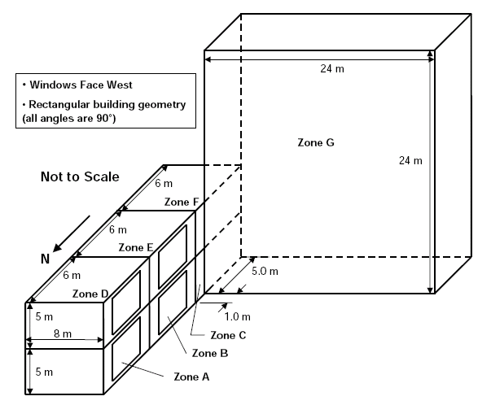

**Figure 5 – Schematic Diagram of Test Building for Test Case MZ355 (Figure 1-6, Neymark and Judkoff 2008)**

### Case MZ360 Multi-Zones with Internal Windows

This case tests a program’s ability to model sensible cooling loads
caused by radiation transmitted through internal windows and the ability
to track transmitted beam and diffuse solar radiation through multiple
zones. The test building is a 3-zone building with the three zones in
series with the outer most zone having an exterior window and the common
walls separating the zones having internal windows (see Figures 6
through 9 for details). The building is oriented such that the windows
face southwest. Other characteristics include:

-   All opaque external surfaces and common wall thermal properties are
    the same as in Case MZ340
-   Ground reflectance is 0.0
-   No internal loads
-   No infiltration or ventilation
-   Interior and exterior combined surface coefficients for opaque
    surfaces are the same as in Case MZ340
-   Window thermal and optical properties and interior and exterior
    combined surface coefficients are the same as in Case MZ340
-   Windows have no setback and are flush with the southwest-facing side
    of its corresponding wall
-   All zones have the same ideal mechanical sensible cooling system
    which is on if temperature >20°C

The simulation is to be run for one year using weather file MZ340.TM2
and results are to be reported as follows:

- Annual sensible cooling load for the entire building and each zone
  (kWh)
- Annual hourly integrated maximum sensible cooling load and time of
  occurrence for the entire building and each zone (Wh/h)
- Annual average air temperature for each zone (°C)
- Annual hourly integrated maximum air temperature and time of
  occurrence for each zone (°C)
- Annual incident total solar radiation (diffuse + direct) and annual
  incident direct beam and diffuse solar radiation on southwest facing
  surface of Zone A $\frac{kWH}{m^2}$
- Annual transmitted total solar radiation (diffuse + direct) and
  annual transmitted direct beam and diffuse solar radiation through
  each window (kWh)
- Daily hourly sensible cooling load for Zone B and daily hourly transmitted total solar radiation (Wh/h) for Zones A, B and C for
    - March 15 (high direct normal radiation during afternoon)
    - October 14 (low direct normal radiation during afternoon)

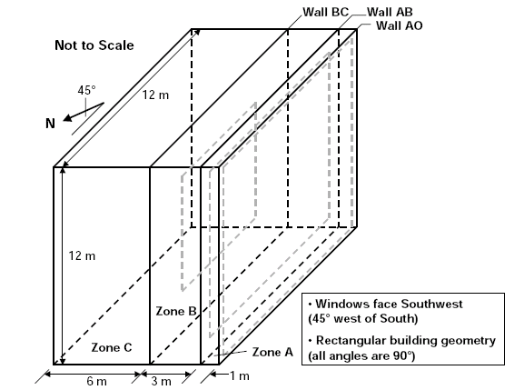

**Figure 6 – Schematic Diagram of Test Building for Test Case MZ360 (Figure 1-7, Neymark and Judkoff 2008)**

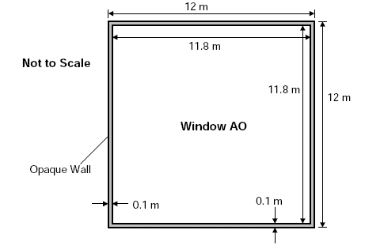

**Figure 7 – Wall AO with Window AO, Elevation Facing Southwest (Figure 1-8, Neymark and Judkoff 2008)**

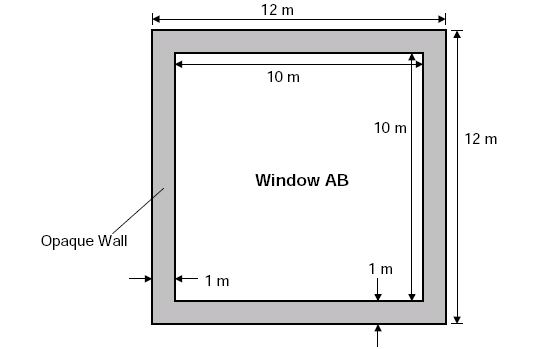

**Figure 8 – Wall AB with Window AB, Elevation Facing Southwest (Figure 1-9, Neymark and Judkoff 2008)**

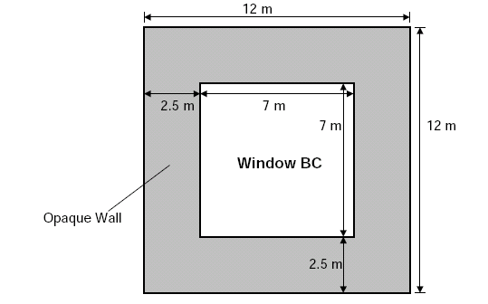

**Figure 9 – Wall BC with Window BC, Elevation Facing Southwest (Figure 1-10, Neymark and Judkoff 2008)**

# Results and Discussion

## Modeling Methodology

### EnergyPlus Shading Module

When assessing heat gains in buildings due to solar radiation, it is
necessary to know how much of each part of the building is shaded and
how much is in direct sunlight. The sunlit area of each surface changes
as the position of the sun changes during the day. The purpose of the
EnergyPlus shadow algorithm is to compute such sunlit areas.
Predecessors to the EnergyPlus shadowing concepts include the BLAST and
TARP shadowing algorithms. The EnergyPlus shadow algorithm is based on
coordinate transformation methods similar to *Groth and Lokmanhekim 1969* and the shadow overlap method of *Walton 1983*.

Shading surfaces are entities outside of the building that may cast
shadows on the building’s heat transfer surfaces. These entities do not
typically have enough thermal mass to be described as part of the
building’s thermal makeup.

The most important effect of shading surfaces is to reduce solar gain in
windows that are shadowed. However, in some cases, shading surfaces can
reflect solar onto a wall or window and increase solar gain.

There are two kinds of shading surfaces in EnergyPlus: **detached** and
**attached**. A **detached** shading surface, such as a tree or
neighboring building, is not connected to the building. An **attached**
shading surface is typically an overhang or fin that is attached to a
particular base surface of the building, usually a wall; attached
shading surfaces are usually designed to shade specific windows.

EnergyPlus creates “bi-directional” shades from each shading surface
entered. This means that the shade surface you input will cast a shadow
no matter which side of the shade surface the sun is on. For example, a
vertical fin will cast a shadow whether the sun is on the left side or
right side of the fin.

It is important to note that EnergyPlus will automatically account for
“self-shading” effects — such as in L-shaped buildings — in which some
of the building’s wall and roof surfaces shade other parts of the
building, especially windows. This means that you only need to describe
shading elements that aren’t building heat-transfer surfaces.

Shading surfaces can also **reflect** solar radiation onto the building.
This feature is simulated if you choose FullExteriorWithReflections or
FullInteriorAndExteriorWithReflections in the Building input object
Solar Distribution field. In this case, you specify the reflectance
properties of a shading surface with the ShadingProperty:Reflectance
input object.

Shading surfaces also automatically shade diffuse solar radiation (and
long-wave radiation) from the sky. And they will automatically shade
diffuse solar radiation from the ground if Solar Distribution Field =
FullExteriorWithReflections or FullInteriorAndExteriorWithReflections in the Building input object. Otherwise, shading surfaces will not shade
diffuse radiation from the ground unless you enter a reduced value for
View Factor to Ground for those building surfaces that are shaded.

### Initial Distribution of Diffuse Solar Transmitted through Exterior and Interior Windows

EnergyPlus calculates the distribution of short-wave radiation in the
interior of each thermal zone. This radiation consists of beam solar
radiation, diffuse solar radiation, and short-wave radiation from
electric lights. The program determines the amount of this radiation
that is (1) absorbed on the inside face of opaque surfaces, (2) absorbed
in the glass and shading device layers of the zone’s exterior and
interior windows, (3) transmitted through the zone’s interior windows to
adjacent zones, and (4) transmitted back out of the exterior windows.

The algorithm for the distribution of diffuse solar was improved in
EnergyPlus Version 2.1. Previous to that release, all diffuse solar
entering the zone was distributed over all surfaces in the zone using a
weighted distribution based on area and solar absorptance for opaque
surfaces or reflectance for windows. For shallow zones with large
windows, such as Case MZ360, this method caused a significant portion of
the diffuse solar to incorrectly leave the zone through the windows. The
new algorithm, described below (excerpted from EnergyPlus Engineering
Reference, version 2.1.0, p.103), has corrected this problem.

> “As of Version 2.1 the treatment of diffuse solar transmitted first
> through exterior windows and subsequently through interior windows has been
> improved. Diffuse solar (from sky and ground sources) transmitted through
> exterior windows is first distributed to the interior heat transfer surfaces in
> the zone containing the exterior windows. This initial distribution apportions
> the transmitted diffuse solar to interior surfaces using the approximate view
> factors described above in "LW Radiation Exchange Among Zone Surfaces." The
> amount of this initially distributed diffuse solar absorbed by each interior
> surface, and each window material layer, is calculated and later added to the
> "short-wave radiation absorbed" values described below. The amount of this
> initially distributed diffuse solar that is reflected is accumulated for each
> zone and redistributed uniformly as part of the QD calculation described below.
> The amount of this initially distributed diffuse solar that is transmitted by
> interior windows to adjacent zones is initially distributed to the interior
> heat transfer surfaces in the adjacent zone in the same manner as just
> described. This new treatment of diffuse solar is intended to more accurately
> account for the initial absorption, transmittance, and reflection of short-wave
> radiation prior to the uniform distribution.”

### Sky Diffuse Model

In EnergyPlus the calculation of diffuse solar radiation from the sky
incident on an exterior surface takes into account the anisotropic
radiance distribution of the sky. For this distribution, the diffuse sky
irradiance on a surface is given by:

> AnisoSkyMult(SurfNum) * DifSolarRad

Where 

> DifSolarRad is the diffuse solar irradiance from the sky on the ground
> and SurfNum is the number of the surface.

AnisoSkyMult is determined by surface orientation and sky radiance
distribution, and accounts for the effects of shading of sky diffuse radiation by shadowing surfaces such as overhangs. It does not account for *reflection* of sky diffuse
radiation from shadowing surfaces.

The sky radiance distribution is based on an empirical model based on
radiance measurements of real skies, as described in *Perez et al., 1990*. In this model the radiance of the sky is determined by three distributions that are superimposed

1. An isotropic distribution that covers the entire sky dome
2. A circumsolar brightening centered at the position of the sun
3. A horizon brightening.

The proportions of these distributions depend on the sky condition,
which is characterized by two quantities, *clearness factor* and
*brightness factor*, which are determined from sun position and solar
quantities from the weather file.

The *circumsolar brightening* is assumed to be concentrated at a point
source at the center of the sun although this region actually begins at
the periphery of the solar disk and falls off in intensity with
increasing angular distance from the periphery.

The *horizon brightening* is assumed to be a linear source at the
horizon and to be independent of azimuth. In actuality, for clear skies,
the horizon brightening is highest at the horizon and decreases in
intensity away from the horizon. For overcast skies the horizon
brightening has a negative value since for such skies the sky radiance
increases rather than decreases away from the horizon.

For further details regarding the EnergyPlus diffuse sky model refer to
the *EnergyPlus Engineering Reference Manual* and the section titled Sky
and Solar/Shading Calculations.

## Modeling Assumptions

The following comments are provided in regards to user inputs that were
used with EnergyPlus to model each of the cases described in the BESTEST
Multi-Zone Non-Airflow specification. Except where discussed below, all
other requirements of the specification were met.

**Case MZ320**

- The exterior and interior surface solar absorptance could not be set
  to 0.0. EnergyPlus requires that this input have a value > 0.0.
  Accordingly, the solar absorptance was set to 0.000001 for both the
  exterior and interior surfaces.
- The exterior surface roughness was not specified and was set to
  VerySmooth (this impacts convection algorithms).
- Number of timesteps per hour was set to 4 (15 minute timestep).
- Building outdoor terrain was set to FlatOpenCountry.

**Case MZ340**

- To simulate external walls which were adiabatic and massless and because the exterior and interior absorptance of the exterior wall surfaces were different, the exterior wall had to be described as
two layers of glass insulation each with a thermal resistance of 500,000 $\frac{m^2K}{W}$ as follows:

        Material:Nomass,  
         Wall-ExteriorLayer, !- Name  
         VerySmooth, !- Roughness  
         500000.00, !- Thermal Resistance {m2-K/W}  
         0.000001, !- Absorptance:Thermal  
         0.000001, !- Absorptance:Solar  
         0.000001; !- Absorptance:Visible  
        
        Material:Nomass,  
         Wall-InteriorLayer, !- Name  
         VerySmooth, !- Roughness  
         500000.00, !- Thermal Resistance {m2-K/W}  
         0.000001, !- Absorptance:Thermal  
         1.000000, !- Absorptance:Solar  
         1.000000; !- Absorptance:Visible  
        
        Construction,
         ExtWall, !- Name
         Wall-ExteriorLayer, !- Outside Layer
         Wall-InteriorLayer; !- Layer 2

- The common wall separating zones was defined as follows:

        Construction,
         ComWall, !- Name
         Wall-InteriorLayer, !- Outside Layer
         Wall-InteriorLayer; !- Layer 2

- All opaque exterior surfaces (except for the west walls which
  contained windows) and all common walls were set to an outside
  boundary condition of “Surface” and the outside boundary surface set
  to itself so that they would be truly adiabatic and did not see
  external weather conditions.

- The west walls which contained windows had to see external weather
  conditions including the sun and so had to be treated differently.
  For this case the ExtWall Construction of double layer insulation described above was used to simulate adiabatic conditions.

- The ideal windows were simulated as described by input objects below. Transmittance values had to be <1.0 and reflectance, IR emittance and conductivity values had to be >0.0.

        WindowMaterial:Glazing,  
        IDEAL GLASS, !- Name  
        SpectralAverage, !- Optical Data Type  
        , !- Name of Window Glass Spectral Data Set  
        0.003175, !- Thickness {m}  
        0.99999999, !- Solar Transmittance at Normal Incidence  
        0.000000001, !- Solar Reflectance at Normal Incidence: Front Side  
        0.000000001, !- Solar Reflectance at Normal Incidence: Back Side  
        0.99999999, !- Visible Transmittance at Normal Incidence  
        0.000000001, !- Visible Reflectance at Normal Incidence: Front Side  
        0.000000001, !- Visible Reflectance at Normal Incidence: Back Side  
        0.0, !- IR Transmittance at Normal Incidence  
        0.000000001, !- IR Hemispherical Emissivity: Front Side  
        0.000000001, !- IR Hemispherical Emissivity: Back Side  
        0.000000001; !- Conductivity {W/m-K}

        
        Construction,  
         IDEAL WINDOW, !- Name  
         IDEAL GLASS; !- Outside Layer  

    During the hourly simulations the window transmittance in EnergyPlus varies based on solar incident angle and ranged from 0.989 to 1.007.
    

**Case 350**

- Case 350a was simulated using the Shading:Fin input object
  associated with the Zone C window. Although attached to the Zone C
  window it can cast shadows on other surfaces of the building.

- Case 350b was simulated using the Shading:Zone:Detailed input object
  where the shading surface was associated with the Zone C exterior
  wall. Although attached to the Zone C window it can cast shadows on
  other surfaces of the building.

- Case 350c was simulated using the Shading:Site:Detailed input object
  where the shading surface is exterior to and separated from the
  building. If the building is rotated this shading surface will
  remain stationary.

- Case 350d was simulated using the Shading:Building:Detailed input
  object where the shading surface is exterior to and separated from
  the building but if the building is rotated the shading surface
  rotates with it.

**Case 355**

- No exceptions taken with the specification

**Case 360**

- No exceptions taken with the specification

## Results

EnergyPlus results that were submitted as part of the initial rounds of
IEA BESTEST testing prior to the time when the diffuse radiation
algorithms were changed are shown in Table 4. Results which were
submitted as part of the last round of the IEA BESTEST testing as
reported in the IEA BESTEST final report (Neymark and Judkoff 2008) and
which contain the diffuse radiation algorithm changes discussed above
are shown in Table 5. As the full suite of test cases have been simulated with later releases of EnergyPlus, i.e. versions 2.1, 2.2, 3.0, 3.1, 4.0, 5.0, 6.0, 7.0, 7.1, 7.2 8.0, 8.1 and 8.2, results have remained unchanged.

The IEA final report published in September 2008 presents and compares
the results for all programs that participated in the simulation of the
Multi-Zone Non-Airflow test cases. Table 6 summarizes the participating
programs. The IEA final report includes results for EnergyPlus version
2.1.0.012 but Figures 10 through 17 show EnergyPlus results for version
8.2.0.

### Case MZ320

A comparison of results for all programs for Case MZ320 is shown in
Figure 10. This was the only test case which had analytical results to
compare to. Excellent agreement was obtained for all programs including
EnergyPlus with EnergyPlus results agreeing exactly with the analytical
solution.

Table 5.1 contains test results for the current version of EnergyPlus.

**Table 4 IEA BESTEST Multi-Zone Non-Airflow In-Depth Test Case Results with EnergyPlus Version 2.0.0.012 (Prior to Diffuse Radiation Calculation Changes)**

**Table 5 IEA BESTEST Multi-Zone Non-Airflow In-Depth Test Case Results with EnergyPlus, Versions 2.1, 2.2, 3.0, 3.1, 4.0, 5.0, 6.0, 7.0, 7.1, 7.2 8.0, 8.1 and 8.2 - (Subsequent to Diffuse Radiation Calculation Changes)**

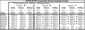

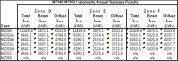

**Table 5.1 IEA BESTEST Multi-Zone Non-Airflow In-Dept Test Case Results with EnergyPlus {{ engine.config["EnergyPlusVersion"] }}**

{{ engine.create_table_from_excel_range("EnergyPlus-Round3-MZ-Output030508.xlsx", "StandardOutput", "D60:E62") }}

{{ engine.create_table_from_excel_range("EnergyPlus-Round3-MZ-Output030508.xlsx", "StandardOutput", "D65:H70") }}

{{ engine.create_table_from_excel_range("EnergyPlus-Round3-MZ-Output030508.xlsx", "StandardOutput", "D73:N85") }}

{{ engine.create_table_from_excel_range("EnergyPlus-Round3-MZ-Output030508.xlsx", "StandardOutput", "O73:W85") }}

{{ engine.create_table_from_excel_range("EnergyPlus-Round3-MZ-Output030508.xlsx", "StandardOutput", "X73:AF85") }}

**Table 6 Participating Programs and Organizations (Table ES-1, Neymark and Judkoff 2008)**

<table>
<thead>
<tr>
  <th>Simulation Program (Case MZ320 Only)</th>
  <th>Implemented by</th>
  <th>Authoring Organization</th>
  <th>Abbreviation</th>
</tr>
</thead>
<tr>
  <td>CODYRUN</td>
  <td>University of Reunion Island, France</td>
  <td>University of Reunion Island, France</td>
  <td>UR</td>
</tr>
<tr>
  <td>COMFIE</td>
  <td>EdMP $^1$ France</td>
  <td>EdMP/IZUBA $^{1,2}$ France</td>
  <td>EdMP</td>
</tr>
<tr>
  <td>KoZiBu</td>
  <td>JNLOG $^3$ France</td>
  <td>INSA-Lyon/JNLOG $^{4,3}$ </td>
  <td>JNLOG</td>
</tr>
</table>

<table>
<thead>
<tr>
  <th>Simulation Program (All other cases)</th>
  <th>Implemented by</th>
  <th>Authoring Organization</th>
  <th>Abbreviation</th>
</tr>
</thead>
<tr>
  <td>EnergyPlus 2.1.0.012</td>
  <td>GARD Analytics, Inc., United States</td>
  <td>LBNL/UIUC/DOE-BT $^{5,6,7}$ United States</td>
  <td>EnergyPlus/GARD</td>
</tr>
<tr>
  <td>ESP-r</td>
  <td>ESRU $^8$ United Kingdom</td>
  <td>ESRU $^8$ United Kingdom</td>
  <td>ESP-r/ESRU</td>
</tr>
<tr>
  <td>HTB2</td>
  <td>WSA $^9$ United Kingdom</td>
  <td>WSA $^9$ United Kingdom</td>
  <td>HTB2/WSA</td>
</tr>
<tr>
  <td>TRNSYS-TUD</td>
  <td>Dresden University of Technology, Germany</td>
  <td>University of Wisconsin/Dresden University of Technology, United States/Germany</td>
  <td>TRNSYS-TUD/TUD</td>
</tr>
<tr>
  <td>TRYSYS-16</td>
  <td>University of Liege, Belgium</td>
  <td>University of Wisconsin, United States</td>
  <td>TRNSYS-16/Ulg</td>
</tr>
<tr>
  <td>VA114 2.25</td>
  <td>VABI Software BV, The Netherlands</td>
  <td>VABI Software BV, The Netherlands</td>
  <td>VA114-CirBm/VABI\</td>
</tr>
</table>

- $^1$ Ecole des Mines de Paris, France
- $^2$ IZUBU Energies, France
- $^3$ Jean Noel, France
- $^4$ INSA-Lyon Thermal Center, France
- $^5$ LBNL: Lawrence Berkeley National Laboratory, United States
- $^6$ UIUC: University of Illinois Urbana/Champaign, United States
- $^7$ DOE-BT: U.S. Department of Energy, Office of Building Technologies, Energy Efficiency and Renewable Energy, United States
- $^8$ ESRU: Energy Systems Research Unit, University of Strathclyde, United Kingdom
- $^9$ Welsh School of Architecture, Cardiff University, United Kingdom

{{ engine.write_chart('ColumnClustered', 'MZ320-Q', 'IEA BESTEST Multi-Zone: MZ320 \nSteady-State Zone C Sensible Cooling Load', [], 'Sensible Cooling Load (W or Wh/h)', 'IEA MZ-RESULTS-Annuals-All Programs-EPlus.xlsx', 'MZ320data', 'B14:L15', "(C14,B15,C15,1);(D14,B15,D15,2);(E14,B15,E15,3);(F14,B15,F15,4);(G14,B15,G15,5);(H14,B15,H15,6);(I14,B15,I15,7);(J14,B15,J15,8);(K14,B15,K15,9);(L14,B15,L15,10);", []) }}

**Figure 10 – Comparison of Results for All Programs to Analytical Result for Case MZ320 (Figure 2-35, Neymark and Judkoff 2008 with EnergyPlus {{ engine.config["EnergyPlusVersion"] }} Results)**

### Cases MZ340, MZ 350 and MZ355

The results across all programs for the 6-zone building cases with and
without shading are shown in Figure 11. For Cases MZ340 and MZ350 the
EnergyPlus results for each comparison lie within the bounds of the
results of other programs although for some zones EnergyPlus is close to
setting the lower bound. No conclusion can be made about the Case MZ355
results since only three programs (EnergyPlus, VA114-CirBM and
VA114-CirDf) were able to model that case and two of the programs are
really different versions of the same program.

Another more fundamental check of how programs are handling shading is
to compare the transmitted solar radiation entering each zone. Figures
12 through 14 show that comparison by depicting the total solar
transmitted for each zone as well as its components, i.e. the beam solar
and diffuse solar. Again, for Cases MZ340 and MZ350, the EnergyPlus
results are within the bounds of the other programs but trend toward the
upper and lower boundary of results for some zones. One further check on
results to give an indication of how each program is handling shading is
to isolate the shading effect by comparing the difference in results
between Case MZ340 (unshaded case) and Case MZ355 (shaded case). This is
shown in Figures 15 through 17 in what is called a “Delta” chart. Figure
15 indicates that EnergyPlus’ Delta Total Solar is within the bounds of
other programs for Zones A, B, D and E but is setting the lower boundary
for Zones C and F and Figure 17 shows that the difference in Diffuse
Solar is causing the difference for Zones C and F.

{{ engine.write_chart('ColumnClustered', 'QCS-Zones', 'IEA BESTEST Multi-Zone: MZ340, MZ350, MZ355 \nAnnual Sensible Cooling Load, All Zones', [], 'Sensible Cooling Load (kWh)', 'IEA MZ-RESULTS-Annuals-All Programs-EPlus.xlsx', 'ABSdata', 'B83:L90', "(C83,B84:B90,C84:C90,1);(D83,B84:B90,D84:D90,2);(E83,B84:B90,E84:E90,3);(F83,B84:B90,F84:F90,4);(G83,B84:B90,G84:G90,5);(H83,B84:B90,H84:H90,6);(I83,B84:B90,I84:I90,7);(J83,B84:B90,J84:J90,8);(K83,B84:B90,K84:K90,9);(L83,B84:B90,L84:L90,10);", []) }}

**Figure 11 – Annual Sensible Cooling Load Results for All Programs for Cases MZ340, MZ350 and MZ355 (Figure 2-37, Neymark and Judkoff 2008 with EnergyPlus {{ engine.config["EnergyPlusVersion"] }} Results)**

{{ engine.write_chart('ColumnClustered', 'ItrTOT-Zones ', 'IEA BESTEST Multi-Zone: MZ340, MZ350, MZ355 \nAnnual Transmitted TOTAL Solar Radiation, All Zones', [], 'Transmitted Solar Radiation (kWh)', 'IEA MZ-RESULTS-Annuals-All Programs-EPlus.xlsx', 'ABSdata', 'B287:L294', "(C287,B288:B294,C288:C294,1);(D287,B288:B294,D288:D294,2);(E287,B288:B294,E288:E294,3);(F287,B288:B294,F288:F294,4);(G287,B288:B294,G288:G294,5);(H287,B288:B294,H288:H294,6);(I287,B288:B294,I288:I294,7);(J287,B288:B294,J288:J294,8);(K287,B288:B294,K288:K294,9);(L287,B288:B294,L288:L294,10);", []) }}

**Figure 12 – Zone Annual Transmitted Total Solar Radiation Results for All Programs for Cases MZ340, MZ350 and MZ355 (Part III Section 3.3, Neymark and Judkoff 2008 with EnergyPlus {{ engine.config["EnergyPlusVersion"] }} Results)**

{{ engine.write_chart('ColumnClustered', 'ItrBEAM-Zones', 'IEA BESTEST Multi-Zone: MZ340, MZ350, MZ355 \nAnnual Transmitted BEAM Solar Radiation, All Zones', [], 'Transmitted Solar Radiation (kWh)', 'IEA MZ-RESULTS-Annuals-All Programs-EPlus.xlsx', 'ABSdata', 'B297:L304', "(C297,B298:B304,C298:C304,1);(D297,B298:B304,D298:D304,2);(E297,B298:B304,E298:E304,3);(F297,B298:B304,F298:F304,4);(G297,B298:B304,G298:G304,5);(H297,B298:B304,H298:H304,6);(I297,B298:B304,I298:I304,7);(J297,B298:B304,J298:J304,8);(K297,B298:B304,K298:K304,9);(L297,B298:B304,L298:L304,10);", []) }}

Figure 13 – Zone Annual Transmitted Beam Solar Radiation Results for All
Programs for Cases MZ340, MZ350 and MZ355 (Part III Section 3.3, Neymark
and Judkoff 2008 with EnergyPlus {{ engine.config["EnergyPlusVersion"] }} Results)

{{ engine.write_chart('ColumnClustered', 'ItrDIFF-Zones', 'IEA BESTEST Multi-Zone: MZ340, MZ350, MZ355 \nAnnual Transmitted DIFFUSE Solar Radiation, All Zones', [], 'Transmitted Solar Radiation (kWh)', 'IEA MZ-RESULTS-Annuals-All Programs-EPlus.xlsx', 'ABSdata', 'B307:L314', "(C307,B308:B314,C308:C314,1);(D307,B308:B314,D308:D314,2);(E307,B308:B314,E308:E314,3);(F307,B308:B314,F308:F314,4);(G307,B308:B314,G308:G314,5);(H307,B308:B314,H308:H314,6);(I307,B308:B314,I308:I314,7);(J307,B308:B314,J308:J314,8);(K307,B308:B314,K308:K314,9);(L307,B308:B314,L308:L314,10);", []) }}

**Figure 14 – Zone Annual Transmitted Diffuse Solar Radiation Results for All Programs for Cases MZ340, MZ350 and MZ355 (Part III Section 3.3, Neymark and Judkoff 2008 with EnergyPlus {{ engine.config["EnergyPlusVersion"] }} Results)**

{{ engine.write_chart('ColumnClustered', 'dItrTOT-Zones', 'IEA BESTEST Multi-Zone: MZ350-MZ340, MZ355-MZ340  \nDelta Annual Shaded TOTAL Solar Radiation, All Zones', [], 'Shaded Solar Radiation (kWh)', 'IEA MZ-RESULTS-Annuals-All Programs-EPlus.xlsx', 'DELdata', 'B152:L158', "(C152,B153:B158,C153:C158,1);(D152,B153:B158,D153:D158,2);(E152,B153:B158,E153:E158,3);(F152,B153:B158,F153:F158,4);(G152,B153:B158,G153:G158,5);(H152,B153:B158,H153:H158,6);(I152,B153:B158,I153:I158,7);(J152,B153:B158,J153:J158,8);(K152,B153:B158,K153:K158,9);(L152,B153:B158,L153:L158,10);", []) }}

**Figure 15 – Delta Chart for Annual Shaded Total Solar Radiation for Cases MZ340, MZ350 and MZ355 (Part III Section 3.3, Neymark and Judkoff 2008 with EnergyPlus {{ engine.config["EnergyPlusVersion"] }} Results)**

{{ engine.write_chart('ColumnClustered', 'dItrBEAM-Zones', 'IEA BESTEST Multi-Zone: MZ350-MZ340, MZ355-MZ340  \nDelta Annual Shaded BEAM Solar Radiation, All Zones', [], 'Shaded Solar Radiation (kWh)', 'IEA MZ-RESULTS-Annuals-All Programs-EPlus.xlsx', 'DELdata', 'B226:L232', "(C226,B227:B232,C227:C232,1);(D226,B227:B232,D227:D232,2);(E226,B227:B232,E227:E232,3);(F226,B227:B232,F227:F232,4);(G226,B227:B232,G227:G232,5);(H226,B227:B232,H227:H232,6);(I226,B227:B232,I227:I232,7);(J226,B227:B232,J227:J232,8);(K226,B227:B232,K227:K232,9);(L226,B227:B232,L227:L232,10);", []) }}

**Figure 16 – Delta Chart for Annual Shaded Beam Solar Radiation for Cases MZ340, MZ350 and MZ355 (Part III Section 3.3, Neymark and Judkoff 2008 with EnergyPlus {{ engine.config["EnergyPlusVersion"] }} Results)**

{{ engine.write_chart('ColumnClustered', 'dItrDIFF-Zones', 'IEA BESTEST Multi-Zone: MZ350-MZ340, MZ355-MZ340  \nDelta Annual Shaded DIFFUSE Solar Radiation, All Zones', [], 'Shaded Solar Radiation (kWh)', 'IEA MZ-RESULTS-Annuals-All Programs-EPlus.xlsx', 'DELdata', 'B300:L306', "(C300,B301:B306,C301:C306,1);(D300,B301:B306,D301:D306,2);(E300,B301:B306,E301:E306,3);(F300,B301:B306,F301:F306,4);(G300,B301:B306,G301:G306,5);(H300,B301:B306,H301:H306,6);(I300,B301:B306,I301:I306,7);(J300,B301:B306,J301:J306,8);(K300,B301:B306,K301:K306,9);(L300,B301:B306,L301:L306,10);", []) }}

**Figure 17 – Delta Chart for Annual Shaded Diffuse Solar Radiation for Cases MZ340, MZ350 and MZ355 (Part III Section 3.3, Neymark and Judkoff 2008 with EnergyPlus {{ engine.config["EnergyPlusVersion"] }} Results)**

The impact of the change in handling of diffuse solar radiation as described in Section 2.1.2 can be seen by comparing EnergyPlus results in Tables 5 and 6 for Cases MZ340, MZ350 and MZ355 where the result was an increase in total building annual cooling load of from 3.7% to 4.0%.

### Case MZ360

Case MZ360 with three zones separated by interior windows with the first
zone being very shallow, i.e. only 1 m deep, presents a difficult
modeling situation. As was explained in Section 2.1.2, in the early
rounds of IEA BESTEST Multi-Zone Non-Airflow testing it became evident
that one of the reasons that the cooling load calculated for this case
by EnergyPlus was lower than the other programs was due to the method
for distributing diffuse solar radiation within a zone. Another reason
is that EnergyPlus does not model direct beam radiation transmitted
through the second internal window but rather assumes that all solar
radiation entering Zone C was diffuse radiation. The impact of reworking
the diffuse radiation algorithms in EnergyPlus is shown in Figure 18 by
comparing the “Eplus/GARD Before Fix” with the “Eplus/GARD After Fix”
results. The change in results was to increase the annual building
cooling load by 33%.

Comparison of results for all programs for Case MZ360 is shown in Figure
19. For individual zones, the EnergyPlus results are within the bounds
of other programs. For the total annual

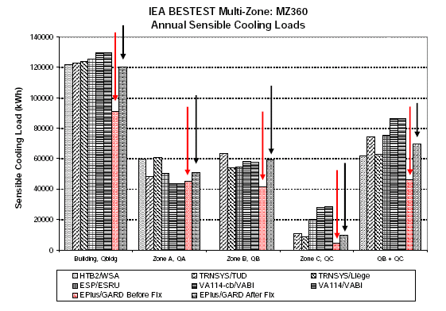

**Figure 18 – EnergyPlus Annual Cooling Load Change Before and After Diffuse Solar Radiation Algorithm Change for Case MZ360 (Part II Figure 2-3, Neymark and Judkoff 2008)**

{{ engine.write_chart('ColumnClustered', 'QC360+2Z', 'IEA BESTEST Multi-Zone: MZ360 \nAnnual Sensible Cooling Loads', [], 'Sensible Cooling Load (kWh)', 'IEA MZ-RESULTS-Annuals-All Programs-EPlus.xlsx', 'ABS360data', 'B19:I24', "(C19,B20:B24,C20:C24,1);(D19,B20:B24,D20:D24,2);(E19,B20:B24,E20:E24,3);(F19,B20:B24,F20:F24,4);(G19,B20:B24,G20:G24,5);(H19,B20:B24,H20:H24,6);(I19,B20:B24,I20:I24,7);", []) }}

**Figure 19 – Annual Sensible Cooling Loads Results for All Programs for Case MZ360 (Part III Section 3.3, Neymark and Judkoff 2008 with EnergyPlus {{ engine.config["EnergyPlusVersion"] }} Results)**

building cooling load EnergyPlus is setting the lower boundary which may
be due to EnergyPlus treating all solar radiation entering Zone C as
diffuse.

## Enhancements to EnergyPlus Prompted by Using IEA BESTEST Multi-Zone Non-Airflow In-Depth Test Suite

As a result of EnergyPlus participating in the IEA BESTEST Multi-Zone
Non-Airflow In-Depth Diagnostic Tests program the following changes and
enhancements were made:

-   Version 2.0.0.025 – added output report variables for internal windows

-   Version 2.1.0.023 – the methodology for handling solar diffuse
    radiation through a window was completely reworked and was changed
    from uniform interior distribution of transmitted diffuse solar to
    distribution based on approximate view factors between transmitting
    windows and zone heat transfer surfaces.

# Conclusions

EnergyPlus Version {{ engine.config["EnergyPlusVersion"] }} was used to model a range of multi-zone
non-airflow configurations specified in *IEA BESTEST Multi-Zone Non-Airflow In-Depth Diagnostic Cases: MZ320 – MZ360* (Neymark and Judkoff 2008). The ability of EnergyPlus to model multi-zone non-airflow configurations and predict zone loads and resulting zone temperatures
was tested using a suite of 5 test cases which included multi-zone with
no windows, multi-zone with unshaded windows, multi-zone with shaded
windows for two configurations, and multi-zones in series with internal
windows. The results predicted by EnergyPlus for the first case,
multi-zone with no windows, was compared to an analytical solution. The
results for the other 4 cases were compared to results from 5 other
programs that participated in an International Energy Agency project
which was completed in 2008. For Case MZ320, EnergyPlus results for
steady state sensible cooling load agreed exactly with the analytical
solution. For Cases MZ340 (6 zone, unshaded) and MZ350 (6 zone, shaded),
EnergyPlus results were within the bounds of the other programs with a
trend toward the upper and lower boundary of results for some zones. No
conclusion could be made about Case MZ355 (self-shaded multi-zone
building) since there were results from only one other program to compare to. For Case MZ360 (three zones in series with internal windows), the EnergyPlus results were mixed with annual cooling loads for individual zones being within the bounds of the other programs but
with EnergyPlus setting the lower bounds of results when comparing total
building sensible cooling load to other programs. This difference may be
due to EnergyPlus not allowing any direct beam solar to enter the most
inner zone but rather assumes all transmitted solar into that zone is
diffuse radiation.

# References

EnergyPlus 2014. U.S. Department of Energy, Energy Efficiency and
Renewable Energy, Office of Building Technologies.
[www.energyplus.gov](http://www.energyplus.gov)

Groth, C. C., and Lokmanhekim, M. 1969. "Shadow - A New Technique for
the Calculation of Shadow Shapes and Areas by Digital Computer," Second
Hawaii International Conference on System Sciences, Honolulu, HI,
January 22-24, 1969.

Neymark, J., and R. Judkoff. 2008. *International Energy Agency Building Energy Simulation TEST and Diagnostic Method (IEA BESTEST) Multi-Zone Non-Airflow In-Depth Diagnostic Cases: MZ320 – MZ360*, NREL/TP-550-43827, National Renewable Energy Laboratory, Golden,
Colorado, September 2008.\
[www.task34.iea-shc.org/publications
](http://www.task34.iea-shc.org/publications)

Perez, R., P. Ineichen, R. Seals, J. Michalsky and R. Stewart. 1990.
Modeling Daylight
Availability and Irradiance Components from Direct and Global
Irradiance. Solar Energy 44,271-289.

Walton, G.N. 1983. “The Thermal Analysis Research Program Reference
Manual Program (TARP)”, National Bureau of Standards (now National
Institute of Standards and Technology).

